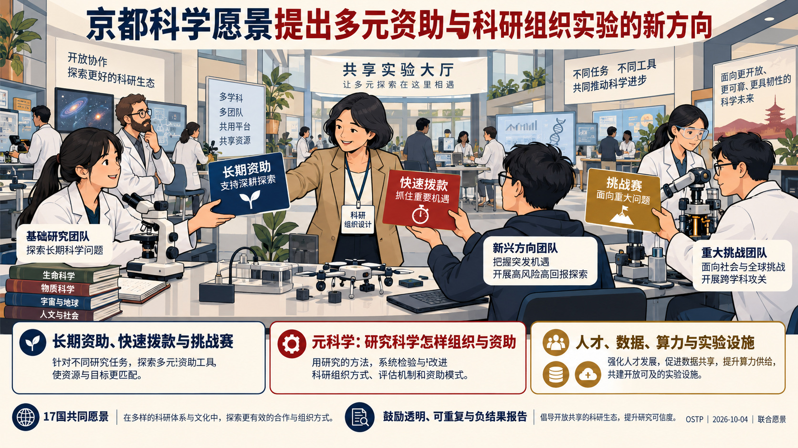
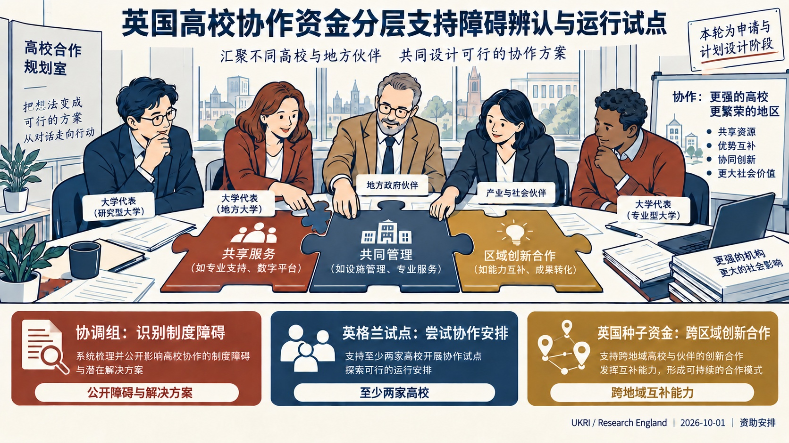
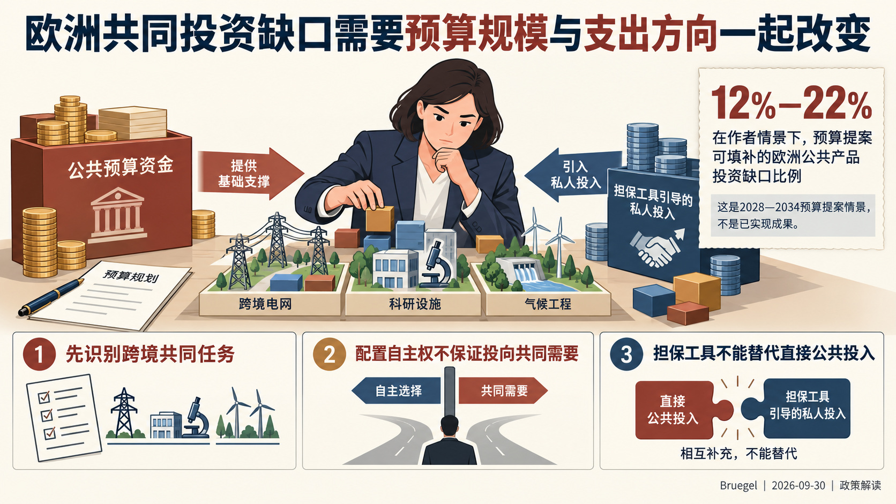

# 国际科技智库周报（2026-10-05）扩充修订版｜资料窗口：2026-09-29 至 2026-10-05

本期收录概况：收录 16 条｜重点 6 条｜本期收录机构 10 家。

<!-- weekly-editorial-sha256: 354f30fe7b05d982035b7b6ce498e867fcadd71159c3af5aef44a4b1a0fdf792 -->

## 科研合作、共同投资与AI治理：本周研究选读

本期包括六篇重点解读和十则简讯，优先关注组织模式的新做法。英国试验高校间的协作安排，日本探索高校、企业与公共项目之间的成果应用分工，兰德讨论政策研究机构如何兼顾快速响应和组织重构。共同投资、科学数据、国际治理及科技竞争等研究提供更广的政策背景。

## 值得细读的发现

### 协作资金支持研究体系的组织试验

英国把合作障碍诊断、英格兰高校试点和跨区域创新伙伴关系分别配置资金，要求说明机构与地区之间如何形成互补能力。

原文：[UKRI资金公告：范围与支持方式](https://www.ukri.org/opportunity/collaboration-for-a-sustainable-future-pilots-uk-seed-funding/) · [阅读全文](#topic-02)

### 欧洲投资缺口同时涉及规模与用途

Bruegel认为，担保工具能够吸引私人资金，但研究、气候和跨境基础设施仍需要直接公共投入；扩大预算还须调整支出方向。

原文：[Bruegel预算政策解读](https://www.bruegel.org/first-glance/finance-its-future-europe-needs-bigger-more-targeted-budget) · [阅读全文](#topic-03)

### AI开始连接化学路线设计与反应验证

AMATERUS AI将AI与量子化学计算结合，从大量候选合成路径中筛选和验证方案；特定药物评估案例的人员投入由64人周降至12人周。

原文：[NEDO发布说明与注3](https://www.nedo.go.jp/news/press/AA5_101968.html) · [阅读全文](#topic-06)

[完整阅读导航（6 篇）](#reading-navigation)

## 主题展开

### 主题 01｜[P1] [《京都科学愿景》提出改革科研资助与组织方式，推动智能技术进入科学发现](https://www.whitehouse.gov/releases/2026/10/us-leads-international-coalition-to-endorse-kyoto-vision-for-a-golden-age-of-science/)

- **来源**：白宫科技政策办公室（OSTP）｜2026-10-04

#### 摘要导读

《京都科学愿景》将科研制度改革、智能技术与人才培养并列提出：采用多种资助方式，试验不同科研组织，并以经验研究改进科学管理。文件还把科学数据、算力和实验设施的可获得性纳入智能科学的发展条件。

#### 报告解读

2026年10月4日，参加京都科学技术与社会论坛相关部长会议的科技政策负责人提出《京都科学愿景》。白宫科技政策办公室发布的文件，把提高科学发现能力同时放在科研制度、智能技术和人才三个方面讨论。其出发点是：新工具正在扩大科学探索的可能范围，资助和组织方式也需要为高风险、变革性研究提供更合适的条件。

### 一、用多种资助和组织方式支持不同科学目标

文件提出有意识地组合长期资助、快速拨款、奖励和挑战赛。这些工具对应不同的研究需要，不能仅以一种申报周期或资助模式覆盖所有科学活动。组织层面则鼓励试验不同的制度安排，使自主权、资源支持与研究方向要求形成不同组合。

检验这些安排的依据来自“元科学”（metascience），即用经验研究考察科学活动本身如何开展、组织和获得资助。愿景鼓励政府建立专门能力，识别并采用有前景的做法。它同时强调可重复、透明、无偏的同行评议，以及对误差和不确定性的沟通，并承认负面结果与零结果的知识价值。资助创新由此与科学质量和公众信任相联系。

### 二、把智能技术与研究条件共同纳入科学政策

文件以“超级智能”（Super Intelligence，SI）描述其期待的技术方向，列举跨大规模知识进行推理、构建更高保真的物理和生物模型，以及自主闭环发现等用途。闭环发现意味着研究问题、实验与结果反馈能够相互连接，技术作用也从辅助单个任务延伸到研究过程。

与这一方向相配套，愿景提出扩大科研人员获取智能工具、科学数据、计算基础设施和实验设施的机会。文件将这些条件共同列出，说明推动智能科学涉及研究资源的组织与开放程度。这里提出的是发展方向；声明没有提供上述能力已经普遍实现的证据，也没有列出统一的建设预算。

### 三、科研人才政策同时关注探索自由与技术实践

愿景主张及早识别和支持有潜力的学生与青年科研人员，给予其开展有雄心研究所需的支持、自由和机会。它还单独提出，先进仪器的运行、维护和改进依赖具备实践经验的人员，科学进步需要同时支持科研构想与技术能力。

联合博士培养、奖学金和合作研究被列为跨科研环境积累经验的途径。文件最后提出在各自国家科研体系中推进这些方向。其后续进展应体现在各国如何调整资助工具、设置组织试验、提供科研资源，以及支持不同类型人才；本次发布本身是一份共同愿景，尚非统一实施方案。

来源：[官方发布与声明全文](https://www.whitehouse.gov/releases/2026/10/us-leads-international-coalition-to-endorse-kyoto-vision-for-a-golden-age-of-science/)。

### 主题 02｜[P1] [英国以分层协作资金回应高校的成本与制度障碍](https://www.ukri.org/opportunity/collaboration-for-a-sustainable-future-pilots-uk-seed-funding/)

- **来源**：英国研究与创新署（UKRI）/ Research England｜2026-10-01

#### 摘要导读

Research England将高校合作支持分为障碍诊断、机构试点与跨区域创新伙伴关系。资金不仅支持提出合作意向，还支持验证多校共同提供研究和创新服务的方式，并把不同地区的互补能力连接起来。

#### 报告解读

英国研究与创新署（UKRI）下属Research England于2026年10月1日公布“面向可持续未来的协作”计划相关资金。面对高校持续承受的运行压力，计划希望通过机构之间的合作，改善研究和创新体系的成本效益。这里的“可持续”主要指机构和体系的长期运行能力，资助对象是新的协作方式。

### 一、辨认合作障碍与开展试点分别获得支持

计划为协调组安排约75万英镑，每组可申请1万至10万英镑、期限最长一年。协调组需要公开识别高校合作面临的制度障碍，并提出可能的解决办法，使其他机构也能使用这些成果。这条路径强调形成共同认识，为之后的实际协作提供条件。

英格兰高校实施试点另有400万英镑，要求至少两家高校参与，单项10万至100万英镑、最长两年。公告列举联合提供专业服务、尝试中等规模设施的共同管理，以及为企业和投资者建立更清晰的合作入口等方向。支持重点是检验新的跨机构安排如何运作，包括责任、服务与资源如何组织。

### 二、种子资金把不同地区的创新优势连接起来

英国范围的跨区域创新伙伴关系安排1500万英镑种子资金，单项100万至500万英镑、最长三年。申请须连接至少两个地域创新生态，参与者除高校外，还可包括地方政府、企业与投资机构。

这类合作需要说明不同地区的能力怎样互补、共同工作能带来什么额外作用。公告强调探索新模式，要求项目回应各地区的经济特点和发展需要；地域范围可由申请方依据实际联系界定。因而，多机构参加和伙伴数量本身不足以说明合作价值，资金设计要求申请者交代协作的具体理由。

### 三、协作资金围绕研究体系的组织条件配置

公告明确，普通联合科研项目、楼宇或设备购置、研究人员资助，以及仅为削减支出而进行的重组均不在支持范围内。它希望试验的是研究和创新活动的组织条件，例如跨校提供服务、建立共同能力和连接区域生态，而非给既有项目换一个合作名称。

两项主要资金合计1900万英镑，另有协调组支持。当前仍处申请阶段，后续能否改善成本效益和协作能力，要看试点的实施与公开成果；公告也没有保证项目能获得后续追加资助。

来源：[试点与跨区域种子资金](https://www.ukri.org/opportunity/collaboration-for-a-sustainable-future-pilots-uk-seed-funding/)；[协调组资金](https://www.ukri.org/opportunity/collaboration-for-a-sustainable-future-coordinating-groups/)。

### 主题 03｜[P1] [欧洲共同投资缺口不能仅靠担保工具补齐](https://www.bruegel.org/first-glance/finance-its-future-europe-needs-bigger-more-targeted-budget)

- **来源**：布鲁盖尔研究所（Bruegel）｜2026-09-30

#### 摘要导读

Bruegel评估欧盟2028—2034年预算提案，认为规模与用途同时限制其投资作用。研究、跨境网络和气候等共同任务，需要直接公共投入，不能只寄望撬动私人资本。

#### 报告解读

布鲁盖尔研究所（Bruegel）于2026年9月30日发布兹索尔特·达尔瓦什（Zsolt Darvas）等人的政策解读《为未来融资，欧洲需要更大且更有针对性的预算》。文章结合对欧盟2028—2034年预算提案的研究，分析欧盟层面的资金能在多大程度上填补投资缺口。作者认为，预算规模不足与支出方向延续旧有格局，会共同限制欧洲的长期投资能力。

### 一、先区分哪些投资需要共同承担

欧洲的绿色转型、数字技术、创新和安全韧性都需要增加投资，但并非所有需求都应由欧盟预算承担。文章以“欧洲公共产品”界定共同投资范围：有些项目存在跨境收益和外溢效应，或由欧盟统一投入比成员国各自行动更有效，例如跨境能源网络、研究和气候行动。

这一划分决定预算评估的分母。衡量共同预算是否有效，需要先考察它对共同任务的贡献；包括私人投资在内的全部投资需求则是更大的范围。混用两个口径，会夸大或低估预算的实际作用。

### 二、同一份预算在不同支出情景下作用不同

研究比较了三种配置情景：大体延续现有支出结构、优先投入欧洲公共产品，以及尽量带动总体投资。在作者的假设下，预算提案可填补欧洲公共产品投资缺口的12%—22%；若以公共和私人部门的全部投资需求为分母，则只能覆盖4%—8%。这些比例是提案情景的估算。

作者认为，问题既在规模，也在用途。欧盟预算仅略高于成员国国民总收入的1%，且相当部分继续用于农业和地区再分配，留给创新、气候和数字化的增量空间有限。赋予成员国更大的支出自主权，也不保证资金会自动流向跨境共同任务，原有分配方式可能继续延续。

### 三、担保工具的作用受项目回报结构约束

公共担保和公私合作可以吸引私人投入，但研究、气候减缓和跨境基础设施仍需要持续的直接公共投资。具有共同收益的项目，未必能提供足以吸引商业资金的回报；仅改变融资工具，无法替代公共预算承担相应成本。

因此，文章主张同时扩大预算并调整用途，把新增空间优先配置到长期共同投资。对国防等受到重视、却仍缺少清晰共同投资需求数据的领域，作者还要求先改善分析依据。其政策判断是，欧洲应把资金规模、共同任务和支出结构放在一起讨论，不能将填补投资缺口的责任主要交给金融工具。

来源：[Bruegel政策解读](https://www.bruegel.org/first-glance/finance-its-future-europe-needs-bigger-more-targeted-budget)。

### 主题 04｜[P1] [ITIF评论中美科技产业竞争：以日本经验预测中国走向存在哪些问题](https://itif.org/publications/2026/10/01/china-challenge-is-not-japan-challenge-its-worse/)

- **来源**：信息技术与创新基金会（ITIF）｜2026-10-01

#### 摘要导读

ITIF总裁阿特金森反对以日本后来的增长放缓推断中国的科技产业竞争压力会自行消退。他从安全关系、市场规模、供应链地位和企业国际化等方面提出比较，主张美国加强自身科技产业能力并协调盟友政策。

#### 报告解读

信息技术与创新基金会（ITIF）于2026年10月1日刊载该机构总裁罗伯特·阿特金森（Robert D. Atkinson）的评论《中国挑战并非日本挑战——而是更严峻》。文章回应一种历史类比：美国曾担忧日本的产业竞争，后来日本增长放缓，因此中国带来的压力也可能自行减弱。作者认为，这种推断忽略了竞争双方所处的安全关系、市场结构和企业发展方式。

### 一、历史类比需要比较约束条件

阿特金森首先强调，日本当时处在美国的安全同盟体系中，美国因而拥有特定的谈判和政策影响渠道；中国与美国的关系不同，历史上的政策工具不能简单复制。他还指出，日本后来增长放缓，也不意味着美国失去的产业能力全部恢复。日本在部分先进生产设备和材料领域仍有重要地位，宏观增速下降与产业竞争能力消失是两个问题。

文章据此将讨论对象从短期贸易摩擦转向支撑国家实力的先进产业。作者认为，一般消费品关税谈判与半导体、电池等领域的竞争涉及不同问题，商业关系阶段性缓和不足以说明科技产业竞争已经改变方向。

### 二、规模、供应链与企业国际化改变竞争形态

作者认为，中国较大的市场规模不仅影响企业生产，也影响跨国企业的利益选择。已经形成当地收入和投资的企业，对政策冲突的反应可能不同于只在境外出口的企业。文章还把关键供应环节列为竞争能力的一部分：若对特定材料和中间投入缺少替代来源，其他国家采取产业或贸易措施时便会受到约束。

在企业层面，文章将部分日本企业围绕本国需求高度优化产品、却较难向海外扩展的现象，与中国企业利用国内规模并积极进入全球市场相比较。阿特金森同时强调中国竞争中企业创业活动与国家产业政策的并存，认为不能只用国家补贴或低成本生产解释其竞争表现。

### 三、政策建议指向科技产业体系的持续建设

沿着上述判断，作者主张美国加强科技、产业与经济体系，并与盟友协调政策，而非等待中国重复日本的历史轨迹。文章没有提出中国必然维持同一增长路径的预测；其核心判断是，期待竞争压力自行消失不足以支撑战略选择。

这是一篇从美国科技产业竞争立场出发的政策评论。它对中国战略意图和政策性质带有明确的作者判断；值得辨析的研究问题在于，市场规模、企业全球布局与关键供应环节怎样共同影响国家竞争能力，以及历史类比是否具备可比条件。

来源：[ITIF评论原文](https://itif.org/publications/2026/10/01/china-challenge-is-not-japan-challenge-its-worse/)。

### 主题 05｜[P1] [兰德研究AGI竞争中的相互克制：核验能力如何支撑国家承诺](https://www.rand.org/pubs/research_reports/RRA5163-1.html)

- **来源**：兰德公司（RAND）｜2026-09-30

#### 摘要导读

兰德将AGI相互克制的难题分为违约动机、发现能力与惩罚效力。国内监管产生的记录可以支持国际核验，但对不同违约行为的作用不一；如果各方认为AGI临近，维持合作所需的制度安排也会改变。

#### 报告解读

兰德公司于2026年9月30日发布托比亚斯·西茨马（Tobias Sytsma）和阿尔文·穆恩（Alvin Moon）的《AGI竞争对手能否保持克制？核验、国内监督与相互克制的条件》。报告讨论：即使两个国家都希望降低通用人工智能（AGI）研发竞赛的风险，为什么仍可能无法共同放缓？作者通过博弈模型分析双方的选择，将国内监督能力视为国际承诺能否获得信任的基础。

### 一、共同担忧风险，并不消除所有违约动机

模型区分了两类可能的秘密违约。跳过安全评估、削弱防护等行为，可能使违约者自身也承担更大事故风险；如果它相信这种损失足够严重，危险本身就能形成一定约束。但秘密取得算法进展、窃取对手模型权重等行为，主要改变谁先取得优势，未必被行为方认为会显著增加共同灾难风险。对这类行为，仅有共同的安全担忧往往不足以维持克制。

因此，核验要求取决于协议要约束什么。未申报的大规模训练可能留下算力、设施和采购记录，秘密算法进展则更难观察。报告认为，应先列明可能的违约方式，再判断证据在哪里、由谁掌握，以及发现后能否施加代价。只监测数据中心，未必足以覆盖所有决定竞争位置的活动。

### 二、国内监督为国际核验提供可检查的记录

作者将监管分为日常国内治理，以及为支持国际核验而增加的监督。设施登记、算力核算、评估记录和审计能够留下相互核对的线索，使一个国家有条件证明自己遵守约定。它们同时也有成本：除了资金与行政资源，披露信息还可能涉及商业秘密和国家安全。

这种成本构成协调难题。一方若预期对手不会建立可检查的制度，就更不愿独自承担监督成本；双方都可能留在互不透明的状态，即使共同建立核验体系对双方更有利。报告因而讨论保护敏感信息的核验技术、相互展示监督能力等办法。不过，单方面提高透明度不能弥补另一方持续不透明，合作能否成立仍受到较难接受监督的一方制约。

### 三、越接近预期的AGI时点，惩罚机制越需要提前安排

模型中的一种惩罚是：秘密违约被发现后，双方失去继续合作的收益，并恢复竞速。若各方认为AGI尚远，这种未来损失可能有较大约束力；若认为突破即将发生，能够失去的“突破前合作”就变少，抢先获胜的诱惑反而上升。即使能够发现违约，也未必仍能阻止它。

作者据此提出，部分安排需要在突破前建立，并能影响突破后的权益，例如共同项目的治理与收益权、能力使用权和较难被单方收回的资源安排。这些是符合模型要求的政策设想，尚未由模型证明可行。报告也假定两国能够控制本国AI产业、检测不存在误报，并将被发现的违约处理为合作永久破裂；现实中的企业自主行为、争议归因和局部合作会使执行更复杂。

报告的政策重点是及早建设保留克制选项所需的能力。国家是否最终选择放缓，仍取决于它如何判断安全风险、先发收益及对手行为。

来源：[兰德报告及全文](https://www.rand.org/pubs/research_reports/RRA5163-1.html)。

### 主题 06｜[P1] [从合成路线到工艺设计：化学研发AI服务的四个环节](https://www.nedo.go.jp/news/press/AA5_101968.html)

- **来源**：日本新能源产业技术综合开发机构（NEDO）｜2026-09-30

#### 摘要导读

NEDO于9月30日介绍TS Technology与奈良先端科学技术大学院大学开发的AMATERUS AI。系统将知识数据库、合成路线探索、反应预测验证与工艺概念设计连接起来，并结合AI和量子化学计算，筛选和评价大量可能的化学合成路线。发布说明中的药物合成评估案例，人员投入由64人周降至12人周；这一单位衡量人员工作量，不能直接读成日历工期缩短相同比例。研究成果当日开始作为服务提供，为观察AI如何进入科学路线设计与验证提供了具体案例，其效果仍需在不同化学体系中检验。

#### 报告解读

日本新能源产业技术综合开发机构（NEDO）于2026年9月30日介绍化学合成程序AMATERUS AI。山口大学衍生企业TS Technology与奈良先端科学技术大学院大学共同开发该程序，把AI设计合成路线与量子化学计算评价反应结合起来。TS Technology当日开始提供相关服务，使公共研发项目中的计算方法成为可供化学研发使用的工具。

### 一、把分散的路线探索与验证连接起来

功能性化学品包括医药、农药、香料和电子材料等产品。确定从什么原料出发、采用哪些反应和条件，往往依赖文献、研究人员经验、个别计算工具及实验试错；候选路线数量庞大，逐一探索耗费大量时间和人力。

AMATERUS AI连接知识数据库、合成路线探索、反应预测与验证、工艺概念设计四类方法。AI提出候选方案，量子化学计算参与反应评价，再根据目标筛选路径。其价值在于将不同研究环节组合起来，支持研究人员比较路线的可行性。

### 二、公共项目支持高校与衍生企业共同开发

这项成果来自NEDO于2019至2025年度实施的功能性化学品连续精密生产过程技术项目。总项目覆盖催化与反应、分离与精制、计算化学三个方向。TS Technology及其再委托合作方奈良先端大学在2022至2025年度推进路线搜索、候选验证和反应模拟。

公开材料展示了公共项目、大学衍生企业和高校研究团队的具体分工：项目提供研发载体，企业与高校共同开发和验证方法，随后由企业提供服务。服务开始意味着成果已有面向使用者的提供渠道，能否持续扩展还需观察不同化学体系中的应用。

### 三、案例中的效率数字衡量人员工作量

发布说明给出一项药物合成研究评估，工作量从64人周降至12人周。“人周”是投入人数与工作周数的乘积，因此它反映人员投入变化，不能直接换算为日历工期减少相同比例。

这一结果支持继续观察AI与计算化学协同筛选路线的效果，但单个案例尚不足以代表所有功能性化学品。后续应用需要在目标化合物、反应条件和实际工艺要求下继续验证。

来源：[NEDO项目成果说明](https://www.nedo.go.jp/news/press/AA5_101968.html)。

## 本期简讯

### [德国科学基金会资助51个项目，建设面向AI研究的数据资源](https://www.dfg.de/de/aktuelles/neuigkeiten-themen/info-wissenschaft/2026/ifw-26-75)

德国科学基金会（DFG）｜2026-09-29

德国科学基金会9月29日宣布，从167项申请中资助51个“人工智能数据语料库”项目，在两年内建设专门面向AI模型研发和科学应用的数据资源。总资助约2200万欧元，包含22%的间接项目支出补助；涉及癌症研究的单细胞基因组数据、多模态文化遗产数据、控制工程中的动态系统等领域。这项安排落实其数字科研与协作信息基础设施讨论中的衔接目标，将按研究需求整理数据作为支持科学AI的方法之一。资金支持的是接下来两年的建设，不能把获资助项目数理解为已有51个可用数据库。

### [政策研究机构可同时推进快速响应与组织重构](https://www.rand.org/pubs/perspectives/PEA5282-1.html)

兰德公司（RAND）｜2026-10-01

兰德10月1日发布政策分析未来研究，提出机构可采用双轨方式：一条轨道让决策者参与分析，通过较快反馈改进现有项目；另一条轨道试验机构角色、资助模式和人才培养的更深变化。作者建议建设专门的AI审计与验证能力，把与决策者共同研究纳入项目设计，并由资助方支持难以仅靠项目合同维持的培训、共同规范及跨领域工作。这些属于面对AI发展与公众信任变化提出的组织改革建议，尚非已验证的统一模式。

### [行业联盟与平台开发者分工建设跨企业数据协作基础](https://www.nedo.go.jp/news/press/AA5_101969.html)

日本新能源产业技术综合开发机构（NEDO）｜2026-10-01

NEDO于10月1日公布化学物质与资源循环信息平台CMP开始服务。行业联盟与NTT DATA共同推进，公共项目支持基础开发，信息处理推进机构提供架构建议，应用开发者面向各行业提供服务。平台把交易关系与物质信息关联起来，仅向指定伙伴传递必要数据，回应企业间协作与商业保密的矛盾。发布方称，500多家企业参与了此前的大规模验证；2028年扩大至数千家仍是目标。这一案例值得关注的，是行业组织、公共支持、技术平台和应用提供者之间的分工。

### [社区协作试验让参与者核准信息并共同探索行动方案](https://www.brookings.edu/articles/ai-community-problem-solving-data-centers/)

布鲁金斯学会（Brookings）｜2026-09-30

布鲁金斯学会9月30日介绍一次围绕数据中心建设的社区协作模拟。研究者设定经济发展、环境和公共服务可负担性三个居民小组，先逐人访谈，由AI整理记录并交本人核准，再比较各组目标、形成共同策略和可交互的政策导航工具。设计强调由社区掌握数据和治理决定，并把意见收集延伸到实施与反馈。它提供了多方协商的组织试验，但研究使用虚构县域和模拟参与者，不能视为实际社区项目已经取得治理成效。

### [OECD.AI刊文比较广岛AI报告框架与欧盟监管的信息衔接](https://oecd.ai/en/wonk/bridging-frameworks-how-haip-2-0-supports-interoperability-with-the-eu-ai-act)

OECD.AI政策观察平台｜2026-09-30

OECD.AI于9月30日刊登研究者评论，将广岛AI进程（HAIP）第二版报告框架的31项问题与欧盟《人工智能法案》及通用AI实践准则逐项比较。作者认为，模型风险、能力评估和控制措施等证据可以部分复用，减少不同制度之间的信息割裂。但两类披露服务于不同目标：HAIP强调自愿、公开和国际可比性，欧盟相关机制则包含面向监管和下游使用者的非公开材料。自愿报告不能替代法定义务；文章提出的是作者对制度互补关系的分析，未将其认定为OECD或欧盟的官方合规结论。

### [专利权能否有效执行，影响技术许可与创新资产价值](https://ecipe.org/insights/the-injunction-divide/)

欧洲国际政治经济研究中心（ECIPE）｜2026-09-29

ECIPE于9月29日刊文比较美欧专利禁令争论。作者认为，限制禁令可以减轻权利人以整件产品停止销售相要挟的空间，却也可能增加技术使用者拖延许可、继续使用专利的动机。争论因而关系到创新者与实施者之间的利益分配。文章以欧洲案件说明，法院可针对特殊情形调整救济范围，例如允许特定患者继续使用唯一适用的心脏瓣膜，而不普遍削弱排他权。作者进一步将执行能力与专利估值、创新企业融资联系起来；美国恢复更强禁令推定的立法建议，仍未取代现行判例标准。

### [数据中心公私合作需事先明确能源与建设责任](https://www.rand.org/pubs/research_reports/RRA5050-1.html)

兰德公司（RAND）｜2026-10-02

兰德10月2日发布联邦土地上AI数据中心选址研究，比较31个候选地点，并通过政府和行业参与的研讨分析合作安排。作者建议，在招租之前核查能源成本、并网可行性和基础设施条件，把供能与土建列为并行工作；公私合作指引则应事先明确各方风险、安全和退役责任。研究发现，地点排序会随规模和融资假设变化，开放土地本身不足以形成可用算力。这里提出的是基础设施合作的决策与责任安排，研讨情景不代表实际项目已成功运行。

### [兰德将科技与国内经济视为中美竞争的基础领域](https://www.rand.org/pubs/research_reports/RRA4254-2.html)

兰德公司（RAND）｜2026-09-29

兰德9月29日发布《中美竞争的范围与性质》。报告官方摘要将科学技术和国内经济列为七个竞争领域中具有基础作用的两项，并把全球网络关系、社会与治理能力作为跨领域条件。作者认为，中国实力变化不能简单视作直线式的权力转移，第三方选择和国家韧性都会影响竞争走向。建议包括增强本国社会经济基础、改进治理，以及重视全球数字和AI网络中的影响力。这一框架把竞争能力与国内发展、技术体系和国际联系放在一起考察，提供了超出单项技术领先或贸易摩擦的观察视角。

### [军事AI遭到干扰后，技术故障可能演变为战略误判](https://www.rand.org/pubs/research_reports/RRA4734-2.html)

兰德公司（RAND）｜2026-09-29

兰德9月29日发布关于对抗性AI与战略稳定的研究，讨论军事及关键基础设施中的AI被干扰、欺骗或阻断后可能产生的影响。官方摘要指出，决策者可能难以区分模型自身失效与蓄意攻击，也难以确认行为方，进而增加误判和不信任；常规与核指挥、控制、通信系统之间的关联还可能放大升级风险。作者据五种情景提出，提高系统韧性、保留恢复与备用方案，并建立事件信息分享和沟通渠道。研究关注的是攻击带来的战略后果与治理条件，未将这些情景写成已经发生的事故。

### [PFAS技术路线需连接材料分类、回收技术与追溯安排](https://www.nedo.go.jp/library/ZZNA_100129.html)

日本新能源产业技术综合开发机构（NEDO）｜2026-09-30

NEDO于9月30日发布含氟化合物PFAS技术动向报告，将低分子物质与高分子材料分开分析。报告指出，针对低分子物质，分离回收还需与后续分解处理衔接；针对含氟聚合物，生产中来源清楚的边角料与使用后混合废物，所需技术条件不同。扩大循环利用不仅依赖清洗、分选和化学回收，还需要掌握材料来源、树脂种类、添加剂和使用环境。报告据此提出分阶段拓展回收对象的路线，为组合技术研发与追溯机制提供依据。

## 阅读导航

- [主题 01｜《京都科学愿景》提出改革科研资助与组织方式，推动智能技术进入科学发现](#topic-01) · 白宫科技政策办公室（OSTP）
- [主题 02｜英国以分层协作资金回应高校的成本与制度障碍](#topic-02) · 英国研究与创新署（UKRI）/ Research England
- [主题 03｜欧洲共同投资缺口不能仅靠担保工具补齐](#topic-03) · 布鲁盖尔研究所（Bruegel）
- [主题 04｜ITIF评论中美科技产业竞争：以日本经验预测中国走向存在哪些问题](#topic-04) · 信息技术与创新基金会（ITIF）
- [主题 05｜兰德研究AGI竞争中的相互克制：核验能力如何支撑国家承诺](#topic-05) · 兰德公司（RAND）
- [主题 06｜从合成路线到工艺设计：化学研发AI服务的四个环节](#topic-06) · 日本新能源产业技术综合开发机构（NEDO）
