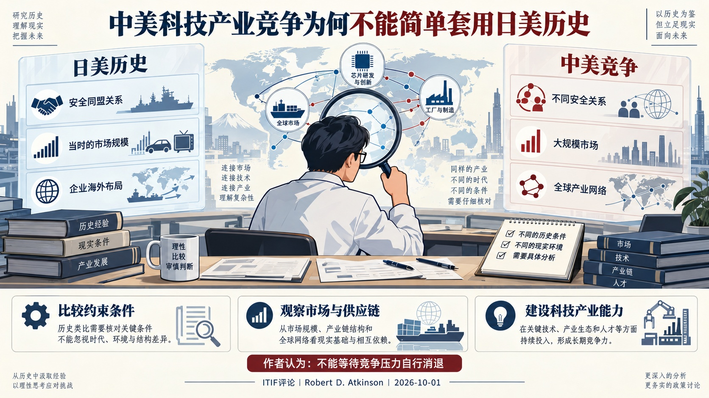
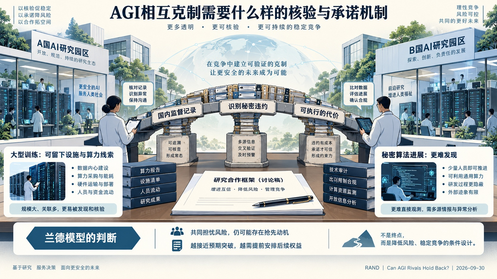

# 国际科技智库周报（2026-10-05）修订阅读版｜资料窗口：2026-09-29 至 2026-10-05

本期收录概况：收录 4 条｜重点 3 条｜本期收录机构 4 家。

<!-- weekly-editorial-sha256: 69577cb409caaef1488224b7274f48a060c82176de40413987a24ca1b68ba34b -->

## 本期重点：AGI治理、科研制度与科技产业竞争

本期保留三篇重点解读与一则科研资助简讯。兰德分析国家如何为AGI克制承诺建立核验条件；《京都科学愿景》讨论资助、组织和智能科学的配套改革；ITIF从历史比较提出对中美科技产业竞争的判断。三篇材料分别呈现模型分析、政策愿景和作者评论。

## 值得细读的发现

### AGI克制需要可以检查的承诺

国内监管记录能支持国际核验，但秘密算法进展与大型训练留下的证据不同；临近预期突破时，惩罚还须考虑突破后的权益。

原文：[兰德报告：核验模型与战略含义](https://www.rand.org/pubs/research_reports/RRA5163-1.html) · [阅读全文](#topic-03)

### 科学政策同时调整工具与制度

京都愿景把长期资助、快速拨款、组织实验与元科学并列提出；德国数据项目提供了支持科学AI的一项具体资助安排。

原文：[京都科学愿景共同声明](https://www.whitehouse.gov/releases/2026/10/us-leads-international-coalition-to-endorse-kyoto-vision-for-a-golden-age-of-science/) · [阅读全文](#topic-01)

[完整阅读导航（3 篇）](#reading-navigation)

## 主题展开

### 主题 01｜[P1] [《京都科学愿景》提出改革科研资助与组织方式，推动智能技术进入科学发现](https://www.whitehouse.gov/releases/2026/10/us-leads-international-coalition-to-endorse-kyoto-vision-for-a-golden-age-of-science/)

- **来源**：白宫科技政策办公室（OSTP）｜2026-10-04

#### 摘要导读

《京都科学愿景》将科研制度改革、智能技术与人才培养并列提出：采用多种资助方式，试验不同科研组织，并以经验研究改进科学管理。文件还把科学数据、算力和实验设施的可获得性纳入智能科学的发展条件。

#### 报告解读

2026年10月4日，参加京都科学技术与社会论坛相关部长会议的科技政策负责人提出《京都科学愿景》。白宫科技政策办公室发布的文件，把提高科学发现能力同时放在科研制度、智能技术和人才三个方面讨论。其出发点是：新工具正在扩大科学探索的可能范围，资助和组织方式也需要为高风险、变革性研究提供更合适的条件。

### 一、用多种资助和组织方式支持不同科学目标

文件提出有意识地组合长期资助、快速拨款、奖励和挑战赛。这些工具对应不同的研究需要，不能仅以一种申报周期或资助模式覆盖所有科学活动。组织层面则鼓励试验不同的制度安排，使自主权、资源支持与研究方向要求形成不同组合。

检验这些安排的依据来自“元科学”（metascience），即用经验研究考察科学活动本身如何开展、组织和获得资助。愿景鼓励政府建立专门能力，识别并采用有前景的做法。它同时强调可重复、透明、无偏的同行评议，以及对误差和不确定性的沟通，并承认负面结果与零结果的知识价值。资助创新由此与科学质量和公众信任相联系。

### 二、把智能技术与研究条件共同纳入科学政策

文件以“超级智能”（Super Intelligence，SI）描述其期待的技术方向，列举跨大规模知识进行推理、构建更高保真的物理和生物模型，以及自主闭环发现等用途。闭环发现意味着研究问题、实验与结果反馈能够相互连接，技术作用也从辅助单个任务延伸到研究过程。

与这一方向相配套，愿景提出扩大科研人员获取智能工具、科学数据、计算基础设施和实验设施的机会。文件将这些条件共同列出，说明推动智能科学涉及研究资源的组织与开放程度。这里提出的是发展方向；声明没有提供上述能力已经普遍实现的证据，也没有列出统一的建设预算。

### 三、科研人才政策同时关注探索自由与技术实践

愿景主张及早识别和支持有潜力的学生与青年科研人员，给予其开展有雄心研究所需的支持、自由和机会。它还单独提出，先进仪器的运行、维护和改进依赖具备实践经验的人员，科学进步需要同时支持科研构想与技术能力。

联合博士培养、奖学金和合作研究被列为跨科研环境积累经验的途径。文件最后提出在各自国家科研体系中推进这些方向。其后续进展应体现在各国如何调整资助工具、设置组织试验、提供科研资源，以及支持不同类型人才；本次发布本身是一份共同愿景，尚非统一实施方案。

来源：[官方发布与声明全文](https://www.whitehouse.gov/releases/2026/10/us-leads-international-coalition-to-endorse-kyoto-vision-for-a-golden-age-of-science/)。

### 主题 02｜[P1] [ITIF评论中美科技产业竞争：以日本经验预测中国走向存在哪些问题](https://itif.org/publications/2026/10/01/china-challenge-is-not-japan-challenge-its-worse/)

- **来源**：信息技术与创新基金会（ITIF）｜2026-10-01

#### 摘要导读

ITIF总裁阿特金森反对以日本后来的增长放缓推断中国的科技产业竞争压力会自行消退。他从安全关系、市场规模、供应链地位和企业国际化等方面提出比较，主张美国加强自身科技产业能力并协调盟友政策。

#### 报告解读

信息技术与创新基金会（ITIF）于2026年10月1日刊载该机构总裁罗伯特·阿特金森（Robert D. Atkinson）的评论《中国挑战并非日本挑战——而是更严峻》。文章回应一种历史类比：美国曾担忧日本的产业竞争，后来日本增长放缓，因此中国带来的压力也可能自行减弱。作者认为，这种推断忽略了竞争双方所处的安全关系、市场结构和企业发展方式。

### 一、历史类比需要比较约束条件

阿特金森首先强调，日本当时处在美国的安全同盟体系中，美国因而拥有特定的谈判和政策影响渠道；中国与美国的关系不同，历史上的政策工具不能简单复制。他还指出，日本后来增长放缓，也不意味着美国失去的产业能力全部恢复。日本在部分先进生产设备和材料领域仍有重要地位，宏观增速下降与产业竞争能力消失是两个问题。

文章据此将讨论对象从短期贸易摩擦转向支撑国家实力的先进产业。作者认为，一般消费品关税谈判与半导体、电池等领域的竞争涉及不同问题，商业关系阶段性缓和不足以说明科技产业竞争已经改变方向。

### 二、规模、供应链与企业国际化改变竞争形态

作者认为，中国较大的市场规模不仅影响企业生产，也影响跨国企业的利益选择。已经形成当地收入和投资的企业，对政策冲突的反应可能不同于只在境外出口的企业。文章还把关键供应环节列为竞争能力的一部分：若对特定材料和中间投入缺少替代来源，其他国家采取产业或贸易措施时便会受到约束。

在企业层面，文章将部分日本企业围绕本国需求高度优化产品、却较难向海外扩展的现象，与中国企业利用国内规模并积极进入全球市场相比较。阿特金森同时强调中国竞争中企业创业活动与国家产业政策的并存，认为不能只用国家补贴或低成本生产解释其竞争表现。

### 三、政策建议指向科技产业体系的持续建设

沿着上述判断，作者主张美国加强科技、产业与经济体系，并与盟友协调政策，而非等待中国重复日本的历史轨迹。文章没有提出中国必然维持同一增长路径的预测；其核心判断是，期待竞争压力自行消失不足以支撑战略选择。

这是一篇从美国科技产业竞争立场出发的政策评论。它对中国战略意图和政策性质带有明确的作者判断；值得辨析的研究问题在于，市场规模、企业全球布局与关键供应环节怎样共同影响国家竞争能力，以及历史类比是否具备可比条件。

来源：[ITIF评论原文](https://itif.org/publications/2026/10/01/china-challenge-is-not-japan-challenge-its-worse/)。

### 主题 03｜[P1] [兰德研究AGI竞争中的相互克制：核验能力如何支撑国家承诺](https://www.rand.org/pubs/research_reports/RRA5163-1.html)

- **来源**：兰德公司（RAND）｜2026-09-30

#### 摘要导读

兰德将AGI相互克制的难题分为违约动机、发现能力与惩罚效力。国内监管产生的记录可以支持国际核验，但对不同违约行为的作用不一；如果各方认为AGI临近，维持合作所需的制度安排也会改变。

#### 报告解读

兰德公司于2026年9月30日发布托比亚斯·西茨马（Tobias Sytsma）和阿尔文·穆恩（Alvin Moon）的《AGI竞争对手能否保持克制？核验、国内监督与相互克制的条件》。报告讨论：即使两个国家都希望降低通用人工智能（AGI）研发竞赛的风险，为什么仍可能无法共同放缓？作者通过博弈模型分析双方的选择，将国内监督能力视为国际承诺能否获得信任的基础。

### 一、共同担忧风险，并不消除所有违约动机

模型区分了两类可能的秘密违约。跳过安全评估、削弱防护等行为，可能使违约者自身也承担更大事故风险；如果它相信这种损失足够严重，危险本身就能形成一定约束。但秘密取得算法进展、窃取对手模型权重等行为，主要改变谁先取得优势，未必被行为方认为会显著增加共同灾难风险。对这类行为，仅有共同的安全担忧往往不足以维持克制。

因此，核验要求取决于协议要约束什么。未申报的大规模训练可能留下算力、设施和采购记录，秘密算法进展则更难观察。报告认为，应先列明可能的违约方式，再判断证据在哪里、由谁掌握，以及发现后能否施加代价。只监测数据中心，未必足以覆盖所有决定竞争位置的活动。

### 二、国内监督为国际核验提供可检查的记录

作者将监管分为日常国内治理，以及为支持国际核验而增加的监督。设施登记、算力核算、评估记录和审计能够留下相互核对的线索，使一个国家有条件证明自己遵守约定。它们同时也有成本：除了资金与行政资源，披露信息还可能涉及商业秘密和国家安全。

这种成本构成协调难题。一方若预期对手不会建立可检查的制度，就更不愿独自承担监督成本；双方都可能留在互不透明的状态，即使共同建立核验体系对双方更有利。报告因而讨论保护敏感信息的核验技术、相互展示监督能力等办法。不过，单方面提高透明度不能弥补另一方持续不透明，合作能否成立仍受到较难接受监督的一方制约。

### 三、越接近预期的AGI时点，惩罚机制越需要提前安排

模型中的一种惩罚是：秘密违约被发现后，双方失去继续合作的收益，并恢复竞速。若各方认为AGI尚远，这种未来损失可能有较大约束力；若认为突破即将发生，能够失去的“突破前合作”就变少，抢先获胜的诱惑反而上升。即使能够发现违约，也未必仍能阻止它。

作者据此提出，部分安排需要在突破前建立，并能影响突破后的权益，例如共同项目的治理与收益权、能力使用权和较难被单方收回的资源安排。这些是符合模型要求的政策设想，尚未由模型证明可行。报告也假定两国能够控制本国AI产业、检测不存在误报，并将被发现的违约处理为合作永久破裂；现实中的企业自主行为、争议归因和局部合作会使执行更复杂。

报告的政策重点是及早建设保留克制选项所需的能力。国家是否最终选择放缓，仍取决于它如何判断安全风险、先发收益及对手行为。

来源：[兰德报告及全文](https://www.rand.org/pubs/research_reports/RRA5163-1.html)。

## 本期简讯

### [德国科学基金会资助51个项目，建设面向AI研究的数据资源](https://www.dfg.de/de/aktuelles/neuigkeiten-themen/info-wissenschaft/2026/ifw-26-75)

德国科学基金会（DFG）｜2026-09-29

德国科学基金会9月29日宣布，从167项申请中资助51个“人工智能数据语料库”项目，在两年内建设专门面向AI模型研发和科学应用的数据资源。总资助约2200万欧元，包含22%的间接项目支出补助；涉及癌症研究的单细胞基因组数据、多模态文化遗产数据、控制工程中的动态系统等领域。这项安排落实其数字科研与协作信息基础设施讨论中的衔接目标，将按研究需求整理数据作为支持科学AI的方法之一。资金支持的是接下来两年的建设，不能把获资助项目数理解为已有51个可用数据库。

## 阅读导航

- [主题 01｜《京都科学愿景》提出改革科研资助与组织方式，推动智能技术进入科学发现](#topic-01) · 白宫科技政策办公室（OSTP）
- [主题 02｜ITIF评论中美科技产业竞争：以日本经验预测中国走向存在哪些问题](#topic-02) · 信息技术与创新基金会（ITIF）
- [主题 03｜兰德研究AGI竞争中的相互克制：核验能力如何支撑国家承诺](#topic-03) · 兰德公司（RAND）
