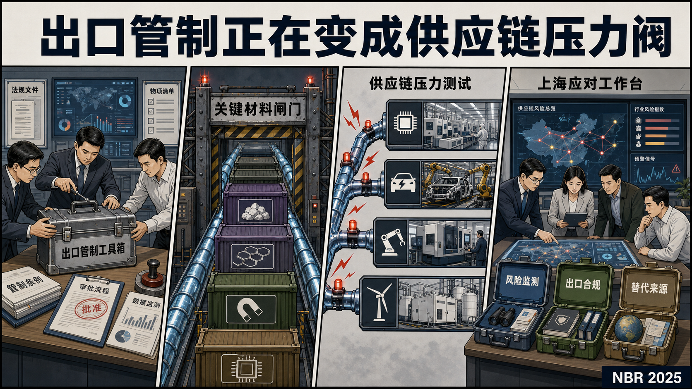

# 国际科技智库周报（2026-07-06）

## 漫画导读

读图说明1：锚定报告：NBR《中国出口管制图谱》。关键判断：出口管制正在制度化为经济安全工具，并通过关键矿产、材料加工设备和下游行业传导为供应链压力。政策建议：持续监测贸易和投资数据，开展供应链压力测试，提前准备替代来源与政企协同。中国/上海参考：半导体、新能源汽车、先进制造和清洁技术应把材料风险、出口合规和产业链韧性纳入常态化监测。

## 新增概览

- 新增条目：113
- P0/P1重点：104
- 创新支撑条目：112
- 纯治理条目：0
- 涉及机构：18
- 高频主题：科技创新, 先进制造, 中国与上海相关, AI治理, 数字经济, 科技治理

## 最近写入

- [P1] National Bureau of Asian Research Technology and Geoeconomic Affairs｜美日技术与经济安全：在扰动时代实现韧性｜https://www.nbr.org/publication/us-japan-technology-and-economic-security-achieving-resilience-in-an-era-of-disruption/
- [P0] National Bureau of Asian Research Technology and Geoeconomic Affairs｜美韩技术合作：电池、生物技术与量子技术｜https://www.nbr.org/publication/u-s-rok-tech-cooperation-batteries-biotech-and-quantum-technologies/
- [P0] National Bureau of Asian Research Technology and Geoeconomic Affairs｜印太国家量子计算生态系统分析｜https://www.nbr.org/publication/analyzing-national-quantum-computing-ecosystems-in-the-indo-pacific/
- [P0] National Bureau of Asian Research Technology and Geoeconomic Affairs｜中国出口管制图谱：预测对美国关键供应链的影响｜https://www.nbr.org/publication/charting-chinas-export-controls-predicting-impacts-on-critical-u-s-supply-chains/
- [P1] Centre for European Policy Studies｜欧盟立法准备中创新原则落实情况评估｜https://www.ceps.eu/ceps-publications/assessment-of-the-state-of-play-of-the-innovation-principle-in-the-preparation-of-eu-legislation/
- [P1] Centre for European Policy Studies｜欧盟及主要全球伙伴技术专长、复杂度与关联性图谱｜https://www.ceps.eu/ceps-publications/mapping-of-technology-specialisation-complexity-and-relatedness-of-the-eu-and-selected-global-partners/
- [P0] Centre for European Policy Studies｜共享收益与安全连接：重思欧亚数字合作｜https://www.ceps.eu/ceps-publications/shared-gains-secure-links-rethinking-eu-asia-digital-cooperation/
- [P0] Centre for European Policy Studies｜欧洲工业AI应用最佳实践图谱｜https://www.ceps.eu/ceps-publications/mapping-european-best-practices-for-ai-uptake-in-industry/

## P0/P1重点

### [P0] 价值链留在国内：中国技术外流管控及其欧洲含义

- 机构：MERICS Industrial Policy and Technology
- 主题：中国与上海相关, 先进制造, 半导体, 科技创新, 科技治理, 数字经济
- 链接：https://merics.org/en/report/keeping-value-chains-home
- 核心观点：该报告分析中国如何通过军民两用出口管制、民用技术出口管制、黑名单、数据本地化、知识产权转让审查、人才流动限制、贸易投资管理和科技发展中的党国控制，管理技术相关外流并维护价值链优势。报告指出，中国的特殊性在于拥有一套以“经济安全”和“创新能力保护”为目标的民用技术出口管制体系，可用于阻止稀土磁体制造、算法、激光雷达、植物育种、遥感测绘等关键技术外流；同时，镓、锗、石墨和稀土加工等案例说明，中国正在把关键矿产、半导体、EV电池和绿色技术供应链中的地位转化为政策杠杆。
- 建议：研判价值在于，该文将中国科技自立自强解释为“防御性去依赖”与“进攻性保留价值链”并行的产业安全战略。对上海和长三角相关研究而言，重点不只在出口管制本身，而在技术、数据、资本、人才、知识产权和产业链节点如何共同构成创新能力外流边界。后续可将该报告与上海集成电路、稀土永磁、新能源汽车、电池材料和数据要素市场研究联动，用于判断中国在全球科技创新链中如何保留关键环节、管理外部获取并应对欧洲去风险。
- 中国/上海参考：研判价值在于，该文将中国科技自立自强解释为“防御性去依赖”与“进攻性保留价值链”并行的产业安全战略。对上海和长三角相关研究而言，重点不只在出口管制本身，而在技术、数据、资本、人才、知识产权和产业链节点如何共同构成创新能力外流边界。后续可将该报告与上海集成电路、稀土永磁、新能源汽车、电池材料和数据要素市场研究联动，用于判断中国在全球科技创新链中如何保留关键环节、管理外部获取并应对欧洲去风险。

### [P0] 中国融入半导体供应链的长期挣扎

- 机构：MERICS Industrial Policy and Technology
- 主题：中国与上海相关, 先进制造, 半导体, 科技治理, 科技创新
- 链接：https://merics.org/en/comment/chinas-long-term-struggle-become-integral-semiconductor-supply-chains
- 核心观点：该文讨论中国在半导体供应链中构建关键依赖的长期努力及其局限。文章认为，中国在封测、部分成熟制程、硅、镓、锗等材料以及部分专用供应链中已形成一定位置，但在高端制程、半导体制造设备和关键技术领先性方面仍受制于美欧日荷等外部体系。中国可以通过成熟节点、汽车芯片、电力半导体、关键材料和纵向整合逐步扩大市场影响，但其对半导体供应链的杠杆能力短期仍弱于美国对先进设备、EDA和高端芯片的控制力。
- 建议：研判价值在于，该文为“半导体自主可控”提供了更细的结构判断：供应链中的市场份额、材料控制和制度性出口管制不等于技术领先，但会随时间积累为谈判筹码。对上海相关研究而言，应关注中国半导体能力建设中的成熟制程、封测、功率器件、车规芯片、关键材料和设备替代路径；同时需要识别欧洲风险评估从单一技术节点走向跨产业、跨国家、跨供应链情景推演的趋势。
- 中国/上海参考：研判价值在于，该文为“半导体自主可控”提供了更细的结构判断：供应链中的市场份额、材料控制和制度性出口管制不等于技术领先，但会随时间积累为谈判筹码。对上海相关研究而言，应关注中国半导体能力建设中的成熟制程、封测、功率器件、车规芯片、关键材料和设备替代路径；同时需要识别欧洲风险评估从单一技术节点走向跨产业、跨国家、跨供应链情景推演的趋势。

### [P0] 技术贸易管制与美中竞争

- 机构：International Institute for Strategic Studies
- 主题：科技创新, AI治理, 中国与上海相关, 半导体
- 链接：https://www.iiss.org/publications/strategic-comments/2023/technology-trade-controls-and-us-china-competition/
- 核心观点：IISS 将美中竞争的核心变量界定为先进技术主导权，尤其是人工智能、微电子和量子信息系统。美国通过出口管制、产业政策和多边技术生态排除机制限制中国获取先进技术；中国则试图在依赖半导体的关键技术中实现领先，并加快本土能力建设以突破外部技术壁垒。
- 建议：该条目虽为 summary_only，但对判断技术管制、半导体生态和科技竞争政策具有直接价值。对上海相关研究而言，可作为观察技术贸易管制如何影响产业链、研发合作和关键技术自主化压力的背景材料。
- 中国/上海参考：该条目虽为 summary_only，但对判断技术管制、半导体生态和科技竞争政策具有直接价值。对上海相关研究而言，可作为观察技术贸易管制如何影响产业链、研发合作和关键技术自主化压力的背景材料。

### [P0] 中国出口管制图谱：预测对美国关键供应链的影响

- 机构：National Bureau of Asian Research Technology and Geoeconomic Affairs
- 主题：中国与上海相关, 先进制造, 科技创新, 科技治理
- 链接：https://www.nbr.org/publication/charting-chinas-export-controls-predicting-impacts-on-critical-u-s-supply-chains/
- 核心观点：报告分析中国出口管制体系的制度化进程及其对美国关键供应链的潜在影响。核心判断是，中国近年来逐步把出口管制作为回应美国及盟友技术保护措施的经济安全工具，尤其可能围绕关键矿产和特定材料加工设备实施更有针对性的控制。报告强调，中国出口管制体系正在从碎片化安排转向更正式的法律与行政工具组合。
- 建议：报告建议美国及盟友持续监测贸易和投资数据，识别中国可能新增管制的材料、设备和下游行业，提前开展供应链压力测试、替代来源布局和政府-企业协同准备。对企业而言，关键是把出口管制视为动态风险，而非事后合规事项。
- 中国/上海参考：该报告直接涉及中国经济安全工具。对上海而言，半导体、新能源汽车、先进制造和清洁技术企业都需要关注关键矿产、稀土、石墨、镓锗锑等材料的管制变化及外部反制。上海可将关键材料供应链、出口合规、替代来源和产业链韧性评估纳入重点产业风险管理。

### [P0] 欧洲与印太：数字秩序中的趋同与分歧

- 机构：International Institute for Strategic Studies
- 主题：数字经济, 科技创新, 中国与上海相关, AI治理
- 链接：https://www.iiss.org/research-paper/2024/03/europe-and-the-indo-pacific-convergence-and-divergence-in-the-digital-order/
- 核心观点：这份 IISS 研究报告聚焦美中竞争加剧背景下，欧洲与印太地区在数字外交和技术竞争中的政策回应。摘要显示，报告覆盖关键基础设施、人工智能、创新保护和网络虚假信息等议题，重点在于比较两个区域在数字秩序塑造中的趋同和分歧。
- 建议：对广义科技创新支撑观察而言，该条目可用于跟踪数字基础设施、技术安全、创新保护和国际规则竞争之间的关系。对中国和上海相关研判而言，其价值在于揭示欧洲与印太伙伴如何围绕技术依赖、基础设施安全、AI 竞争和网络信息环境形成政策协调或政策差异，适合与欧盟数字战略、印太技术联盟和中国数字出海议题联动使用。
- 中国/上海参考：对广义科技创新支撑观察而言，该条目可用于跟踪数字基础设施、技术安全、创新保护和国际规则竞争之间的关系。对中国和上海相关研判而言，其价值在于揭示欧洲与印太伙伴如何围绕技术依赖、基础设施安全、AI 竞争和网络信息环境形成政策协调或政策差异，适合与欧盟数字战略、印太技术联盟和中国数字出海议题联动使用。

### [P0] 欧洲工业AI应用最佳实践图谱

- 机构：Centre for European Policy Studies
- 主题：AI治理, 科技创新, 先进制造, 数字经济
- 链接：https://www.ceps.eu/ceps-publications/mapping-european-best-practices-for-ai-uptake-in-industry/
- 核心观点：报告以欧洲产业AI应用案例为基础，覆盖农业科技、纺织、木材加工、医疗技术、汽车与自动驾驶、半导体和能源等部门，核心判断是：AI进入工业体系的关键不在单个模型能力，而在行业数据、设备接口、工艺知识、软件工具、人才技能和企业组织流程能否被同时改造。欧洲已有多部门实践样本，但扩散仍受中小企业数据准备、系统集成能力和跨部门知识转移限制。
- 建议：报告的政策含义是推动面向行业的AI采用工程：建立行业案例库和知识图谱，支持中小企业开展数据治理与系统集成，围绕重点产业提供测试场、工具链、培训和供应商对接机制。AI政策应从原则性监管和模型展示转向生产现场的可复制流程，重点解决技术适配、组织吸收和产业链协同。
- 中国/上海参考：对上海而言，该报告可直接用于校准“AI+制造”政策：生物医药、汽车、半导体、能源装备等优势产业需要按场景建立AI应用成熟度清单，评估数据可用性、设备接口、模型部署和岗位技能缺口。政策重点不宜只放在算力和模型供给，还应组织行业测试场、应用服务商和中小企业改造路径。

### [P0] 共享收益与安全连接：重思欧亚数字合作

- 机构：Centre for European Policy Studies
- 主题：中国与上海相关, 先进制造, 半导体, 数字经济
- 链接：https://www.ceps.eu/ceps-publications/shared-gains-secure-links-rethinking-eu-asia-digital-cooperation/
- 核心观点：报告认为，在美中技术竞争加剧背景下，欧盟需要通过与日本、韩国、新加坡、印度和台湾等亚洲科技伙伴深化数字合作，巩固其在AI、半导体、6G、网络安全和数字标准中的位置。现有欧亚数字伙伴关系存在机构碎片化、成员国行动分散、伙伴制度深度不一和私营部门参与不足等问题，导致合作目标与执行工具之间存在落差。
- 建议：报告建议欧盟把数字伙伴关系从宣示性框架推进为可执行合作组合：强化双边和小多边机制，围绕关键技术供应链、数字贸易、研究创新、标准互认、网络安全和人才流动建立更稳定的合作安排；同时根据不同伙伴的制度条件设计差异化工具，尤其处理台湾等非正式渠道合作的制度约束。
- 中国/上海参考：该报告直接反映欧洲在美中竞争之间重组数字供应链和技术伙伴网络的思路。上海应关注欧盟与亚洲伙伴在半导体、AI标准、6G、网络安全和数字贸易规则上的新组合，这会影响上海企业进入欧洲市场、参与国际研发合作和嵌入跨境数字价值链的规则环境。

### [P0] 追寻战略自主？欧洲应对美中竞争

- 机构：MERICS Industrial Policy and Technology
- 主题：中国与上海相关, 先进制造, 科技创新
- 链接：https://merics.org/en/report/quest-strategic-autonomy-europe-grapples-us-china-rivalry
- 核心观点：ETNC 与 MERICS 的这份报告讨论欧洲在美中竞争中的战略自主选择，涉及供应链依赖、产业竞争力、技术安全和对华政策协调。报告把欧洲的政策困境置于美国安全压力、中国市场与制造能力、欧洲自身产业基础之间的结构性张力中。
- 建议：该材料对中国和上海具有较高参考价值：欧洲对华技术和产业政策的变化会直接影响跨国企业在华研发、供应链布局、先进制造合作和市场准入预期。后续可重点抽取其中关于欧洲对华技术依赖、去风险化工具和产业政策协调的章节。
- 中国/上海参考：该材料对中国和上海具有较高参考价值：欧洲对华技术和产业政策的变化会直接影响跨国企业在华研发、供应链布局、先进制造合作和市场准入预期。后续可重点抽取其中关于欧洲对华技术依赖、去风险化工具和产业政策协调的章节。

### [P0] 奖金竞赛如何促进AI创新

- 机构：Center for Security and Emerging Technology
- 主题：科技创新, AI治理, 科技治理
- 链接：https://cset.georgetown.edu/article/how-prize-competitions-enable-ai-innovation/
- 核心观点：该文讨论美国联邦奖金竞赛如何作为AI创新政策工具发挥作用。CSET指出，与传统研发拨款和采购合同相比，奖金竞赛以结果付费、降低参与门槛、允许政府在采购或规模化前测试方案，并可通过挑战式采购连接非传统供应商、科研机构和政府需求。文章列举DARPA网络挑战、陆军xTech挑战以及中国、日本、韩国相关竞赛实践，说明竞赛机制可在较低成本下形成技术基准、人才发现和应用验证。对科技创新支撑而言，该材料的价值在于提示创新政策不只依赖补贴和项目制资助，还可通过问题牵引、场景验证和后续采购通道，把研发、测试、人才和市场化连接起来。
- 建议：该文讨论美国联邦奖金竞赛如何作为AI创新政策工具发挥作用。CSET指出，与传统研发拨款和采购合同相比，奖金竞赛以结果付费、降低参与门槛、允许政府在采购或规模化前测试方案，并可通过挑战式采购连接非传统供应商、科研机构和政府需求。文章列举DARPA网络挑战、陆军xTech挑战以及中国、日本、韩国相关竞赛实践，说明竞赛机制可在较低成本下形成技术基准、人才发现和应用验证。对科技创新支撑而言，该材料的价值在于提示创新政策不只依赖补贴和项目制资助，还可通过问题牵引、场景验证和后续采购通道，把研发、测试、人才和市场化连接起来。
- 中国/上海参考：该文讨论美国联邦奖金竞赛如何作为AI创新政策工具发挥作用。CSET指出，与传统研发拨款和采购合同相比，奖金竞赛以结果付费、降低参与门槛、允许政府在采购或规模化前测试方案，并可通过挑战式采购连接非传统供应商、科研机构和政府需求。文章列举DARPA网络挑战、陆军xTech挑战以及中国、日本、韩国相关竞赛实践，说明竞赛机制可在较低成本下形成技术基准、人才发现和应用验证。对科技创新支撑而言，该材料的价值在于提示创新政策不只依赖补贴和项目制资助，还可通过问题牵引、场景验证和后续采购通道，把研发、测试、人才和市场化连接起来。

### [P0] NAIRR试点：估算公共AI算力需求

- 机构：Center for Security and Emerging Technology
- 主题：AI治理, 科技创新, 科技治理
- 链接：https://cset.georgetown.edu/article/the-nairr-pilot-estimating-compute/
- 核心观点：该文围绕美国国家人工智能研究资源（NAIRR）试点，讨论联邦政府为AI研究者提供算力、数据和培训资源时，如何估算计算需求并配置公共基础设施。文章将NAIRR试点视为公共AI研究基础设施的概念验证，重点涉及安全可信AI研究、资源申请、算力单位、可扩展性和未来制度化成本。
- 建议：该文围绕美国国家人工智能研究资源（NAIRR）试点，讨论联邦政府为AI研究者提供算力、数据和培训资源时，如何估算计算需求并配置公共基础设施。文章将NAIRR试点视为公共AI研究基础设施的概念验证，重点涉及安全可信AI研究、资源申请、算力单位、可扩展性和未来制度化成本。 中文研判：这类材料的价值在于把“算力”放入公共科研基础设施框架，而不只作为硬件采购或产业投资问题处理。对上海和中国相关研究的启示是，公共算力平台建设需要同步建立需求测算、资源分配、使用绩效、数据服务和开放科研机制，否则难以真正支撑AI创新扩散。
- 中国/上海参考：中文研判：这类材料的价值在于把“算力”放入公共科研基础设施框架，而不只作为硬件采购或产业投资问题处理。对上海和中国相关研究的启示是，公共算力平台建设需要同步建立需求测算、资源分配、使用绩效、数据服务和开放科研机制，否则难以真正支撑AI创新扩散。

### [P0] 技术去全球化时代的中国AI发展模式

- 机构：MERICS Industrial Policy and Technology
- 主题：中国与上海相关, AI治理, 科技创新
- 链接：https://merics.org/en/report/chinas-ai-development-model-era-technological-deglobalization
- 核心观点：报告分析在中美战略竞争和技术去全球化背景下，中国 AI 产业原先依赖的全球联系受到削弱，北京因而转向算力基础设施大型工程、基础模型举国推进和数据/产业政策协同。其重点是中国如何在外部脱钩压力下重组 AI 创新系统。
- 建议：原文或现有摘要未检出明确政策建议；后续精读应优先核验其对研发投入、人才培养、科研基础设施、产业化通道、标准监管和国际竞争工具的具体主张。
- 中国/上海参考：对上海研判而言，该报告可用于观察中国 AI 发展从全球分工嵌入转向国内基础设施、政策组织和产业链自主能力建设的路径。其价值不仅在 AI 治理，更在算力、模型、数据、应用场景和产业政策如何共同支撑创新能力。

### [P0] 中国内外AI发展金融支持格局

- 机构：Center for Security and Emerging Technology
- 主题：AI治理, 中国与上海相关, 科技创新
- 链接：https://cset.georgetown.edu/article/in-out-of-china-financial-support-for-ai-development/
- 核心观点：该文梳理中国围绕人工智能发展的国内外资金支持机制，包括政府引导、产业基金、企业投资、对外扩张和政策性支持安排。材料关注中国如何通过金融工具和产业政策支撑AI能力积累，并把国内能力建设与“走出去”战略联系起来。
- 建议：该文梳理中国围绕人工智能发展的国内外资金支持机制，包括政府引导、产业基金、企业投资、对外扩张和政策性支持安排。材料关注中国如何通过金融工具和产业政策支撑AI能力积累，并把国内能力建设与“走出去”战略联系起来。 中文研判：该文适合纳入“创新金融”和“涉华科技创新支撑”资料池。其核心意义在于揭示AI发展背后的资金组织方式、政府—企业关系和国际化路径，可用于分析中国AI产业政策从研发投入、资本供给到海外布局的连续机制。
- 中国/上海参考：该文梳理中国围绕人工智能发展的国内外资金支持机制，包括政府引导、产业基金、企业投资、对外扩张和政策性支持安排。材料关注中国如何通过金融工具和产业政策支撑AI能力积累，并把国内能力建设与“走出去”战略联系起来。 中文研判：该文适合纳入“创新金融”和“涉华科技创新支撑”资料池。其核心意义在于揭示AI发展背后的资金组织方式、政府—企业关系和国际化路径，可用于分析中国AI产业政策从研发投入、资本供给到海外布局的连续机制。

### [P0] 2026年AI指数报告经济篇

- 机构：Stanford Institute for Human-Centered Artificial Intelligence
- 主题：AI治理, 科技人才, 数字经济
- 链接：https://hai.stanford.edu/ai-index/2026-ai-index-report/economy
- 核心观点：该章节集中刻画 AI 的经济足迹：2025 年全球企业 AI 投资翻倍，私人投资增长最快，生成式 AI 吸收近半数私人 AI 资金；美国私人 AI 投资仍显著领先中国和欧洲，但中国政府引导基金可能使公开口径低估其总投入。材料同时跟踪 AI 企业收入、算力成本、云厂商资本开支、组织采用率、劳动力冲击、生产率提升和工业机器人安装情况。对后续研判而言，AI 竞争已经从模型能力扩展到资金、算力基础设施、企业采用和机器人产业化，适合作为创新体系和数字经济监测指标，而不宜只归入 AI 治理观察。
- 建议：该章节集中刻画 AI 的经济足迹：2025 年全球企业 AI 投资翻倍，私人投资增长最快，生成式 AI 吸收近半数私人 AI 资金；美国私人 AI 投资仍显著领先中国和欧洲，但中国政府引导基金可能使公开口径低估其总投入。材料同时跟踪 AI 企业收入、算力成本、云厂商资本开支、组织采用率、劳动力冲击、生产率提升和工业机器人安装情况。对后续研判而言，AI 竞争已经从模型能力扩展到资金、算力基础设施、企业采用和机器人产业化，适合作为创新体系和数字经济监测指标，而不宜只归入 AI 治理观察。
- 中国/上海参考：该章节集中刻画 AI 的经济足迹：2025 年全球企业 AI 投资翻倍，私人投资增长最快，生成式 AI 吸收近半数私人 AI 资金；美国私人 AI 投资仍显著领先中国和欧洲，但中国政府引导基金可能使公开口径低估其总投入。材料同时跟踪 AI 企业收入、算力成本、云厂商资本开支、组织采用率、劳动力冲击、生产率提升和工业机器人安装情况。对后续研判而言，AI 竞争已经从模型能力扩展到资金、算力基础设施、企业采用和机器人产业化，适合作为创新体系和数字经济监测指标，而不宜只归入 AI 治理观察。

### [P0] 印太国家量子计算生态系统分析

- 机构：National Bureau of Asian Research Technology and Geoeconomic Affairs
- 主题：中国与上海相关, 先进制造, 科技创新
- 链接：https://www.nbr.org/publication/analyzing-national-quantum-computing-ecosystems-in-the-indo-pacific/
- 核心观点：报告比较美国、中国、日本和韩国的量子计算生态系统，关注各国如何通过研究机构、企业、资本市场、供应链和政府政策把量子突破转化为长期经济与战略优势。报告不把技术里程碑作为唯一排序依据，而是强调生态系统吸收能力：谁能把硬件路线、软件工具、产业组织和供应链支撑组合成可持续的商业化路径。
- 建议：报告的政策含义是，量子竞争不能只靠单点科研项目或示范装置。政府需要同时支持基础研究、核心企业、创业公司、供应链环节、资本投入、标准制定和应用场景，形成可承接技术突破的完整生态。评估量子政策时，应把产业组织和商业化能力纳入核心指标。
- 中国/上海参考：对上海而言，该报告可用于校准量子科技布局：除实验室和重大项目外，还要系统识别本地量子计算、量子通信、量子传感企业，补齐低温、光子、控制、软件、材料和应用端供应链。上海若要形成量子产业优势，需要把科研平台、创业资本、场景验证和工业用户组织起来。

### [P0] 深度观察DeepSeek AI人才及其对美国创新的影响

- 机构：Hoover Technology Policy Accelerator
- 主题：科技创新, AI治理, 科技治理
- 链接：https://www.hoover.org/research/deep-peek-deepseek-ais-talent-and-implications-us-innovation
- 核心观点：报告以 DeepSeek 2024—2025 年五篇基础论文的 200 多名作者为对象，分析其教育背景、职业路径和跨国流动。核心判断是，DeepSeek 的冲击不只来自低成本训练或模型性能，更来自中国已经形成较稳固的本土 AI 人才管道。报告认为，几乎所有 DeepSeek 论文作者都曾在中国受教育或工作，超过半数未离开中国求学或任职；部分研究者虽有美国机构经历，但多数最终回到中国，使美国科研体系在一定程度上成为中国 AI 能力积累的中转环节。
- 建议：报告的政策含义是，美国仅依靠芯片出口管制和算力投资不足以维持 AI 领先，必须重新审视人才培养、大学科研、国际学生政策、研究生态吸引力和跨国知识流动。其隐含建议包括：把人力资本视为 AI 竞争的核心变量，提升美国研究型大学和产业实验室的人才留存能力，建立更细致的国际科研流动监测，而非把技术优势简化为硬件和模型指标。
- 中国/上海参考：对上海而言，该报告可用于支撑 AI 人才体系、青年科研团队、开源模型生态和产学研组织方式研究。重点启示在于，前沿 AI 竞争中的人才优势并不只来自海外引进，也来自本土高校、科研机构、企业工程团队和开源论文网络的连续培养。上海若要建设 AI 创新高地，应同步关注基础模型团队的人才来源、论文协作网络、工程训练环境、公共算力开放和青年研究者留用机制。

### [P0] 研究文化的对话与实践：面向研究者福祉全国调查

- 机构：National Institute of Science and Technology Policy Japan
- 主题：科技创新, 科技人才, 科技治理
- 链接：https://www.nistep.go.jp/en/?p=5926
- 核心观点：该页面汇集 NISTEP 讨论论文《研究文化的对话与实践》及相关报告、演讲材料和国际参考文献，并说明其将在 2026 财年开展面向日本研究者福祉与研究文化的全国调查。材料将论文数、引文数、经费额等可量化产出之外的“研究土壤”作为研究能力的前置条件，强调好奇心、失败学习、代际隐性知识、安全提问关系、研究评价改革和研究者主观体验。对中国和上海的科研体系建设而言，该材料的价值在于把科技创新支撑从投入和产出指标推进到研究文化、评价机制、人才生态和 AI 时代科研方式变化的制度层面。
- 建议：原文或现有摘要未检出明确政策建议；后续精读应优先核验其对研发投入、人才培养、科研基础设施、产业化通道、标准监管和国际竞争工具的具体主张。
- 中国/上海参考：该页面汇集 NISTEP 讨论论文《研究文化的对话与实践》及相关报告、演讲材料和国际参考文献，并说明其将在 2026 财年开展面向日本研究者福祉与研究文化的全国调查。材料将论文数、引文数、经费额等可量化产出之外的“研究土壤”作为研究能力的前置条件，强调好奇心、失败学习、代际隐性知识、安全提问关系、研究评价改革和研究者主观体验。对中国和上海的科研体系建设而言，该材料的价值在于把科技创新支撑从投入和产出指标推进到研究文化、评价机制、人才生态和 AI 时代科研方式变化的制度层面。

### [P0] 回应中国挑战：新能源供应链多元化与去风险化

- 机构：RUSI Artificial Intelligence and National Security
- 主题：中国与上海相关, 先进制造, 科技创新
- 链接：https://www.rusi.org/explore-our-research/publications/external-publications/responding-china-challenge-diversification-and-de-risking-new-energy-supply-chains-issue-142
- 核心观点：该页介绍《Oxford Energy Forum》有关新能源供应链去风险的一期专题，强调关键矿产和低碳能源材料已经成为中西方战略竞争的重要场域。RUSI 研究人员参与讨论中国在关键矿产和材料供应中的中心地位，以及西方政府试图降低依赖所面临的现实困难。
- 建议：研判：该条目对上海关注清洁能源、低碳制造、关键矿产供应链和产业安全具有参考价值。其重点不在单一技术突破，而在说明新能源产业链的安全韧性已经成为科技创新体系的一部分，后续可与稀土、光伏、电池、氢能和先进制造政策比较使用。
- 中国/上海参考：研判：该条目对上海关注清洁能源、低碳制造、关键矿产供应链和产业安全具有参考价值。其重点不在单一技术突破，而在说明新能源产业链的安全韧性已经成为科技创新体系的一部分，后续可与稀土、光伏、电池、氢能和先进制造政策比较使用。

### [P0] 中国与稀土供应链

- 机构：RUSI Artificial Intelligence and National Security
- 主题：中国与上海相关, 先进制造, 科技治理
- 链接：https://www.rusi.org/explore-our-research/publications/research-papers/china-and-rare-earth-supply-chains
- 核心观点：报告分析中国在稀土开采、分离、金属加工和永磁体制造中的主导地位，重点讨论 2025 年以来中国对中重稀土实施出口管制后的贸易影响、军民两用治理逻辑以及英国暴露风险。报告认为，中国一方面鼓励含稀土终端产品出口以保留产业链价值，另一方面通过许可证和双用途控制掌握对外供应可见性与影响力；英国和欧洲的真正挑战不只是寻找矿山，而是重建合金、粉末、烧结和规模化制造等中下游能力。
- 建议：研判：该报告是关键矿产、先进制造和战略供应链的高价值材料。对上海而言，可用于理解稀土永磁、电动车、机器人、风电、医疗影像和国防装备背后的基础材料约束，也可作为“科技创新支撑体系”中资源安全、产业链控制和盟友协同的案例。
- 中国/上海参考：研判：该报告是关键矿产、先进制造和战略供应链的高价值材料。对上海而言，可用于理解稀土永磁、电动车、机器人、风电、医疗影像和国防装备背后的基础材料约束，也可作为“科技创新支撑体系”中资源安全、产业链控制和盟友协同的案例。

## 科技创新支撑重点

- [P0] MERICS Industrial Policy and Technology｜价值链留在国内：中国技术外流管控及其欧洲含义
- [P0] MERICS Industrial Policy and Technology｜中国融入半导体供应链的长期挣扎
- [P0] International Institute for Strategic Studies｜技术贸易管制与美中竞争
- [P0] National Bureau of Asian Research Technology and Geoeconomic Affairs｜中国出口管制图谱：预测对美国关键供应链的影响
- [P0] International Institute for Strategic Studies｜欧洲与印太：数字秩序中的趋同与分歧
- [P0] Centre for European Policy Studies｜欧洲工业AI应用最佳实践图谱
- [P0] Centre for European Policy Studies｜共享收益与安全连接：重思欧亚数字合作
- [P0] MERICS Industrial Policy and Technology｜追寻战略自主？欧洲应对美中竞争
- [P0] Center for Security and Emerging Technology｜奖金竞赛如何促进AI创新
- [P0] Center for Security and Emerging Technology｜NAIRR试点：估算公共AI算力需求
- [P0] MERICS Industrial Policy and Technology｜技术去全球化时代的中国AI发展模式
- [P0] Center for Security and Emerging Technology｜中国内外AI发展金融支持格局

## 广义科技创新支撑

- [P0] MERICS Industrial Policy and Technology｜价值链留在国内：中国技术外流管控及其欧洲含义
- [P0] International Institute for Strategic Studies｜技术贸易管制与美中竞争
- [P0] National Bureau of Asian Research Technology and Geoeconomic Affairs｜中国出口管制图谱：预测对美国关键供应链的影响
- [P0] Centre for European Policy Studies｜欧洲工业AI应用最佳实践图谱
- [P0] Center for Security and Emerging Technology｜奖金竞赛如何促进AI创新
- [P0] Stanford Institute for Human-Centered Artificial Intelligence｜2026年AI指数报告经济篇
- [P0] Hoover Technology Policy Accelerator｜深度观察DeepSeek AI人才及其对美国创新的影响
- [P0] National Institute of Science and Technology Policy Japan｜研究文化的对话与实践：面向研究者福祉全国调查
- [P0] RUSI Artificial Intelligence and National Security｜回应中国挑战：新能源供应链多元化与去风险化
- [P0] CNAS Technology and National Security｜美国AI公司仍然拿不到足够芯片
- [P0] ORF America Technology Policy｜印度在全球清洁能源供应链多元化中的角色
- [P0] Center for Strategic and International Studies｜北美堡垒：墨西哥在保障区域经济未来中的作用

## 涉华/涉沪判断

- [P0] MERICS Industrial Policy and Technology｜价值链留在国内：中国技术外流管控及其欧洲含义｜https://merics.org/en/report/keeping-value-chains-home
- [P0] MERICS Industrial Policy and Technology｜中国融入半导体供应链的长期挣扎｜https://merics.org/en/comment/chinas-long-term-struggle-become-integral-semiconductor-supply-chains
- [P0] International Institute for Strategic Studies｜技术贸易管制与美中竞争｜https://www.iiss.org/publications/strategic-comments/2023/technology-trade-controls-and-us-china-competition/
- [P0] National Bureau of Asian Research Technology and Geoeconomic Affairs｜中国出口管制图谱：预测对美国关键供应链的影响｜https://www.nbr.org/publication/charting-chinas-export-controls-predicting-impacts-on-critical-u-s-supply-chains/
- [P0] International Institute for Strategic Studies｜欧洲与印太：数字秩序中的趋同与分歧｜https://www.iiss.org/research-paper/2024/03/europe-and-the-indo-pacific-convergence-and-divergence-in-the-digital-order/
- [P0] Centre for European Policy Studies｜共享收益与安全连接：重思欧亚数字合作｜https://www.ceps.eu/ceps-publications/shared-gains-secure-links-rethinking-eu-asia-digital-cooperation/
- [P0] MERICS Industrial Policy and Technology｜追寻战略自主？欧洲应对美中竞争｜https://merics.org/en/report/quest-strategic-autonomy-europe-grapples-us-china-rivalry
- [P0] MERICS Industrial Policy and Technology｜技术去全球化时代的中国AI发展模式｜https://merics.org/en/report/chinas-ai-development-model-era-technological-deglobalization
- [P0] Center for Security and Emerging Technology｜中国内外AI发展金融支持格局｜https://cset.georgetown.edu/article/in-out-of-china-financial-support-for-ai-development/
- [P0] National Bureau of Asian Research Technology and Geoeconomic Affairs｜印太国家量子计算生态系统分析｜https://www.nbr.org/publication/analyzing-national-quantum-computing-ecosystems-in-the-indo-pacific/
- [P0] RUSI Artificial Intelligence and National Security｜回应中国挑战：新能源供应链多元化与去风险化｜https://www.rusi.org/explore-our-research/publications/external-publications/responding-china-challenge-diversification-and-de-risking-new-energy-supply-chains-issue-142
- [P0] RUSI Artificial Intelligence and National Security｜中国与稀土供应链｜https://www.rusi.org/explore-our-research/publications/research-papers/china-and-rare-earth-supply-chains

## 新增索引

- [P0] Stanford Institute for Human-Centered Artificial Intelligence｜2026年AI指数报告：研发篇｜https://hai.stanford.edu/ai-index/2026-ai-index-report/research-and-development
- [P0] RUSI Artificial Intelligence and National Security｜构建前沿AI安全第三方访问框架｜https://www.rusi.org/explore-our-research/publications/research-papers/developing-framework-secure-third-party-access-frontier-ai
- [P0] CNAS Technology and National Security｜美国AI公司仍然拿不到足够芯片｜https://www.cnas.org/publications/reports/american-ai-companies-cant-get-enough-chips
- [P0] Stanford Institute for Human-Centered Artificial Intelligence｜2026年AI指数报告：技术性能篇｜https://hai.stanford.edu/ai-index/2026-ai-index-report/technical-performance
- [P0] ORF America Technology Policy｜印度在全球清洁能源供应链多元化中的角色｜https://orfamerica.org/newresearch/india-global-clean-energy-supply-chains
- [P0] MERICS Industrial Policy and Technology｜加速器国家：中国技术工业驱动中的中小企业｜https://merics.org/en/report/accelerator-state-small-firms-join-fray-chinas-techno-industrial-drive
- [P0] MERICS Industrial Policy and Technology｜从中国战略到没有战略：欧洲对华路径的多样性｜https://merics.org/en/report/china-strategy-no-strategy-all-exploring-diversity-european-approaches
- [P0] Center for Strategic and International Studies｜北美堡垒：墨西哥在保障区域经济未来中的作用｜https://www.csis.org/analysis/fortress-north-america-mexicos-role-securing-regions-economic-future
- [P0] Bruegel｜绿色基础设施投资能在多大程度上缓解中国清洁能源产能过剩？｜https://www.bruegel.org/working-paper/what-extent-can-green-infrastructure-investment-mitigate-chinas-clean-energy
- [P0] Carnegie Technology and International Affairs Program｜当代战场中的军事AI效应｜https://carnegieendowment.org/research/2026/05/the-effect-of-military-ai-on-contemporary-battlefields
- [P0] Carnegie Technology and International Affairs Program｜人工智能与医疗健康的全球政治图景｜https://carnegieendowment.org/research/2026/02/navigating-the-global-politics-of-artificial-intelligence-and-healthcare
- [P0] Center for Security and Emerging Technology｜关于加快美国科学事业发展的OSTP征询意见回应｜https://cset.georgetown.edu/publication/rfi-response-office-of-science-and-technology-policys-accelerating-the-american-scientific-enterprise-request-for-information/
- [P0] Hoover Technology Policy Accelerator｜艾米·泽加特谈混合信号与新兴技术｜https://www.hoover.org/research/mixed-signals-and-emerging-technology-amy-zegart
- [P0] National Bureau of Asian Research Technology and Geoeconomic Affairs｜美韩技术合作：电池、生物技术与量子技术｜https://www.nbr.org/publication/u-s-rok-tech-cooperation-batteries-biotech-and-quantum-technologies/
- [P0] MERICS Industrial Policy and Technology｜数字丝绸之路：中国科技巨头出海中的北京优先事项｜https://merics.org/en/tracker/digital-silk-road-growing-priority-beijing-its-tech-champions-expand-overseas
- [P0] MERICS Industrial Policy and Technology｜中国数据管理：党国走向前台｜https://merics.org/en/report/chinas-data-management-putting-party-state-charge
- [P0] Center for Security and Emerging Technology｜中华人民共和国两用物项出口管制条例英译｜https://cset.georgetown.edu/publication/china-dual-use-export-control-regulation/
- [P1] RUSI Artificial Intelligence and National Security｜欧洲亟需在高风险技术供应商问题上形成一致立场｜https://www.rusi.org/explore-our-research/publications/external-publications/europe-urgently-needs-cohesion-high-risk-technology-vendors
- [P1] Carnegie Technology and International Affairs Program｜2026年印度AI影响峰会中的开源创新前景｜https://carnegieendowment.org/india/research/2026/05/outlooks-on-open-source-innovation-at-the-india-ai-impact-summit-2026
- [P1] Carnegie Technology and International Affairs Program｜AI劳动力争论：未来工作的三种观点｜https://carnegieendowment.org/research/2026/04/the-ai-labor-debate-three-views-on-the-future-of-work
- [P1] Harvard Belfer Center Science, Technology, and Public Policy｜商业聚变能源临近说法的近期炒作评析｜https://www.belfercenter.org/research-analysis/notes-recent-hype-about-imminence-commercial-fusion-energy
- [P1] Carnegie Technology and International Affairs Program｜非洲全球经济优势：推进战略性部门｜https://carnegieendowment.org/research/2026/03/africa-economic-edge-advancing-strategic-sectors
- [P1] ORF America Technology Policy｜美印人工智能与新兴技术合作契约｜https://orfamerica.org/newresearch/us-india-ai-and-emerging-technology-compact
- [P1] Center for Security and Emerging Technology｜人工智能专利集群｜https://cset.georgetown.edu/publication/artificial-intelligence-patent-clusters/
- [P1] Center for Security and Emerging Technology｜七部门推进脑机接口产业创新发展的实施意见｜https://cset.georgetown.edu/publication/china-bci-implementation-opinions/
- [P1] Hoover Technology Policy Accelerator｜瞄准月球竞争｜https://www.hoover.org/research/shooting-moon
- [P1] National Bureau of Asian Research Technology and Geoeconomic Affairs｜美日技术与经济安全：在扰动时代实现韧性｜https://www.nbr.org/publication/us-japan-technology-and-economic-security-achieving-resilience-in-an-era-of-disruption/
- [P1] International Institute for Strategic Studies｜量子传感：中美比较｜https://www.iiss.org/research-paper/2024/02/quantum-sensing-comparing-the-united-states-and-china/
- [P1] International Institute for Strategic Studies｜俄乌战争对国家网络规划的影响：十国调查｜https://www.iiss.org/research-paper/2024/01/impact-of-the-russia-ukraine-war-on-national-cyber-planning-a-survey-of-ten-countries/
- [P1] Center for Security and Emerging Technology｜中国混合经济下的华大基因：应对路径｜https://cset.georgetown.edu/article/chinas-hybrid-economy-what-to-do-about-bgi/
- [P1] RAND｜韩国必须将能源安全重定义为地缘政治要务｜https://www.rand.org/pubs/commentary/2026/04/korea-must-redefine-energy-security-as-a-geopolitical.html
- [P1] Carnegie Technology and International Affairs Program｜非洲数字基础设施的政策紧迫性｜https://carnegieendowment.org/research/2026/04/africa-digital-infrastructure-aftech-technology-policy
- [P1] Carnegie Technology and International Affairs Program｜韩国新空间经济产业政策｜https://carnegieendowment.org/research/2025/10/south-koreas-industrial-policy-for-the-new-space-economy
- [P1] ORF America Technology Policy｜构建韧性供应链：半导体案例｜https://orfamerica.org/newresearch/building-resilient-supply-chains-semiconductors
- [P1] Stanford Institute for Human-Centered Artificial Intelligence｜以人为本的大语言模型｜https://hai.stanford.edu/industry/human-centered-large-language-models
- [P1] Centre for European Policy Studies｜欧盟及主要全球伙伴技术专长、复杂度与关联性图谱｜https://www.ceps.eu/ceps-publications/mapping-of-technology-specialisation-complexity-and-relatedness-of-the-eu-and-selected-global-partners/
- [P1] RAND｜威慑海底俄罗斯：保护北约关键海底基础设施｜https://www.rand.org/pubs/commentary/2026/06/deterring-russia-beneath-the-waves-securing-natos-critical.html
- [P1] Bruegel｜税收与竞争力｜https://www.bruegel.org/anthology/taxation-and-competitiveness
- [P1] MERICS Industrial Policy and Technology｜实体经济数字化、能源部门升级与供应链｜https://merics.org/en/merics-briefs/real-economy-digitalization-energy-sector-upgrade-supply-chains
- [P1] RUSI Artificial Intelligence and National Security｜从矿石到军械：扰乱俄罗斯火炮供应链｜https://www.rusi.org/explore-our-research/publications/external-publications/ore-ordnance-disrupting-russias-artillery-supply-chains
- [P1] International Institute for Strategic Studies｜土耳其与其他欧洲国家的防务工业关系｜https://www.iiss.org/research-paper/2024/09/turkiyes-defence-industrial-relationships-with-other-european-states/
- [P1] RUSI Artificial Intelligence and National Security｜安全、产业与失落的欧洲愿景：俄乌战争如何改变欧洲防务技术工业基础｜https://www.rusi.org/explore-our-research/publications/external-publications/security-industry-and-lost-european-vision-how-russias-war-ukraine-changing-european-defense
- [P1] Information Technology and Innovation Foundation｜越南竞争法修订意见：数字平台监管可能损害创新｜https://itif.org/publications/2026/06/20/comments-vietnams-ministry-industry-trade-draft-law-amending-supplementing-competition-law/
- [P1] Carnegie Technology and International Affairs Program｜核燃料循环是否到来：全球核能复兴中的前景与影响｜https://carnegieendowment.org/research/2026/06/time-for-nuclear-recycling-prospects-and-implications-during-a-global-nuclear-energy-renewal
- [P1] Carnegie Technology and International Affairs Program｜印度2023年空间政策与创业生态评估｜https://carnegieendowment.org/india/research/2026/05/indian-space-policy-review-entrepreneurship-and-innovation-ecosystem
- [P1] ORF America Technology Policy｜IBSA+印尼能源转型：塑造路径与释放解决方案｜https://orfamerica.org/newresearch/ibsa-indonesia-energy-transitions-shaping-pathways-and-unlocking-solutions
- [P1] RUSI Artificial Intelligence and National Security｜英国防务工业：历史、现状与可能未来｜https://www.rusi.org/explore-our-research/publications/external-publications/british-defence-industry-past-present-and-possible-futures
- [P1] RUSI Artificial Intelligence and National Security｜英国防务新产业战略｜https://www.rusi.org/explore-our-research/publications/external-publications/defences-new-industrial-strategy
- [P1] ORF America Technology Policy｜推进美印能源安全伙伴关系的蓝图｜https://orfamerica.org/newresearch/a-blueprint-to-advance-the-us-india-energy-security-partnership
- [P1] International Institute for Strategic Studies｜局外旁观：冷战后土耳其在欧洲防务工业合作中的边缘角色｜https://www.iiss.org/research-paper/2024/07/on-the-outside-looking-in-turkiyes-peripheral-role-in-european-defence-industrial-collaboration-since-the-end-of-the-cold-war/
- [P1] International Institute for Strategic Studies｜调适安全：土耳其外交政策与防务工业化的交汇｜https://www.iiss.org/research-paper/2024/06/adapting-security-the-intersection-of-turkiyes-foreign-policy-and-defence-industrialisation/
- [P1] Center for Security and Emerging Technology｜地方导向创新的成效衡量｜https://cset.georgetown.edu/article/measuring-success-in-place-based-innovation/
- [P1] ORF America Technology Policy｜解码印度绿色氢能潜力｜https://orfamerica.org/newresearch/green-hydrogen-bp
- [P1] ORF America Technology Policy｜印度在全球太阳能光伏供应链中的崛起｜https://orfamerica.org/newresearch/solar-rising-india
- [P1] CNAS Technology and National Security｜生物技术至关重要｜https://www.cnas.org/publications/reports/biotech-matters
- [P1] RUSI Artificial Intelligence and National Security｜英国防务领域的私人资本｜https://www.rusi.org/explore-our-research/publications/insights-papers/private-capital-uk-defence
- [P1] Information Technology and Innovation Foundation｜欧洲版权环境意见：保留文本与数据挖掘例外以支撑AI创新｜https://itif.org/publications/2026/06/24/comments-european-commission-regarding-copyright-environment-in-europe/
- [P1] Information Technology and Innovation Foundation｜美国两党平台法案承诺创新与选择却可能适得其反｜https://itif.org/publications/2026/06/17/new-bipartisan-bill-promises-innovation-choice-will-deliver-neither/
- [P1] Carnegie Technology and International Affairs Program｜从贸易依赖到地缘杠杆：武器化相互依赖时代的欧盟｜https://carnegieendowment.org/europe/research/2026/06/from-trade-dependence-to-geopolitical-leverage-the-eu-in-an-era-of-weaponized-interdependence
- [P1] Carnegie Technology and International Affairs Program｜超大规模云厂商核能承诺与美国能源现实｜https://carnegieendowment.org/research/2026/06/beyond-the-hype-assessing-hyperscaler-nuclear-commitments-against-us-energy-realities
- [P1] RUSI Artificial Intelligence and National Security｜“始终在线”的英国防务工业：性质、重要性、挑战与路径｜https://www.rusi.org/explore-our-research/publications/rusi-newsbrief/always-and-defence-industry-uk-its-nature-importance-challenges-and-ways-forward
- [P1] Centre for European Policy Studies｜欧盟立法准备中创新原则落实情况评估｜https://www.ceps.eu/ceps-publications/assessment-of-the-state-of-play-of-the-innovation-principle-in-the-preparation-of-eu-legislation/
- [P1] Information Technology and Innovation Foundation｜世界银行，产业政策的道歉在哪里？｜https://itif.org/publications/2026/04/23/world-bank-wheres-your-industrial-policy-mea-culpa/
- [P1] Harvard Belfer Center Science, Technology, and Public Policy｜资源诅咒是否正在挤出美国可再生能源｜https://www.belfercenter.org/research-analysis/resource-curse-crowding-out-us-renewable-energy
- [P1] Hoover Technology Policy Accelerator｜机器人与政策：Allison M. Okamura的建议｜https://www.hoover.org/research/robotics-policy-advice-allison-m-okamura
- [P1] Hoover Technology Policy Accelerator｜量子传感：被忽视的战略优势｜https://www.hoover.org/research/quantum-sensing-overlooked-strategic-advantage
- [P1] Information Technology and Innovation Foundation｜企业不应被当作就业安置项目｜https://itif.org/publications/2026/02/20/we-dont-want-our-companies-to-be-jobs-programs/
- [P1] Carnegie Technology and International Affairs Program｜欧盟新工业战略与全球失序｜https://carnegieendowment.org/research/2026/02/the-eus-new-industrial-strategy-and-global-disorder
- [P1] Hoover Technology Policy Accelerator｜追寻技术知识及其明智运用｜https://www.hoover.org/research/quest-tech-knowledge-and-wisdom-use-it
- [P1] Carnegie Technology and International Affairs Program｜德国FDI支持非洲经济结构转型的潜力与前景｜https://carnegieendowment.org/research/2026/01/german-fdi-supporting-the-structural-transformation-of-african-economies
- [P1] Carnegie Technology and International Affairs Program｜战争中的数字技术：从创新到参与｜https://carnegieendowment.org/research/2025/12/the-digital-in-war-from-innovation-to-participation
- [P1] Carnegie Technology and International Affairs Program｜印度半导体生态中翻新设备使用问题再审视｜https://carnegieendowment.org/india/research/2025/10/revisiting-the-usage-of-refurbished-equipment-in-indias-semiconductor-ecosystem
- [P1] Information Technology and Innovation Foundation｜重新思考反垄断：动态竞争政策的理由｜https://itif.org/publications/2025/10/14/rethinking-antitrust-the-case-for-dynamic-competition-policy/
- [P1] Harvard Belfer Center Science, Technology, and Public Policy｜商业航天竞争行政令中的新型空间活动解析｜https://www.belfercenter.org/research-analysis/explainer-novel-space-activities-executive-order-enabling-competition-commercial
- [P1] International Institute for Strategic Studies｜能力专题：供应链与关键原材料受到更多关注｜https://www.iiss.org/publications/strategic-dossiers/progress-and-shortfalls-in-europes-defence-an-assessment/capability-vignette-increased-focus-on-supply-chains-and-critical-raw-materials/
- [P1] Information Technology and Innovation Foundation｜别让华盛顿把科技公司变成美铁｜https://itif.org/publications/2025/08/28/dont-let-washington-turn-tech-companies-into-amtrak/
- [P1] ORF America Technology Policy｜能源转型与全球南方合作：生物燃料案例｜https://orfamerica.org/newresearch/energy-global-south-biofuels
- [P1] International Institute for Strategic Studies｜支撑欧洲战区军事行动的空间能力｜https://www.iiss.org/research-paper/2025/space-capabilities-to-support-military-operations-in-the-european-theatre/
- [P1] CNAS Technology and National Security｜让美国成为生物强国｜https://www.cnas.org/publications/commentary/make-america-the-biopower
- [P1] International Institute for Strategic Studies｜欧洲防务工业能力｜https://www.iiss.org/publications/strategic-dossiers/european-defence-industrial-capability/
- [P1] ORF America Technology Policy｜充电上链：印度在全球电池供应链中的潜在角色｜https://orfamerica.org/newresearch/batteries-ev-india
- [P1] International Institute for Strategic Studies｜加拿大吸引科技人才的政策尝试｜https://www.iiss.org/publications/strategic-comments/2023/canadas-bid-to-attract-technology-talent/
- [P1] Information Technology and Innovation Foundation｜美国国家经济委员会误判大企业与小企业在创新中的作用｜https://itif.org/publications/2023/07/20/nec-gets-it-wrong-on-roles-of-big-and-small-firms-in-us-innovation/
- [P1] RAND｜美国各州需要既有学习学分认定路线图｜https://www.rand.org/pubs/commentary/2026/05/states-need-a-roadmap-for-credit-for-prior-learning.html
- [P1] RAND｜地面机器人短期内不会取代步兵｜https://www.rand.org/pubs/commentary/2026/04/robots-just-captured-a-russian-position-in-ukraine.html
- [P1] ORF America Technology Policy｜数字公共基础设施与数字支付未来：Pix与UPI的经验｜https://orfamerica.org/newresearch/digital-public-infrastructure-and-the-future-of-digital-payments-lessons-from-pix-and-upi
- [P2] ORF America Technology Policy｜穿越纠缠：中美量子技术竞赛中的相互依赖｜https://orfamerica.org/newresearch/us-china-quantum-technology-race
- [P2] Center for Security and Emerging Technology｜美国国防部扩大与8家公司开展机密AI合作：Anthropic因争议被排除｜https://cset.georgetown.edu/article/dod-expands-its-classified-ai-work-with-8-companies-excluding-anthropic-amid-ongoing-dispute/
- [P2] ORF America Technology Policy｜中国能否在2030年前建成金融强国｜https://orfamerica.org/newresearch/can-china-build-a-financial-powerhouse-by-2030
- [P2] ORF America Technology Policy｜电网将决定全球南方的AI未来｜https://orfamerica.org/newresearch/grids-will-decide-the-global-souths-ai-future
- [P2] ORF America Technology Policy｜为什么技术联盟重要：人工智能扩散｜https://orfamerica.org/newresearch/why-technology-alliances-matter-ai-diffusion
- [P2] ORF America Technology Policy｜维持美国半导体领导力的政策优先事项｜https://orfamerica.org/newresearch/policy-us-semiconductor-leadership
- [P2] Center for Security and Emerging Technology｜数据中心成本高且不受欢迎：或成美国中期选举转折点｜https://cset.georgetown.edu/article/data-centers-are-expensive-unpopular-and-could-be-a-tipping-point-in-the-midterms/
- [P2] ORF America Technology Policy｜太阳能供应链多元化：成本与国际协调｜https://orfamerica.org/newresearch/solar-supply-chains-diversity-coordination
- [P2] European Centre for International Political Economy｜向硅谷征税，还是向法国征税？｜https://ecipe.org/insights/taxing-silicon-valley-or-taxing-france/

## 后续推进

- 对P0/P1条目补充中文研判、页码级证据和可复用表述。
