# 国际科技智库周报（2026-07-12）

## 目录

- P.03｜[主题 01｜跨大西洋 AI 算计：战略竞争时代的美欧 AI 合作](#topic-01)
- P.04｜[主题 02｜中国军事 AI 后勤原则上可行，但自身也会成为打击目标](#topic-02)
- P.05｜[主题 03｜机器人会诱使战争吗：机器人革命对武装冲突倾向的影响](#topic-03)
- P.06｜[主题 04｜西方比中国更好吗](#topic-04)
- P.07｜[主题 05｜AI 数据中心电费保护承诺需要执行机制](#topic-05)
- P.08｜[主题 06｜量子技术如何为 AI 开辟新前沿](#topic-06)
- P.09｜[主题 07｜中国技术产品与投资风险评估新框架](#topic-07)
- P.10｜[主题 08｜大负荷改革：美国电网运营商准备好迎接 AI 时代了吗](#topic-08)
- P.11｜[主题 09｜高带宽内存是什么，为什么重要](#topic-09)
- P.12｜[主题 10｜数据中心反弹预示 AI 权力之争](#topic-10)
- P.13｜[主题 11｜欧盟《工业加速法案》的缺陷及修正路径](#topic-11)
- P.14｜[主题 12｜私营部门网络与安全运营中心经验：美国空军可借鉴的做法](#topic-12)
- P.15｜[主题 13｜机器人正在重塑制造业](#topic-13)
- P.16｜[主题 14｜澳大利亚必须建设自主矿业人才队伍](#topic-14)
- P.17｜[主题 15｜将铝供应链留在盟友体系内：美国铝业南非投资的战略意义](#topic-15)
- P.18｜[主题 16｜数据中心用水问题可以解决](#topic-16)

## 本周态势

本周形成 16 条 P0/P1 重点，议题集中在AI、数字基础设施与技术治理、产业链、制造与能源基础设施。产业链、制造与能源信号 7 条；AI 与数字基础设施信号 10 条；直接涉华条目 3 条。

## 本周必读

1. **作者的核心判断是支持跨大西洋合作，但强调合作价值具有条件性，需要根据不同 AI 技术未来来校准，而不能把“美欧合作”视为天然有效。** —— RAND（P0｜产业链、制造与关键技术竞争的核心证据）[原文](https://www.rand.org/pubs/research_reports/RRA4754-1.html)
2. **ASPI 的核心判断是警示性的：AI 后勤在和平时期能够提升保障速度、协同效率和远距离支撑能力，但这些优势依赖数据链路、传感器、规划系统和分散部队之间的连续连接，战时反而会暴露出可被攻击的关键节点。** —— Australian Strategic Policy Institute（P0｜直接涉及中国/上海研判口径）[原文](https://www.aspistrategist.org.au/good-in-principle-but-chinas-new-military-ai-logistics-are-themselves-targets/)
3. **Atkinson 的核心判断带有明显警示和悲观色彩：如果“中国挑战”是真实的，西方必须认真建立国家层面的技术产业政策，不能继续停留在自由市场全球化最终胜利的旧叙事中。** —— Information Technology and Innovation Foundation（P0｜直接涉华，且触及产业链与制造竞争核心证据）[原文](https://itif.org/publications/2026/07/07/is-the-west-better-than-china/)
4. **Brookings 作者的核心判断是支持“费率支付者保护承诺”的方向，但强调承诺本身不足，必须转化为可执行的州级电价和成本分摊规则。** —— Brookings Center for Technology Innovation（P0｜算力、数据与AI规则组合信号）[原文](https://www.brookings.edu/articles/the-pledge-to-protect-ratepayers-from-ai-data-center-costs-needs-enforcement/)
5. **作者的核心判断是审慎乐观：大规模容错量子计算机仍是长期目标，但早期量子设备及其与既有 AI 系统的整合，已经开始为量子增强 AI 铺路。** —— OECD.AI Policy Observatory（P0｜创新政策工具与创新体系的可比样本）[原文](https://oecd.ai/en/wonk/how-quantum-technologies-could-open-new-frontiers-for-ai)

## 议题观点速览

### AI、数字基础设施与技术治理（4 条）

- **RAND**：作者的核心判断是警示性的但并非确定论：自主武器创新可能通过提高胜利前景、降低战争经济成本、增加发动冲突的政治收益三种机制，提高战争概率，但这些效应并非必然发生。
- **Brookings Center for Technology Innovation**：Brookings 作者的核心判断是支持“费率支付者保护承诺”的方向，但强调承诺本身不足，必须转化为可执行的州级电价和成本分摊规则。
- **OECD.AI Policy Observatory**：作者的核心判断是审慎乐观：大规模容错量子计算机仍是长期目标，但早期量子设备及其与既有 AI 系统的整合，已经开始为量子增强 AI 铺路。
- **Center for Strategic and International Studies**：作者的核心判断是警示性的：美国能源部和 FERC 已把大负荷接入速度视为 AI 时代经济竞争力问题，但区域输电组织和独立系统运营商的规则仍高度碎片化，难以充分回应速度、成本和供给约...

### 产业链、制造与能源基础设施（4 条）

- **RAND**：作者的核心判断是支持跨大西洋合作，但强调合作价值具有条件性，需要根据不同 AI 技术未来来校准，而不能把“美欧合作”视为天然有效。
- **RAND**：作者的核心判断是明确肯定性的：HBM 已成为领先 AI 芯片和高性能计算硬件的关键使能技术，因为大模型需要同时具备高存储容量和高内存带宽。
- **Bruegel**：这份 Bruegel 政策简报评估的是欧盟委员会 2026 年 3 月提出的《工业加速法案》。
- **Brookings Center for Technology Innovation**：节目的核心判断总体乐观但带有政策动员意味：制造业机器人有助于提升效率、维持美国竞争力，并支撑军事准备和生产能力。

### 涉华科技竞争与上海参考（3 条）

- **Australian Strategic Policy Institute**：ASPI 的核心判断是警示性的：AI 后勤在和平时期能够提升保障速度、协同效率和远距离支撑能力，但这些优势依赖数据链路、传感器、规划系统和分散部队之间的连续连接，战时反而会暴露出可...
- **Information Technology and Innovation Foundation**：Atkinson 的核心判断带有明显警示和悲观色彩：如果“中国挑战”是真实的，西方必须认真建立国家层面的技术产业政策，不能继续停留在自由市场全球化最终胜利的旧叙事中。
- **Brookings Center for Technology Innovation**：Brookings 作者的核心判断是支持建立更清晰、更可校准的风险框架，而非继续依赖临时、分散和突然的禁令。

## 主题展开

### 主题 01｜[P0] [跨大西洋 AI 算计：战略竞争时代的美欧 AI 合作](https://www.rand.org/pubs/research_reports/RRA4754-1.html)

- **来源**：RAND｜**议题**：产业链、制造与能源基础设施
- **主题**：AI治理, 科技创新, 先进制造

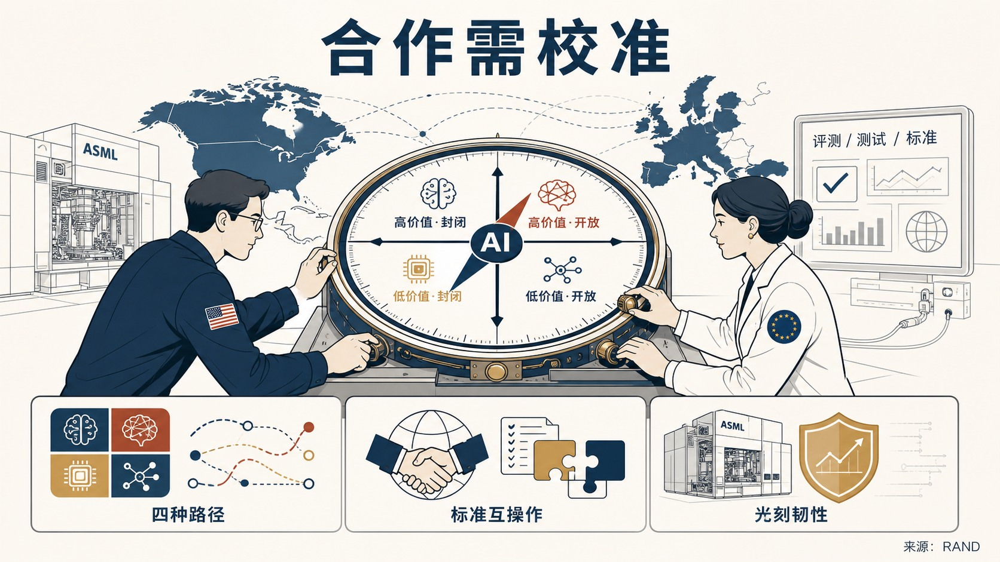

- **核心判断**：**作者的核心判断是支持跨大西洋合作，但强调合作价值具有条件性，需要根据不同 AI 技术未来来校准，而不能把“美欧合作”视为天然有效。**
- **主要论据**：
  - 这份 RAND 报告讨论的是美国在全球 AI 竞争加剧背景下如何评估与欧盟及成员国建立 AI 伙伴关系的战略价值。
  - 报告指出，现有跨大西洋制度架构能够支持双边对话、研究合作、对欧盟头部企业的风险投资和市场准入，但尚未形成可持续、正式、能贯穿 AI 开发和部署生命周期的战略 AI 伙伴关系。
  - 主要方法是场景分析：作者用 AI 价值创造最终位置和先进模型开放程度两个变量，构造四种 AI 发展路径，并评估不同合作形式在何种条件下最能服务美国战略利益。
  - 报告认为，评测、测试和标准互操作以及光刻韧性两类合作在四种路径下都可能产生回报，应立即推进；另外三类合作应根据专有模型与开源模型差距、通用模型与专用模型利润差异等可观察信号进行调整。
- **政策建议**：**报告建议美国优先推进评测、测试、标准互操作和光刻韧性合作，并把其他合作工具与 AI 技术路径的可观察信号挂钩，同时处理美国私人资本重塑欧盟 AI 基础设施、ASML 对华出口管制对研发管线造成收入压力等联盟内部张力。**
- **中国/上海参考**：**### 建议 报告建议美国优先推进评测、测试、标准互操作和光刻韧性合作，并把其他合作工具与 AI 技术路径的可观察信号挂钩，同时处理美国私人资本重塑欧盟 AI 基础设施、ASML 对华出口管制对研发管线造成收入压力等联盟内部张力。**

### 主题 02｜[P0] [中国军事 AI 后勤原则上可行，但自身也会成为打击目标](https://www.aspistrategist.org.au/good-in-principle-but-chinas-new-military-ai-logistics-are-themselves-targets/)

- **来源**：Australian Strategic Policy Institute｜**议题**：涉华科技竞争与上海参考
- **主题**：AI治理, 中国与上海相关, 国防AI

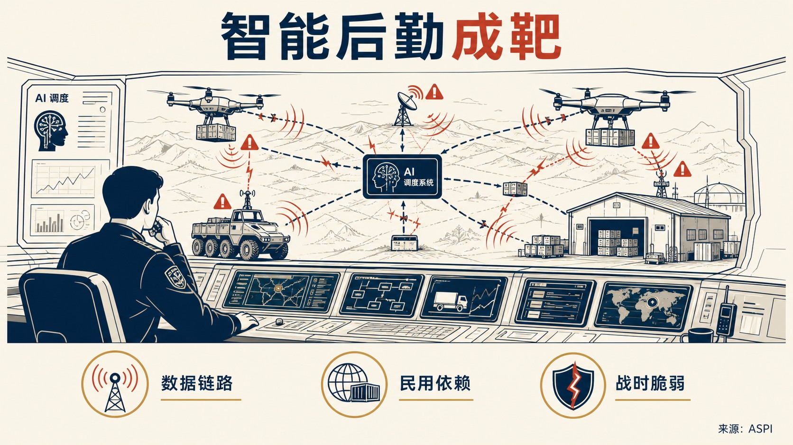

- **核心判断**：**ASPI 的核心判断是警示性的：AI 后勤在和平时期能够提升保障速度、协同效率和远距离支撑能力，但这些优势依赖数据链路、传感器、规划系统和分散部队之间的连续连接，战时反而会暴露出可被攻击的关键节点。**
- **主要论据**：
  - 这篇文章讨论的是中国军队把 AI 嵌入后勤体系后可能形成的能力增益与战时脆弱性。
  - 文章认为，中国军队对商业供应链和民用软件的依赖进一步增加了弱点，网络入侵可能篡改排程数据、延误物资运动，并在部队和战区之间造成连锁故障。
  - 电磁干扰或欺骗还可能阻断货运无人机和无人地面车辆的补给链，即使运输设备本身没有损坏。
  - 文章以集中式后勤系统在通信和访问受阻时容易变脆弱为论据，指出 AI 工具、旧平台和既有官僚流程之间的兼容问题会在系统降级时重新显现。
- **中国/上海参考**：**在于，文章直接分析解放军 AI 后勤体系的潜在脆弱点，强调应同时观察能力建设和战时抗毁性。** 该判断对理解“智能化军事后勤”不能只看算法和平台，也要看通信冗余、人工回退机制、商业供应链依赖和跨系统兼容性。

### 主题 03｜[P0] [机器人会诱使战争吗：机器人革命对武装冲突倾向的影响](https://www.rand.org/pubs/rgs_dissertations/RGSDA5114-1.html)

- **来源**：RAND｜**议题**：AI、数字基础设施与技术治理
- **主题**：AI治理, 国防AI, 科技创新

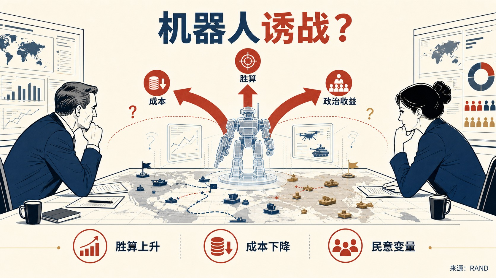

- **核心判断**：**作者的核心判断是警示性的但并非确定论：自主武器创新可能通过提高胜利前景、降低战争经济成本、增加发动冲突的政治收益三种机制，提高战争概率，但这些效应并非必然发生。**
- **主要论据**：
  - 这篇 RAND 博士论文研究的是自主武器系统和军事机器人是否会提高国家使用武力的倾向。
  - 论文背景是 21 世纪第二个十年大国竞争回归，AI 成为竞争新前沿，而全自主武器尚未真正出现，却可能在体能和认知层面超越人类士兵。
  - 研究方法包括构建新兴技术条件下使用武力决策空间的分析框架、建立围绕第三国的大国对抗博弈模型，并通过调查实验测试机器人战争对俄罗斯公众支持军事干预的影响。
  - 主要发现还包括，机器人技术在实验场景中对俄罗斯公众支持军事干预没有显著影响，道德论证的影响更大，俄罗斯士兵伤亡并非显著预测因素。
- **政策建议**：**论文建议美国通过提升自身作战成功前景和降低动员成本来增强承诺可信度，从而降低竞争对手因自主武器带来的相对优势预期而使用武力的激励。**

### 主题 04｜[P0] [西方比中国更好吗](https://itif.org/publications/2026/07/07/is-the-west-better-than-china/)

- **来源**：Information Technology and Innovation Foundation｜**议题**：涉华科技竞争与上海参考
- **主题**：中国与上海相关, 先进制造, 科技创新

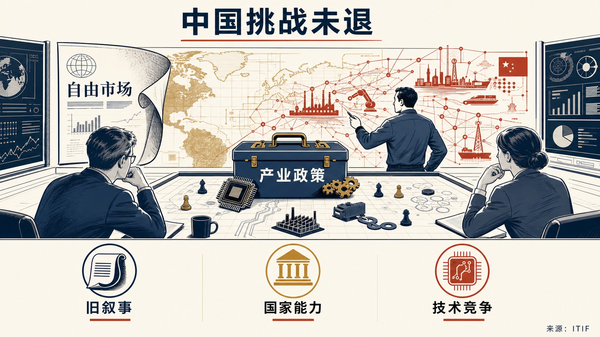

- **核心判断**：**Atkinson 的核心判断带有明显警示和悲观色彩：如果“中国挑战”是真实的，西方必须认真建立国家层面的技术产业政策，不能继续停留在自由市场全球化最终胜利的旧叙事中。**
- **主要论据**：
  - 这篇 ITIF 文章摘自 Hinrich Foundation 白皮书摘要，讨论西方尤其是美国为何长期误判中国崛起及其技术工业竞争能力。
  - 作者 Robert D.
  - 文章认为，2000 年 CIA 对中国 2015 年前景的判断、美国围绕中国入世形成的乐观预期，以及“历史终结”式全球化想象，都低估了中国长期追求综合国力和技术经济优势的战略连续性。
  - 作者的主要论据是，西方精英曾期待中国融入世界秩序后走向开放和民主，但现实演变为一场可能持续 40 至 50 年的新冷战式技术经济竞争。
- **政策建议**：**文章明确主张西方需要国家技术产业政策，更主动地动员科技、贸易和产业能力，正视先进产业市场份额和生产能力竞争，而不能把“保持自由市场纯粹性”作为应对中国技术工业竞争的替代方案。**
- **中国/上海参考**：**在于，文章把中国竞争力解释为长期技术产业战略、综合国力观和国家动员能力的结果。** 该材料显示，美国政策界的部分声音正在从“制度优越感”转向对中国技术工业政策有效性的承认和回应。

### 主题 05｜[P0] [AI 数据中心电费保护承诺需要执行机制](https://www.brookings.edu/articles/the-pledge-to-protect-ratepayers-from-ai-data-center-costs-needs-enforcement/)

- **来源**：Brookings Center for Technology Innovation｜**议题**：AI、数字基础设施与技术治理
- **主题**：AI治理, 数字经济

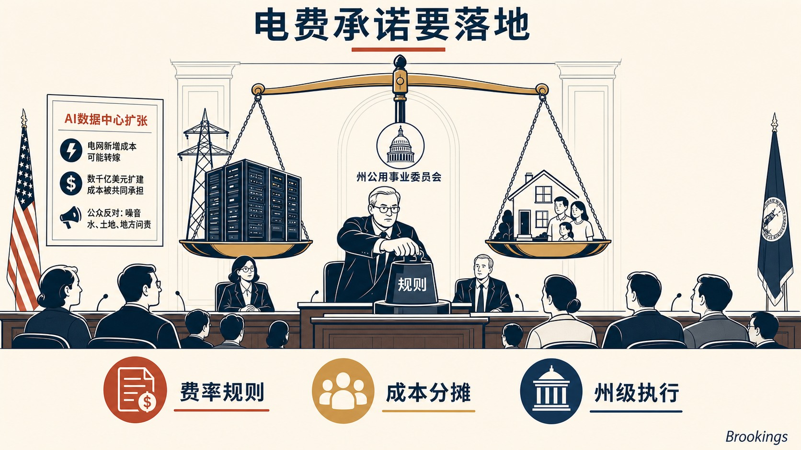

- **核心判断**：**Brookings 作者的核心判断是支持“费率支付者保护承诺”的方向，但强调承诺本身不足，必须转化为可执行的州级电价和成本分摊规则。**
- **主要论据**：
  - 这篇评论讨论的是 AI 数据中心快速扩张可能把电网新增成本转嫁给普通电力用户的问题。
  - 文章指出，一年前业界甚至未承认问题存在，部分数据中心倡导者还声称大型数据中心接入会降低电价；现在则形成了更广泛共识，即如果不设置新 tariff 结构，满足数据中心电力需求所需的数千亿美元成本可能被普通住宅和非数据中心用户共同承担。
  - 文章同时提醒，公众对数据中心的反对并不只来自电费，还包括资源使用、生活质量和对 AI 本身的担忧。
  - 主要证据包括大型 AI 企业支持的“Ratepayer Protection Pledge”、各州单独 tariff 结构、北弗吉尼亚数据中心密集区的土地和电力约束。
- **政策建议**：**文章明确建议州议会、公用事业委员会和州长把保护承诺转化为具体 tariff、接入和成本分摊规则，确保数据中心新增负荷承担相应电网成本，避免普通用户为 AI 基础设施扩张埋单。**

### 主题 06｜[P0] [量子技术如何为 AI 开辟新前沿](https://oecd.ai/en/wonk/how-quantum-technologies-could-open-new-frontiers-for-ai)

- **来源**：OECD.AI Policy Observatory｜**议题**：AI、数字基础设施与技术治理
- **主题**：AI治理, 科技创新

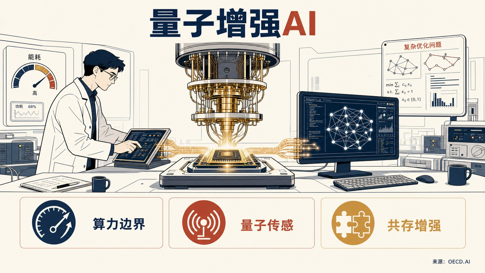

- **核心判断**：**作者的核心判断是审慎乐观：大规模容错量子计算机仍是长期目标，但早期量子设备及其与既有 AI 系统的整合，已经开始为量子增强 AI 铺路。**
- **主要论据**：
  - 这篇 OECD.AI 文章是 AI 与量子技术互补关系系列的第三篇，讨论量子计算、量子传感和量子通信如何反过来支持 AI 发展。
  - 文章指出，随着大语言模型等 AI 系统变得更强、更数据密集，经典计算在速度、能耗和可扩展性上的瓶颈更加明显，量子技术可能为扩展计算边界提供路径。
  - 作者并不认为量子计算会取代现有 AI 系统，而是强调两者会共存，量子系统更适合处理传统计算机困难或不可解的特定问题。
  - 主要论据包括，量子计算可能提升能效，量子技术在优化、模拟、感知和通信中的能力可与 AI 系统形成互补。

### 主题 07｜[P1] [中国技术产品与投资风险评估新框架](https://www.brookings.edu/articles/a-new-risk-framework-for-chinese-technology-products-and-investments/)

- **来源**：Brookings Center for Technology Innovation｜**议题**：涉华科技竞争与上海参考
- **主题**：中国与上海相关, 科技创新

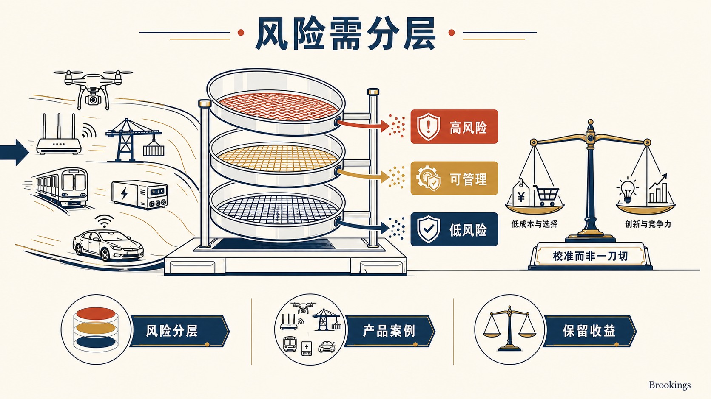

- **核心判断**：**Brookings 作者的核心判断是支持建立更清晰、更可校准的风险框架，而非继续依赖临时、分散和突然的禁令。**
- **主要论据**：
  - 这篇研究讨论的是美国如何评估和处理中国技术产品、服务与投资带来的安全和经济风险。
  - 文章认为，联网设备扩散和中国在技术供应链中的中心地位，使风险变得更复杂；但美国同时需要保留低成本、产品选择和创新竞争力等收益。
  - 其证据包括近年进入政策视野的无人机、Wi-Fi 路由器、港口起重机、地铁车辆、电力逆变器和联网汽车等案例，以及 FCC Covered List、国防部 1260H 清单、商务部 ICTS 规则、USTR 调查、CFIUS 等工具的分散并存。
  - 文章强调，过于粗糙或突然的禁令会给美国经济造成不必要扰动，多部门重复处理同类问题也削弱了政府整体反应能力。
- **政策建议**：**文章建议美国在同中国建立“贸易委员会”和“投资委员会”之前，先形成内部统一的风险评估程序，明确敏感与非敏感部门边界，协调联邦机构工具，避免用一刀切禁令替代分级管理。**
- **中国/上海参考**：**在于，文章把中国技术风险放在产品、服务、投资和供应链位置的复合框架中处理，显示美国政策讨论正在从单项制裁转向分级评估和制度化谈判准备。**

### 主题 08｜[P1] [大负荷改革：美国电网运营商准备好迎接 AI 时代了吗](https://www.csis.org/analysis/large-load-reform-how-prepared-are-us-grid-operators-ai-era)

- **来源**：Center for Strategic and International Studies｜**议题**：AI、数字基础设施与技术治理
- **主题**：AI治理, 科技创新

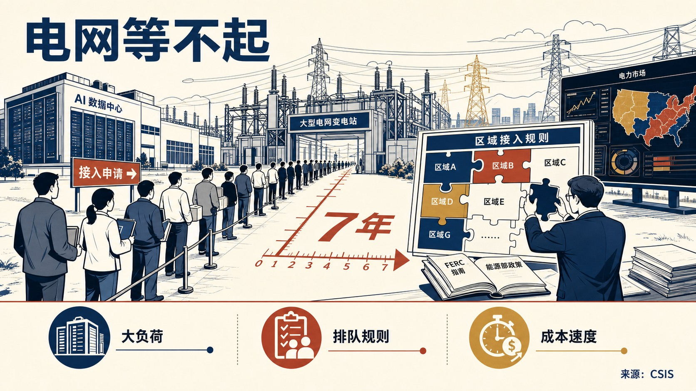

- **核心判断**：**作者的核心判断是警示性的：美国能源部和 FERC 已把大负荷接入速度视为 AI 时代经济竞争力问题，但区域输电组织和独立系统运营商的规则仍高度碎片化，难以充分回应速度、成本和供给约束。**
- **主要论据**：
  - 这篇 CSIS 评论和政策矩阵讨论的是美国数据中心等“大负荷”接入电网的制度准备程度。
  - 文章把大负荷界定为超过 20MW 的用电需求，指出数据中心建设竞赛使接入申请激增，一些地区开发商需要等待最长 7 年才能让新数据中心或设施上线。
  - 主要证据包括，2025 年 10 月美国能源部长要求 FERC 推动大负荷接入改革，2026 年 6 月 FERC 通过 6 项 show-cause orders 要求服务美国近三分之二用电负荷的运营商在 60 天内证明 tariff 规则符合五类标准。
  - 文章强调，这些标准不仅涉及接入速度，还涉及成本转移、发电容量缺口、输电基础设施不足、共址和表后发电以及灵活负荷服务。
- **政策建议**：**文章建议各 RTO/ISO 对照 FERC 标准调整大负荷接入政策，明确成本分摊、共址和表后发电、灵活负荷和输电服务规则，在加快“speed to power”的同时保护费率支付者并缓解容量缺口。**

### 主题 09｜[P1] [高带宽内存是什么，为什么重要](https://www.rand.org/pubs/perspectives/PEA4748-1.html)

- **来源**：RAND｜**议题**：产业链、制造与能源基础设施
- **主题**：AI治理, 半导体

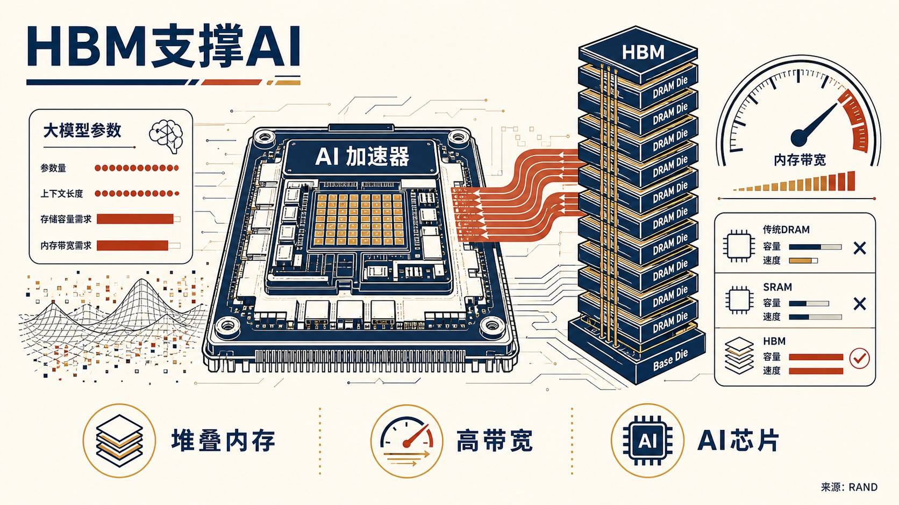

- **核心判断**：**作者的核心判断是明确肯定性的：HBM 已成为领先 AI 芯片和高性能计算硬件的关键使能技术，因为大模型需要同时具备高存储容量和高内存带宽。**
- **主要论据**：
  - 这篇 RAND Expert Insights 解释高带宽内存 HBM 的技术含义及其对 AI 的战略重要性。
  - 文章指出，HBM 通过堆叠 DRAM die，在接近处理器的位置存放模型权重和上下文数据，能够满足传统 DRAM、SRAM 等单一技术难以同时满足的容量和速度需求。
  - 主要证据包括，2026 年大多数领先 AI 芯片使用 HBM，几乎所有领先 AI 模型都在搭载 HBM 的 AI 芯片上训练和部署；HBM 生产需要先进光刻、垂直堆叠和极高精度，光刻设备成本可超过 3 亿美元。
  - 文章还指出，HBM 可能占 AI 芯片总生产成本 45%，约为处理器制造成本的三倍，显示其不仅是技术部件，也是成本和供应链瓶颈。
- **政策建议**：**文章面向研究者和政策制定者提出，应把 HBM 生态系统纳入 AI 硬件和出口管制分析，不能只跟踪处理器本身。**
- **中国/上海参考**：**在于，文章指出全球竞争性 HBM 生产主要由 SK Hynix、三星和美光承担，产能集中在韩国、台湾和日本；长鑫存储正在扩大国产 HBM，但总体产出和最先进代际仍落后。** 由于 2024 年 12 月后中国被禁止进口国外 HBM，中国先进 HBM 获取能力取决于 CXMT 能否进一步提升。

### 主题 10｜[P1] [数据中心反弹预示 AI 权力之争](https://www.brookings.edu/articles/data-center-backlash-signals-a-fight-over-ai-power/)

- **来源**：Brookings Center for Technology Innovation｜**议题**：AI、数字基础设施与技术治理
- **主题**：AI治理, 数字经济

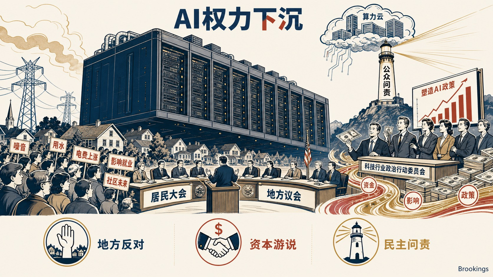

- **核心判断**：**Brookings 作者的核心判断具有强烈警示意味：数据中心已成为公众对 AI 影响就业、日常生活和民主问责不满的可见代理物，争论本质是 AI 基础设施由民主机构治理还是由掌握资本、信息和算力的企业控制。**
- **主要论据**：
  - 这篇评论讨论的是美国数据中心选址反弹如何演变为围绕 AI 基础设施权力的政治冲突。
  - 文章引用 Data Center Watch 的数据指出，2026 年第一季度地方反对已阻止或延迟 75 个数据中心项目，涉及 1300 亿美元拟建投资，数量接近 2025 年全年受影响项目。
  - 文章还指出，科技行业领袖正投入数千万美元进入超级政治行动委员会塑造 AI 政策，而员工团体以小得多的预算推动更强监管。
  - 两党议员均担心少数公司掌握前所未有的资本、信息和政治权力集中度。

### 主题 11｜[P1] [欧盟《工业加速法案》的缺陷及修正路径](https://www.bruegel.org/policy-brief/flaws-european-unions-proposed-industrial-accelerator-act-and-how-fix-them)

- **来源**：Bruegel｜**议题**：产业链、制造与能源基础设施
- **主题**：先进制造

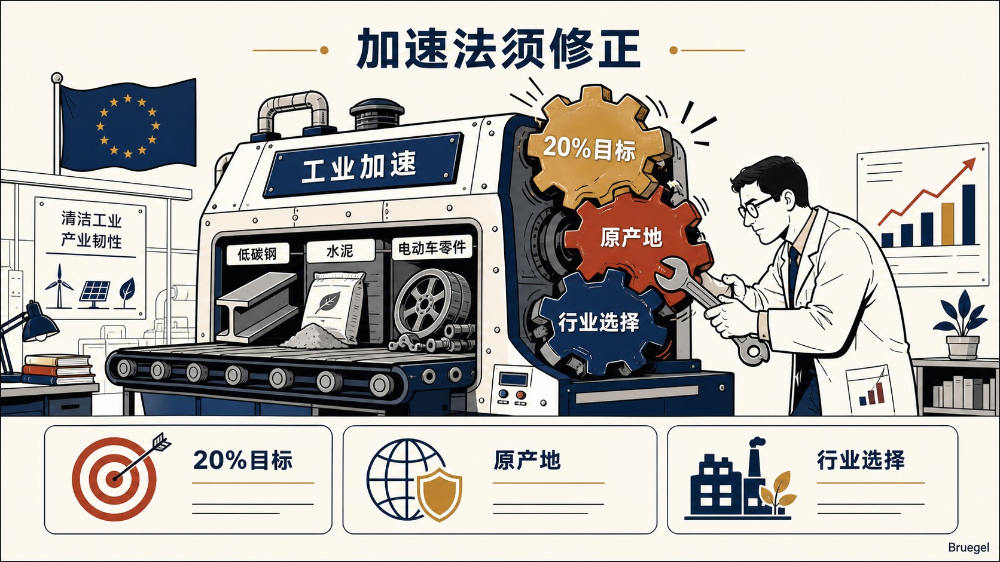

- **核心判断**：**这份 Bruegel 政策简报评估的是欧盟委员会 2026 年 3 月提出的《工业加速法案》。**
- **主要论据**：
  - 作者支持欧洲推动清洁工业转型和产业韧性，但对法案现有设计持明显批判态度，认为其制造业占 GDP 20% 的目标、原产地规则和行业选择逻辑存在实质缺陷。
  - 文章指出，该法案拟通过公共采购和支持计划提高欧盟制造、可信伙伴和低碳产品偏好，覆盖低碳钢铁、水泥、清洁技术和电动汽车，并可能影响每年数十亿欧元补贴和采购支出。
  - 主要论据包括：20% 制造业目标缺乏经济依据并可能扭曲资源配置；原产地内容规则可能延缓脱碳、提高企业和消费者成本，并引发 WTO 争端；覆盖行业选择缺少透明论证，也不足以反映产业适应新竞争挑战的需要。
  - 文章的内部争论在于，欧盟希望以产业政策增强竞争力和供应韧性，但作者警示若工具设计过度依赖本地化和数量目标，可能削弱清洁转型效率。
- **政策建议**：**文章建议删除 2035 年制造业占 GDP 20% 的目标，严格论证战略行业选择，用既有可持续性和韧性标准替代原产地规则，追求互惠市场准入而非笼统排除，并以不阻断增值投资的方式使用 FDI 审查。**
- **中国/上海参考**：**在于，文章把《工业加速法案》视为欧洲应对中国在清洁技术和其他工业价值链中主导地位的工具之一，并提到欧盟已对中国生产的电动汽车征收 10% 至 40% 反补贴税。** 该材料显示，欧洲产业政策正在同时处理绿色转型、贸易规则和对华竞争。

### 主题 12｜[P1] [私营部门网络与安全运营中心经验：美国空军可借鉴的做法](https://www.rand.org/pubs/perspectives/PEA3801-1.html)

- **来源**：RAND｜**议题**：AI、数字基础设施与技术治理
- **主题**：科技创新, 数字经济

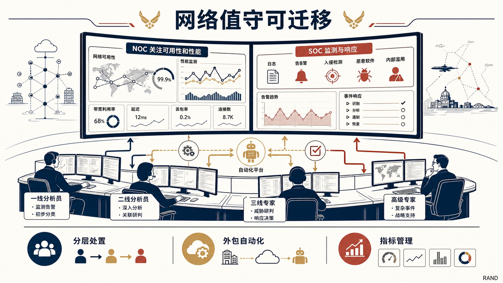

- **核心判断**：**作者的核心判断偏向务实支持：私营部门在 NOC/SOC 结构、人员分层、外包和自动化方面形成了可迁移做法，能帮助国防部门在保障网络性能和安全的同时降低人力压力。**
- **主要论据**：
  - 这篇 RAND 论文讨论的是私营企业如何组织网络运营中心和安全运营中心，以及这些经验如何供美国空军现代化指挥控制网络时借鉴。
  - 文章指出，NOC 通常聚焦业务关键系统的可用性和性能，依靠低层级分析员、自动化平台和逐级升级机制处理例行故障；SOC 则负责日志、告警、入侵、恶意软件和内部滥用监测，并以检测时间、事件处置速度和合规结果衡量绩效。
  - 主要证据包括，企业常通过托管服务商或托管安全服务商获得 24/7 覆盖，内部团队保留事件响应、取证和高层沟通等关键职责。
  - 文章还提醒，SIEM、SOAR 等自动化工具可以缓解人员短缺，但过度依赖工具或调校不足会制造安全盲点。

### 主题 13｜[P1] [机器人正在重塑制造业](https://www.brookings.edu/articles/how-robotics-is-reshaping-manufacturing-the-techtank-podcast/)

- **来源**：Brookings Center for Technology Innovation｜**议题**：产业链、制造与能源基础设施
- **主题**：先进制造

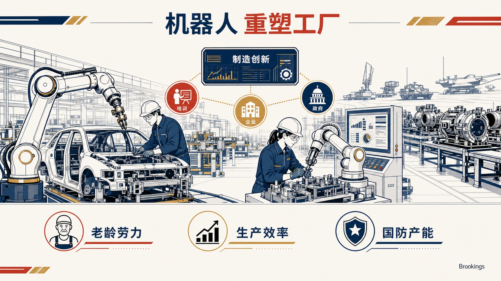

- **核心判断**：**节目的核心判断总体乐观但带有政策动员意味：制造业机器人有助于提升效率、维持美国竞争力，并支撑军事准备和生产能力。**
- **主要论据**：
  - 这期 Brookings TechTank 播客讨论的是机器人、AI 和自动化如何改变制造业。
  - 节目认为，在制造业劳动力老化和生产需求上升的背景下，机器人不是单一设备替换问题，而是企业和政府需要共同加速采用的制造创新体系。
  - 材料以 Ford Rouge 工厂等制造场景作为可视化线索，并通过 ARM Institute 的实践讨论制造创新的组织含义。
  - 主要论据包括，AI、机器人和自动化共同重塑制造流程，机器人对经济、军工准备和必要产出水平具有支撑作用。
- **政策建议**：**节目明确提出，政府和企业应评估机器人在制造业中的适用场景，并通过支持技术采用、制造创新机构和产业能力建设，加快机器人与自动化在关键生产环节中的扩散。**
- **中国/上海参考**：**在于，材料在美中制造能力比较中提到中国已是全球最大机器人使用者和供应者。** 这一线索说明，制造业机器人竞争既涉及应用规模，也涉及供应端能力。

### 主题 14｜[P1] [澳大利亚必须建设自主矿业人才队伍](https://www.aspistrategist.org.au/australia-must-build-its-own-workforce-to-run-its-mining-industry/)

- **来源**：Australian Strategic Policy Institute｜**议题**：产业链、制造与能源基础设施
- **主题**：先进制造

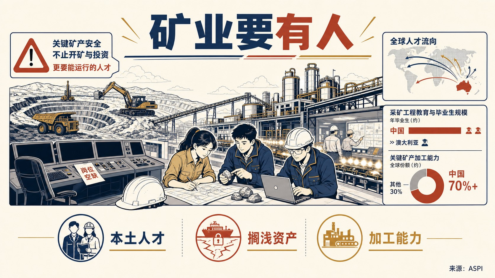

- **核心判断**：**ASPI 的核心判断带有明确警示色彩：澳大利亚不能只把关键矿产安全理解为开矿和投资，还必须建设能够运行矿山和加工设施的本土地质师、工程师和运营队伍。**
- **主要论据**：
  - 这篇文章讨论的是澳大利亚关键矿产战略中的人才和运营能力缺口，背景是各国都在把矿山、加工设施和供应链安全视为战略能力。
  - 文章认为，若继续依赖外部人才，矿山和加工项目可能成为“搁浅资产”，无法转化为可持续战略能力。
  - 其主要证据包括：中国不仅主导关键矿产加工，也控制相当部分知识基础，中国有 45 个采矿工程项目、约 1.2 万名在读学生和每年约 3000 名毕业生，而澳大利亚矿业 2022 年报告 63% 的技能短缺，阿德莱德大学 2025 年还停止招收采矿工程新生。
  - 文章还指出，美国 2023 年仅毕业 162 名采矿工程师，加拿大和印度也面临类似约束，说明盟友体系自身无法轻易填补澳大利亚缺口。
- **政策建议**：**文章明确建议澳大利亚把矿业人才培养纳入关键矿产安全政策，通过教育项目、地质与采矿工程人才管道、矿山和加工设施运营能力建设，把“资源项目”转化为真正可运行的战略能力。**
- **中国/上海参考**：**在于，文章把中国优势界定为“加工能力+知识基础”的组合，而非单纯产能规模。** 对关键矿产竞争的研判应同时关注工程教育、产业现场经验和加工环节人才供给。

### 主题 15｜[P1] [将铝供应链留在盟友体系内：美国铝业南非投资的战略意义](https://www.csis.org/analysis/keeping-aluminum-allied-hands-stakes-alcoas-south-africa-bet)

- **来源**：Center for Strategic and International Studies｜**议题**：产业链、制造与能源基础设施
- **主题**：先进制造

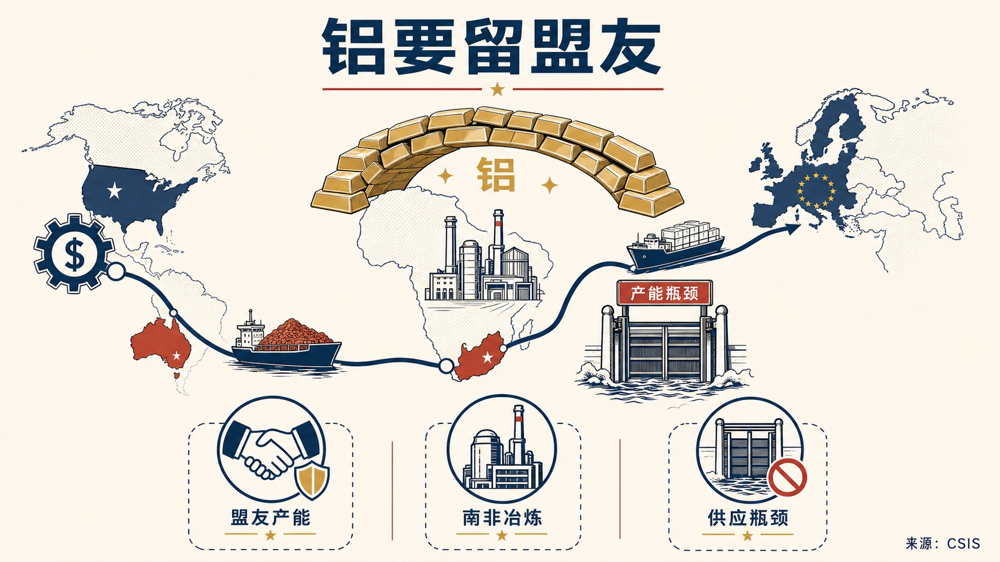

- **核心判断**：**这篇 CSIS 评论讨论的是美国铝业公司以 56 亿美元收购 South32 铝价值链资产、尤其是南非 Hillside Aluminium Smelter 的战略意义。**
- **主要论据**：
  - 作者对交易本身持积极但有条件的态度，认为它使美国首次在南非矿产加工领域获得重要运营存在，并把美国资本、澳大利亚铝土矿、南非冶炼和欧洲及全球市场连接成更可信的盟友铝供应链。
  - 文章强调，其战略意义不在于直接拖慢中国，而在于当非中国原铝产能成为瓶颈时，把稀缺且难以替代的产能留在盟友体系内。
  - 主要证据包括：中国约占全球原铝产量 60%，年产约 4300 万吨；美国 82% 原铝依赖进口；全球铝需求预计从 2020 年 8620 万吨增至 2030 年 1.195 亿吨；中国冶炼能力在双碳框架下大体受 4500 万吨上限约束，而西方新建项目受能源成本、许可周期和 5 至 7 年建设期制约。
  - Hillside 是南非唯一原铝生产商，年产约 71.8 万吨，雇用 2500 多名员工和承包商，并支持约 2.9 万个间接岗位。
- **政策建议**：**文章明确建议南非为 Hillside 谈判 15 年长期电力合同，解决冶炼行业高度依赖低成本稳定电力的问题，同时避免把优惠电价简单变成无限期补贴，需在 Eskom 财务压力、居民电价和战略工业能力之间建立可解释的政策安排。**
- **中国/上海参考**：**在于，文章把中国约 60% 的全球原铝产量、双碳约束下的产能上限和西方供应缺口并置，说明关键矿产加工竞争已从采矿延伸到能源价格、冶炼产能和盟友资本布局。**

### 主题 16｜[P1] [数据中心用水问题可以解决](https://itif.org/publications/2026/07/06/the-data-center-water-problem-is-soluble/)

- **来源**：Information Technology and Innovation Foundation｜**议题**：AI、数字基础设施与技术治理
- **主题**：数字经济

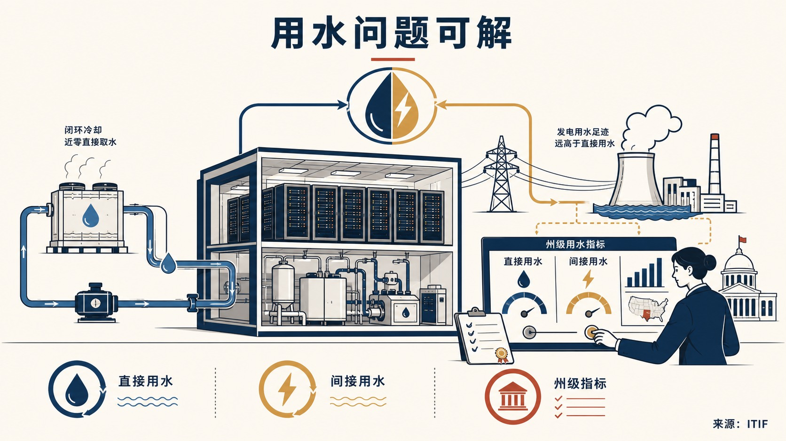

- **核心判断**：**作者的核心判断是审慎乐观：数据中心用水问题可以通过技术和州级治理工具解决，真正缺口在于机构协调、监管细化、标准化机制和指标。**
- **主要论据**：
  - 这份 ITIF 报告讨论的是数据中心直接和间接用水引发的治理争议。
  - 报告指出，数据中心既直接用水冷却，也通过用电间接消耗发电用水，其中间接用水超过直接用水 10 倍以上，但从美国总用水结构看，数据中心占比仍然很小。
  - 主要证据包括，接近零直接用水的冷却技术已经可行，成本略高但部分 hyperscalers 正在采用；间接用水则取决于发电技术选择和地区气候，例如天然气比太阳能消耗更多水。
  - 报告同时区分全国层面和流域层面，认为美国并不存在全国性水资源短缺，但亚利桑那等干旱地区和加州等干旱影响地区有真实压力。
- **政策建议**：**报告建议由州政府牵头建立面向数据中心和大型工业用户的水治理模型，要求披露用水数据，形成统一指标和机制，并把监管重点放在具体流域、发电技术选择和直接冷却技术约束上。**
