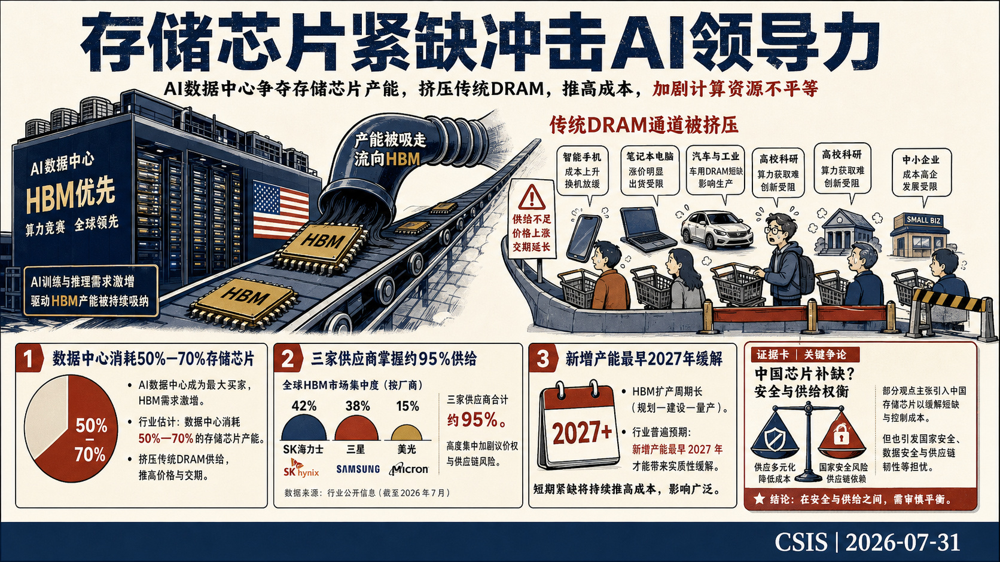
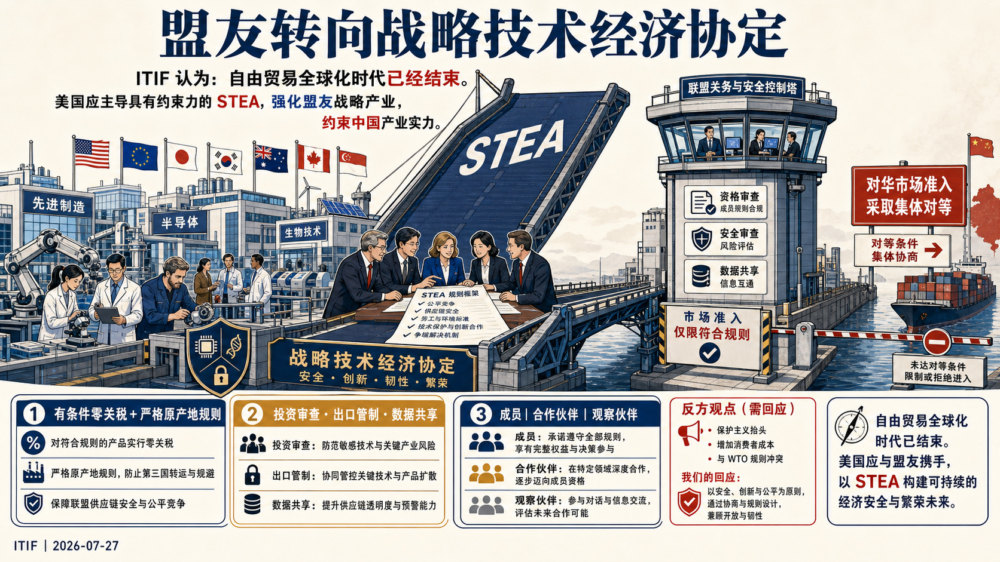
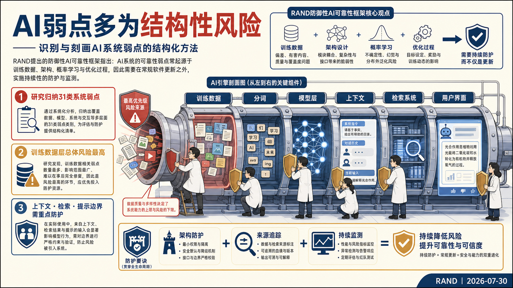
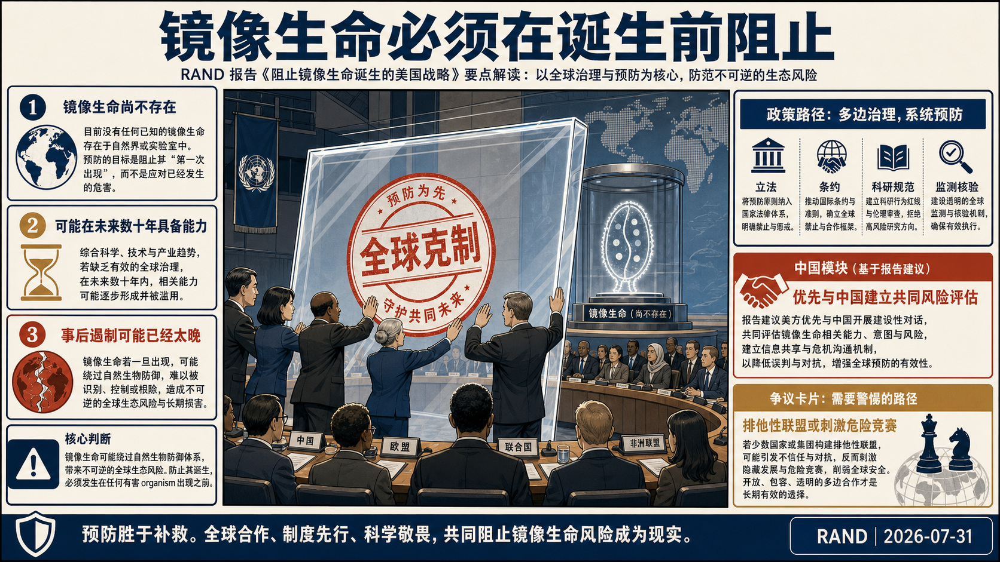
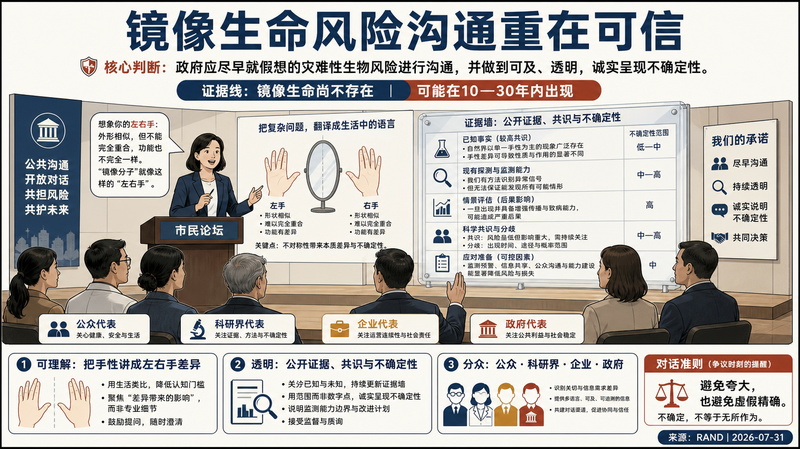
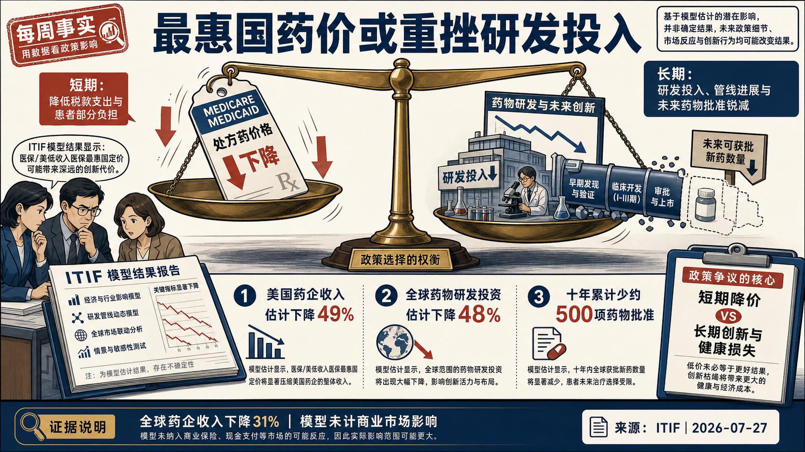
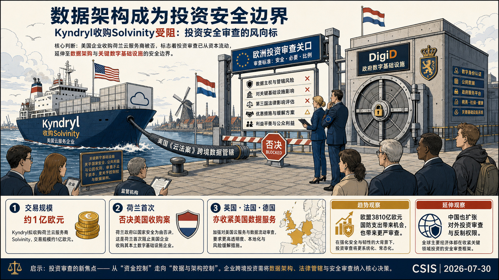
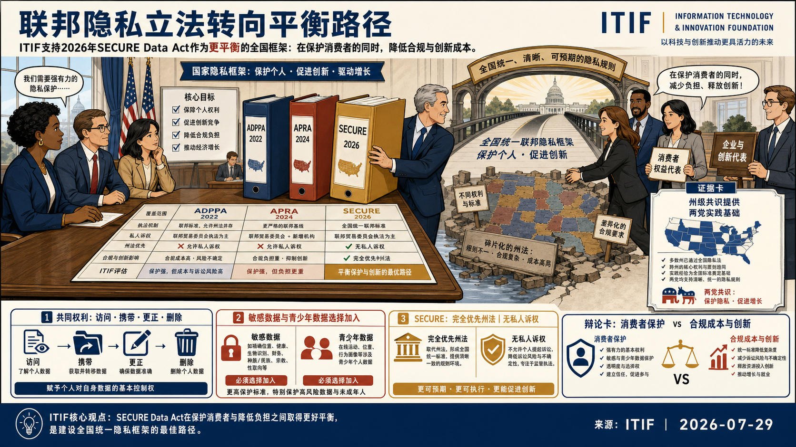
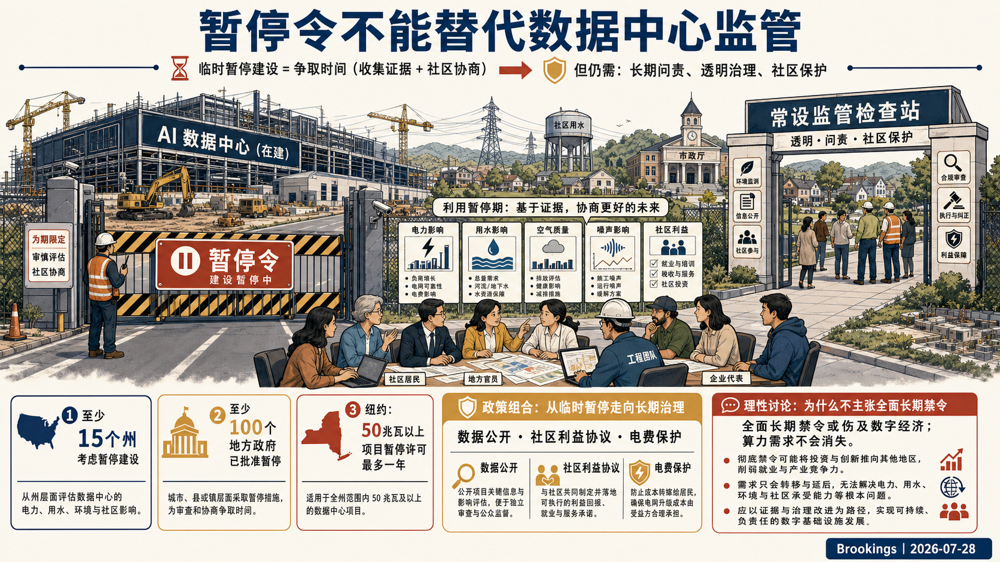

# 国际科技智库周报（2026-08-02）

## 目录

- P.05-06｜[主题 01｜美国存储芯片紧缺加剧及其对科技与AI领导力的影响](#topic-01)
- P.07-08｜[主题 02｜技术经济战动员之六：从自由贸易协定转向战略技术经济协定](#topic-02)
- P.09-10｜[主题 03｜识别与刻画AI漏洞的结构化方法](#topic-03)
- P.11-12｜[主题 04｜阻止镜像生命诞生的美国战略](#topic-04)
- P.13-14｜[主题 05｜镜像生命风险传播原则](#topic-05)
- P.15-16｜[主题 06｜每周事实：医保最惠国定价或使全球药物研发投资下降48%](#topic-06)
- P.17-18｜[主题 07｜Kyndryl收购Solvinity受阻：投资安全审查的风向标](#topic-07)
- P.19-20｜[主题 08｜美国近期联邦数据隐私法案比较](#topic-08)
- P.21-22｜[主题 09｜数据中心暂停令不能替代持续监管](#topic-09)

## 本周态势

本周形成 9 条 P0/P1 重点，议题集中在科研体系、人才与创新政策、AI、数字基础设施与技术治理。产业链、制造与能源信号 1 条；AI 与数字基础设施信号 4 条；直接涉华条目 1 条。

## 本周必读

1. **[美国存储芯片紧缺加剧及其对科技与AI领导力的影响](https://www.csis.org/analysis/united-states-accelerating-memory-chip-crunch-implications-tech-and-ai-leadership)**
   - **研判**：Center for Strategic and International Studies对短期前景持强烈警示态度，认为这场“RAMageddon”既会抬高消费电子与基础设施成本，也会加剧大企业和中小企业、大学及政府机构之间的算力获取差距。
   - **证据**：报告考察美国AI数据中心扩张如何把存储芯片产能推向高带宽存储器，并挤压手机、电脑、汽车等产品所需的常规DRAM供给。
   - **来源**：Center for Strategic and International Studies｜P0｜产业链、制造与能源基础设施
2. **[技术经济战动员之六：从自由贸易协定转向战略技术经济协定](https://itif.org/publications/2026/07/27/mobilizing-techno-economic-war-6-free-trade-agreements-strategic-techno-economic-agreements/)**
   - **研判**：Information Technology and Innovation Foundation主张自由贸易全球化时代已经结束，美国应牵头建立具有约束力的“战略技术经济协定”（STEA），同时强化盟友的国家经济实力产业并压制中国相关产业能力。
   - **证据**：协定设计以盟友内部有条件的零关税、严格原产地规则、数字经济一体化、研发与产业政策协调为激励，并把共同投资审查、出口管制、市场准入对等和实时数据共享作为约束中国的工具。
   - **来源**：Information Technology and Innovation Foundation｜P0｜涉华科技竞争与上海参考
3. **[识别与刻画AI漏洞的结构化方法](https://www.rand.org/pubs/research_reports/RRA4983-1.html)**
   - **研判**：RAND认为许多AI漏洞源于训练数据、模型架构、概率学习和优化目标，具有跨版本持续、难以彻底修补的结构性特征，因此对仅靠常规软件补丁的治理方式持明确怀疑态度。
   - **证据**：研究从训练数据、分词、Transformer层到部署接口逐层分解架构，共识别31类漏洞，其中训练数据相关漏洞的总体风险最高。
   - **来源**：RAND｜P1｜AI、数字基础设施与技术治理
4. **[数据中心暂停令不能替代持续监管](https://www.brookings.edu/articles/data-center-moratoriums-are-not-a-substitute-for-oversight/)**
   - **研判**：文章分析美国AI数据中心建设激增所引发的地方反对和暂停审批浪潮，重点判断暂停令能否处理电价、用水、污染、噪声和社区信任问题。
   - **证据**：Brookings作者支持把暂停期作为调查与协商窗口，但明确反对把暂停令视为完整解决方案，认为长期仍需可执行的问责、透明度和设施影响监管。
   - **来源**：Brookings Center for Technology Innovation｜P1｜AI、数字基础设施与技术治理
5. **[阻止镜像生命诞生的美国战略](https://www.rand.org/pubs/research_reports/RRA4335-1.html)**
   - **研判**：RAND对风险持最高强度警示：镜像细菌可能逃避免疫识别、抵抗自然降解和捕食并在生态系统扩散，首个成功实验就可能使遏制和防御失效。
   - **证据**：RAND研究由反向手性生物分子构成的“镜像生命”风险，并为美国提出在任何主体造出首个镜像生物前实施全球预防的战略。
   - **来源**：RAND｜P1｜科研体系、人才与创新政策

## 议题观点速览

### 科研体系、人才与创新政策（4 条）

- **RAND**：RAND对风险持最高强度警示：镜像细菌可能逃避免疫识别、抵抗自然降解和捕食并在生态系统扩散，首个成功实验就可能使遏制和防御失效。
- **RAND**：RAND认为镜像细菌可能逃避人类、动物和植物免疫系统，并使既有反制能力难以规模化部署，因此需要政府主导、在能力成熟前启动沟通。
- **Information Technology and Innovation Foundation**：ITIF对该政策持明确反对和强烈警示态度，认为短期降价会以药企收入、研发投入和未来药物供给的大幅收缩为代价。
- **Information Technology and Innovation Foundation**：ITIF明确支持《SECURE数据法案》，认为其在保护消费者、降低企业合规成本与维持数据驱动创新之间形成了更可行的平衡。

### AI、数字基础设施与技术治理（3 条）

- **RAND**：RAND认为许多AI漏洞源于训练数据、模型架构、概率学习和优化目标，具有跨版本持续、难以彻底修补的结构性特征，因此对仅靠常规软件补丁的治理方式持明确怀疑态度。
- **Center for Strategic and International Studies**：Center for Strategic and International Studies将该案视为结构性转折的早期信号，并警示美国科技企业在欧洲将面对更严格的数据主权、司法管辖...
- **Brookings Center for Technology Innovation**：文章分析美国AI数据中心建设激增所引发的地方反对和暂停审批浪潮，重点判断暂停令能否处理电价、用水、污染、噪声和社区信任问题。

### 产业链、制造与能源基础设施（1 条）

- **Center for Strategic and International Studies**：Center for Strategic and International Studies对短期前景持强烈警示态度，认为这场“RAMageddon”既会抬高消费电子与基础设施成本...

### 涉华科技竞争与上海参考（1 条）

- **Information Technology and Innovation Foundation**：Information Technology and Innovation Foundation主张自由贸易全球化时代已经结束，美国应牵头建立具有约束力的“战略技术经济协定”（ST...

## 主题展开

### 主题 01｜[P0] [美国存储芯片紧缺加剧及其对科技与AI领导力的影响](https://www.csis.org/analysis/united-states-accelerating-memory-chip-crunch-implications-tech-and-ai-leadership)

- **来源**：Center for Strategic and International Studies｜**议题**：产业链、制造与能源基础设施
- **主题**：AI治理, 半导体, 数字经济

- **核心判断**：**Center for Strategic and International Studies对短期前景持强烈警示态度，认为这场“RAMageddon”既会抬高消费电子与基础设施成本，也会加剧大企业和中小企业、大学及政府机构之间的算力获取差距。**
- **主要论据**：
  - 报告考察美国AI数据中心扩张如何把存储芯片产能推向高带宽存储器，并挤压手机、电脑、汽车等产品所需的常规DRAM供给。
  - Center for Strategic and International Studies援引估算称，2026年数据中心可能消耗全球50%至70%的存储芯片，而Micron、SK海力士和三星合计控制约95%的全球供应；英特尔预计供给至少到2028年才可能缓解，SK海力士则判断需求到2030年仍将超过供给。
  - Micron的新厂最早要到2027年投产，且其当前在美国本土生产的份额不足美国所需存储芯片的2%，说明新增产能难以解决眼前缺口。
  - 行业协会已报告电子产品、通信基础设施、汽车和医疗器械成本上升，并要求政府扩大美国产能和盟友产能、改善贸易安排、调整CHIPS法案资金及清理供给障碍。
- **政策建议**：**报告列出的近期选项包括扩大美国及盟友的存储芯片产能、通过贸易协议增强供应链韧性、保障消费品企业获得现有产能、重新审视CHIPS法案资金安排，并处理限制全球供给的监管障碍。** 对于采用中国芯片的方案，报告主张先开展更充分的成本收益与安全评估，并把敏感用途、市场范围和供应链安全约束纳入设计。
- **中国/上海参考**：**报告将存储芯片短缺直接置于中美AI领导力竞争中，指出美国虽领先于AI芯片设计和云计算，但制造能力集中、对韩国供应商依赖较高，构成对华算力竞争的结构性弱点。** 文中还评估了CXMT和长江存储作为短期补充供给的可能性及其军方清单、实体清单和网络安全争议，显示消费级供给缓解与技术安全管制之间存在明确权衡。

### 主题 02｜[P0] [技术经济战动员之六：从自由贸易协定转向战略技术经济协定](https://itif.org/publications/2026/07/27/mobilizing-techno-economic-war-6-free-trade-agreements-strategic-techno-economic-agreements/)

- **来源**：Information Technology and Innovation Foundation｜**议题**：涉华科技竞争与上海参考
- **主题**：中国与上海相关, 科技创新, 科技治理

- **核心判断**：**Information Technology and Innovation Foundation主张自由贸易全球化时代已经结束，美国应牵头建立具有约束力的“战略技术经济协定”（STEA），同时强化盟友的国家经济实力产业并压制中国相关产业能力。**
- **主要论据**：
  - ITIF对现行WTO和最惠国框架持明确否定态度，认为其无法约束中国的非市场与重商主义政策，单边主义和美国独力对华也同样难以奏效。
  - 协定设计以盟友内部有条件的零关税、严格原产地规则、数字经济一体化、研发与产业政策协调为激励，并把共同投资审查、出口管制、市场准入对等和实时数据共享作为约束中国的工具。
  - 报告提出正式成员、合作伙伴和观察伙伴三级结构，以不同承诺程度配置市场准入，承认全球南方国家和资源型经济体未必愿意接受完整条款。
  - 其论据包括美国市场准入的杠杆作用、USMCA等既有制度先例，以及中国在先进产业规模、国家支持和贸易报复方面对单个国家形成的压力。
- **政策建议**：**ITIF明确建议美国以对盟友实行有条件的“零对零”关税为核心，推动成员削减歧视性非关税壁垒，建立STEM人才快速签证、联合投资审查、出口管制、研发合作和供应链韧性安排。** 成员还应建立类似“贸易北约”的互助机制，对中国施加的市场限制采取即时对等措施，并以共同监测、执法和数据共享支撑行动。
- **中国/上海参考**：**报告把中国界定为STEA的主要竞争对象，目标是限制中国先进产业进入盟友市场、削弱其国家经济实力产业，并以对等准入和集体反制降低中国对单个国家实施经济报复的能力。** 该立场具有鲜明的阵营化和遏制取向，可用于识别未来对华贸易、投资、出口管制、科研合作和人才流动规则可能出现的联动收紧；报告未提出上海层面的专门分析。

### 主题 03｜[P1] [识别与刻画AI漏洞的结构化方法](https://www.rand.org/pubs/research_reports/RRA4983-1.html)

- **来源**：RAND｜**议题**：AI、数字基础设施与技术治理
- **主题**：AI治理, 数字经济

- **核心判断**：**RAND认为许多AI漏洞源于训练数据、模型架构、概率学习和优化目标，具有跨版本持续、难以彻底修补的结构性特征，因此对仅靠常规软件补丁的治理方式持明确怀疑态度。**
- **主要论据**：
  - 报告面向生成式AI系统安全，提出以系统组件和结构弱点为中心的漏洞识别框架，替代主要按攻击手法分类的传统思路。
  - 研究从训练数据、分词、Transformer层到部署接口逐层分解架构，共识别31类漏洞，其中训练数据相关漏洞的总体风险最高。
  - 报告还将上下文窗口、检索增强生成管线和提示边界确定为主要暴露面，指出恶意输入和注入式上下文可操纵模型行为。
  - 其方法把威胁严重性、可利用性和组件位置结合起来，用于确定数据治理、来源验证、架构防护与持续监测的优先级。
- **政策建议**：**RAND建议优先保护训练数据、上下文窗口和检索系统，建立数据集治理、来源追踪以及对检索内容和上下文输入的控制。** 工程与标准体系还应纳入组件级风险评估、利用行为检测、日志与异常监测、随机性攻击测试，并制定把AI特有弱点纳入全球漏洞目录和风险管理框架的分类标准。

### 主题 04｜[P1] [阻止镜像生命诞生的美国战略](https://www.rand.org/pubs/research_reports/RRA4335-1.html)

- **来源**：RAND｜**议题**：科研体系、人才与创新政策
- **主题**：科技创新

- **核心判断**：**RAND对风险持最高强度警示：镜像细菌可能逃避免疫识别、抵抗自然降解和捕食并在生态系统扩散，首个成功实验就可能使遏制和防御失效。**
- **主要论据**：
  - RAND研究由反向手性生物分子构成的“镜像生命”风险，并为美国提出在任何主体造出首个镜像生物前实施全球预防的战略。
  - 科学界已经能够制造镜像生物分子和部分组件，一些实验室公开提出构建可存活镜像细胞的目标，专家判断相关能力可能在未来数十年出现。
  - RAND认为这一治理对象缺少可靠早期预警，事后适应性治理几乎无效，且材料和知识分散意味着保密路线既不可行又会制造战略误判。
  - RAND同时分析反方动机：部分科研人员可能不接受灾难风险判断、相信风险可控，或把镜像生命视为可控生物武器。
- **政策建议**：**RAND建议美国同步推进国内立法、国际条约、科研共同体规范、监测核验和早期威慑工具，并把反制措施与生物韧性建设限定为后备方案。** 美国还应公开承诺不开发镜像生命，避免可能诱发互不信任和战略竞赛的言论或行动。
- **中国/上海参考**：**报告把中国列为必须优先接触的科学大国，明确要求美国与中国建立共同风险评估、透明科研协作和早期规范，以形成集体克制基础。** 其判断是排他性盟友方案可能刺激镜像生命及使能技术的战略竞争，因此对华合作在该议题上被视为灾难风险预防的必要组成；报告未涉及上海。

### 主题 05｜[P1] [镜像生命风险传播原则](https://www.rand.org/pubs/perspectives/PEA4619-1.html)

- **来源**：RAND｜**议题**：科研体系、人才与创新政策
- **主题**：科技创新

- **核心判断**：**RAND认为镜像细菌可能逃避人类、动物和植物免疫系统，并使既有反制能力难以规模化部署，因此需要政府主导、在能力成熟前启动沟通。**
- **主要论据**：
  - RAND讨论政府如何向公众、科研界、企业和政府机构传播镜像生命风险，背景是合成生物学正在提高构造反向手性生物系统的可能性，而社会认知和政策准备仍然有限。
  - 报告提出可理解性、透明度、谨慎使用类比、面向不同受众定制信息、预判异议与错误认知五项原则。
  - 其证据基础结合镜像生命科学事实、风险传播研究和作者专业判断，并建议把“手性”等术语转换为“左右手差异”等可理解表述。
  - RAND强调应如实说明镜像生命尚不存在、可能在10至30年内出现，同时公开风险与政策效果的不确定性、价值判断和科学共识程度。
- **政策建议**：**RAND建议政府建立统一事实基线和分受众传播方案，使用清晰语言、可校验的时间范围及不失真的类比，并主动回应常见异议、误解和错误信息。** 传播者还应持续披露研究进展、风险证据、政策选择及其不确定性，把沟通作为后续治理讨论和公众自主判断的基础。

### 主题 06｜[P1] [每周事实：医保最惠国定价或使全球药物研发投资下降48%](https://itif.org/publications/2026/07/27/imposing-mfn-pricing-medicare-medicaid-reduce-global-pharmaceutical-rd-investment/)

- **来源**：Information Technology and Innovation Foundation｜**议题**：科研体系、人才与创新政策
- **主题**：科技创新

- **核心判断**：**ITIF对该政策持明确反对和强烈警示态度，认为短期降价会以药企收入、研发投入和未来药物供给的大幅收缩为代价。**
- **主要论据**：
  - 短文评估将“最惠国”定价同时用于美国Medicare和Medicaid、使已上市药品价格对齐一组同类国家最低价的创新后果。
  - 其依据是芝加哥大学2025年政策简报的模型估算：美国药企收入将下降49%，全球药企收入下降31%，损失规模相当于美国GDP的0.8%。
  - 收入下降进一步被估算为全球药物研发投资减少48%；若政策维持十年，累计将少批准约500项新药及后续适应证。
  - 模型还把创新减少换算为全球损失5.16亿生命年、约660万人生命，并称这些结果尚未计入商业保险市场受到的影响，因此属于保守估计。

### 主题 07｜[P1] [Kyndryl收购Solvinity受阻：投资安全审查的风向标](https://www.csis.org/analysis/kyndryl-solvinity-case-barometer-investment-security-reviews)

- **来源**：Center for Strategic and International Studies｜**议题**：AI、数字基础设施与技术治理
- **主题**：数字经济

- **核心判断**：**Center for Strategic and International Studies将该案视为结构性转折的早期信号，并警示美国科技企业在欧洲将面对更严格的数据主权、司法管辖和本地控制审查。**
- **主要论据**：
  - 报告以荷兰阻止美国Kyndryl约1亿欧元收购云服务商Solvinity为对象，分析投资安全审查如何从资本流动扩展到数据架构和关键数字基础设施。
  - Solvinity承载荷兰DigiD数字身份、政府通信和政企服务平台，美国《云法案》可能要求美国母公司交出境外服务器数据，由此把商业收购转化为国家安全问题。
  - 荷兰监管机构曾在2026年2月批准交易，但议会、隐私组织和社会力量持续反对，最终由投资审查局建议在5月否决，显示商业价值与主权安全之间的权衡发生变化。
  - 英国、法国和德国削减或替换美国数据服务商合同的案例进一步证明，这一趋势并非单一交易事件。
- **中国/上海参考**：**报告把欧洲的技术主权处境描述为夹在美国云服务优势与中国华为、中兴等通信设备影响之间，并指出中国在2026年6月建立综合性对外投资审查制度，具备用商业限制回应外国政策的权力。** 该比较说明投资审查、数据主权和技术供应链安全正在全球化，但报告未提出针对上海的具体判断。

### 主题 08｜[P1] [美国近期联邦数据隐私法案比较](https://itif.org/publications/2026/07/29/comparing-recent-federal-data-privacy-bills/)

- **来源**：Information Technology and Innovation Foundation｜**议题**：科研体系、人才与创新政策
- **主题**：科技创新

- **核心判断**：**ITIF明确支持《SECURE数据法案》，认为其在保护消费者、降低企业合规成本与维持数据驱动创新之间形成了更可行的平衡。**
- **主要论据**：
  - 报告比较2026年《SECURE数据法案》与2024年《美国隐私权法案》、2022年《美国数据隐私与保护法案》，评估美国联邦隐私立法的政策转向。
  - 三案均赋予访问、携带、更正和删除数据等权利，并对敏感数据和未成年人数据采取选择加入机制；《SECURE数据法案》没有直接设立通用退出机制，而是先要求研究其效果。
  - 与前两案相比，该法案减少刚性安全清单和严格数据最小化要求，不设私人诉权，并完全优先于州隐私法，因而给不同规模组织更大执行弹性。
  - 报告以民主、共和两党主导州已经采用相近条款为证据，主张这些规则建立在州级共识和实践基础上。
- **政策建议**：**ITIF建议国会在2026年余下时间优先推动以《SECURE数据法案》为基础的两党全国隐私框架，完整取代州法拼盘，并保留风险导向、技术中性的合规弹性。** 其目标是形成全国一致的消费者保护标准，同时降低企业合规成本，避免私人诉权和过度规定削弱生产率与创新。

### 主题 09｜[P1] [数据中心暂停令不能替代持续监管](https://www.brookings.edu/articles/data-center-moratoriums-are-not-a-substitute-for-oversight/)

- **来源**：Brookings Center for Technology Innovation｜**议题**：AI、数字基础设施与技术治理
- **主题**：数字经济

- **核心判断**：**文章分析美国AI数据中心建设激增所引发的地方反对和暂停审批浪潮，重点判断暂停令能否处理电价、用水、污染、噪声和社区信任问题。**
- **主要论据**：
  - Brookings作者支持把暂停期作为调查与协商窗口，但明确反对把暂停令视为完整解决方案，认为长期仍需可执行的问责、透明度和设施影响监管。
  - 文中称至少15个州考虑过暂停建设，至少100个地方政府已经批准相关措施；纽约还对用电达到50兆瓦的数据中心暂停州级环境许可最多一年。
  - Brookings Center for Technology Innovation以孟菲斯xAI设施引发的空气质量监测和NAACP诉讼为例，说明企业数据不透明会把环境与健康疑虑转化为持续抵制。
  - 报告同时警告，范围过宽的长期禁令会威胁数字经济并造成企业财务损失，而全国算力需求不会因个别地区停建而消失。
- **政策建议**：**Brookings Center for Technology Innovation建议在暂停期内收集设施影响数据、建立社区利益协议和审计报告要求、举行公开会议，并让企业承担面向社区的信息说明责任。** 州和联邦层面还应把电费承担从企业自愿承诺升级为可执行的用户保护，确保数据中心成本和环境负担不由周边居民被动承担。
