# 国际科技智库周报（2026-08-09）

## 目录

- P.05-06｜[主题 01｜中国延迟退休为2035年争取的是时间窗口](#topic-01)
- P.07-08｜[主题 02｜应急管理AI产品供给与采用路径](#topic-02)
- P.09-10｜[主题 03｜CSET联合高校扩展AI治理法规追踪平台](#topic-03)
- P.11-12｜[主题 04｜如何解释前沿AI双用途生物基准的饱和与代际进步](#topic-04)
- P.13-14｜[主题 05｜境外建设前沿AI数据中心的国家安全含义](#topic-05)
- P.15-16｜[主题 06｜美国国会应明确AI模型停服权限](#topic-06)
- P.17-18｜[主题 07｜AI专项税争论忽视了既有财政风险](#topic-07)
- P.19-20｜[主题 08｜欧盟《数据法》与《数字市场法》云监管冲突](#topic-08)
- P.21-22｜[主题 09｜美国如何为AI研发自动化加速做准备](#topic-09)
- P.23-24｜[主题 10｜安全推理数据中心的纵向一体化工程方案](#topic-10)
- P.25-26｜[主题 11｜伊朗在美伊冲突中的网络行动已转向战时支援](#topic-11)
- P.27-28｜[主题 12｜美国联邦研发支出结构如何影响生产率](#topic-12)
- P.29-30｜[主题 13｜韩国未来基金应把存储芯片红利转化为下一轮增长](#topic-13)
- P.31-32｜[主题 14｜乌克兰经验显示半自主系统可快速形成作战规模](#topic-14)
- P.33-34｜[主题 15｜生育如何影响工作表现、人力资本与晋升](#topic-15)
- P.35-36｜[主题 16｜ITIF建议终止传统高成本通信补贴并转向可负担性](#topic-16)

## 本周态势

本周形成 16 条 P0/P1 重点，议题集中在AI、数字基础设施与技术治理、科研体系、人才与创新政策。产业链、制造与能源信号 1 条；AI 与数字基础设施信号 12 条；直接涉华条目 1 条。

## 本周必读

1. **[中国延迟退休为2035年争取的是时间窗口](https://www.rand.org/pubs/research_reports/RRA4750-1.html)**
   - **研判**：RAND判断，中国2025年延迟退休改革只能形成暂时的法定劳动年龄窗口，无法逆转人口老龄化，政策价值取决于新增法定劳动人口能否转化为实际就业和生产率。
   - **证据**：月度出生队列模拟显示，中央情景下2024至2035年法定劳动年龄人口可增加约550万，而旧制度下将减少约4300万；相较旧制度，2030年和2035年分别多保留约2800万和4800万人。
   - **来源**：RAND｜P0｜涉华科技竞争与上海参考
2. **[CSET联合高校扩展AI治理法规追踪平台](https://cset.georgetown.edu/article/expanded-collaboration-to-boost-critical-ai-governance-data-and-tracking-tool/)**
   - **研判**：CSET宣布联合普渡大学、麻省理工学院和卡内基梅隆大学扩展AI治理与监管档案AGORA，核心判断是持续更新的公共数据基础设施已成为AI治理研究和决策的必要条件。
   - **证据**：AGORA目前收录1000余项AI相关法律、法规和标准，自2024年上线后已被美国、欧盟等地研究者、实务人员和政策制定者使用。
   - **来源**：Center for Security and Emerging Technology｜P0｜AI、数字基础设施与技术治理
3. **[境外建设前沿AI数据中心的国家安全含义](https://www.brookings.edu/articles/the-national-security-implications-of-building-frontier-ai-data-centers-overseas/)**
   - **研判**：布鲁金斯将前沿AI数据中心的海外选址界定为国家安全决策，主张按资产、工作负载、司法辖区和附加条件分类判断，不能沿用一般商业设施的选址逻辑。
   - **证据**：其警示，数据中心体量大、难隐藏，冷却、变压器和发电机等关键节点易受攻击；2026年伊朗无人机袭击中东AWS设施造成结构、电力、消防及水损，显示此类基础设施会直接进入地缘冲突目标清单。
   - **来源**：Brookings Center for Technology Innovation｜P0｜AI、数字基础设施与技术治理
4. **[韩国未来基金应把存储芯片红利转化为下一轮增长](https://itif.org/publications/2026/08/03/koreas-future-fund-should-finance-the-next-boom/)**
   - **研判**：ITIF认为，AI存储芯片景气带来的出口、利润和税收增长为韩国提供了短暂的再投资窗口，应将其转化为下一轮技术繁荣所需的共享能力和商业化通道。
   - **证据**：机构支持设立未来应对基金，但警惕基金沦为对特定企业的永久补助或常规资本开支替代。
   - **来源**：Information Technology and Innovation Foundation｜P1｜科研体系、人才与创新政策
5. **[乌克兰经验显示半自主系统可快速形成作战规模](https://www.aspistrategist.org.au/learning-from-ukraine-semi-autonomy-can-deliver-combat-mass/)**
   - **研判**：ASPI主张，澳大利亚若要在印太广阔且受对抗的环境中形成足够作战规模，应由少量昂贵载人平台转向低成本、大批量、持续迭代的半自主无人系统。
   - **证据**：乌克兰经验显示，军人、初创企业、志愿者与政府机构形成闭环后，产品可在数周内由原型进入战场，部分远程导弹约18个月即可投产，而装备三个月后就可能过时。
   - **来源**：Australian Strategic Policy Institute｜P1｜产业链、制造与能源基础设施

## 议题观点速览

### AI、数字基础设施与技术治理（4 条）

- **RAND**：RAND通过市场扫描评估美国应急管理领域AI产品的真实供给与采用条件，认为产品数量已相当可观，但供给分布、系统协同和可信保障远未成熟。
- **Center for Security and Emerging Technology**：CSET宣布联合普渡大学、麻省理工学院和卡内基梅隆大学扩展AI治理与监管档案AGORA，核心判断是持续更新的公共数据基础设施已成为AI治理研究和决策的必要条件。
- **RAND**：RAND认为，前沿AI在双用途生物基准上的总分已越来越难解释：大量低难度题目趋于饱和，但仍有一小组高难度、高区分度题目能够识别模型代际差异。
- **Brookings Center for Technology Innovation**：布鲁金斯将前沿AI数据中心的海外选址界定为国家安全决策，主张按资产、工作负载、司法辖区和附加条件分类判断，不能沿用一般商业设施的选址逻辑。

### 科研体系、人才与创新政策（3 条）

- **RAND**：RAND研究认为，联邦研发支出的内部构成比总额变化更能解释美国长期生产率差异，当前偏重开发活动的组合可能超过生产率最大化水平。
- **Information Technology and Innovation Foundation**：ITIF认为，AI存储芯片景气带来的出口、利润和税收增长为韩国提供了短暂的再投资窗口，应将其转化为下一轮技术繁荣所需的共享能力和商业化通道。
- **RAND**：该论文研究在就业状态和工时均未改变的条件下，母亲收入惩罚仍会通过哪些机制形成。

### 涉华科技竞争与上海参考（1 条）

- **RAND**：RAND判断，中国2025年延迟退休改革只能形成暂时的法定劳动年龄窗口，无法逆转人口老龄化，政策价值取决于新增法定劳动人口能否转化为实际就业和生产率。

### 产业链、制造与能源基础设施（1 条）

- **Australian Strategic Policy Institute**：ASPI主张，澳大利亚若要在印太广阔且受对抗的环境中形成足够作战规模，应由少量昂贵载人平台转向低成本、大批量、持续迭代的半自主无人系统。

## 主题展开

### 主题 01｜[P0] [中国延迟退休为2035年争取的是时间窗口](https://www.rand.org/pubs/research_reports/RRA4750-1.html)

- **来源**：RAND｜**议题**：涉华科技竞争与上海参考
- **主题**：AI治理, 中国与上海相关, 科技人才

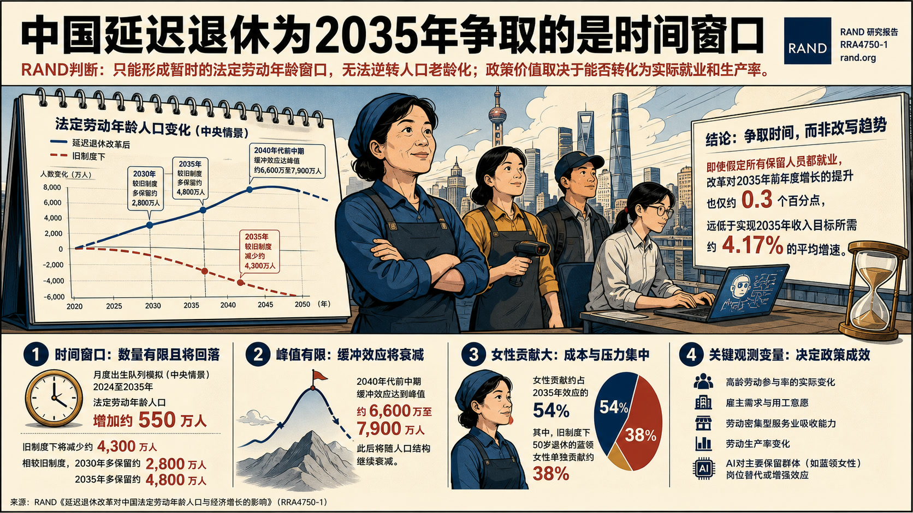

- **核心判断**：**RAND判断，中国2025年延迟退休改革只能形成暂时的法定劳动年龄窗口，无法逆转人口老龄化，政策价值取决于新增法定劳动人口能否转化为实际就业和生产率。**
- **主要论据**：
  - 月度出生队列模拟显示，中央情景下2024至2035年法定劳动年龄人口可增加约550万，而旧制度下将减少约4300万；相较旧制度，2030年和2035年分别多保留约2800万和4800万人。
  - 缓冲效应在2040年代前中期达到约6600万至7900万人的峰值，此后仍会随人口结构继续衰减。
  - 女性贡献约占2035年效应的54%，其中旧制度下50岁退休的蓝领女性单独贡献约38%，说明政策成本和就业吸收压力高度集中。
  - RAND对增长效果持明显克制态度：即使假定所有保留人员都就业，改革对2035年前年度增长的提升也仅约0.3个百分点，远低于实现2035年收入目标所需约4.17%的平均增速。
- **中国/上海参考**：**报告把中国延迟退休的政策效应限定为“争取时间”，并明确提出后续观察变量：高龄劳动参与率、雇主需求、劳动密集型服务业吸收能力、生产率变化，以及AI对蓝领女性等主要保留群体的岗位替代或增强效应。**

### 主题 02｜[P0] [应急管理AI产品供给与采用路径](https://www.rand.org/pubs/research_reports/RRA4625-1.html)

- **来源**：RAND｜**议题**：AI、数字基础设施与技术治理
- **主题**：AI治理, 科技创新

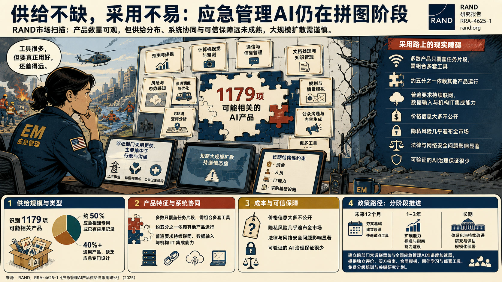

- **核心判断**：**RAND通过市场扫描评估美国应急管理领域AI产品的真实供给与采用条件，认为产品数量已相当可观，但供给分布、系统协同和可信保障远未成熟。**
- **主要论据**：
  - 研究识别1179项可能相关产品，其中约一半为应急管理专用或已有应用记录，40%以上是缺乏应急专门设计的通用产品。
  - 多数产品只覆盖任务片段，需要组合多套工具，五分之一依赖其他产品运行，且普遍要求持续联网、数据输入和机构IT集成能力。
  - 价格信息大多不公开，隐私风险几乎遍布全市场，法律与网络安全问题影响显著，而可验证的AI治理保证很少。
  - RAND对短期大规模扩散持谨慎态度，指出资金、人员、IT能力和采购基础设施仍是延续数十年的结构性约束，邻近的公用事业、非营利组织和公共卫生机构采用稍快但主要集中于行政和沟通。
- **政策建议**：**各方应按未来12个月、1至3年和长期三个阶段推进行动，建立跨部门常设联盟和全国应急管理AI准备度加速器，提供独立产品评价、标准化买方指南、合同模板、同伴学习与部署工具，并建设免费分级培训和关键研究计划。**

### 主题 03｜[P0] [CSET联合高校扩展AI治理法规追踪平台](https://cset.georgetown.edu/article/expanded-collaboration-to-boost-critical-ai-governance-data-and-tracking-tool/)

- **来源**：Center for Security and Emerging Technology｜**议题**：AI、数字基础设施与技术治理
- **主题**：AI治理, 科技创新

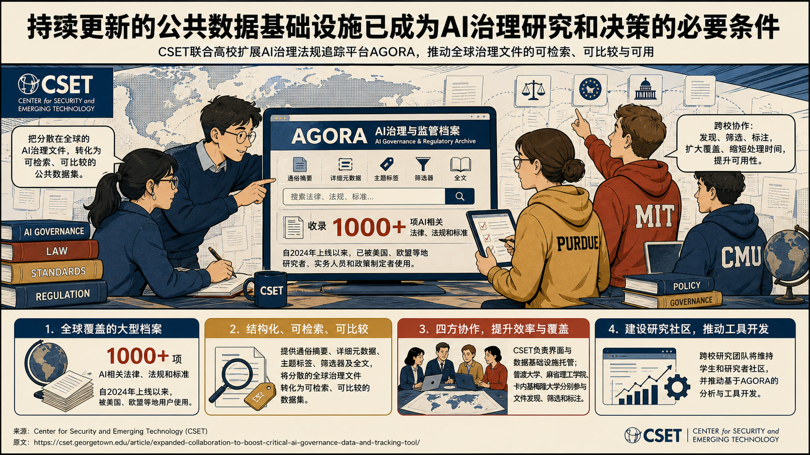

- **核心判断**：**CSET宣布联合普渡大学、麻省理工学院和卡内基梅隆大学扩展AI治理与监管档案AGORA，核心判断是持续更新的公共数据基础设施已成为AI治理研究和决策的必要条件。**
- **主要论据**：
  - AGORA目前收录1000余项AI相关法律、法规和标准，自2024年上线后已被美国、欧盟等地研究者、实务人员和政策制定者使用。
  - 平台提供通俗摘要、详细元数据、主题标签、筛选器及全文，试图把分散的全球治理文件转化为可检索、可比较的数据集。
  - CSET继续承担界面和数据基础设施托管，四方团队分别参与文件发现、筛选和标注，以扩大覆盖、缩短处理时间并提升可用性。
  - 机构对合作扩容持明确支持态度，认为跨校研究团队可以维持学生和研究者社区，并推动基于AGORA的分析与工具开发。

### 主题 04｜[P0] [如何解释前沿AI双用途生物基准的饱和与代际进步](https://www.rand.org/pubs/research_reports/RRA5055-1.html)

- **来源**：RAND｜**议题**：AI、数字基础设施与技术治理
- **主题**：AI治理, 科技创新

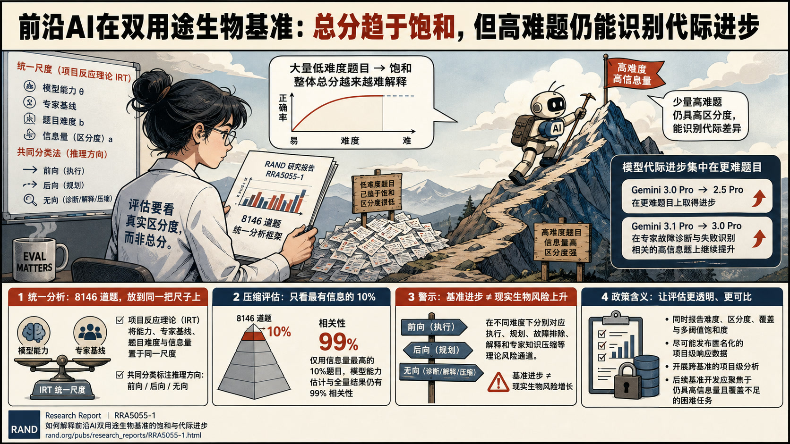

- **核心判断**：**RAND认为，前沿AI在双用途生物基准上的总分已越来越难解释：大量低难度题目趋于饱和，但仍有一小组高难度、高区分度题目能够识别模型代际差异。**
- **主要论据**：
  - 研究把8146道题视为统一数据集，使用项目反应理论将模型能力、专家基线、题目难度和信息量放到同一尺度，并用共同分类法标注推理方向。
  - 结果显示，Gemini 3.0 Pro相较2.5 Pro在更难题目上进步，3.1 Pro又在专家故障诊断和失败识别相关的高信息题上继续提升。
  - 仅选取信息量最高的10%题目，模型能力估计与全量结果仍有99%的相关性，说明评估可显著压缩而不丢失主要排序信号。
  - 报告同时警示，基准进步不直接等同于现实生物风险增长；前向、后向和无向推理在不同难度下分别对应执行、规划、故障排除、解释和专家知识压缩等理论风险通道。
- **政策建议**：**评估机构应同时报告难度、区分度、覆盖和多阈值饱和度，尽可能发布匿名化项目级响应数据，并开展跨基准项目级分析；后续基准开发应集中于仍具高信息量且覆盖不足的困难任务。**

### 主题 05｜[P0] [境外建设前沿AI数据中心的国家安全含义](https://www.brookings.edu/articles/the-national-security-implications-of-building-frontier-ai-data-centers-overseas/)

- **来源**：Brookings Center for Technology Innovation｜**议题**：AI、数字基础设施与技术治理
- **主题**：AI治理, 数字经济

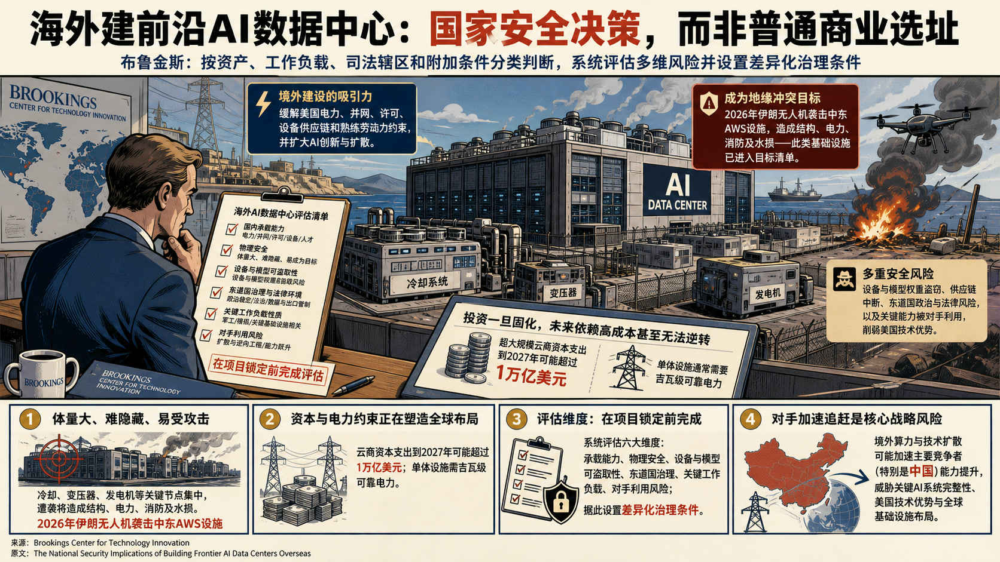

- **核心判断**：**布鲁金斯将前沿AI数据中心的海外选址界定为国家安全决策，主张按资产、工作负载、司法辖区和附加条件分类判断，不能沿用一般商业设施的选址逻辑。**
- **主要论据**：
  - 文章态度审慎但不主张全面回流：境外建设可能缓解美国电力、并网、许可、设备供应链和熟练劳动力约束，也可能扩大AI创新与扩散。
  - 其警示，数据中心体量大、难隐藏，冷却、变压器和发电机等关键节点易受攻击；2026年伊朗无人机袭击中东AWS设施造成结构、电力、消防及水损，显示此类基础设施会直接进入地缘冲突目标清单。
  - 文章还指出，超大规模云商资本支出到2027年可能超过1万亿美元，单体设施需吉瓦级可靠电力，当前投资一旦固化，未来形成的依赖关系可能高成本甚至无法逆转。
  - 风险还来自设备和模型权重盗窃、东道国政治与法律环境、供应链中断，以及关键能力被对手利用后削弱美国技术优势。
- **政策建议**：**境外建设决策应在项目锁定前完成国内承载能力、物理安全、设备与模型可盗取性、东道国治理、关键工作负载和对手利用风险的系统评估，并据此设置差异化治理条件。**
- **中国/上海参考**：**文章将中国列为可能因美国境外算力与技术扩散而加速能力提升的主要竞争者之一，并把这一风险与关键AI系统完整性、美国技术优势和全球基础设施布局联系起来。**

### 主题 06｜[P0] [美国国会应明确AI模型停服权限](https://itif.org/publications/2026/08/03/congress-can-bring-clarity-to-ai-shutdown-authority/)

- **来源**：Information Technology and Innovation Foundation｜**议题**：AI、数字基础设施与技术治理
- **主题**：AI治理, 科技创新

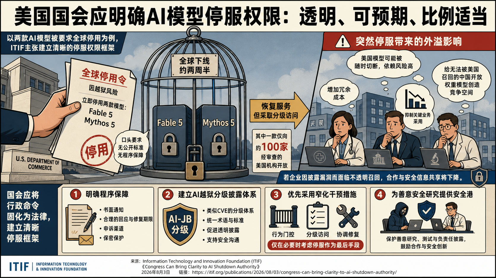

- **核心判断**：**ITIF以美国商务部因越狱风险要求Anthropic全球停用两款模型的事件为例，主张国会建立透明、可预期且比例适当的AI停服权限框架。**
- **主要论据**：
  - 文章并不否认严重模型漏洞可能需要政府干预，但强烈反对依赖口头证据、无公开标准和无程序保障的全球召回。
  - 两款模型停服约两周半后恢复，其中一款仅向约100家经审查美国机构开放，说明分级访问等窄化措施原本可用。
  - 突然停服使医院、企业和研究机构把美国模型视为可被随时切断的依赖，进而增加冗余成本、抑制关键业务采用，并给无法被美国召回的中国开放权重模型创造竞争空间。
  - Information Technology and Innovation Foundation警示，若企业因披露漏洞而面临不透明召回，合作和安全信息共享都会下降。
- **政策建议**：**国会应把行政命令固化为法律，明确书面通知、回应与修复期限、申诉渠道和保密保护；建立类似CVE的AI越狱分级披露体系，优先采用行为门控、分级访问和协调修复，并为善意安全研究设置安全港。**

### 主题 07｜[P1] [AI专项税争论忽视了既有财政风险](https://www.brookings.edu/articles/ai-tax-debate-misses-the-threat-thats-already-here/)

- **来源**：Brookings Center for Technology Innovation｜**议题**：AI、数字基础设施与技术治理
- **主题**：AI治理, 数字经济

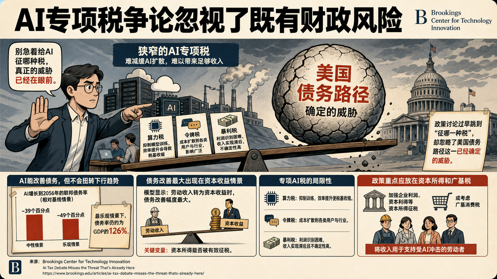

- **核心判断**：**布鲁金斯作者反对以算力、令牌或AI企业暴利为对象的狭窄专项税，认为这类工具既难有效减缓AI扩散，也难筹集足以应对就业冲击和债务问题的收入。**
- **主要论据**：
  - 文章接受AI可能大规模替代劳动、加剧环境和安全风险的担忧，但警示政策讨论过早跳到“征哪一种税”，忽略了美国债务路径这一已经确定的威胁。
  - 其援引NBER情景研究指出，AI增长到2056年可使联邦债务率较基线低39至49个百分点，但即便最乐观情景仍约为GDP的126%，债务不会因AI而转入下降。
  - 模型中债务改善最大反而出现在劳动收入转为资本收益的情景，说明关键变量是资本所得能否被有效征税。
  - 算力税会抑制模型训练且税基随效率提高而收缩，令牌税会把成本扩散给各类用户，暴利税则面临利润识别和收入实现滞后。
- **政策建议**：**政策重点应转向加强企业利润、资本利得等资本所得征税，或考虑广基消费税，并用所得支持受AI冲击的劳动者；不应把窄口径AI税包装为财政可持续性的解决方案。**

### 主题 08｜[P1] [欧盟《数据法》与《数字市场法》云监管冲突](https://www.csis.org/analysis/brussels-vs-brussels-eus-data-act-and-dmas-clash-over-cloud)

- **来源**：Center for Strategic and International Studies｜**议题**：AI、数字基础设施与技术治理
- **主题**：科技治理, 数字经济

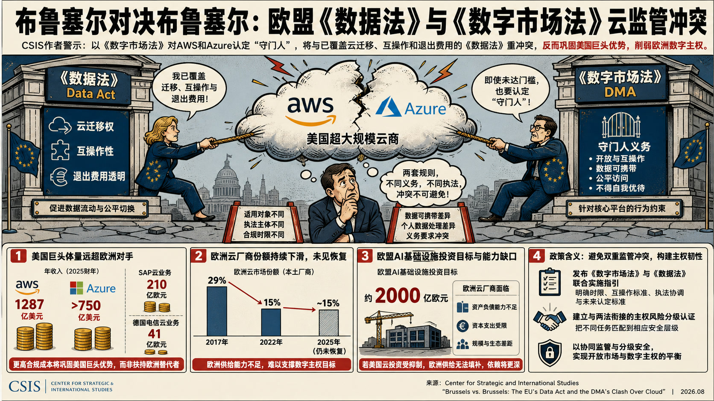

- **核心判断**：**CSIS作者批评欧盟委员会拟在AWS和Azure未达到量化门槛的情况下，以《数字市场法》将其认定为云服务“守门人”，认为此举与已经覆盖云迁移、互操作和退出费用的《数据法》形成制度重叠。**
- **主要论据**：
  - 文章认可欧洲对主权和市场集中度的担忧，但强烈警示，两套法规在适用对象、执法主体、合规时限、数据可携带和个人数据处理上的差异会制造相互冲突的义务。
  - AWS与微软2025财年相关收入分别达1287亿美元和逾750亿美元，远高于SAP和德国电信云业务的210亿欧元和41亿欧元；由此，合规成本更可能巩固美国巨头优势，而非扶持欧洲替代者。
  - 欧洲云厂商在本土市场的份额从2017年的29%降至2022年的15%，到2025年仍未恢复，且缺少承担欧盟约2000亿欧元AI基础设施投资目标的资产负债能力。
  - Center for Strategic and International Studies据此判断，若监管抑制美国超大规模云商投资而欧洲供给无法填补，欧洲将得到更深的外部依赖，与数字主权目标背离。
- **政策建议**：**欧盟委员会若继续推进守门人认定，应发布《数字市场法》与《数据法》的联合实施指引，明确时限、互操作标准、执法协调和未来认定标准；同时建立与两法衔接的主权风险分级认证，把不同任务匹配到相应安全层级。**

### 主题 09｜[P1] [美国如何为AI研发自动化加速做准备](https://ifp.org/preparing-for-ai-research-automation/)

- **来源**：Institute for Progress｜**议题**：AI、数字基础设施与技术治理
- **主题**：AI治理, 科技创新

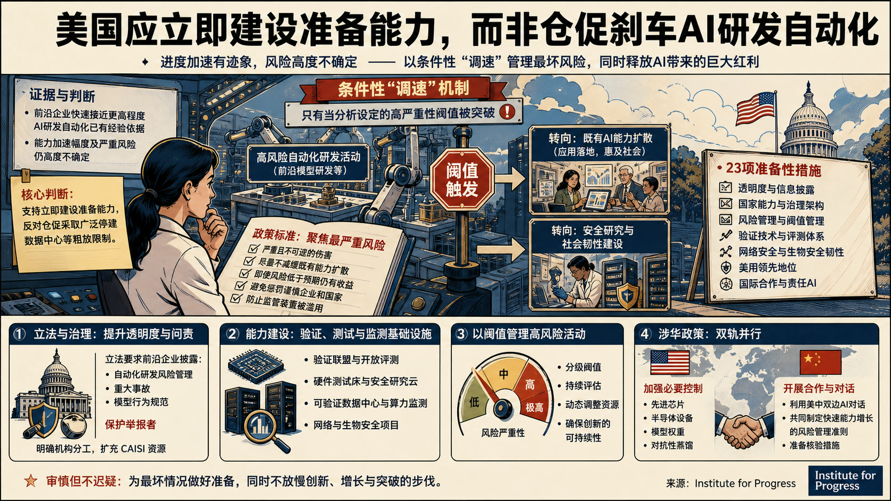

- **核心判断**：**进步研究所认为，前沿企业快速接近更高程度的AI研发自动化已有经验依据，但由此带来的能力加速幅度及严重风险仍高度不确定，因此支持立即建设准备能力，同时反对仓促采取广泛停建数据中心等粗放限制。**
- **主要论据**：
  - 报告把“调速”界定为条件性资源重配：只有经分析设定的高严重性阈值被突破时，才把算力和人才从高风险自动化活动转向既有AI能力扩散，或转向安全研究与社会韧性。
  - Institute for Progress对减速持审慎立场，强调先进AI可能带来增长、技术与疾病治疗突破，风险缓释应服务于创新的可持续性。
  - 其政策标准聚焦严重且不可逆伤害、尽量不减缓既有能力扩散、即使风险低于预期仍有收益、避免惩罚谨慎企业和国家，并防止监管装置被滥用。
  - 报告提出23项准备性措施，覆盖透明度、国家能力、风险管理、验证技术、网络与生物安全韧性、美国领先地位和国际合作。
- **政策建议**：**美国应立法要求前沿企业披露自动化研发风险管理、事故、模型行为规范并保护举报者，明确机构分工，扩充CAISI资源；同时推进验证联盟、硬件测试床、可验证数据中心、算力监测、网络与生物安全项目，并以分级阈值管理高风险活动。**
- **中国/上海参考**：**报告一方面建议美国加强对先进芯片、半导体设备、模型权重和对抗性蒸馏的控制，另一方面明确提出利用美中双边AI对话共同制定快速能力增长的风险管理准则并准备核验措施。**

### 主题 10｜[P1] [安全推理数据中心的纵向一体化工程方案](https://www.rand.org/pubs/research_reports/RRA4827-1.html)

- **来源**：RAND｜**议题**：AI、数字基础设施与技术治理
- **主题**：AI治理, 数字经济

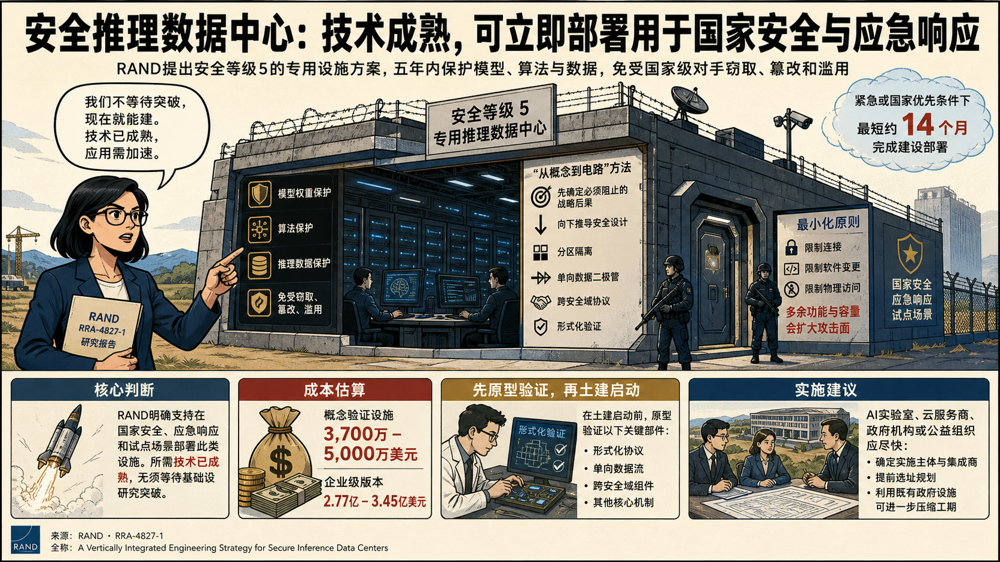

- **核心判断**：**报告明确支持在国家安全、应急响应和试点场景部署此类设施，认为所需技术已经成熟，无须等待基础研究突破。**
- **主要论据**：
  - RAND提出安全等级5的专用推理数据中心，用于在五年运行期内保护模型权重、算法和推理数据免受高能力国家级对手窃取、篡改和滥用。
  - 其“从概念到电路”方法先确定必须阻止的战略后果，再向下推导分区、单向数据二极管、跨安全域协议和形式化验证等设计，反对在通用基础设施外围事后叠加安全控制。
  - 方案刻意限制连接、软件变更和物理访问，因为多余功能和容量会扩大攻击面。
  - 成本估算为概念验证设施3700万至5000万美元，企业级版本2.77亿至3.45亿美元；在紧急或国家优先条件下，最短约14个月可完成建设部署。
- **政策建议**：**AI实验室、云服务商、政府机构或公益组织应尽快确定实施主体和集成商，提前选址，并在土建启动前原型验证形式化协议、单向数据流等关键部件；利用既有政府设施可进一步压缩工期。**

### 主题 11｜[P1] [伊朗在美伊冲突中的网络行动已转向战时支援](https://www.csis.org/analysis/how-tehrans-use-cyber-operations-us-iran-conflict-has-evolved)

- **来源**：Center for Strategic and International Studies｜**议题**：AI、数字基础设施与技术治理
- **主题**：国防AI, 数字经济

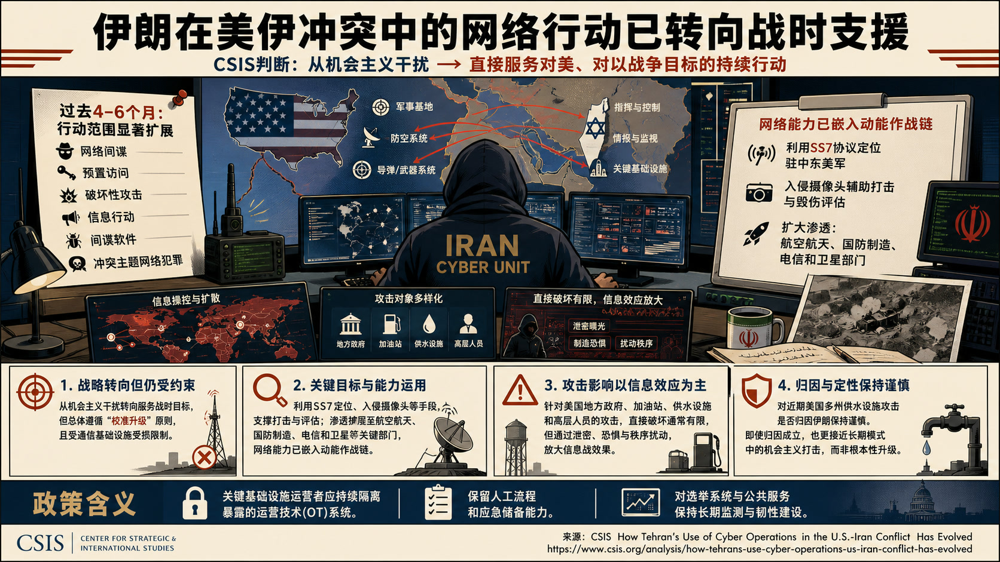

- **核心判断**：**CSIS判断，伊朗网络体系已从冲突初期的机会主义干扰，转向直接服务对美、对以战争目标的持续行动，但总体仍受“校准升级”原则和受损通信基础设施约束。**
- **主要论据**：
  - 过去4至6个月，行动范围扩展到网络间谍、预置访问、破坏性攻击、信息行动、间谍软件和冲突主题网络犯罪。
  - 文章列举伊朗利用SS7协议定位驻中东美军、入侵摄像头辅助打击与毁伤评估，并扩大对航空航天、国防制造、电信和卫星部门的渗透，说明网络能力已嵌入动能作战链。
  - 针对美国地方政府、加油站、水设施和高层人员的攻击，其直接破坏通常有限，却能通过泄密、恐惧和秩序扰动放大信息战效果。
  - Center for Strategic and International Studies对近期美国多州供水设施攻击是否归因伊朗保持谨慎，反对在证据不足时把它直接定性为根本性升级；即使归因成立，也更接近长期模式中的机会主义打击。
- **政策建议**：**美国关键基础设施运营者应持续隔离暴露的运营技术、保留人工流程和应急储备，并对选举与公共服务系统维持长期监测和韧性建设。**

### 主题 12｜[P1] [美国联邦研发支出结构如何影响生产率](https://www.rand.org/pubs/working_papers/WRA4392-1.html)

- **来源**：RAND｜**议题**：科研体系、人才与创新政策
- **主题**：科技创新

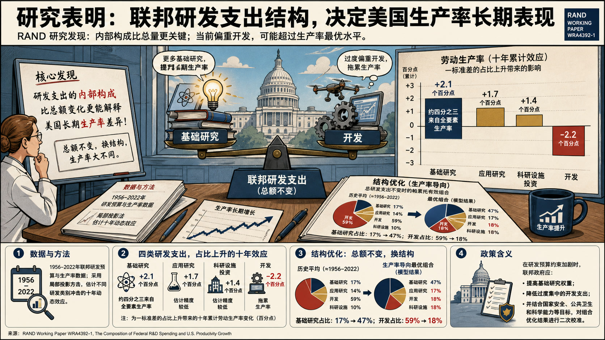

- **核心判断**：**RAND研究认为，联邦研发支出的内部构成比总额变化更能解释美国长期生产率差异，当前偏重开发活动的组合可能超过生产率最大化水平。**
- **主要论据**：
  - RAND利用1956至2022年研发预算和生产率数据，通过局部投影估计不同研发类别冲击的十年动态效应。
  - 一标准差的基础研究占比上升与十年累计劳动生产率提高约2.1个百分点相关，约四分之三效应来自全要素生产率；开发占比的同等上升则与约2.2个百分点下降相关。
  - 应用研究和科研设施投资对应约1.7和1.4个百分点的正效应，但估计精度较低。
  - 组合优化显示，在总研发支出不变时，生产率导向的帕累托有效组合会把基础研究占比由历史约17%提高到47%，把开发占比由59%降至18%。
- **政策建议**：**在研发预算约束加剧时，联邦政府应提高基础研究权重、降低过度集中的开发支出，并用生产率以外的国家安全、公共卫生和科学能力目标对组合优化结果进行二次校准。**

### 主题 13｜[P1] [韩国未来基金应把存储芯片红利转化为下一轮增长](https://itif.org/publications/2026/08/03/koreas-future-fund-should-finance-the-next-boom/)

- **来源**：Information Technology and Innovation Foundation｜**议题**：科研体系、人才与创新政策
- **主题**：科技创新

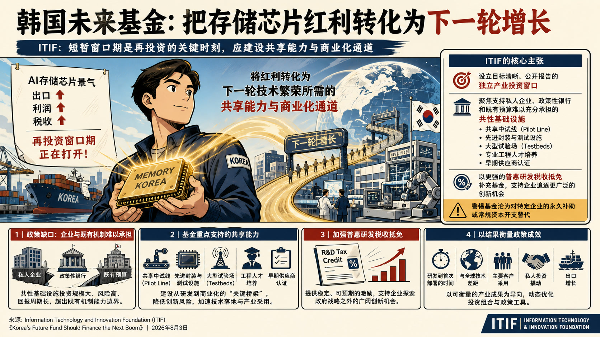

- **核心判断**：**ITIF认为，AI存储芯片景气带来的出口、利润和税收增长为韩国提供了短暂的再投资窗口，应将其转化为下一轮技术繁荣所需的共享能力和商业化通道。**
- **主要论据**：
  - 机构支持设立未来应对基金，但警惕基金沦为对特定企业的永久补助或常规资本开支替代。
  - 文章将政策缺口定位在私人企业、政策性银行和既有预算难以充分承担的共性基础设施，包括中试线、先进封装与测试设施、大型试验场、专业工程人才培养和早期供应商认证。
  - Information Technology and Innovation Foundation同时主张加强普惠、稳定的研发税收抵免，使企业能够追逐政府指定战略技术之外的机会。
  - 政策成效应由研发到首次部署的时间、与全球技术差距、主要客户采用、私人投资和出口等结果衡量。
- **政策建议**：**韩国应为未来应对基金设置目标清晰、公开报告的独立产业投资窗口，重点支持共享中试、封装测试、试验场、工程人才和供应商认证，并以更强的普惠研发税收抵免补充基金。**

### 主题 14｜[P1] [乌克兰经验显示半自主系统可快速形成作战规模](https://www.aspistrategist.org.au/learning-from-ukraine-semi-autonomy-can-deliver-combat-mass/)

- **来源**：Australian Strategic Policy Institute｜**议题**：产业链、制造与能源基础设施
- **主题**：先进制造

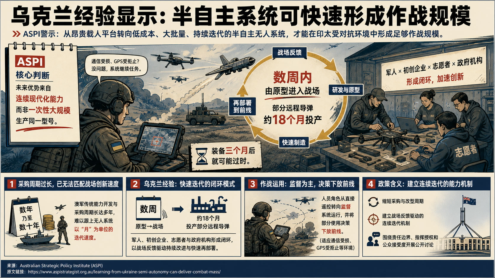

- **核心判断**：**ASPI主张，澳大利亚若要在印太广阔且受对抗的环境中形成足够作战规模，应由少量昂贵载人平台转向低成本、大批量、持续迭代的半自主无人系统。**
- **主要论据**：
  - 文章对澳军现有多年乃至数十年的能力开发与采购周期持强烈警示态度，认为其已无法匹配无人系统以月为单位的战场创新速度。
  - 乌克兰经验显示，军人、初创企业、志愿者与政府机构形成闭环后，产品可在数周内由原型进入战场，部分远程导弹约18个月即可投产，而装备三个月后就可能过时。
  - 文章据此强调，竞争优势取决于从战场反馈、研发、制造到再部署的连续现代化能力，而非一次性大规模生产同一型号。
  - 其进一步支持将人员角色由直接遥控转为监督系统运行，并把部分使用决策下放至前线，以适应通信受损、GPS受拒止等环境。
- **政策建议**：**澳大利亚政府与国防工业应缩短采购和改型周期，建立战场反馈驱动的连续迭代机制，并围绕半自主系统的责任边界、指挥授权和公众接受度开展公开讨论。**

### 主题 15｜[P1] [生育如何影响工作表现、人力资本与晋升](https://www.rand.org/pubs/external_publications/EP71438.html)

- **来源**：RAND｜**议题**：科研体系、人才与创新政策
- **主题**：科技人才

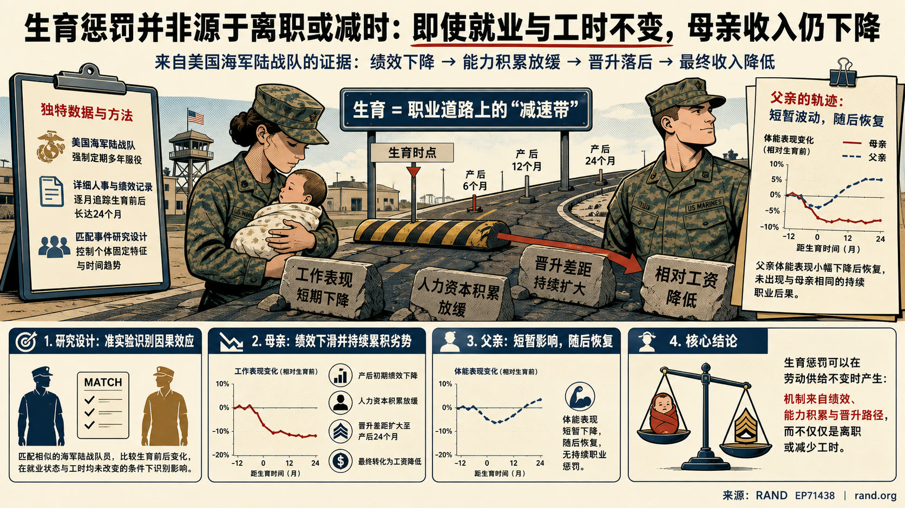

- **核心判断**：**该论文研究在就业状态和工时均未改变的条件下，母亲收入惩罚仍会通过哪些机制形成。**
- **主要论据**：
  - RAND利用美国海军陆战队强制多年服役和详细人事记录构造匹配事件研究，逐月追踪生育前后工作表现、人力资本积累与晋升变化。
  - 研究发现，母亲生育后的工作表现起初下降，晋升差距持续扩大到产后24个月，并最终转化为相对工资降低。
  - 父亲的体能表现也出现一定下降，但随后恢复，未呈现与母亲相同的持续职业后果。
  - 文章据此支持“生育惩罚可在劳动供给不变时产生”的判断，将机制从离职或减时扩展到绩效、能力积累和晋升路径。

### 主题 16｜[P1] [ITIF建议终止传统高成本通信补贴并转向可负担性](https://itif.org/publications/2026/08/04/comments-fcc-regarding-reforming-high-cost-program-for-all-ip-future/)

- **来源**：Information Technology and Innovation Foundation｜**议题**：AI、数字基础设施与技术治理
- **主题**：数字经济

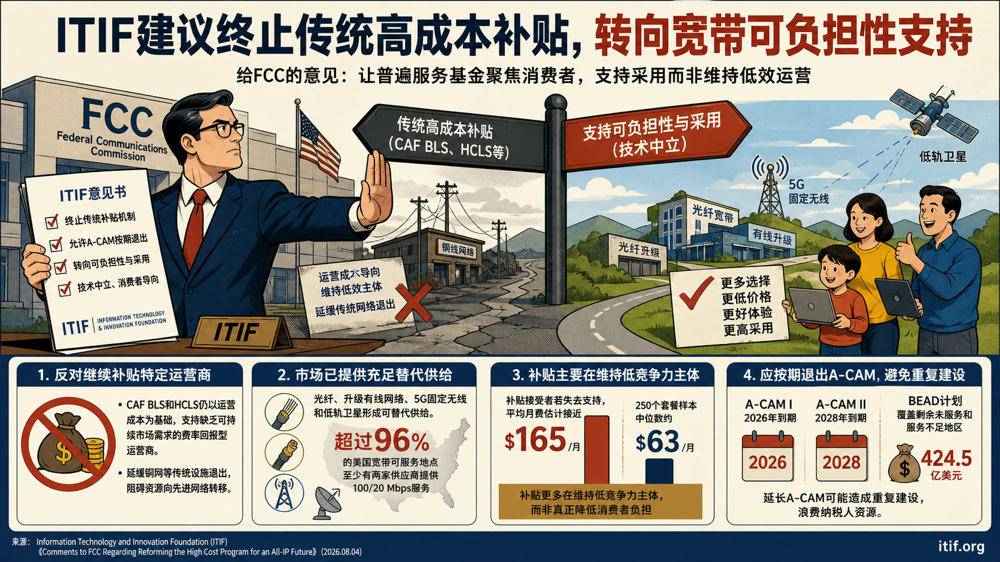

- **核心判断**：**ITIF向美国联邦通信委员会主张，传统高成本支持机制和有期限的A-CAM部署项目已基本完成历史任务，应按既定时间退出，并把更精简的普遍服务基金转向宽带可负担性与采用。**
- **主要论据**：
  - 机构对继续补贴特定运营商持明确反对立场，认为CAF BLS和HCLS仍以运营成本为基础支持缺乏可持续市场需求的费率回报型运营商，还会延缓铜网等传统设施退出。
  - 市场证据显示，光纤、升级有线网络、5G固定无线和低轨卫星已经形成可替代供给，超过96%的美国宽带可服务地点至少有两家供应商提供100/20 Mbps服务。
  - 传统补贴接受者若失去支持，平均月费估计接近165美元，而250个套餐样本的中位数约63美元，反映补贴更多在维持低竞争力主体。
  - A-CAM I和II分别计划于2026年和2028年到期，另有424.5亿美元BEAD计划覆盖剩余未服务和服务不足地区，延长A-CAM可能造成重复建设。
- **政策建议**：**FCC应终止CAF BLS、HCLS等传统机制，允许A-CAM按期退出，并在扣除私人投资和BEAD承诺后，把普遍服务支持改为技术中立、消费者定向的可负担性补贴。**
