# 国际科技智库周报（2026-08-16）

## 目录

- P.05-06｜[主题 01｜人工智能、中国与美国安全新风险：乔雷夫访谈](#topic-01)
- P.07-08｜[主题 02｜追踪“硅谷和平”倡议的演进：时间线](#topic-02)
- P.09-10｜[主题 03｜中国创新不只是加大投入，转化效率也在提升](#topic-03)
- P.11-12｜[主题 04｜评测大语言模型智能体规避核酸合成筛查的生物工具使用能力](#topic-04)
- P.13-14｜[主题 05｜以供应链为基础提升制造企业AI转型数据利用的政策工具](#topic-05)
- P.15-16｜[主题 06｜被AI甩在后面：政策如何重塑网络安全合规](#topic-06)
- P.17-18｜[主题 07｜以可叠加证书现代化美国空军部AI与先进技术培训](#topic-07)
- P.19-20｜[主题 08｜美国供水系统遭网络攻击与伊朗问题：升级还是机会主义行动？](#topic-08)
- P.21-22｜[主题 09｜评估AI数据中心选址的能源潜力：场址适宜性比较框架](#topic-09)
- P.23-24｜[主题 10｜口罩产能应急扩张：确保美国中小企业增产呼吸防护装备的方案](#topic-10)
- P.25-26｜[主题 11｜压力下的民主与全球秩序转型](#topic-11)
- P.27-28｜[主题 12｜美国科学体系需要改革，而非任意削减经费](#topic-12)
- P.29-30｜[主题 13｜数据中心就业效应的新证据](#topic-13)

## 本周态势

本周形成 13 条 P0/P1 重点，议题集中在AI、数字基础设施与技术治理、产业链、制造与能源基础设施。产业链、制造与能源信号 3 条；AI 与数字基础设施信号 9 条；直接涉华条目 2 条。

## 本周必读

1. **[人工智能、中国与美国安全新风险：乔雷夫访谈](https://www.rand.org/pubs/commentary/2026/08/ai-china-and-the-new-risks-to-us-security-qa-with-matan.html)**
   - **研判**：机构警示，人工智能不会自动赋予国家更大的战略自主性，反而会强化对芯片、算力、资本、人才、能源、市场等跨国投入的依赖。
   - **证据**：论证依据是对国家能力组合的映射，而非仅比较单项技术水平。
   - **来源**：RAND｜P0｜涉华科技竞争与上海参考
2. **[追踪“硅谷和平”倡议的演进：时间线](https://itif.org/publications/2026/08/13/pax-silica-timeline/)**
   - **研判**：机构判断，该倡议已从保障AI关键投入品，扩展到支撑大规模开发和部署AI所需的工业能力、基础设施与跨境商业合作。
   - **证据**：时间线显示，倡议在2025年12月由美、英、日、韩、新、澳、以七国签署声明启动，到2026年8月声明签署国增至25个；另有35国签署侧重AI可及性、开发部署与数字基础设施的《AI机会声明》。
   - **来源**：Information Technology and Innovation Foundation｜P0｜产业链、制造与能源基础设施
3. **[以供应链为基础提升制造企业AI转型数据利用的政策工具](https://www.stepi.re.kr/site/stepien/ex/bbs/publicationView.do?pageIndex=1&cbIdx=1303&reIdx=137&cateCont=A0508)**
   - **研判**：机构判断，韩国制造企业的数据利用障碍具有供应链结构性：大企业与中小供应商之间的数据获取、标准、互信和收益分配难以靠单个企业解决。
   - **证据**：STEPI将制造业AI转型中的数据界定为能够支撑缺陷预测、预测性维护、流程优化和供应链协同的战略资产，而非单纯生产记录。
   - **来源**：Science and Technology Policy Institute Korea｜P0｜产业链、制造与能源基础设施
4. **[被AI甩在后面：政策如何重塑网络安全合规](https://cset.georgetown.edu/publication/outpaced-ai-and-policys-role-in-transforming-cybersecurity-compliance/)**
   - **研判**：CSET判断，现有美国联邦网络安全合规体系已无法适应AI加速的攻防与软件迭代节奏，继续以文件审查和周期性授权为核心会造成安全与创新双重滞后。
   - **证据**：机构对现行授权运行及其风险管理框架持明确批评态度，认为其缓慢、重复且难以反映持续变化的系统风险。
   - **来源**：Center for Security and Emerging Technology｜P1｜AI、数字基础设施与技术治理
5. **[美国供水系统遭网络攻击与伊朗问题：升级还是机会主义行动？](https://www.csis.org/analysis/cyberattacks-us-water-sector-and-iran-question-escalation-or-opportunism)**
   - **研判**：CSIS判断，伊朗很可能是针对美国供水部门网络攻击的实施方，但其主要目的在于制造恐惧、混乱和社会分裂，并非寻求立即升级为大规模冲突。
   - **证据**：机构将此类行动置于信息战和机会主义施压的框架内，强调攻击对象的民生敏感性能够放大心理效应。
   - **来源**：Center for Strategic and International Studies｜P1｜AI、数字基础设施与技术治理

## 议题观点速览

### AI、数字基础设施与技术治理（4 条）

- **RAND**：机构警示，这类智能体已显现出降低专业门槛的风险潜力；风险来自“模型+工具链”组合，而非单纯的文本生成能力。
- **Center for Security and Emerging Technology**：CSET判断，现有美国联邦网络安全合规体系已无法适应AI加速的攻防与软件迭代节奏，继续以文件审查和周期性授权为核心会造成安全与创新双重滞后。
- **RAND**：机构持支持态度，认为模块化、可累积的学习路径可补足传统职业军事教育更新慢、与岗位技术需求脱节的问题。
- **Center for Strategic and International Studies**：CSIS判断，伊朗很可能是针对美国供水部门网络攻击的实施方，但其主要目的在于制造恐惧、混乱和社会分裂，并非寻求立即升级为大规模冲突。

### 产业链、制造与能源基础设施（3 条）

- **Information Technology and Innovation Foundation**：机构判断，该倡议已从保障AI关键投入品，扩展到支撑大规模开发和部署AI所需的工业能力、基础设施与跨境商业合作。
- **Science and Technology Policy Institute Korea**：机构判断，韩国制造企业的数据利用障碍具有供应链结构性：大企业与中小供应商之间的数据获取、标准、互信和收益分配难以靠单个企业解决。
- **RAND**：机构判断，新冠疫情期间中小企业曾承担补充产能角色，未来能否再次增产取决于企业在平时是否保持经营可持续、市场竞争力与应急准备状态。

### 涉华科技竞争与上海参考（2 条）

- **RAND**：机构警示，人工智能不会自动赋予国家更大的战略自主性，反而会强化对芯片、算力、资本、人才、能源、市场等跨国投入的依赖。
- **Information Technology and Innovation Foundation**：ITIF判断，中国高技术产业竞争力的变化已不能只用研发投入规模解释，更关键的是创新投入向可商业化技术产出的转化效率上升。

### 科研体系、人才与创新政策（2 条）

- **Center for Strategic and International Studies**：CSIS判断，民主制度、经济繁荣与国际秩序正受到治理绩效不佳、不安全感、腐败和跨国犯罪等多重压力的共同冲击。
- **Information Technology and Innovation Foundation**：ITIF反对以任意削减经费和强化政治干预作为美国科研体系改革手段，认为这会进一步损害已在下降的创新生产率与国际竞争力。

## 主题展开

### 主题 01｜[P0] [人工智能、中国与美国安全新风险：乔雷夫访谈](https://www.rand.org/pubs/commentary/2026/08/ai-china-and-the-new-risks-to-us-security-qa-with-matan.html)

- **来源**：RAND｜**议题**：涉华科技竞争与上海参考
- **主题**：AI治理, 中国与上海相关, 科技创新

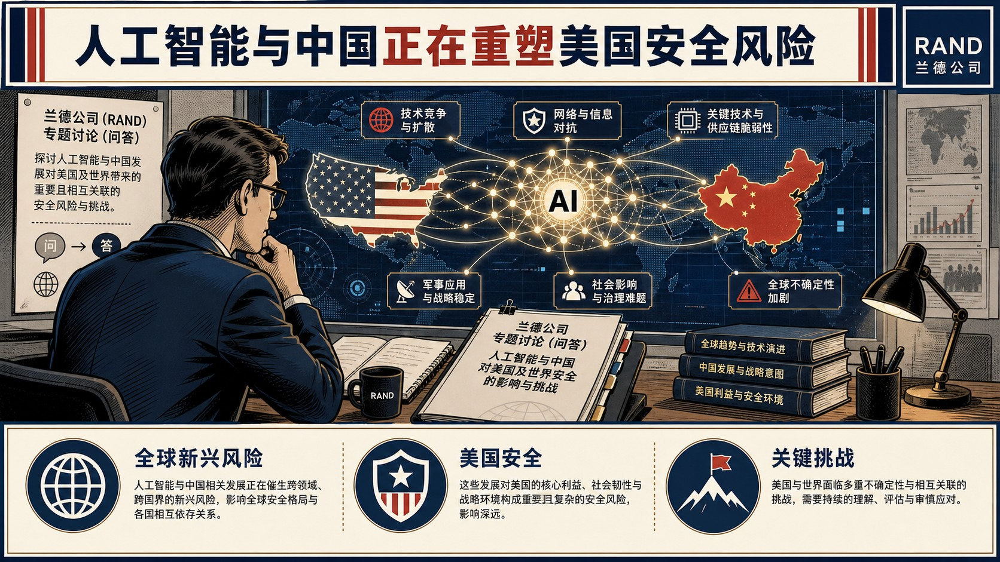

- **核心判断**：**机构警示，人工智能不会自动赋予国家更大的战略自主性，反而会强化对芯片、算力、资本、人才、能源、市场等跨国投入的依赖。**
- **主要论据**：
  - RAND将当下界定为可与二战后相提并论的战略转折点：冷战后秩序的基本假设已失效，而人工智能正同时改变生产、社会生活、作战和国际竞争。
  - 该判断对中美同样适用：两国都难以将AI优势直接转化为地缘政治支配力，缺乏全套投入要素的新兴国家则可能被进一步拉开差距。
  - 论证依据是对国家能力组合的映射，而非仅比较单项技术水平。
  - 乔雷夫同时反对“AI会一夜重置国际政治”的断言，强调技术变迁存在延续性与高度不确定性。

### 主题 02｜[P0] [追踪“硅谷和平”倡议的演进：时间线](https://itif.org/publications/2026/08/13/pax-silica-timeline/)

- **来源**：Information Technology and Innovation Foundation｜**议题**：产业链、制造与能源基础设施
- **主题**：AI治理, 先进制造, 科技创新

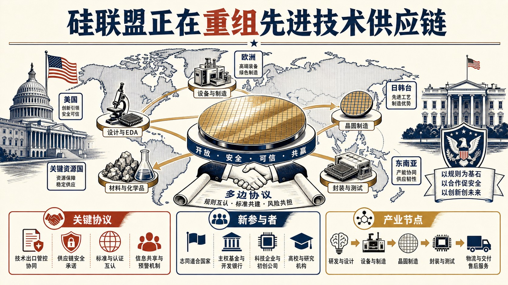

- **核心判断**：**机构判断，该倡议已从保障AI关键投入品，扩展到支撑大规模开发和部署AI所需的工业能力、基础设施与跨境商业合作。**
- **主要论据**：
  - ITIF将“硅谷和平”定位为美国主导的经济安全与产业协作框架，其目标是围绕关键矿产、能源、半导体、先进制造和AI基础设施重组可信供应链。
  - 时间线显示，倡议在2025年12月由美、英、日、韩、新、澳、以七国签署声明启动，到2026年8月声明签署国增至25个；另有35国签署侧重AI可及性、开发部署与数字基础设施的《AI机会声明》。
  - 这些扩员、协议和投资节点构成其论证证据。
  - 材料没有把这一机制描述为既成有效的供应链替代体系，仍以持续出现的新协议和合作机制来标识其范围扩张。

### 主题 03｜[P0] [中国创新不只是加大投入，转化效率也在提升](https://itif.org/publications/2026/08/11/china-isnt-just-spending-more-on-innovation-its-getting-better-at-innovation/)

- **来源**：Information Technology and Innovation Foundation｜**议题**：涉华科技竞争与上海参考
- **主题**：科技创新, 中国与上海相关

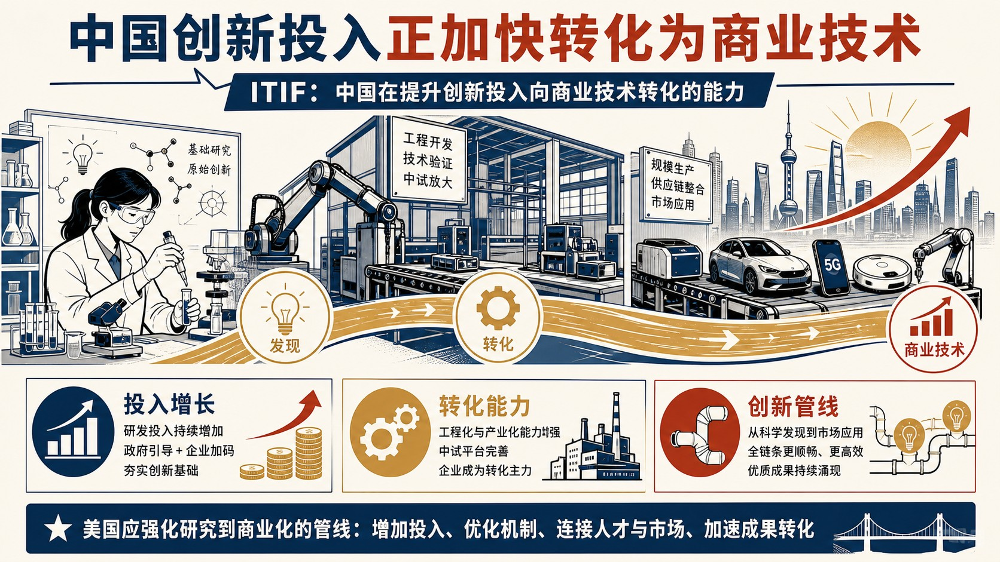

- **核心判断**：**ITIF判断，中国高技术产业竞争力的变化已不能只用研发投入规模解释，更关键的是创新投入向可商业化技术产出的转化效率上升。**
- **主要论据**：
  - 机构对此持明确警示立场，认为这一趋势会使中国企业以更低成本、更快速度进入半导体、先进制造和人工智能等原由美国占优的行业。
  - 其核心证据是2005—2024年中国高技术产业专利申请年均增长19.2%，而研发机构、全时当量研发人员、研发经费和新产品开发投入的年均增速约为12%—18%。
  - 按单位投入计算，每家研发机构的专利申请由约10.4件增至16件，每万名全时当量研发人员的申请由972件增至3210件。
  - 文章承认专利并不能覆盖创新质量的全部维度，但认为投入与产出增速的持续背离具有方向性意义。
- **中国/上海参考**：**文章直接以中国高技术产业为对象，显示专利产出相对研发投入的效率提升已构成美国对华技术竞争评估中的结构性变量。**

### 主题 04｜[P0] [评测大语言模型智能体规避核酸合成筛查的生物工具使用能力](https://www.rand.org/pubs/research_reports/RRA4741-2.html)

- **来源**：RAND｜**议题**：AI、数字基础设施与技术治理
- **主题**：科技创新, AI治理

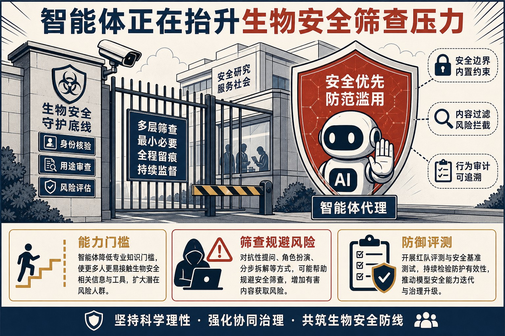

- **核心判断**：**机构警示，这类智能体已显现出降低专业门槛的风险潜力；风险来自“模型+工具链”组合，而非单纯的文本生成能力。**
- **主要论据**：
  - RAND评测大语言模型智能体调用生物信息学工具、重新设计肽和蛋白质以规避核酸合成筛查的能力。
  - 研究以受控红队任务测试智能体在蛋白质重设计、工具调用和筛查规避中的表现，并将其与既有筛查机制相对照。
  - 结果显示，智能体能力仍在发展，任务成功并不等同于现实世界危害的即时实现。
  - 报告同时强调，风险评估应持续跟踪工具接入、模型能力和合成筛查防线之间的相互作用，不能据一次实验结果推断必然失效。

### 主题 05｜[P0] [以供应链为基础提升制造企业AI转型数据利用的政策工具](https://www.stepi.re.kr/site/stepien/ex/bbs/publicationView.do?pageIndex=1&cbIdx=1303&reIdx=137&cateCont=A0508)

- **来源**：Science and Technology Policy Institute Korea｜**议题**：产业链、制造与能源基础设施
- **主题**：AI治理, 先进制造

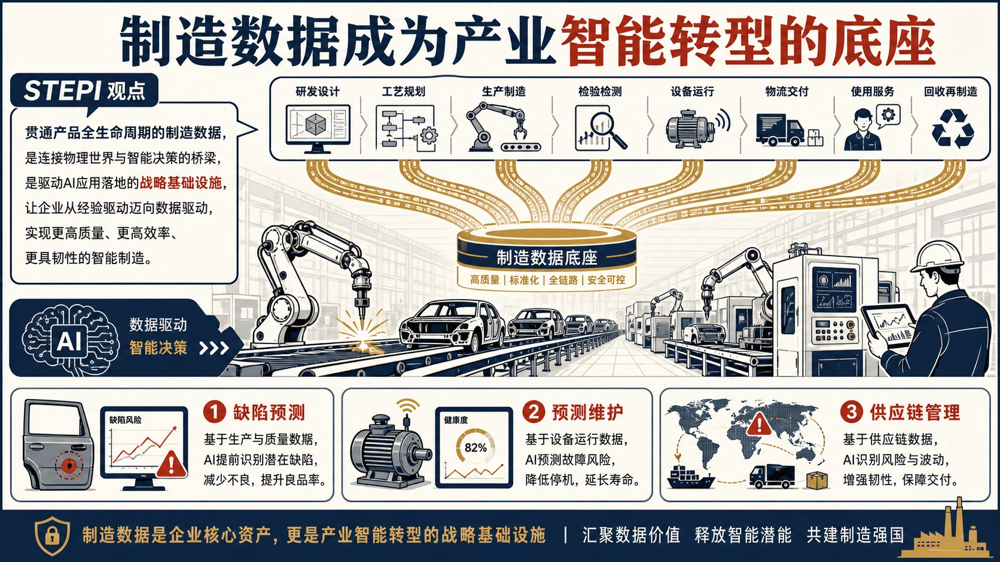

- **核心判断**：**机构判断，韩国制造企业的数据利用障碍具有供应链结构性：大企业与中小供应商之间的数据获取、标准、互信和收益分配难以靠单个企业解决。**
- **主要论据**：
  - STEPI将制造业AI转型中的数据界定为能够支撑缺陷预测、预测性维护、流程优化和供应链协同的战略资产，而非单纯生产记录。
  - 报告据供应链视角梳理制造数据在生产、设备维护、质量管理和跨企业协同中的应用场景，并将数据可用性与AI转型绩效相联系。
  - 其政策取向是推动共享基础设施、互操作标准和能使中小企业参与的数据治理安排。
  - 材料同时提示，若忽略企业间能力差异，数据开放可能反而扩大数字化能力鸿沟。

### 主题 06｜[P1] [被AI甩在后面：政策如何重塑网络安全合规](https://cset.georgetown.edu/publication/outpaced-ai-and-policys-role-in-transforming-cybersecurity-compliance/)

- **来源**：Center for Security and Emerging Technology｜**议题**：AI、数字基础设施与技术治理
- **主题**：AI治理, 数字经济

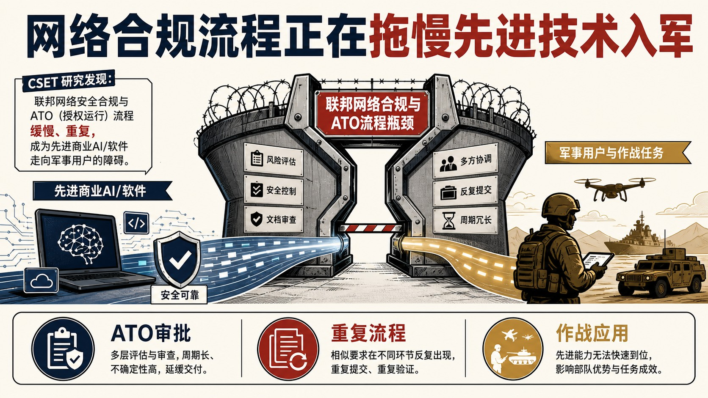

- **核心判断**：**CSET判断，现有美国联邦网络安全合规体系已无法适应AI加速的攻防与软件迭代节奏，继续以文件审查和周期性授权为核心会造成安全与创新双重滞后。**
- **主要论据**：
  - 机构对现行授权运行及其风险管理框架持明确批评态度，认为其缓慢、重复且难以反映持续变化的系统风险。
  - 政策简报以联邦合规流程及其改革讨论为证据，主张将合规从一次性许可转向可验证、持续监测和可复用的安全保证。
  - 文章并未把AI视为自动解决合规问题的工具，强调如果规则、采购和责任机制不改造，AI只会放大既有流程缺陷。
  - 其结论是，技术能力提升必须与制度更新同步推进。
- **政策建议**：**将授权运行改造为持续性安全保证，并同步调整采购、责任与风险管理制度。**

### 主题 07｜[P1] [以可叠加证书现代化美国空军部AI与先进技术培训](https://www.rand.org/pubs/perspectives/PEA4950-1.html)

- **来源**：RAND｜**议题**：AI、数字基础设施与技术治理
- **主题**：AI治理, 科技创新

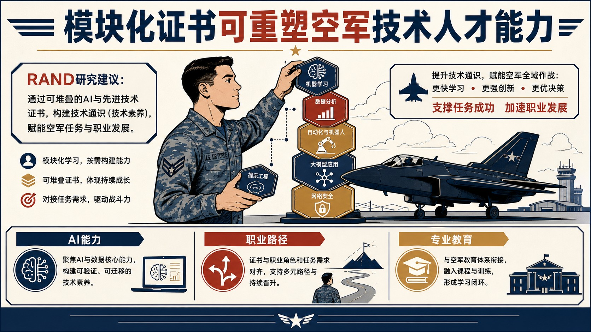

- **核心判断**：**机构持支持态度，认为模块化、可累积的学习路径可补足传统职业军事教育更新慢、与岗位技术需求脱节的问题。**
- **主要论据**：
  - RAND评估以可叠加证书项目提升美国空军部关键任务与职业领域AI、先进技术素养的可行性。
  - 研究围绕关键职业领域、任务需求和既有专业教育体系设计证书衔接方式，将技术能力建设同职业发展和战备要求相联结。
  - 报告并未把证书视为替代完整学历或在职训练的万能方案，实施效果仍取决于课程质量、认证标准、岗位认可和持续更新。
  - 其结论是，人才培养制度需要能随技术迭代而快速调整的组织机制。
- **政策建议**：**在关键岗位建立可叠加证书路径，并将课程、认证和岗位晋升要求联动更新。**

### 主题 08｜[P1] [美国供水系统遭网络攻击与伊朗问题：升级还是机会主义行动？](https://www.csis.org/analysis/cyberattacks-us-water-sector-and-iran-question-escalation-or-opportunism)

- **来源**：Center for Strategic and International Studies｜**议题**：AI、数字基础设施与技术治理
- **主题**：国防AI, 数字经济

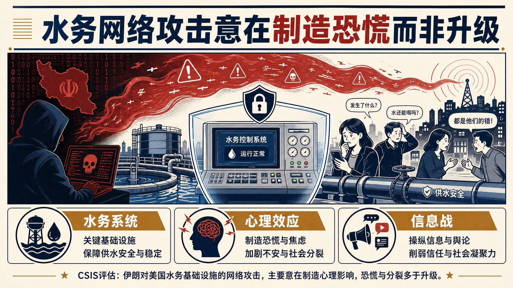

- **核心判断**：**CSIS判断，伊朗很可能是针对美国供水部门网络攻击的实施方，但其主要目的在于制造恐惧、混乱和社会分裂，并非寻求立即升级为大规模冲突。**
- **主要论据**：
  - 机构将此类行动置于信息战和机会主义施压的框架内，强调攻击对象的民生敏感性能够放大心理效应。
  - 文章以攻击归因线索、伊朗网络行动的既有模式及其宣传效果作为判断基础。
  - Center for Strategic and International Studies并未排除误判与升级风险，认为关键在于攻击方如何评估美国反应及危机互动。
  - 其立场是，将心理威慑与基础设施韧性置于同一分析框架，避免只以传统军事升级尺度衡量网络事件。
- **政策建议**：**围绕供水等关键基础设施提升网络韧性，并将心理影响纳入事件响应与威慑评估。**

### 主题 09｜[P1] [评估AI数据中心选址的能源潜力：场址适宜性比较框架](https://www.rand.org/pubs/research_briefs/RBA3845-3.html)

- **来源**：RAND｜**议题**：AI、数字基础设施与技术治理
- **主题**：AI治理, 数字经济

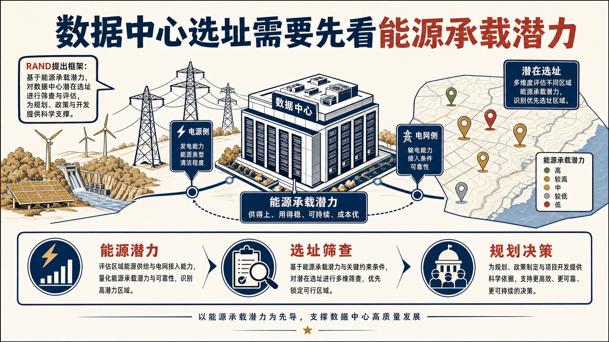

- **核心判断**：**机构的基本判断是，数据中心选址不能只按土地或现有电价排序，必须把供电资源、输配电条件与未来扩容潜力放在同一能源约束框架中比较。**
- **主要论据**：
  - RAND提出一套比较AI数据中心候选场址能源潜力的筛选框架，服务于规划者、政策制定者和开发商的前期决策。
  - 研究以场址能源潜力这一可操作指标组织筛选，并将其作为后续工程、经济和环境评估的前置条件。
  - 该框架并不承诺单一指标可以替代完整项目可行性研究，强调其功能是缩小候选集和暴露约束。
  - 因而，对AI基础设施扩张的关键含义在于，电力可得性已成为选址与建设时序的核心瓶颈。

### 主题 10｜[P1] [口罩产能应急扩张：确保美国中小企业增产呼吸防护装备的方案](https://www.rand.org/pubs/research_reports/RRA5031-1.html)

- **来源**：RAND｜**议题**：产业链、制造与能源基础设施
- **主题**：先进制造

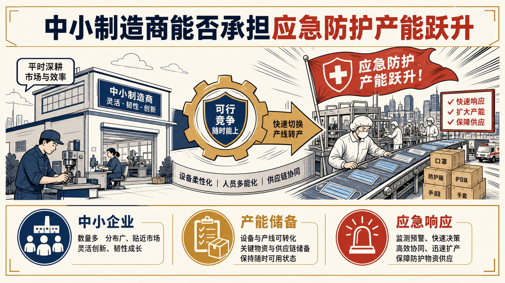

- **核心判断**：**机构判断，新冠疫情期间中小企业曾承担补充产能角色，未来能否再次增产取决于企业在平时是否保持经营可持续、市场竞争力与应急准备状态。**
- **主要论据**：
  - RAND研究美国中小企业在公共卫生危机中快速扩张呼吸防护装备产能的条件。
  - 报告以疫情期间个人防护装备生产经验为依据，分析供给链、认证、采购和需求稳定性对产能转换的影响。
  - 其立场反对只在危机爆发后临时动员，因为停产、设备闲置和合规障碍会削弱可用产能。
  - 材料将韧性制造理解为平时商业可行性与战时快速切换能力的结合。

### 主题 11｜[P1] [压力下的民主与全球秩序转型](https://www.csis.org/analysis/democracy-under-stress-and-transformation-global-order)

- **来源**：Center for Strategic and International Studies｜**议题**：科研体系、人才与创新政策
- **主题**：科技创新

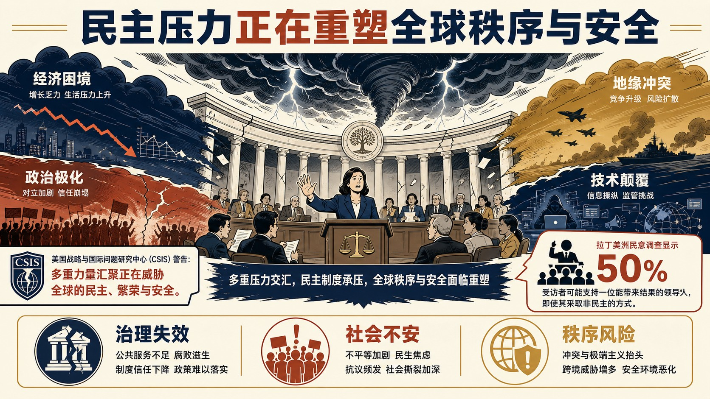

- **核心判断**：**CSIS判断，民主制度、经济繁荣与国际秩序正受到治理绩效不佳、不安全感、腐败和跨国犯罪等多重压力的共同冲击。**
- **主要论据**：
  - 机构警示，民众对“能解决问题的强人政治”的容忍度上升，会削弱民主制度的合法性并重塑全球政治竞争。
  - 文章援引拉美晴雨表调查：半数受访者愿意支持为取得成效而采取非民主手段的领导人，并以智利、哥伦比亚、厄瓜多尔和秘鲁选举中的安全议题说明这种压力。
  - Center for Strategic and International Studies同时将数字监控技术视为威权控制能力的重要放大器，但未将技术本身等同于制度结果。
  - 其论点在于，民主国家若不能改善公共安全、物质福祉和制度可信度，将在与威权治理模式的竞争中持续失分。
- **中国/上海参考**：**文章直接以中国的人脸识别、金融与互联网数据联接，以及向委内瑞拉、厄瓜多尔和玻利维亚输出的系统为威权数字治理能力扩张的案例。**

### 主题 12｜[P1] [美国科学体系需要改革，而非任意削减经费](https://itif.org/publications/2026/08/10/us-science-system-needs-reform-not-arbitrary-funding-cuts/)

- **来源**：Information Technology and Innovation Foundation｜**议题**：科研体系、人才与创新政策
- **主题**：科技创新

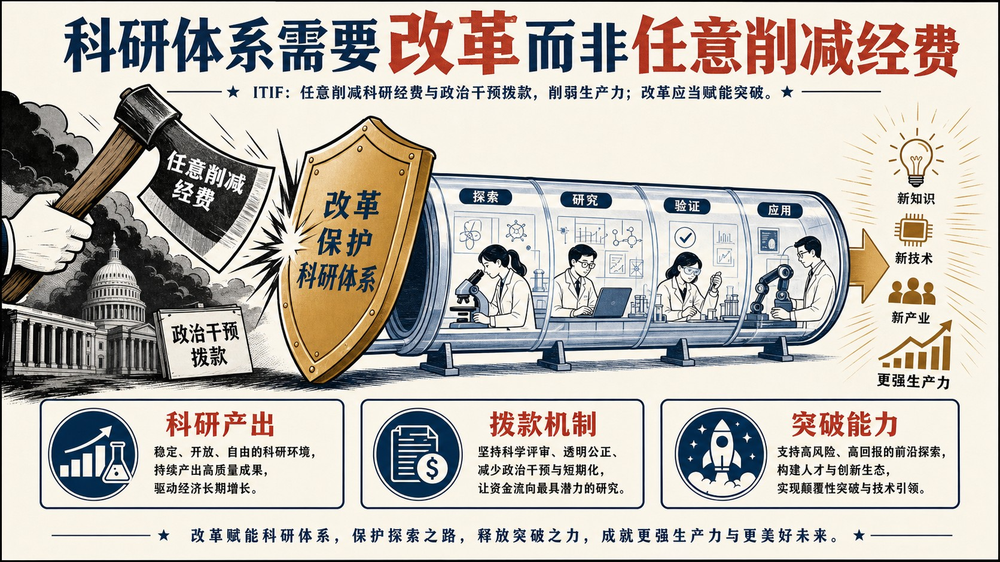

- **核心判断**：**ITIF反对以任意削减经费和强化政治干预作为美国科研体系改革手段，认为这会进一步损害已在下降的创新生产率与国际竞争力。**
- **主要论据**：
  - 机构援引到2025年5月已取消逾15亿美元高校科研资助，并指出让政治任命者更直接决定项目资助会偏离专家同行评审。
  - 其证据包括OSTP对科研生产率下滑的诊断、科研人员近半工作时间耗于文书合规的估计，以及研究生产率约每13年减半的学术研究结论。
  - 文章并不主张简单增加经费即可解决问题，而是要求同时降低行政负担、延长优秀研究者资助周期、试验快速资助和奖金等多样化工具。
  - 其立场是，以制度效率改革释放科研能力，比削减投入更有助于维持美国技术竞争力。
- **政策建议**：**减少合规负担，扩大多元资助工具，并以持续评估改进科研资助组合。**

### 主题 13｜[P1] [数据中心就业效应的新证据](https://www.brookings.edu/articles/new-evidence-on-data-center-employment-effects/)

- **来源**：Brookings Center for Technology Innovation｜**议题**：AI、数字基础设施与技术治理
- **主题**：数字经济

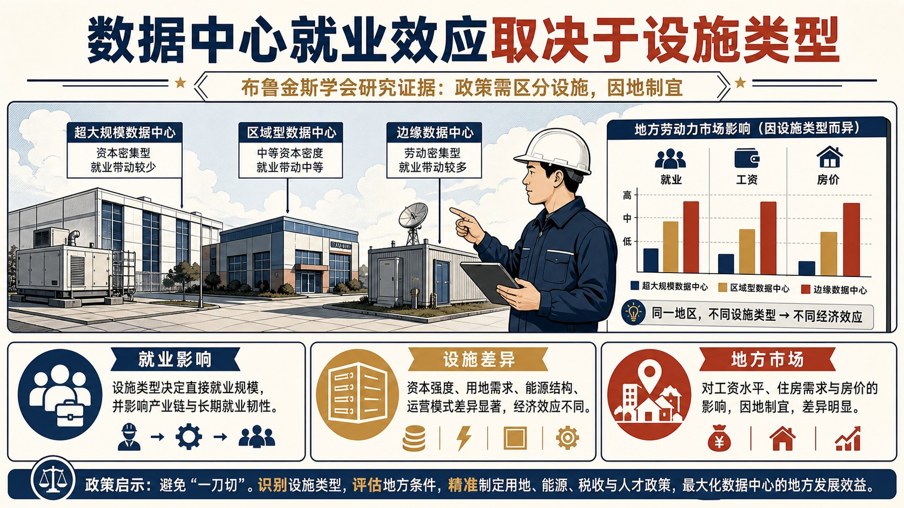

- **核心判断**：**布鲁金斯的研究判断，数据中心确会创造地方就业，但规模明显低于行业倡导者常称的水平，且效果高度取决于设施类型。**
- **主要论据**：
  - 研究团队汇集约1500座美国数据中心、52个已宣布后取消项目，并与2003—2024年县级就业和工资数据匹配；以取消项目所在地区作为对照，减少选址本身造成的高增长偏差。
  - 结果显示，首座大型数据中心投运后十年，数据处理业就业增加56%，电信业增加43%，典型县仅增加约100—200个岗位，工资未见提升，房价上升2%—5%。
  - 超大规模园区带来电信生态效应，托管型设施则未显示同样效应。
  - 机构因此对以税收优惠换取就业的做法持审慎态度：选址更受电力、土地和光纤约束，托管型项目的补贴占投资比重却可能高达62%。
- **政策建议**：**以设施类型和严谨对照研究评估补贴、规划与环境权衡，避免把既有增长趋势误判为数据中心的就业贡献。**
