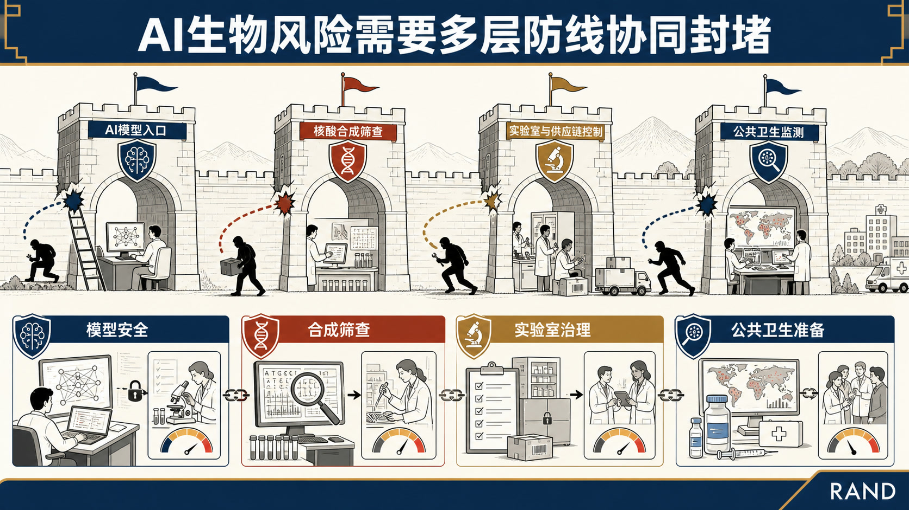
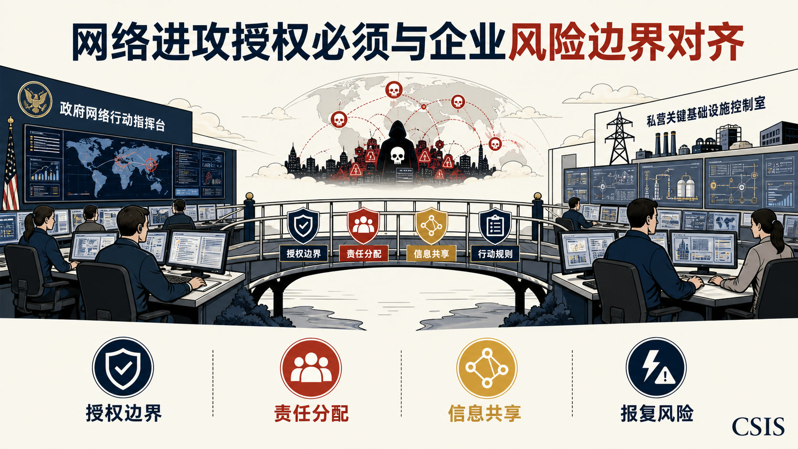
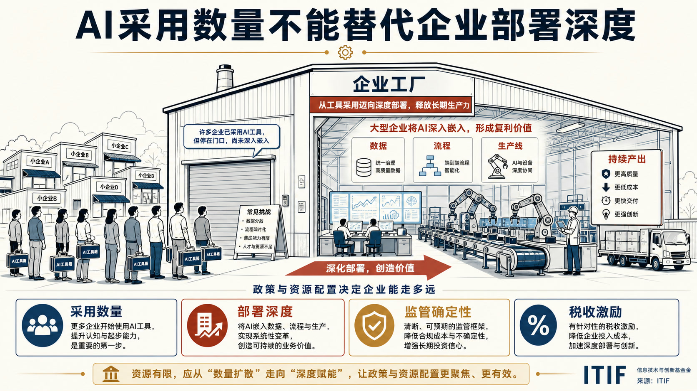
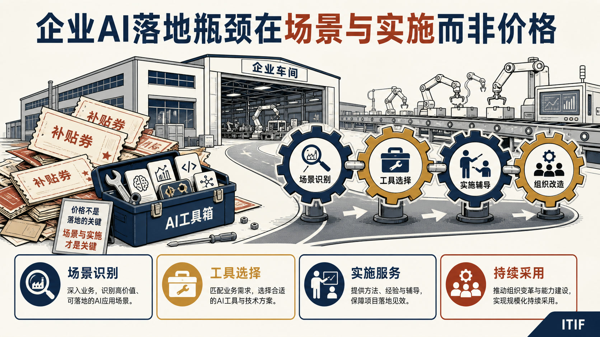
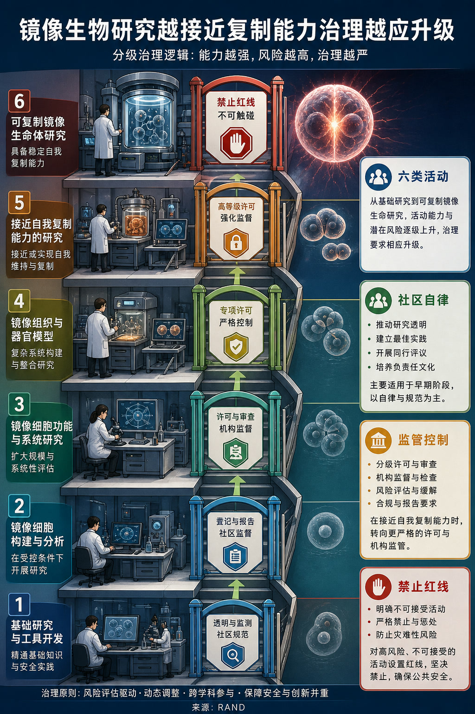
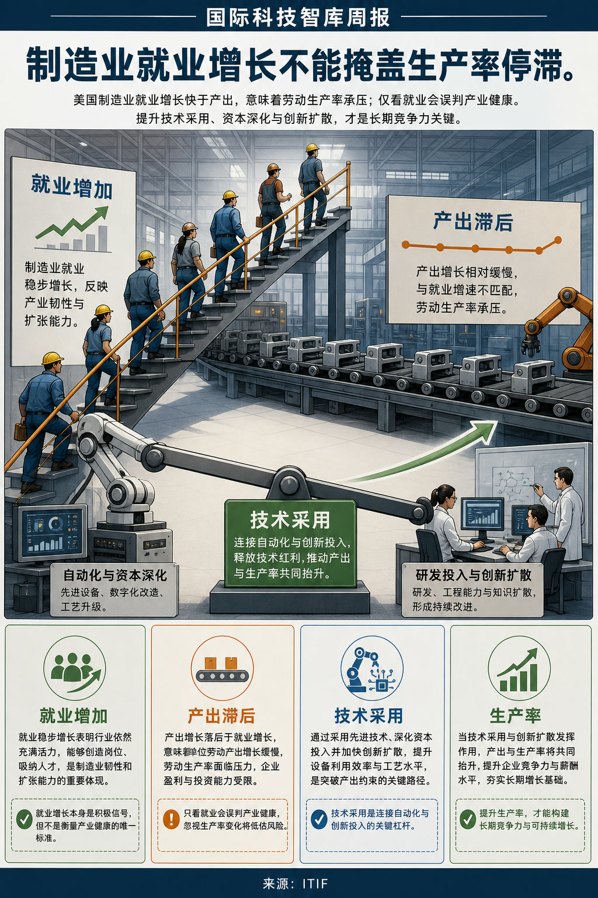

# 国际科技智库周报（2026-08-23）

## 目录

- P.05-06｜[主题 01｜AI时代生物安全需要纵深防御体系](#topic-01)
- P.07-08｜[主题 02｜美国打击跨国网络犯罪备忘录的政企影响](#topic-02)
- P.09-10｜[主题 03｜加拿大AI战略选错了重点企业](#topic-03)
- P.11-12｜[主题 04｜加拿大不能只靠补贴推动AI采用](#topic-04)
- P.13-14｜[主题 05｜镜像生物学研究的分级操作治理框架](#topic-05)
- P.15-16｜[主题 06｜NIH应扩展科研影响评价与激励框架](#topic-06)
- P.17-18｜[主题 07｜美国制造业就业快于产出暴露生产率问题](#topic-07)

## 本周态势

本周形成 7 条 P0/P1 重点，议题集中在AI、数字基础设施与技术治理、科研体系、人才与创新政策。产业链、制造与能源信号 1 条；AI 与数字基础设施信号 4 条。

## 本周必读

1. **[AI时代生物安全需要纵深防御体系](https://www.rand.org/pubs/research_reports/RRA4999-1.html)**
   - **研判**：RAND主张建立纵深防御体系，将模型层安全措施、核酸合成筛查、实验室与供应链控制、公共卫生监测等机制组合使用。
   - **证据**：报告逐项比较不同措施的有效范围、部署条件与可能被规避的方式，并强调需要依据能力进步持续调整防线。
   - **来源**：RAND｜P0｜AI、数字基础设施与技术治理
2. **[美国打击跨国网络犯罪备忘录的政企影响](https://www.csis.org/analysis/presidential-memo-combating-transnational-cybercrime-implications-industry-and-government)**
   - **研判**：文章认为，该举措向对手释放美国将提高网络威慑强度的信号，并把部分行动能力和基础设施协同需求推向私营部门。
   - **证据**：CSIS评析美国总统关于打击跨国网络犯罪的备忘录，关注政府强化进攻性网络行动时企业承担的角色与风险。
   - **来源**：Center for Strategic and International Studies｜P1｜AI、数字基础设施与技术治理
3. **[NIH应扩展科研影响评价与激励框架](https://itif.org/publications/2026/08/19/comments-to-nih-on-measuring-and-rewarding-scientific-impact/)**
   - **研判**：ITIF在提交NIH的意见中认为，以论文和学术引用为中心的评价体系无法完整反映公共科研投入产生的社会与产业影响。
   - **证据**：该方案试图增强科研与产业、临床和人才体系的联系，但也意味着数据归因、时间滞后和不同学科可比性将成为实施难点。
   - **来源**：Information Technology and Innovation Foundation｜P1｜科研体系、人才与创新政策
4. **[加拿大AI战略选错了重点企业](https://itif.org/publications/2026/08/19/canadas-ai-strategy-focuses-on-wrong-firms/)**
   - **研判**：ITIF认为，加拿大AI战略即使完成企业采用率目标，也可能无法兑现生产率增长承诺，因为采用数量不能替代采用深度。
   - **证据**：其判断建立在企业规模、资本投入、数据基础和组织变革能力之间的差异上。
   - **来源**：Information Technology and Innovation Foundation｜P1｜AI、数字基础设施与技术治理
5. **[加拿大不能只靠补贴推动AI采用](https://itif.org/publications/2026/08/17/canada-cant-subsidize-its-way-to-ai-adoption/)**
   - **研判**：ITIF肯定加拿大提高企业AI采用率的目标，但认为政策误把购买成本视为主要障碍。
   - **证据**：文章判断，多数企业更根本的困难在于识别具有商业价值的应用场景，并把工具嵌入既有流程与组织结构。
   - **来源**：Information Technology and Innovation Foundation｜P1｜AI、数字基础设施与技术治理

## 议题观点速览

### AI、数字基础设施与技术治理（4 条）

- **RAND**：RAND主张建立纵深防御体系，将模型层安全措施、核酸合成筛查、实验室与供应链控制、公共卫生监测等机制组合使用。
- **Center for Strategic and International Studies**：文章认为，该举措向对手释放美国将提高网络威慑强度的信号，并把部分行动能力和基础设施协同需求推向私营部门。
- **Information Technology and Innovation Foundation**：ITIF认为，加拿大AI战略即使完成企业采用率目标，也可能无法兑现生产率增长承诺，因为采用数量不能替代采用深度。
- **Information Technology and Innovation Foundation**：ITIF肯定加拿大提高企业AI采用率的目标，但认为政策误把购买成本视为主要障碍。

### 科研体系、人才与创新政策（2 条）

- **RAND**：RAND指出，镜像生物学已被识别为潜在高后果风险，但国际社会尚缺少可实际执行的协同治理安排。
- **Information Technology and Innovation Foundation**：ITIF在提交NIH的意见中认为，以论文和学术引用为中心的评价体系无法完整反映公共科研投入产生的社会与产业影响。

### 产业链、制造与能源基础设施（1 条）

- **Information Technology and Innovation Foundation**：文章将这一趋势与非贸易部门生产率改善形成对照，认为制造业竞争力不能以就业数量单独衡量。

## 主题展开

### 主题 01｜[P0] [AI时代生物安全需要纵深防御体系](https://www.rand.org/pubs/research_reports/RRA4999-1.html)

- **来源**：RAND｜**议题**：AI、数字基础设施与技术治理
- **主题**：AI治理, 科技创新

- **核心判断**：**RAND主张建立纵深防御体系，将模型层安全措施、核酸合成筛查、实验室与供应链控制、公共卫生监测等机制组合使用。**
- **主要论据**：
  - RAND讨论生成式AI降低生物知识与实验能力门槛后，单一控制点难以覆盖从模型访问、设计、合成到实验实施的完整风险链。
  - RAND判断，各项缓释措施均有盲区，但可通过相互补位降低单点失效导致的系统性风险。
  - 报告逐项比较不同措施的有效范围、部署条件与可能被规避的方式，并强调需要依据能力进步持续调整防线。
  - RAND同时指出，过度限制可能压缩正常生物医学研究与创新空间，因此治理应根据风险证据和技术成熟度校准。
- **政策建议**：**RAND建议将模型安全、合成筛查、实验室治理和公共卫生准备纳入统一的纵深防御框架，并通过持续评估修正各层措施之间的空隙。**

### 主题 02｜[P1] [美国打击跨国网络犯罪备忘录的政企影响](https://www.csis.org/analysis/presidential-memo-combating-transnational-cybercrime-implications-industry-and-government)

- **来源**：Center for Strategic and International Studies｜**议题**：AI、数字基础设施与技术治理
- **主题**：国防AI, 数字经济

- **核心判断**：**文章认为，该举措向对手释放美国将提高网络威慑强度的信号，并把部分行动能力和基础设施协同需求推向私营部门。**
- **主要论据**：
  - CSIS评析美国总统关于打击跨国网络犯罪的备忘录，关注政府强化进攻性网络行动时企业承担的角色与风险。
  - 其主要论据是关键网络、威胁情报和大量技术能力掌握在企业手中，政府行动难以脱离政企协作。
  - Center for Strategic and International Studies同时警告，政策效果取决于授权边界、责任分配、信息共享和行动规则能否清晰落地。
  - 企业风险偏好、法律责任和潜在报复风险若未被纳入设计，进攻性行动可能造成执行落差。

### 主题 03｜[P1] [加拿大AI战略选错了重点企业](https://itif.org/publications/2026/08/19/canadas-ai-strategy-focuses-on-wrong-firms/)

- **来源**：Information Technology and Innovation Foundation｜**议题**：AI、数字基础设施与技术治理
- **主题**：AI治理, 数字经济

- **核心判断**：**ITIF认为，加拿大AI战略即使完成企业采用率目标，也可能无法兑现生产率增长承诺，因为采用数量不能替代采用深度。**
- **主要论据**：
  - 文章批评政策资源过度集中于中小企业，而大型企业才具备在复杂流程中规模化部署AI并形成显著生产率收益的能力。
  - 其判断建立在企业规模、资本投入、数据基础和组织变革能力之间的差异上。
  - Information Technology and Innovation Foundation主张将政策重点转向大型企业的深度采用，通过监管确定性和更有利的AI部署税收待遇降低长期投资障碍。
  - 文章并未否认中小企业数字化的重要性，但认为普遍补贴会把“采用”简化为工具购买，难以形成可测量的产出改进。

### 主题 04｜[P1] [加拿大不能只靠补贴推动AI采用](https://itif.org/publications/2026/08/17/canada-cant-subsidize-its-way-to-ai-adoption/)

- **来源**：Information Technology and Innovation Foundation｜**议题**：AI、数字基础设施与技术治理
- **主题**：AI治理, 数字经济

- **核心判断**：**ITIF肯定加拿大提高企业AI采用率的目标，但认为政策误把购买成本视为主要障碍。**
- **主要论据**：
  - 文章判断，多数企业更根本的困难在于识别具有商业价值的应用场景，并把工具嵌入既有流程与组织结构。
  - 单纯补贴采购可能增加软件购买量，却无法保证形成稳定使用、流程改造或生产率提升。
  - Information Technology and Innovation Foundation主张政府把支持方式转向需求诊断、技术选择、实施辅导和示范扩散，帮助企业找到适合自身业务的AI工具。
  - 文章的隐含反方是降低价格仍可能帮助资金不足企业入门，但作者认为缺乏应用能力时补贴的边际效果有限。
- **政策建议**：**文章建议把公共支持从普遍采购补贴转向应用场景识别、实施服务和组织能力建设，并以持续采用和生产率结果检验政策效果。**

### 主题 05｜[P1] [镜像生物学研究的分级操作治理框架](https://www.rand.org/pubs/perspectives/PEA4952-1.html)

- **来源**：RAND｜**议题**：科研体系、人才与创新政策
- **主题**：科技创新

- **核心判断**：**RAND指出，镜像生物学已被识别为潜在高后果风险，但国际社会尚缺少可实际执行的协同治理安排。**
- **主要论据**：
  - RAND依据研究活动距离可自我复制镜像细胞的技术里程碑，将研究划分为六类，并把治理强度设置为社区自律、机构与资助方监督、监管和供应链控制、禁止四级。
  - 其核心原则是风险越接近完整复制能力，责任主体越应从研究共同体外移至国家监管和国际协调层级。
  - RAND强调，分类只描述技术活动与关键屏障的关系，具体治理强度仍需结合潜在收益、可替代路径和证据变化校准。
  - 报告也承认天然手性研究、检测工具和既有镜像组件存在边界问题，过宽控制可能抑制有益研究，过窄控制则会留下能力迁移通道。

### 主题 06｜[P1] [NIH应扩展科研影响评价与激励框架](https://itif.org/publications/2026/08/19/comments-to-nih-on-measuring-and-rewarding-scientific-impact/)

- **来源**：Information Technology and Innovation Foundation｜**议题**：科研体系、人才与创新政策
- **主题**：科技人才

- **核心判断**：**ITIF在提交NIH的意见中认为，以论文和学术引用为中心的评价体系无法完整反映公共科研投入产生的社会与产业影响。**
- **主要论据**：
  - 其建议把新药开发、企业对大学科研的投入、发现向商业和临床成果的转化、国际科研伙伴关系深度以及生物医学人才管线纳入评价。
  - 文章的核心判断是，评价指标决定机构和研究者的激励方向，过窄指标会低估转化、合作和人才培养活动。
  - Information Technology and Innovation Foundation据此主张联邦科研机构建立多维指标体系，并使资助和奖励机制与更广泛的影响结果相连接。
  - 该方案试图增强科研与产业、临床和人才体系的联系，但也意味着数据归因、时间滞后和不同学科可比性将成为实施难点。
- **政策建议**：**意见书建议NIH及其他联邦机构采用覆盖产业产出、临床转化、国际合作和人才管线的多维科研影响评价，并据此调整资助与奖励机制。**

### 主题 07｜[P1] [美国制造业就业快于产出暴露生产率问题](https://itif.org/publications/2026/08/18/us-manufacturing-employment-growing-faster-than-output-thats-a-problem/)

- **来源**：Information Technology and Innovation Foundation｜**议题**：产业链、制造与能源基础设施
- **主题**：先进制造

- **核心判断**：**文章将这一趋势与非贸易部门生产率改善形成对照，认为制造业竞争力不能以就业数量单独衡量。**
- **主要论据**：
  - ITIF指出，美国制造业就业增长快于产出，表明新增劳动投入并未转化为相应的生产率提升。
  - Information Technology and Innovation Foundation判断，，长期产业领导力依赖每名劳动者创造的产出以及企业持续采用先进技术的能力。
  - Information Technology and Innovation Foundation主张政策激励制造商采用自动化、数字化和其他提高生产率的技术，而非把政策目标局限于扩大就业。
  - 文章隐含回应了“制造业岗位增长即复兴”的观点，指出低生产率扩张会削弱工资、投资和国际竞争力的可持续性。
- **政策建议**：**文章建议将制造业支持政策与自动化、数字化和生产率提升挂钩，以产出和效率指标约束单纯追求就业数量的政策偏向。**
