# 国际科技智库周报（2026-09-06）

## 目录

- P.05-06｜[主题 01｜供应链AI依赖正在制造跨企业聚合风险](#topic-01)
- P.07-08｜[主题 02｜美国降低中国原料药依赖的多工具政策组合](#topic-02)
- P.09-10｜[主题 03｜AI受控访问政策可能反向加速无监管扩散](#topic-03)
- P.11-12｜[主题 04｜高风险生命科学研究需要客观可扩展的审查框架](#topic-04)
- P.13-14｜[主题 05｜技术性反蒸馏措施难以单独改变竞争激励](#topic-05)
- P.15-16｜[主题 06｜金融AI监管应以动态监督替代新增刚性规则](#topic-06)
- P.17-18｜[主题 07｜人工智能保险退出正在成为美国AI采用的隐性约束](#topic-07)
- P.19-20｜[主题 08｜太空工业劳动力短缺正在削弱战时重建能力](#topic-08)
- P.21-22｜[主题 09｜应急管理采用AI的瓶颈已从供给转向组织能力](#topic-09)
- P.23-24｜[主题 10｜病毒设计AI能力上升要求前置生物安全护栏](#topic-10)
- P.25-26｜[主题 11｜乌克兰5G拍卖暴露可信供应商融资缺口](#topic-11)
- P.27-28｜[主题 12｜美国引入私营网络攻势需要严格授权边界](#topic-12)
- P.29-30｜[主题 13｜商业航天许可改革应采用风险分级豁免](#topic-13)
- P.31-32｜[主题 14｜美国生物科技企业为何把一期临床试验移往澳大利亚](#topic-14)
- P.33-34｜[主题 15｜太平洋正在决定深海采矿的全球制度走向](#topic-15)
- P.35-36｜[主题 16｜日本并购审查应把创新效率纳入竞争分析](#topic-16)
- P.37-38｜[主题 17｜镜像生命风险需要中美提前建立共同禁区](#topic-17)

## 本周态势

本周形成 17 条 P0/P1 重点，议题集中在AI、数字基础设施与技术治理、产业链、制造与能源基础设施。产业链、制造与能源信号 5 条；AI 与数字基础设施信号 9 条；直接涉华条目 2 条。

## 本周必读

1. **[供应链AI依赖正在制造跨企业聚合风险](https://www.rand.org/pubs/research_reports/RRA5093-1.html)**
   - **研判**：RAND研究AI进入运输、物流、仓储和库存管理后，效率提升如何同时转化为新的运营依赖与保险风险。
   - **证据**：其证据包括文献与事故诉讼梳理、跨行业访谈和结构化情景，重点考察多家企业同时受损的聚合风险。
   - **来源**：RAND｜P0｜产业链、制造与能源基础设施
2. **[美国降低中国原料药依赖的多工具政策组合](https://itif.org/publications/2026/08/31/how-america-reduce-dependence-chinese-active-pharmaceutical-ingredients-apis/)**
   - **研判**：Information Technology and Innovation Foundation认为这种结构源于长期成本导向的离岸外包和上游集中，印度后段合成能力又在很大程度上依赖中国原料。
   - **证据**：FDA药物主文件数据显示，1981年欧洲和美国分别占全球原料药能力的63%和25%，到2024年已降至6%和3%，中国与印度则升至45%和43%。
   - **来源**：Information Technology and Innovation Foundation｜P0｜涉华科技竞争与上海参考
3. **[金融AI监管应以动态监督替代新增刚性规则](https://oecd.ai/en/wonk/can-the-finance-sector-oversee-ai-innovation-while-maintaining-its-rapid-progress)**
   - **研判**：文章讨论信用评分、反欺诈、投顾和客服等金融AI应用扩张后，监管如何同时维护创新速度、消费者利益和市场稳定。
   - **证据**：现实瓶颈包括金融机构AI采用数据不足、模型复杂和不透明、人工监督难以操作，以及公平性、验证和数据治理缺少共同基准。
   - **来源**：OECD.AI Policy Observatory｜P0｜AI、数字基础设施与技术治理
4. **[人工智能保险退出正在成为美国AI采用的隐性约束](https://www.csis.org/analysis/insurance-industrys-retreat-ai-threatens-slow-innovation-and-adoption)**
   - **研判**：Center for Strategic and International Studies认为问题具有结构性：承保人看不到企业使用何种模型、用途与控制措施，因而难以定价道德风险、逆向选择和相关性损失。
   - **证据**：2026年州保险监管机构批准了超过八成的相关免责申请，而对多数企业而言，无法投保的业务往往也无法规模化部署。
   - **来源**：Center for Strategic and International Studies｜P0｜AI、数字基础设施与技术治理
5. **[乌克兰5G拍卖暴露可信供应商融资缺口](https://ecipe.org/insights/ukraine-5g-auction/)**
   - **研判**：文章认为，乌克兰通信政策正在从战时保通转向决定长期网络结构的5G频谱分配，但可信供应商规则与商业投资已出现明显时序错位。
   - **证据**：该国已有三百多个非独立组网5G基站、累计服务约150万用户，主要运营商的试验网大量使用华为设备；固定宽带市场也存在相似的中国设备存量。
   - **来源**：European Centre for International Political Economy｜P1｜产业链、制造与能源基础设施

## 议题观点速览

### AI、数字基础设施与技术治理（4 条）

- **RAND**：报告把AI扩散治理从出口管制、许可和算力控制等供给侧工具，转向用户在受控与无监管渠道之间如何选择的需求侧问题。
- **RAND**：RAND将审查拆分为实验室风险与研究收益、重大负面与正面社会后果等可定义因素，并通过决策树形成较透明的适用性判断。
- **OECD.AI Policy Observatory**：文章讨论信用评分、反欺诈、投顾和客服等金融AI应用扩张后，监管如何同时维护创新速度、消费者利益和市场稳定。
- **Center for Strategic and International Studies**：Center for Strategic and International Studies认为问题具有结构性：承保人看不到企业使用何种模型、用途与控制措施，因而难以定价道德风险、逆向选择和相关性损失。

### 产业链、制造与能源基础设施（4 条）

- **RAND**：RAND研究AI进入运输、物流、仓储和库存管理后，效率提升如何同时转化为新的运营依赖与保险风险。
- **RAND**：报告把美国在近对等冲突后12至24个月内重建太空能力的可行性，直接联系到国防太空工业基础的劳动力储备。
- **European Centre for International Political Economy**：文章认为，乌克兰通信政策正在从战时保通转向决定长期网络结构的5G频谱分配，但可信供应商规则与商业投资已出现明显时序错位。
- **Center for Strategic and International Studies**：太平洋岛国立场高度分化，从主动引资、审慎研究到长期禁采并存，因此区域共识更集中在科学证据、传统知识和跨境影响评估。

### 科研体系、人才与创新政策（4 条）

- **Information Technology and Innovation Foundation**：ITIF支持削减商业航天发射与再入许可中的低效环境审查，但反对FAA拟议规则对不同场址和十三部环境法律作统一豁免。
- **Institute for Progress**：文章把一期临床试验界定为药物开发中最早获得人体证据、同时决定项目能否继续融资的关键节点。
- **Information Technology and Innovation Foundation**：文章援引“倒U形”关系说明，集中度上升在尚未形成垄断时可能提高企业投入高风险研发并回收成本的能力，但并未据此主张所有并购都具有创新收益。
- **RAND**：评论关注由自然生物分子的镜像版本构成、目前尚不存在的“镜像生命”，并把最早可能出现的镜像细菌视为生态与公共卫生高后果风险。

### 涉华科技竞争与上海参考（2 条）

- **Information Technology and Innovation Foundation**：Information Technology and Innovation Foundation认为这种结构源于长期成本导向的离岸外包和上游集中，印度后段合成能力又在很大程度上依赖中国原料。
- **RAND**：其关键判断并非技术措施能否增加一些摩擦，而是这些摩擦能否让理性行为者改为自主建设模型。

## 主题展开

### 主题 01｜[P0] [供应链AI依赖正在制造跨企业聚合风险](https://www.rand.org/pubs/research_reports/RRA5093-1.html)

- **来源**：RAND｜**议题**：产业链、制造与能源基础设施
- **主题**：AI治理, 先进制造, 科技创新

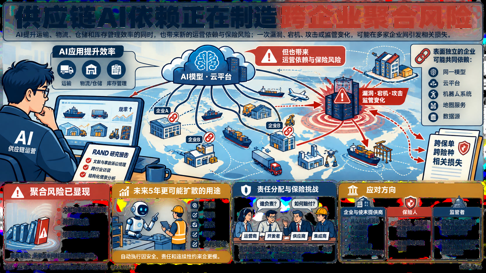

- **核心判断**：**RAND研究AI进入运输、物流、仓储和库存管理后，效率提升如何同时转化为新的运营依赖与保险风险。**
- **主要论据**：
  - 其证据包括文献与事故诉讼梳理、跨行业访谈和结构化情景，重点考察多家企业同时受损的聚合风险。
  - 未来五年最可能扩散的是监测、预测、优化、维护和文档处理等辅助用途，自动执行因安全、责任和连续性约束会更慢。
  - 表面独立的企业可能共同依赖同一模型、云平台、机器人系统、地图服务或数据源，一次漏洞、宕机、攻击或监管变化即可跨保单和险种形成相关损失。
  - 当前责任仍难在运营商、开发者、供应商和集成商之间分配，保险业主要通过条款调整、免责和个案核保应对，尚无稳定方法。
- **政策建议**：**供应链企业和技术提供商应建立AI使用清单、人类监督、来源追踪、运行监测、分阶段部署与可测试的回退程序。** 保险人需把模型、供应商和操作权限纳入核保与累积风险管理；监管者则应区分可由组合管理吸收的相关损失与灾难性风险，并在私人市场承载不足时评估公私保险机制或政府兜底。

### 主题 02｜[P0] [美国降低中国原料药依赖的多工具政策组合](https://itif.org/publications/2026/08/31/how-america-reduce-dependence-chinese-active-pharmaceutical-ingredients-apis/)

- **来源**：Information Technology and Innovation Foundation｜**议题**：涉华科技竞争与上海参考
- **主题**：先进制造, 中国与上海相关, 科技创新

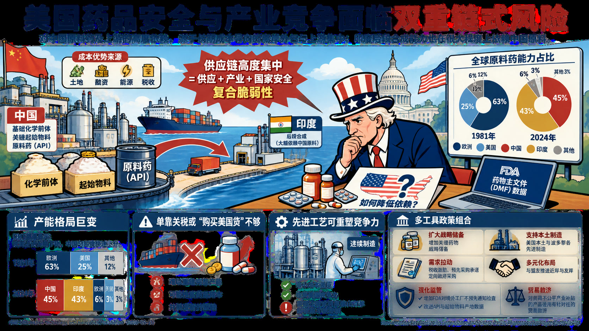

- **核心判断**：**Information Technology and Innovation Foundation认为这种结构源于长期成本导向的离岸外包和上游集中，印度后段合成能力又在很大程度上依赖中国原料。**
- **主要论据**：
  - 报告把美国对中国原料药及其上游关键起始物料的依赖，界定为药品供应、产业竞争和国家安全的复合脆弱性。
  - FDA药物主文件数据显示，1981年欧洲和美国分别占全球原料药能力的63%和25%，到2024年已降至6%和3%，中国与印度则升至45%和43%。
  - 单靠关税或“购买美国货”难以重建完整产能，还可能推高药品成本并制造新的短缺。
  - 连续制造等先进工艺可通过缩小成本差距恢复美国竞争力，但新设施只有获得稳定需求和规模化订单才能持续。
- **政策建议**：**Information Technology and Innovation Foundation建议扩大关键药物战略储备，支持美国本土及波多黎各的先进制造，运用税收激励、预先采购承诺和定向政府采购形成可预期需求，并同盟友推进近岸与友岸多元化。** 监管方面应增加FDA对境外工厂的不预先通知检查、改进原料药和起始物料产地数据，并对获得不公平产业补贴的产品使用有针对性的贸易救济。
- **中国/上海参考**：**报告将中国的基础化学前体、关键起始物料和原料药能力视为美国药品供应链风险的主要来源，并指向土地、融资、能源与税收支持形成的成本优势。** 其数据和政策组合可用于比较生物医药制造能力与供应链韧性的关系；原文没有针对上海的单独判断。

### 主题 03｜[P0] [AI受控访问政策可能反向加速无监管扩散](https://www.rand.org/pubs/research_reports/RRA4996-1.html)

- **来源**：RAND｜**议题**：AI、数字基础设施与技术治理
- **主题**：AI治理, 科技创新

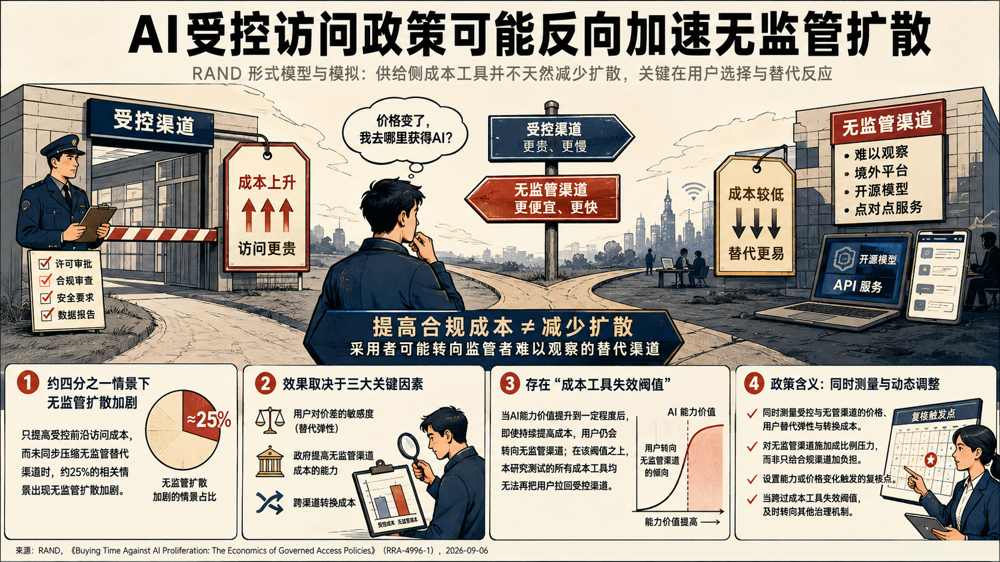

- **核心判断**：**报告把AI扩散治理从出口管制、许可和算力控制等供给侧工具，转向用户在受控与无监管渠道之间如何选择的需求侧问题。**
- **主要论据**：
  - 其形式模型显示，政策改变相对价格后，采用者可能转向监管者不易观察的替代渠道，因此“提高合规成本”并不天然减少扩散。
  - 模拟中，若只提高受控前沿访问成本而没有同步压缩无监管替代渠道，约四分之一的相关情景出现了无监管扩散加剧。
  - 政策效果主要取决于用户对价差的敏感度、政府提高无监管渠道成本的能力，以及跨渠道转换成本。
  - 模型还判断，当AI能力价值高到一定程度后，成本工具将失去把用户拉回受控渠道的作用，所测试政策均无法继续压制无监管访问。
- **政策建议**：**政策设计应同时测量受控与无监管访问的价格、用户替代弹性和转换成本，避免只给合规渠道加负担。** 监管者需要对无监管渠道施加成比例压力，并设置能力或价格变化触发的复核点；当技术价值跨过成本工具失效阈值时，应及时转向其他治理机制。

### 主题 04｜[P0] [高风险生命科学研究需要客观可扩展的审查框架](https://www.rand.org/pubs/working_papers/WRA5251-1.html)

- **来源**：RAND｜**议题**：AI、数字基础设施与技术治理
- **主题**：AI治理, 科技创新

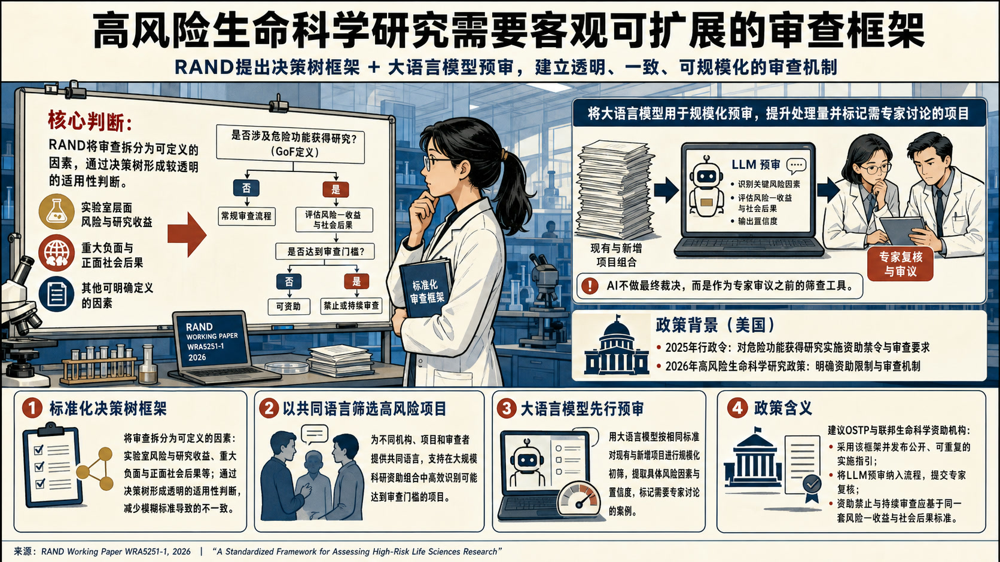

- **核心判断**：**RAND将审查拆分为实验室风险与研究收益、重大负面与正面社会后果等可定义因素，并通过决策树形成较透明的适用性判断。**
- **主要论据**：
  - 这份工作论文回应美国2025年行政令和2026年高风险生命科学研究政策对危险功能获得研究提出的资助禁令与审查要求。
  - 框架旨在减少不同机构、项目和审查者使用模糊标准造成的不一致，也为在大规模科研资助组合中筛选高风险项目提供共同语言。
  - 报告进一步测试用大语言模型按相同标准预审项目，目标是提高处理量并标记需要专家讨论的案例。
  - RAND并未把AI设定为最终裁决者，而是把它放在专家人类审议之前的筛查位置。
- **政策建议**：**RAND建议OSTP和联邦生命科学资助机构采用该危险功能获得研究评估框架，形成公开、可重复的实施指引；同时用大语言模型对现有和新增项目组合进行规模化初筛，把具体风险因素与置信度提交专家复核。** 高风险研究的资助禁止和持续审查应建立在同一套风险—收益与社会后果标准上。

### 主题 05｜[P0] [技术性反蒸馏措施难以单独改变竞争激励](https://www.rand.org/pubs/perspectives/PEA5081-1.html)

- **来源**：RAND｜**议题**：涉华科技竞争与上海参考
- **主题**：AI治理, 中国与上海相关, 数字经济

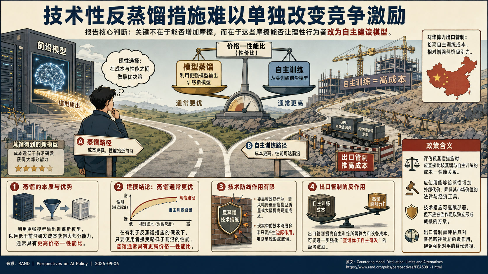

- **核心判断**：**其关键判断并非技术措施能否增加一些摩擦，而是这些摩擦能否让理性行为者改为自主建设模型。**
- **主要论据**：
  - 报告把模型蒸馏界定为利用更强模型输出训练新模型，从而以远低于前沿研发成本获得大部分能力。
  - RAND在有利于反蒸馏措施的假设下建模，仍认为只要使用者接受略低于前沿的性能，蒸馏通常具有更高价格—性能比。
  - 出口管制提高自主训练所需算力和设备成本，可能进一步强化“蒸馏优于自主研发”的经济激励。
  - 降低蒸馏模型质量或提高规避成本需要达到很大幅度，现实中的技术防线多半只能产生边际作用。
- **政策建议**：**RAND建议评估反蒸馏措施时直接比较蒸馏与自主训练的成本—性能关系，并使用能够给蒸馏增加外部代价、降低其市场价值的法律与经济工具。** 技术措施可继续部署，但不应被当作足以独立形成威慑的方案，出口管制也需评估其对替代路径激励的反作用。
- **中国/上海参考**：**报告以中国企业获取美国前沿模型能力为主要竞争情景，并指出对华算力出口管制可能抬高自主训练成本、相对增强蒸馏吸引力。** 这为评估技术封锁与能力替代之间的政策反馈提供了直接证据；原文没有上海层面的讨论。

### 主题 06｜[P0] [金融AI监管应以动态监督替代新增刚性规则](https://oecd.ai/en/wonk/can-the-finance-sector-oversee-ai-innovation-while-maintaining-its-rapid-progress)

- **来源**：OECD.AI Policy Observatory｜**议题**：AI、数字基础设施与技术治理
- **主题**：AI治理, 科技创新

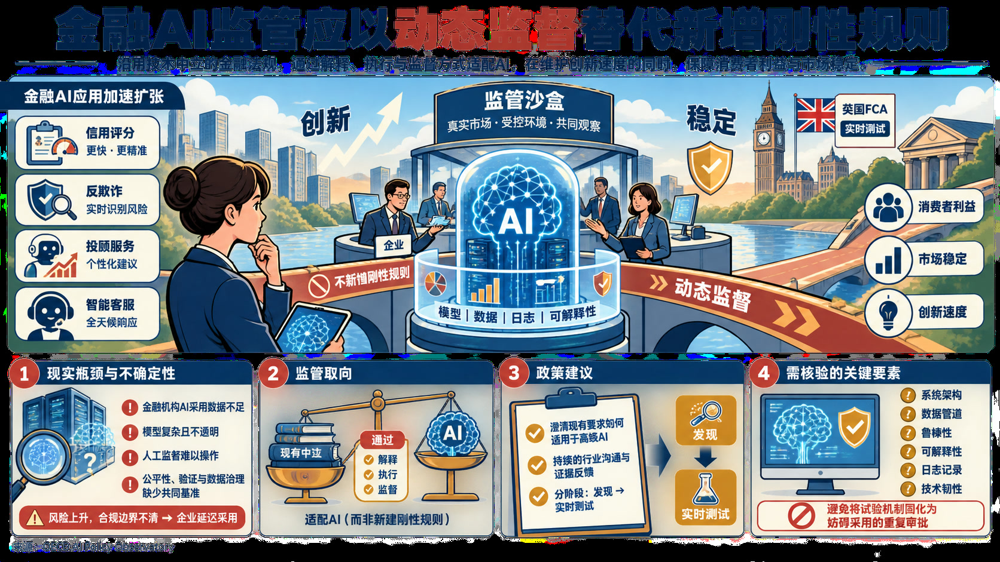

- **核心判断**：**文章讨论信用评分、反欺诈、投顾和客服等金融AI应用扩张后，监管如何同时维护创新速度、消费者利益和市场稳定。**
- **主要论据**：
  - OECD.AI Policy Observatory倾向沿用技术中立的金融法规，通过解释、执行和监督方式适配AI，而非先建立一套刚性的新规则。
  - 现实瓶颈包括金融机构AI采用数据不足、模型复杂和不透明、人工监督难以操作，以及公平性、验证和数据治理缺少共同基准。
  - 这些不确定性既增加风险，也会让企业因合规边界不清而延迟采用。
  - 文章以英国金融行为监管局的AI实时测试为例，主张让监管者与企业在真实但受控的市场环境中共同观察系统行为、证据和控制措施。
- **政策建议**：**文章建议金融监管者优先澄清现有模型风险管理、验证、监测和治理要求如何适用于高级AI，建立持续的行业沟通与证据反馈机制，并采用分阶段的发现—实时测试流程。** 监管需要核验系统架构、数据管道、鲁棒性、可解释性、日志与技术韧性，同时避免把试验机制固化为妨碍采用的重复审批。

### 主题 07｜[P0] [人工智能保险退出正在成为美国AI采用的隐性约束](https://www.csis.org/analysis/insurance-industrys-retreat-ai-threatens-slow-innovation-and-adoption)

- **来源**：Center for Strategic and International Studies｜**议题**：AI、数字基础设施与技术治理
- **主题**：AI治理, 科技创新

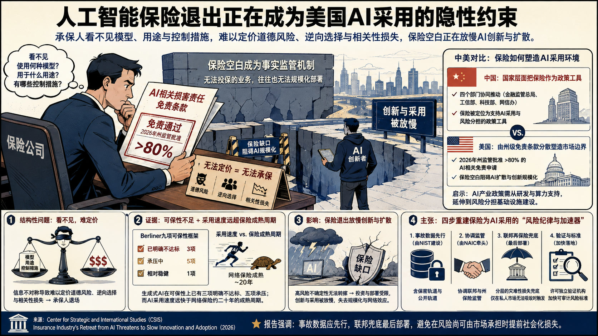

- **核心判断**：**Center for Strategic and International Studies认为问题具有结构性：承保人看不到企业使用何种模型、用途与控制措施，因而难以定价道德风险、逆向选择和相关性损失。**
- **主要论据**：
  - 报告把保险公司大规模排除AI相关损害责任，界定为影响美国AI扩散的事实监管机制。
  - 2026年州保险监管机构批准了超过八成的相关免责申请，而对多数企业而言，无法投保的业务往往也无法规模化部署。
  - 按照保险业长期采用的Berliner九项可保性框架，生成式AI已有三项明确不达标、另有五项承压；AI采用速度又远快于网络保险约二十年的成熟周期。
  - Center for Strategic and International Studies主张把保险重新塑造成技术采用的风险纪律和加速器，同时不照搬欧洲合规模式或中国国有保险模式。
- **政策建议**：**报告提出四项按顺序推进的工具：由NIST建设含保密与公开轨道的AI事故数据库；由全美保险监督官协会协调联邦与州监管；预先设计分层的灾难性损失联邦兜底，但仅在私人市场无法吸收时触发；许可独立验证机构并加快可审计风险标准。** 作者强调事故数据应先行，联邦兜底最后部署，以免在风险尚可由市场承担时提前社会化损失。
- **中国/上海参考**：**报告明确比较称，中国已由四个部门把保险作为推动AI采用的政策工具，而美国仍由州级免责条款分散塑造市场边界。** 这一比较可用于观察AI产业政策如何从研发与算力支持延伸到风险分担基础设施；原文未涉及上海层面的制度安排。

### 主题 08｜[P0] [太空工业劳动力短缺正在削弱战时重建能力](https://www.rand.org/pubs/research_reports/RRA3665-2.html)

- **来源**：RAND｜**议题**：产业链、制造与能源基础设施
- **主题**：先进制造, 科技创新

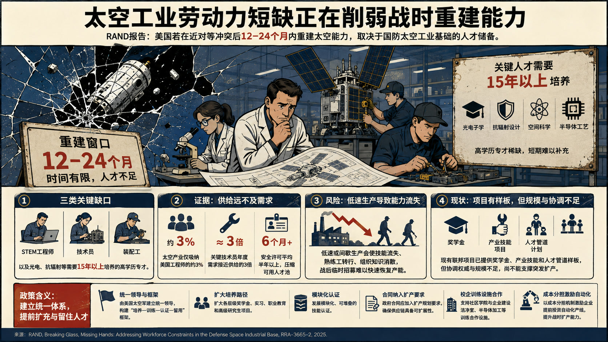

- **核心判断**：**报告把美国在近对等冲突后12至24个月内重建太空能力的可行性，直接联系到国防太空工业基础的劳动力储备。**
- **主要论据**：
  - 三类关键缺口分别是STEM工程师、技术员与装配工，以及光电和抗辐射等需要十五年以上培养的高学历专才。
  - 劳工统计与企业访谈显示，太空产业只吸纳约3%的美国工程师，关键技术员年度需求接近合格供给的三倍，安全许可平均半年以上又压缩了可用人才池。
  - 报告强调，低速或间歇生产会使技能流失、熟练工转行和组织知识消散，战争后再临时招募难以恢复产能。
  - 现有联邦项目提供了奖学金、产业技能和人才管道样板，但协调权威与规模不足，尚不能支撑突发扩产。
- **政策建议**：**RAND建议由美国太空军建立统一领导和“培养—训练—认证—留用”框架，扩大各层级奖学金、实习、职业教育和高级研究生项目，并发展模块化、可堆叠的技能认证。** 政府合同应加入扩产规划要求，支持社区学院与企业建设洁净室、半导体加工等训练合作，并以成本分担激励自动化产线提前部署。

### 主题 09｜[P1] [应急管理采用AI的瓶颈已从供给转向组织能力](https://www.rand.org/pubs/commentary/2026/09/when-disaster-strikes-could-ai-help-qa-with-jessica.html)

- **来源**：RAND｜**议题**：AI、数字基础设施与技术治理
- **主题**：AI治理, 科技创新

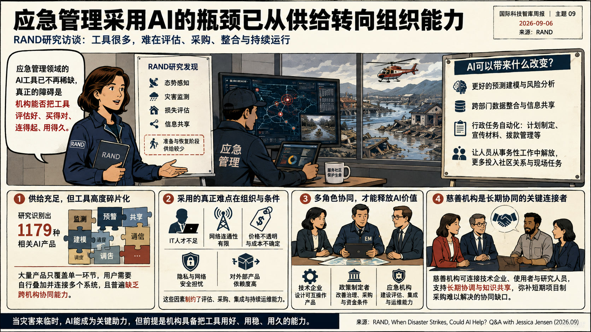

- **核心判断**：**访谈基于RAND对应研究，认为应急管理AI的主要瓶颈已经从“有没有工具”转向机构能否评估、采购、整合并持续运行工具。**
- **主要论据**：
  - 研究识别出1179种相关产品，多集中于态势感知、灾害监测、损失评估和信息共享，准备与恢复阶段供给较少。
  - 大量产品只解决单一环节，用户需要自行叠加并连接多个系统，且普遍缺乏跨机构协同能力。
  - AI可改善预测建模、跨部门数据整合，也能承担计划、宣传材料和拨款管理等行政工作，使人员转向社区关系与现场任务。
  - 真正制约采用的因素包括IT人才、网络连通性、价格透明度、隐私和网络安全，以及对外部产品的依赖。
- **政策建议**：**技术企业应围绕应急管理流程设计可互操作产品，并公开价格、接入与技术要求；政策制定者需改善治理、采购和资金条件；应急机构则应建设产品评估、集成和持续运维能力。** 慈善机构可承担连接技术企业、使用者与研究人员的长期协调角色，弥补短期项目制采购难以解决的协同缺口。

### 主题 10｜[P1] [病毒设计AI能力上升要求前置生物安全护栏](https://www.rand.org/pubs/commentary/2026/09/ai-can-now-design-viruses-we-need-biosecurity-guardrails.html)

- **来源**：RAND｜**议题**：AI、数字基础设施与技术治理
- **主题**：AI治理, 科技创新

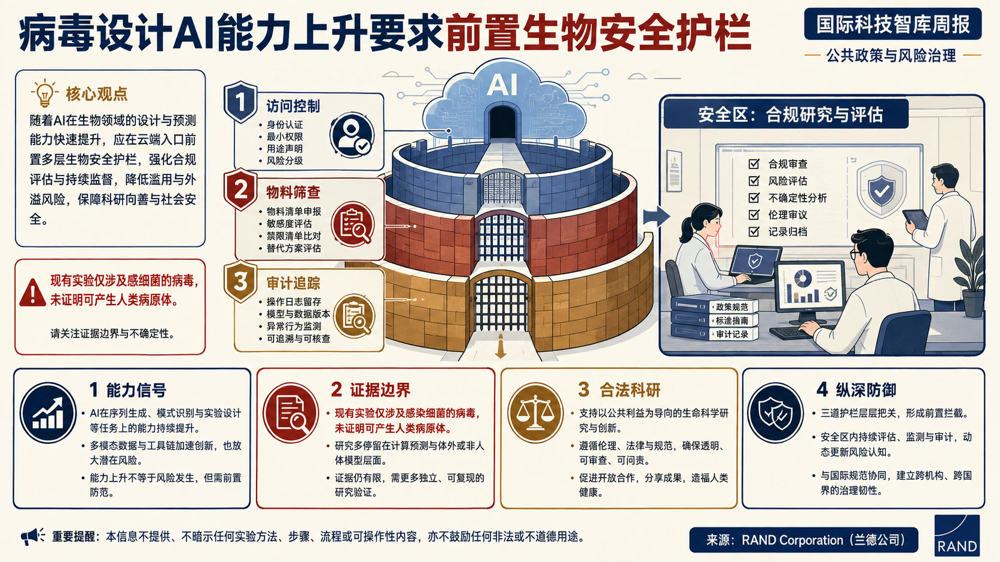

- **核心判断**：**文章主张在能力成熟前限制恶意行为者取得关键工具、数据和材料，并建设能够提高攻击成本和发现概率的纵深防御。**
- **主要论据**：
  - 评论以一项《科学》论文为能力信号：受训练的AI模型已能设计可感染细菌的新型病毒，显示生物设计正从分析辅助走向生成能力。
  - 该实验没有制造人类病原体，因而不能直接证明AI已能产生可传播的人类生物武器；作者把它视为需要提前治理的方向性证据。
  - 风险变化在于，历史生物恐怖袭击多使用不具人际传播性的毒素或病原体，而可设计病毒可能把单点伤害扩展为持续传播事件。
  - 其立场同时保留科研边界：治理目标是继续允许正当病毒学与生物技术研究，同时阻断AI对武器化设计和生产的帮助。
- **政策建议**：**RAND建议对可用于病毒设计与生产的高风险工具、训练数据和物料设置访问限制，并把核酸合成筛查、可追溯性、异常检测及威慑机制组合成前置防线。** 规则应围绕具体危险能力和使用场景设置，避免把所有AI辅助生物研究一概纳入禁区。

### 主题 11｜[P1] [乌克兰5G拍卖暴露可信供应商融资缺口](https://ecipe.org/insights/ukraine-5g-auction/)

- **来源**：European Centre for International Political Economy｜**议题**：产业链、制造与能源基础设施
- **主题**：先进制造, 科技治理

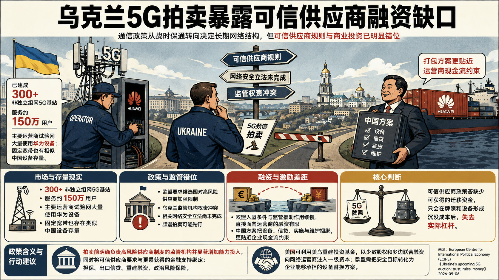

- **核心判断**：**文章认为，乌克兰通信政策正在从战时保通转向决定长期网络结构的5G频谱分配，但可信供应商规则与商业投资已出现明显时序错位。**
- **主要论据**：
  - 该国已有三百多个非独立组网5G基站、累计服务约150万用户，主要运营商的试验网大量使用华为设备；固定宽带市场也存在相似的中国设备存量。
  - 欧盟要求候选国对高风险供应商加强限制，但乌克兰监管机构之间权责冲突，相关网络安全立法尚未完成，频谱拍卖却可能先行。
  - European Centre for International Political Economy指出，欧盟的入盟条件和监管援助作用缓慢，直接面向运营商的融资有限；中国方案则把设备、信贷、实施与维护捆绑，更贴近企业现金流约束。
  - 由此形成的核心判断是，可信供应商政策若缺少可获得的迁移资金，只会在牌照和设备形成沉没成本后失去实际杠杆。
- **政策建议**：**European Centre for International Political Economy建议在拍卖前明确负责高风险供应商制度的监管机构并显著增加其能力投入，同时把可信供应商要求同更易获得的担保、出口信贷、重建融资和政治风险保险绑定。** 美国可利用美乌重建投资基金，以少数股权和多边联合融资向网络运营商注入一级资本；欧盟则需把安全目标转化为企业能够承担的设备替换方案。
- **中国/上海参考**：**文章将华为在乌克兰的设备存量、融资便利性和俄乌战争后的市场安排作为直接比较对象，揭示供应链安全政策能否落地取决于替代融资与迁移成本。** 该证据可用于研究中国通信设备企业在重建市场中的综合竞争方式；原文没有上海层面的建议。

### 主题 12｜[P1] [美国引入私营网络攻势需要严格授权边界](https://itif.org/publications/2026/09/04/us-should-harness-private-sector-cyber-power-responsibly/)

- **来源**：Information Technology and Innovation Foundation｜**议题**：AI、数字基础设施与技术治理
- **主题**：国防AI, 数字经济

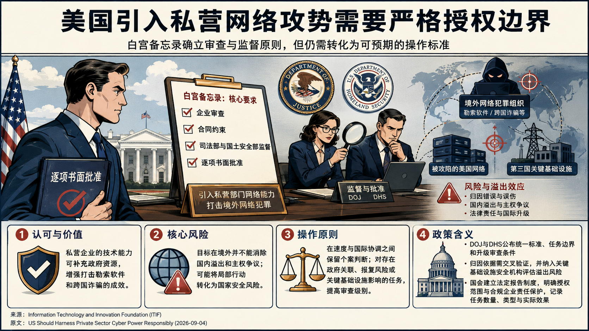

- **核心判断**：**白宫备忘录已要求企业审查、合同约束、司法部和国土安全部监督及逐项书面批准，文章认为这些原则仍需转化为可预期的操作标准。**
- **主要论据**：
  - Information Technology and Innovation Foundation评估美国政府允许经审查企业对境外网络犯罪组织实施进攻性行动的新机制。
  - Information Technology and Innovation Foundation认可私营企业的技术能力可补充政府打击勒索软件和跨国诈骗的资源，但强调网络归因错误、误伤合法系统、法律责任和国际升级都可能把局部行动转化为国家安全风险。
  - 由于犯罪组织可能使用被攻陷的美国网络或第三国关键基础设施，目标位于境外并不能消除国内溢出和主权争议。
  - 文章支持在速度与国际协调之间保留个案判断，对存在政府关联、报复风险或关键基础设施影响的任务提高审查级别。
- **政策建议**：**Information Technology and Innovation Foundation建议司法部和国土安全部公布统一的参与标准、任务边界和升级审查条件，要求对归因依据作交叉验证，并让关键基础设施安全机构参与溢出风险评估。** 国会应建立法定报告制度，明确授权范围和合规企业的责任保护，同时记录任务数量、类型和实际效果。

### 主题 13｜[P1] [商业航天许可改革应采用风险分级豁免](https://itif.org/publications/2026/08/31/comments-federal-aviation-administration-commercial-space-launch-reentry-actions/)

- **来源**：Information Technology and Innovation Foundation｜**议题**：科研体系、人才与创新政策
- **主题**：科技创新

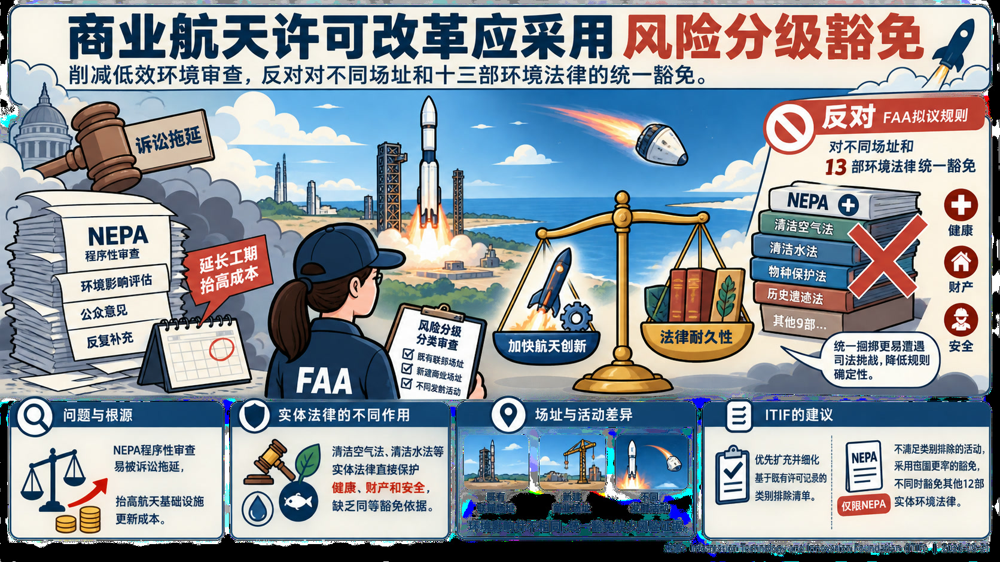

- **核心判断**：**ITIF支持削减商业航天发射与再入许可中的低效环境审查，但反对FAA拟议规则对不同场址和十三部环境法律作统一豁免。**
- **主要论据**：
  - 文章认为，NEPA的程序性审查容易被诉讼拖延，确实会抬高航天基础设施更新成本；清洁空气法、清洁水法等实体法律则直接保护健康、财产和安全，缺乏同等豁免依据。
  - 将这些法律同NEPA捆绑处理，会使原本可辩护的许可改革更易遭遇司法挑战，反而降低企业需要的规则确定性。
  - 既有联邦场址、新建商业场址和不同发射活动的环境影响并不相同，统一豁免也缺少风险证据。
  - 文章的中心立场是在加快航天创新与维持法律耐久性之间采取分级改革，而非以最大幅度放松监管衡量成效。
- **政策建议**：**ITIF建议FAA优先扩充并细化基于既有许可记录的类别排除清单，对不满足类别排除条件的活动再采用范围更窄、仅限NEPA的豁免。** 场址和活动应依据已知环境影响分别审查，不应同时豁免其他十二部实体环境法律。

### 主题 14｜[P1] [美国生物科技企业为何把一期临床试验移往澳大利亚](https://ifp.org/why-biotech-companies-go-to-australia-to-test-new-drugs/)

- **来源**：Institute for Progress｜**议题**：科研体系、人才与创新政策
- **主题**：科技创新

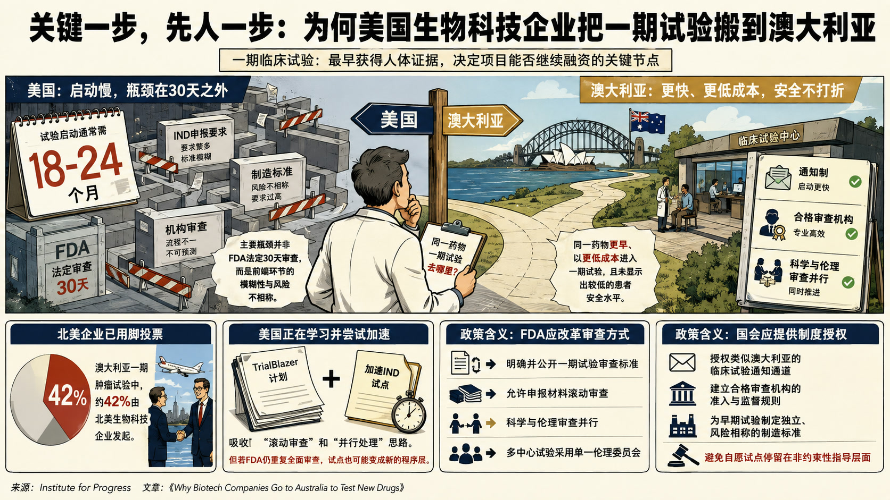

- **核心判断**：**文章把一期临床试验界定为药物开发中最早获得人体证据、同时决定项目能否继续融资的关键节点。**
- **主要论据**：
  - 美国试验启动通常需要18至24个月，主要瓶颈并非FDA法定30天审查，而是IND申报要求、制造标准和机构审查环节存在模糊性与风险不相称。
  - 澳大利亚通过通知制、合格审查机构以及科学和伦理审查并行，使同一药物能够更早、以更低成本进入一期试验，并未显示出较低的患者安全水平。
  - 北美企业已用脚投票，澳大利亚一期肿瘤试验中约42%由北美生物科技企业发起。
  - 美国“TrialBlazer”及加速IND试点吸收了滚动审查和并行处理思路，但若FDA仍重复全面审查，试点也可能变成新的程序层。
- **政策建议**：**文章建议FDA明确并公开一期试验审查标准，允许申报材料滚动审查、科学与伦理审查并行，并推动多中心试验采用单一伦理委员会。** 国会还需授权类似澳大利亚的临床试验通知通道，建立合格审查机构的准入与监督规则，并为早期试验制定独立、风险相称的制造标准，避免自愿试点停留在非约束性指导层面。

### 主题 15｜[P1] [太平洋正在决定深海采矿的全球制度走向](https://www.csis.org/analysis/pacific-ground-zero-deep-sea-mining)

- **来源**：Center for Strategic and International Studies｜**议题**：产业链、制造与能源基础设施
- **主题**：先进制造

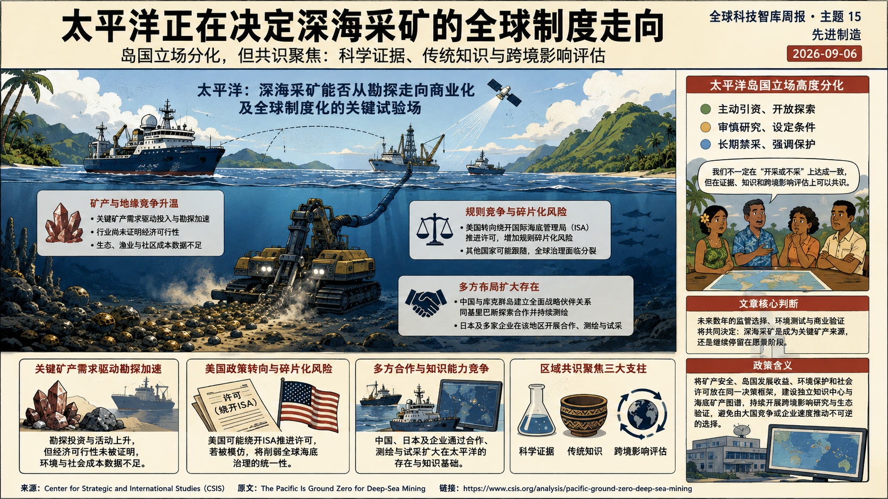

- **核心判断**：**太平洋岛国立场高度分化，从主动引资、审慎研究到长期禁采并存，因此区域共识更集中在科学证据、传统知识和跨境影响评估。**
- **主要论据**：
  - 文章把太平洋视为深海采矿能否从勘探走向商业化及全球制度化的关键试验场。
  - 关键矿产竞争、美国政策转向和企业投资已推动实际勘探，但行业尚未证明经济可行性，生态、渔业和社区成本也缺少充分数据。
  - 美国可能绕开国际海底管理局推进许可，增加了规则碎片化和其他国家跟随的风险；中国、日本及多家企业则通过合作、测绘和试采扩大在该地区的存在。
  - 文章没有给出支持或反对开采的单一结论，而是认为未来数年的监管选择、环境测试和商业验证将共同决定深海采矿是成为关键矿产来源，还是继续停留在愿景阶段。
- **政策建议**：**文章提出的可操作方向包括建设独立区域知识中心、海底矿产图谱和跨境影响研究，并在许可前持续验证生态与商业可行性。** 其政策含义是将矿产安全、岛国发展收益、环境保护和社会许可放进同一决策框架，避免仅由大国竞争或企业投资速度推动不可逆选择。
- **中国/上海参考**：**文章列举中国与库克群岛建立全面战略伙伴关系、同基里巴斯探索合作并持续开展海底测绘，说明中国在太平洋关键矿产竞争中同时运用外交合作与知识能力积累。** 该材料可支撑对深海资源治理和关键矿产供应链的比较研究，原文未提出上海层面的政策建议。

### 主题 16｜[P1] [日本并购审查应把创新效率纳入竞争分析](https://itif.org/publications/2026/08/31/comments-to-jftc-regarding-the-revised-guidelines-to-application-of-the-antimonopoly-act-business-combination/)

- **来源**：Information Technology and Innovation Foundation｜**议题**：科研体系、人才与创新政策
- **主题**：科技创新

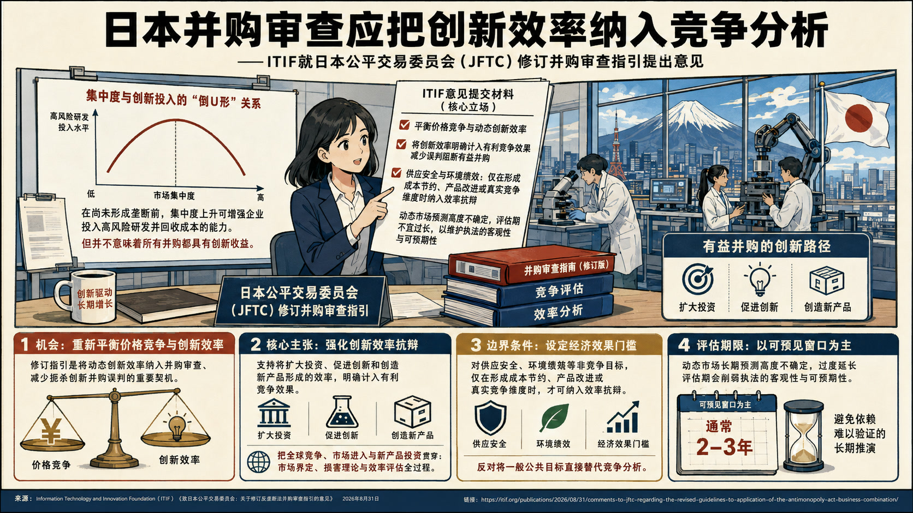

- **核心判断**：**文章援引“倒U形”关系说明，集中度上升在尚未形成垄断时可能提高企业投入高风险研发并回收成本的能力，但并未据此主张所有并购都具有创新收益。**
- **主要论据**：
  - 这份意见把日本公平交易委员会修订并购审查指引视为重新平衡价格竞争与动态创新效率的机会。
  - ITIF支持将扩大投资、促进创新和创造新产品形成的效率明确计入有利竞争效果，以减少阻断有益并购的误判。
  - 对于供应安全和环境绩效，作者要求只有在形成成本节约、产品改进或真实竞争维度时才纳入效率抗辩，反对把一般公共目标直接替代竞争分析。
  - 文章也警告，动态市场的长期预测高度不确定，过度延长评估期会削弱执法的客观性和可预期性。
- **政策建议**：**ITIF建议保留并强化创新效率抗辩，把全球竞争、市场进入和新产品投资贯穿于市场界定、损害理论与效率评估；对环境、韧性等非竞争目标设定经济效果门槛；并以通常两至三年的可预见窗口为主，避免依赖难以验证的长期市场推演。**

### 主题 17｜[P1] [镜像生命风险需要中美提前建立共同禁区](https://www.rand.org/pubs/commentary/2026/08/mirror-life-is-theoretical-the-danger-is-anything-but.html)

- **来源**：RAND｜**议题**：科研体系、人才与创新政策
- **主题**：科技创新

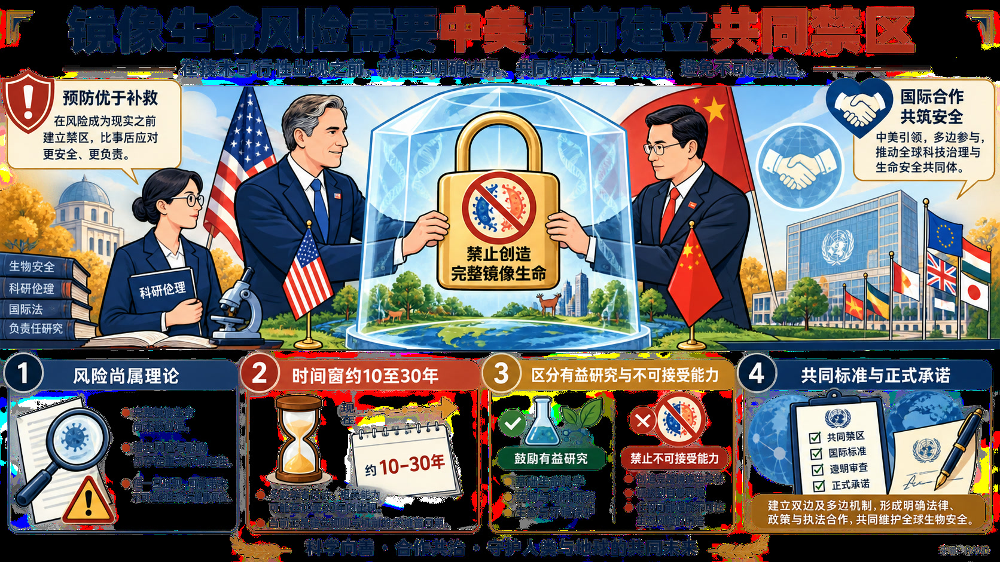

- **核心判断**：**评论关注由自然生物分子的镜像版本构成、目前尚不存在的“镜像生命”，并把最早可能出现的镜像细菌视为生态与公共卫生高后果风险。**
- **主要论据**：
  - 镜像生物或许能逃避免疫系统、酶和捕食性微生物等自然约束，一旦逸出可能同时影响人类、动物、植物和生态系统。
  - 相关工具可用于制造更耐降解的医药分子，但镜像核糖体等中间突破也可能成为创造完整镜像生命的关键台阶。
  - RAND估计真正能力窗口仍有约10至30年，且掌握所需技术的科学家很少，因此当前仍存在通过科研共同体约束能力路径的机会。
  - 文章主张禁止创造镜像生命，同时通过协商区分有益镜像分子研究与不可接受的能力积累。
- **政策建议**：**RAND建议中美首先发表共同原则，明确镜像生命不是合法科研目标，组织科学家制定伦理标准和研究边界，并进一步形成正式的不研发承诺及经济、物流障碍。** 具体边界应优先讨论镜像核糖体等兼具医学价值与能力跃迁风险的节点，寻找不推进完整镜像生命的替代技术路线。
- **中国/上海参考**：**文章直接建议中美元首把预防镜像生命纳入双边议程，并以共同标准、科研约束和正式协议建立全球禁区。** 这可作为高后果生物技术中“竞争关系下有限合作”的议题样本；原文没有上海层面的实施建议。
