# 国际科技智库周报（2026-09-13）

## 目录

- P.05-06｜[主题 01｜中国地方竞逐量子技术商业化](#topic-01)
- P.07-08｜[主题 02｜推进军事人工智能的人类控制](#topic-02)
- P.09-10｜[主题 03｜中国人工智能目标与欧洲的战略选择](#topic-03)
- P.11-12｜[主题 04｜公共采购与人工智能治理：中等强国的战略框架](#topic-04)
- P.13-14｜[主题 05｜为量子计算的物理需求建设适配基础设施](#topic-05)
- P.15-16｜[主题 06｜欧洲创新法案：强化创新单一市场](#topic-06)
- P.17-18｜[主题 07｜以创新为导向制定人工智能政策：GTIPA各国视角](#topic-07)
- P.19-20｜[主题 08｜企业增加人工智能投资后年均生产率增速约高一个百分点](#topic-08)
- P.21-22｜[主题 09｜中国或将引领量子技术研究，民主国家须加快行动](#topic-09)
- P.23-24｜[主题 10｜十亿美元芯片：谁还能负担未来设计](#topic-10)
- P.25-26｜[主题 11｜华盛顿仍未正视中国的技术经济挑战](#topic-11)
- P.27-28｜[主题 12｜安全部门治理与管理中的新兴技术](#topic-12)
- P.29-30｜[主题 13｜AI数据中心的网络安全薄弱环节：支撑运行的操作技术](#topic-13)
- P.31-32｜[主题 14｜学校人工智能宜“慢下来才能快起来”的三个理由](#topic-14)
- P.33-34｜[主题 15｜技术乐观与政策焦虑：智库如何看待技术、贸易与地缘政治](#topic-15)
- P.35-36｜[主题 16｜跨大西洋次国家创新竞争力指数3.0](#topic-16)
- P.37-38｜[主题 17｜全球科学外交变化下中日韩科技合作的可持续路径](#topic-17)
- P.39-40｜[主题 18｜量子战争尚未打响：战略窗口正在关闭](#topic-18)
- P.41-42｜[主题 19｜传统劳动力数据跟不上“前沿经济”新职业](#topic-19)
- P.43-44｜[主题 20｜阻止数据中心建设，社区会失去什么](#topic-20)

## 本周态势

本周形成 20 条 P0/P1 重点，议题集中在AI、数字基础设施与技术治理、涉华科技竞争与上海参考。产业链、制造与能源信号 4 条；AI 与数字基础设施信号 11 条；直接涉华条目 5 条。

## 本周必读

1. **[中国地方竞逐量子技术商业化](https://merics.org/index%2Ephp/en/comment/provinces-race-commercialize-quantum-technology-research)**
   - **研判**：MERICS认为，中国地方政府正在以应用场景、产业基金和首用补贴推动尚未成熟的量子技术从实验室走向市场，这延续了地方竞争式产业政策。
   - **证据**：广东提出覆盖医疗、海洋与金融科技的100个场景，广州开展心血管筛查和药物分子模拟试点，上海对首批商业化产品给予最高2000万元支持，四川、湖北和北京也投入不同规模的政府资本。
   - **来源**：MERICS Industrial Policy and Technology｜P0｜涉华科技竞争与上海参考
2. **[推进军事人工智能的人类控制](https://www.brookings.edu/articles/advancing-human-control-of-military-ai/)**
   - **研判**：文章汇集美中二轨对话参与者的两种视角，试图把两国关于核武器始终由人类控制的共识扩展到更广泛的军事人工智能。
   - **证据**：美方作者重点警告，AI 驱动的网络能力若误攻核指挥、控制与通信系统或关键基础设施，可能在信息不确定和时间压力下触发升级，因此发起此类攻击的决定必须由人作出。
   - **来源**：Brookings Center for Technology Innovation｜P0｜涉华科技竞争与上海参考
3. **[公共采购与人工智能治理：中等强国的战略框架](https://www.rand.org/pubs/research_reports/RRA5284-1.html)**
   - **研判**：RAND把“AI中等强国”界定为具备经济、外交、安全或监管能力，却依赖美中前沿模型供应商的国家，并分析公共采购能否成为治理这种依赖的工具。
   - **证据**：报告识别三类由政府买方承担的突出风险：供应商锁定与断供、无法独立评估模型能力，以及数据主权和信息安全问题。
   - **来源**：RAND｜P0｜AI、数字基础设施与技术治理
4. **[为量子计算的物理需求建设适配基础设施](https://www.csis.org/analysis/building-quantum-ready-infrastructure-preparing-physical-demands-quantum-computing)**
   - **研判**：文章承认技术路线和资源需求存在高度不确定性，主张用多情景估算和早期部署数据逐步修正规划，而不是押注单一路线。
   - **证据**：超导和硅自旋路线依赖稀释制冷、氦-3、低温电子与专门制造，中性原子和离子阱路线则更依赖超高真空、稳定激光和精密光学，因此不存在一套通用设施蓝图。
   - **来源**：Center for Strategic and International Studies｜P0｜产业链、制造与能源基础设施
5. **[欧洲创新法案：强化创新单一市场](https://research-and-innovation.ec.europa.eu/strategy/support-policy-making/shaping-eu-research-and-innovation-policy/european-innovation-act_en)**
   - **研判**：欧盟委员会把《欧洲创新法案》定位为将科研卓越转化为产业领导力的首个跨境、跨行业创新制度框架，目标是补上从实验室到市场、从初创企业到规模化企业的制度断点。
   - **证据**：JRC事前评估估计三项改革十年累计可增加约2560亿至4520亿欧元GDP、峰值增加23.8万至50.7万个岗位，但结果取决于政策实施效果和模型假设，不能视为确定收益。
   - **来源**：European Commission Research Innovation and Technology Strategy｜P0｜产业链、制造与能源基础设施

## 议题观点速览

### AI、数字基础设施与技术治理（4 条）

- **RAND**：RAND把“AI中等强国”界定为具备经济、外交、安全或监管能力，却依赖美中前沿模型供应商的国家，并分析公共采购能否成为治理这种依赖的工具。
- **Information Technology and Innovation Foundation**：GTIPA的总体立场是，只要治理得当，AI可以推动增长与发展，并主张民主国家在开放、透明、责任和创新之间形成共同框架。
- **Information Technology and Innovation Foundation**：ITIF转述一项NBER工作论文的结果：2018—2024年，企业中AI岗位占比增长一个标准差，与六年累计销售额劳动生产率高6.2个百分点、全要素生产率高7.5个百分点相关，折算约为每年多一个百分点。
- **RAND**：RAND认为，这些工具可提高效率、态势感知、透明度和可追溯性，但也会带来隐私与数据保护、算法偏差、黑箱决策、网络安全、数据主权、数字排斥和供应商依赖等跨场景风险。

### 涉华科技竞争与上海参考（4 条）

- **MERICS Industrial Policy and Technology**：MERICS认为，中国地方政府正在以应用场景、产业基金和首用补贴推动尚未成熟的量子技术从实验室走向市场，这延续了地方竞争式产业政策。
- **Brookings Center for Technology Innovation**：文章汇集美中二轨对话参与者的两种视角，试图把两国关于核武器始终由人类控制的共识扩展到更广泛的军事人工智能。
- **Bruegel**：Bruegel认为，中国在“十五五”中同时追求人工智能自主可控、国内市场保护、开放权重模型国际扩散和全球治理合作，这些目标并非相互矛盾，而是围绕中国居于创新、采用、标准和平台中心的一体化战略。
- **Australian Strategic Policy Institute**：ASPI依据其关键技术追踪器判断，中国在量子通信和后量子密码的高影响力研究上已居领先位置，在量子传感方面也占据优势，美国目前只在量子计算等少数领域保持领先。

### 科研体系、人才与创新政策（4 条）

- **Information Technology and Innovation Foundation**：人工智能与生物技术融合、量子计算和聚变被认为可能取得显著进展，网络安全投入不足和绿色技术部署缓慢则形成跨国共识。
- **Information Technology and Innovation Foundation**：报告的核心判断是，国家战略若忽视地区间人才、产业、基础设施和资本条件差异，就难以形成有效创新政策；但综合排名受指标可得性、估算方法和权重选择影响，宜用于识别结构短板而非简单贴标签。
- **Science and Technology Policy Institute Korea**：STEPI认为，美中竞争、俄乌战争和科学安全化正在把中日韩科技合作从一般交流推向“竞合并存”的结构。
- **Australian Strategic Policy Institute**：Australian Strategic Policy Institute认为，澳大利亚把量子政策的时间表绑定于容错量子计算机成熟，是误判了眼前的军事技术窗口。

### 产业链、制造与能源基础设施（3 条）

- **Center for Strategic and International Studies**：文章承认技术路线和资源需求存在高度不确定性，主张用多情景估算和早期部署数据逐步修正规划，而不是押注单一路线。
- **European Commission Research Innovation and Technology Strategy**：欧盟委员会把《欧洲创新法案》定位为将科研卓越转化为产业领导力的首个跨境、跨行业创新制度框架，目标是补上从实验室到市场、从初创企业到规模化企业的制度断点。
- **Center for Strategic and International Studies**：Center for Strategic and International Studies指出，美国半导体政策长期偏重制造能力，却低估了前沿芯片设计成本快速上升带来的上游集中风险。

## 主题展开

### 主题 01｜[P0] [中国地方竞逐量子技术商业化](https://merics.org/index%2Ephp/en/comment/provinces-race-commercialize-quantum-technology-research)

- **来源**：MERICS Industrial Policy and Technology｜**议题**：涉华科技竞争与上海参考
- **主题**：中国与上海相关, 科技创新, 先进制造

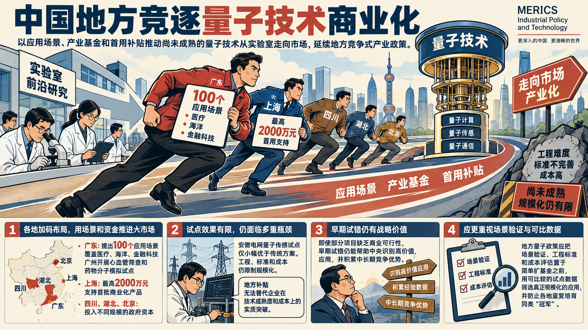

- **核心判断**：**MERICS认为，中国地方政府正在以应用场景、产业基金和首用补贴推动尚未成熟的量子技术从实验室走向市场，这延续了地方竞争式产业政策。**
- **主要论据**：
  - 广东提出覆盖医疗、海洋与金融科技的100个场景，广州开展心血管筛查和药物分子模拟试点，上海对首批商业化产品给予最高2000万元支持，四川、湖北和北京也投入不同规模的政府资本。
  - 文章并不认为这些试验都会成功：量子传感在安徽电网试点中仅小幅优于传统方案，工程、标准和成本仍限制规模化。
  - MERICS Industrial Policy and Technology判断，，即使部分项目缺乏商业可行性，早期试错仍能帮助中央识别高价值应用并积累中长期竞争优势；反方约束在于，地方补贴无法替代企业在技术成熟度和成本上的实质突破。
- **政策建议**：**地方量子政策应把场景验证、工程标准和成本评估置于简单扩基金之前，用可比较的试点数据筛选真正可规模化的应用，并防止各地重复培育同类“冠军”。**
- **中国/上海参考**：**文章直接提到上海量子计算枢纽以最高2000万元支持首批产品落地，可作为研究上海“首用—场景—产业化”工具的外部观察样本；但材料未评估补贴绩效，不能据此判断项目已经商业成功。**

### 主题 02｜[P0] [推进军事人工智能的人类控制](https://www.brookings.edu/articles/advancing-human-control-of-military-ai/)

- **来源**：Brookings Center for Technology Innovation｜**议题**：涉华科技竞争与上海参考
- **主题**：中国与上海相关, AI治理, 国防AI

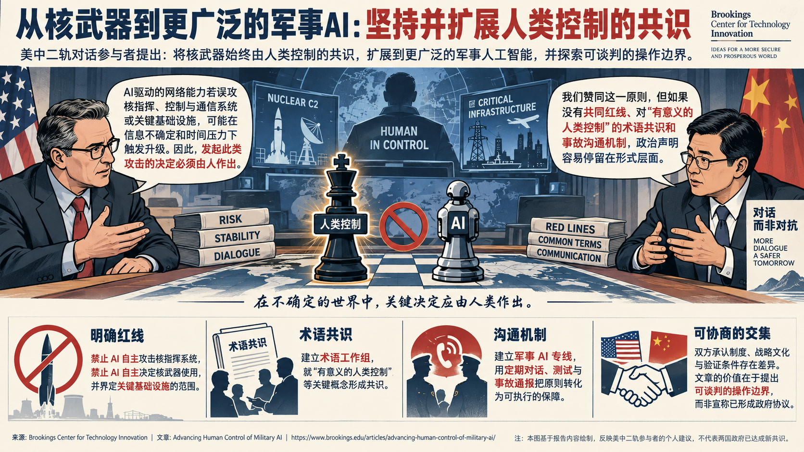

- **核心判断**：**文章汇集美中二轨对话参与者的两种视角，试图把两国关于核武器始终由人类控制的共识扩展到更广泛的军事人工智能。**
- **主要论据**：
  - 美方作者重点警告，AI 驱动的网络能力若误攻核指挥、控制与通信系统或关键基础设施，可能在信息不确定和时间压力下触发升级，因此发起此类攻击的决定必须由人作出。
  - 中方作者赞同原则，但强调如果没有共同红线、对“有意义的人类控制”的术语共识和事故沟通机制，政治声明容易停留在形式层面。
  - 双方共同承认制度、战略文化与验证条件存在差异，因而文章的价值在于提出可谈判的操作边界，而非宣称已经形成政府协议。
- **政策建议**：**美中列出禁止 AI 自主攻击核指挥系统、禁止 AI 自主决定核武器使用等红线，界定关键基础设施范围，建立术语工作组和军事 AI 专线，并用定期对话、测试与事故通报把人类控制原则转化为可执行保障。**
- **中国/上海参考**：**材料直接呈现美中学者对军事 AI 风险边界的可协商交集，但属于二轨参与者个人建议，不能归因为两国政府已达成的新共识。**

### 主题 03｜[P0] [中国人工智能目标与欧洲的战略选择](https://www.bruegel.org/analysis/chinas-artificial-intelligence-goals-and-strategic-choices-europe)

- **来源**：Bruegel｜**议题**：涉华科技竞争与上海参考
- **主题**：AI治理, 中国与上海相关, 科技创新

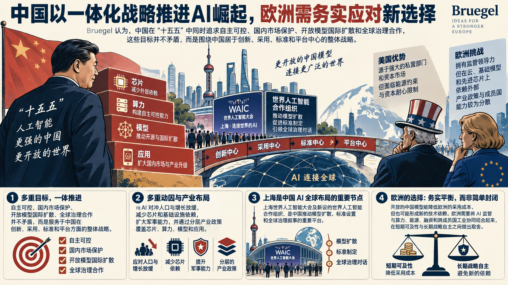

- **核心判断**：**Bruegel认为，中国在“十五五”中同时追求人工智能自主可控、国内市场保护、开放权重模型国际扩散和全球治理合作，这些目标并非相互矛盾，而是围绕中国居于创新、采用、标准和平台中心的一体化战略。**
- **主要论据**：
  - 其动因包括用 AI 对冲人口与增长放缓、减少芯片和基础设施依赖、扩大军事能力，并通过分层产业政策覆盖芯片、算力、模型和应用。
  - 文章对比指出，美国优势来自私营部门和资本市场，但受能源与资本耐心约束；欧盟虽有监管领导力，却在云、基础模型和先进芯片上依赖外部，且产业政策与成员国能力较为分散。
  - Bruegel警告，开放的中国模型既能降低欧洲采用成本，也可能形成新的技术依赖，因此欧洲的选择不能简化为监管或封闭，而要处理算力、产业协同与战略自主之间的取舍。
- **政策建议**：**欧洲需要把 AI 监管与算力、能源、融资和跨成员国工业协同结合起来，同时评估采用中国开放模型所带来的短期可及性与长期依赖风险。**
- **中国/上海参考**：**文章把上海世界人工智能大会及新设的世界人工智能合作组织视为中国推动模型扩散、标准设置和全球治理叙事的重要平台；这一判断可用于观察上海在国家 AI 外部合作布局中的节点作用。**

### 主题 04｜[P0] [公共采购与人工智能治理：中等强国的战略框架](https://www.rand.org/pubs/research_reports/RRA5284-1.html)

- **来源**：RAND｜**议题**：AI、数字基础设施与技术治理
- **主题**：AI治理, 科技创新

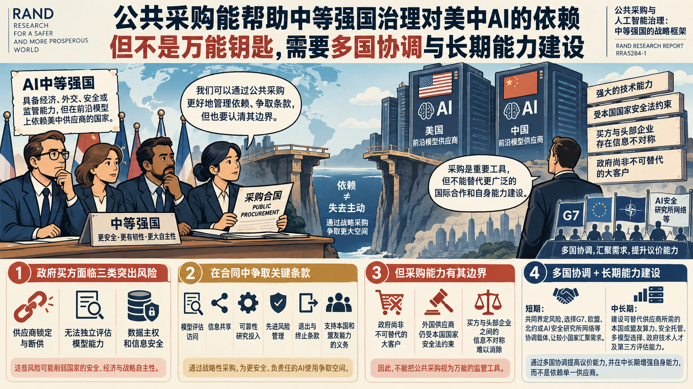

- **核心判断**：**RAND把“AI中等强国”界定为具备经济、外交、安全或监管能力，却依赖美中前沿模型供应商的国家，并分析公共采购能否成为治理这种依赖的工具。**
- **主要论据**：
  - 报告识别三类由政府买方承担的突出风险：供应商锁定与断供、无法独立评估模型能力，以及数据主权和信息安全问题。
  - RAND提出在合同中争取模型评估访问、信息共享、可靠性研究投入、先进风险管理、退出与终止条款，以及支持本国和盟友能力的义务。
  - 报告同时强调采购能力有边界：政府尚非不可替代的大客户，外国供应商仍受本国国家安全法约束，买方与头部企业之间的信息不对称也难以消除；其结论因此是通过多国协调提高议价能力，而非把采购视为万能监管。
- **政策建议**：**短期应共同界定风险、选择G7、欧盟、北约或AI安全研究所网络等协调载体，并让较小国家汇聚需求；中长期应建设可替换供应商所需的本国或盟友算力、安全托管、多模型选择、政府技术人才及第三方评估能力。**

### 主题 05｜[P0] [为量子计算的物理需求建设适配基础设施](https://www.csis.org/analysis/building-quantum-ready-infrastructure-preparing-physical-demands-quantum-computing)

- **来源**：Center for Strategic and International Studies｜**议题**：产业链、制造与能源基础设施
- **主题**：AI治理, 科技创新, 先进制造

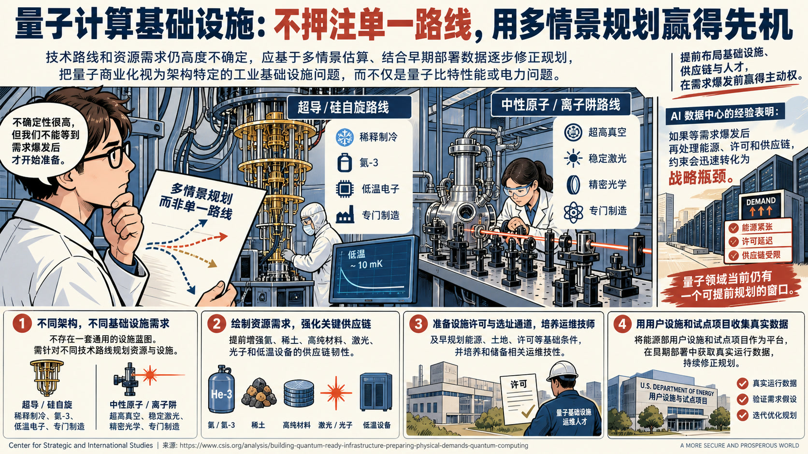

- **核心判断**：**文章承认技术路线和资源需求存在高度不确定性，主张用多情景估算和早期部署数据逐步修正规划，而不是押注单一路线。**
- **主要论据**：
  - Center for Strategic and International Studies将量子商业化界定为架构特定的工业基础设施问题，而不仅是量子比特性能或电力问题。
  - 超导和硅自旋路线依赖稀释制冷、氦-3、低温电子与专门制造，中性原子和离子阱路线则更依赖超高真空、稳定激光和精密光学，因此不存在一套通用设施蓝图。
  - 人工智能数据中心的经验说明，如果等需求爆发后再处理能源、许可和供应链，约束会迅速转化为战略瓶颈；量子领域当前仍有一个可提前规划的窗口。
- **政策建议**：**美国应绘制不同架构的资源需求，提前增强氦、稀土、高纯材料、激光、光子和低温设备供应链，准备设施许可与选址通道，培养运维技师，并把能源部用户设施和试点项目作为收集真实运行数据的平台。**

### 主题 06｜[P0] [欧洲创新法案：强化创新单一市场](https://research-and-innovation.ec.europa.eu/strategy/support-policy-making/shaping-eu-research-and-innovation-policy/european-innovation-act_en)

- **来源**：European Commission Research Innovation and Technology Strategy｜**议题**：产业链、制造与能源基础设施
- **主题**：科技创新, 数字经济, 先进制造

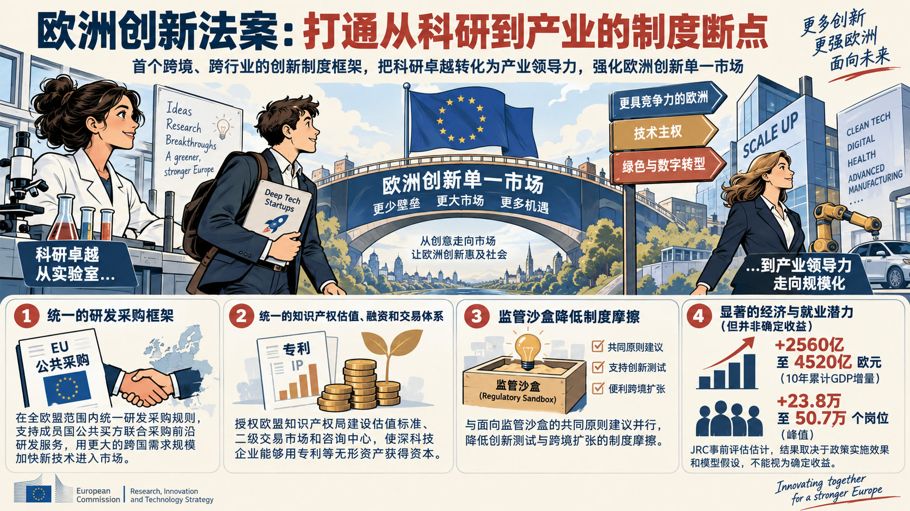

- **核心判断**：**欧盟委员会把《欧洲创新法案》定位为将科研卓越转化为产业领导力的首个跨境、跨行业创新制度框架，目标是补上从实验室到市场、从初创企业到规模化企业的制度断点。**
- **主要论据**：
  - 拟议法规集中处理两个障碍：建立欧盟统一的研发采购框架，以法律确定性和跨国需求规模加快新技术进入市场；建立统一的知识产权估值、融资和交易体系，使深科技企业能够用专利等无形资产获得资本。
  - 法案与面向监管沙盒的共同原则建议并行，并被置于欧盟初创与规模化战略、竞争力指南针和技术主权议程之下。
  - JRC事前评估估计三项改革十年累计可增加约2560亿至4520亿欧元GDP、峰值增加23.8万至50.7万个岗位，但结果取决于政策实施效果和模型假设，不能视为确定收益。
- **政策建议**：**欧盟拟统一研发采购规则，支持成员国公共买方联合采购前沿研发服务；授权欧盟知识产权局建设估值标准、二级交易市场和咨询中心，并用监管沙盒降低创新测试与跨境扩张的制度摩擦。**

### 主题 07｜[P0] [以创新为导向制定人工智能政策：GTIPA各国视角](https://itif.org/publications/2026/09/08/gtipa-perspectives-making-ai-policy-to-drive-innovation/)

- **来源**：Information Technology and Innovation Foundation｜**议题**：AI、数字基础设施与技术治理
- **主题**：AI治理, 科技创新

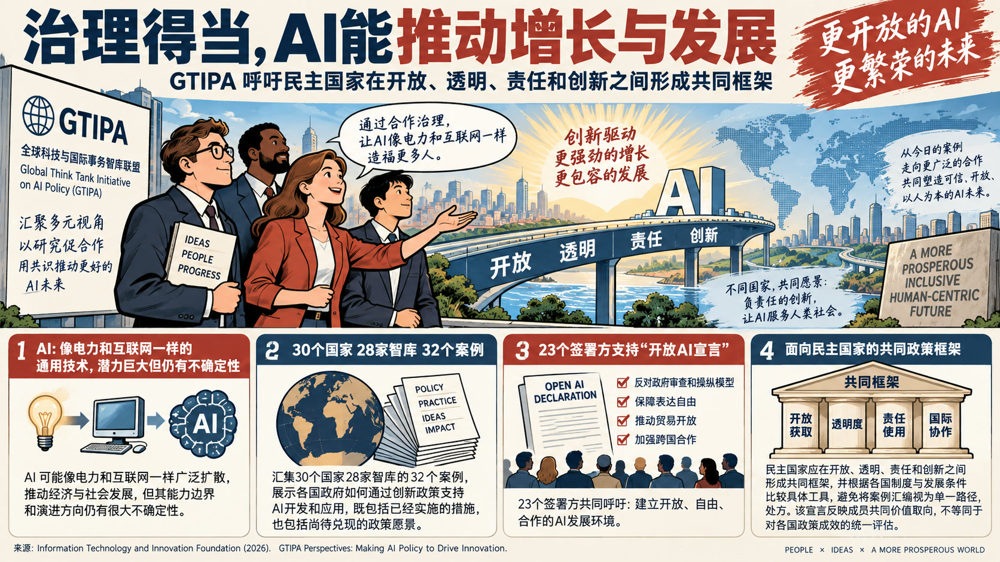

- **核心判断**：**GTIPA的总体立场是，只要治理得当，AI可以推动增长与发展，并主张民主国家在开放、透明、责任和创新之间形成共同框架。**
- **主要论据**：
  - 报告把人工智能视为可能像电力和互联网一样广泛扩散的通用技术，但同时承认其能力边界和演进方向仍有很大不确定性。
  - 它汇集30个国家28家智库的32个案例，展示各国政府如何通过创新政策支持AI开发和应用，既包括已经实施的措施，也包括尚待兑现的政策愿景。
  - 报告附带23个签署方支持的“开放AI宣言”，反对政府审查和操纵模型，强调表达自由、贸易开放和跨国合作；这一规范性立场反映联盟成员的共同价值取向，不等同于对各国政策成效的统一评估。
- **政策建议**：**民主国家围绕开放获取、透明度、责任使用和国际协作建立AI政策框架，同时根据各国制度与发展条件比较具体工具，避免把案例汇编当作单一路径处方。**

### 主题 08｜[P1] [企业增加人工智能投资后年均生产率增速约高一个百分点](https://itif.org/publications/2026/09/08/investing-more-ai-experienced-roughly-one-percentage-point-productivity-growth-per-year/)

- **来源**：Information Technology and Innovation Foundation｜**议题**：AI、数字基础设施与技术治理
- **主题**：AI治理, 科技创新

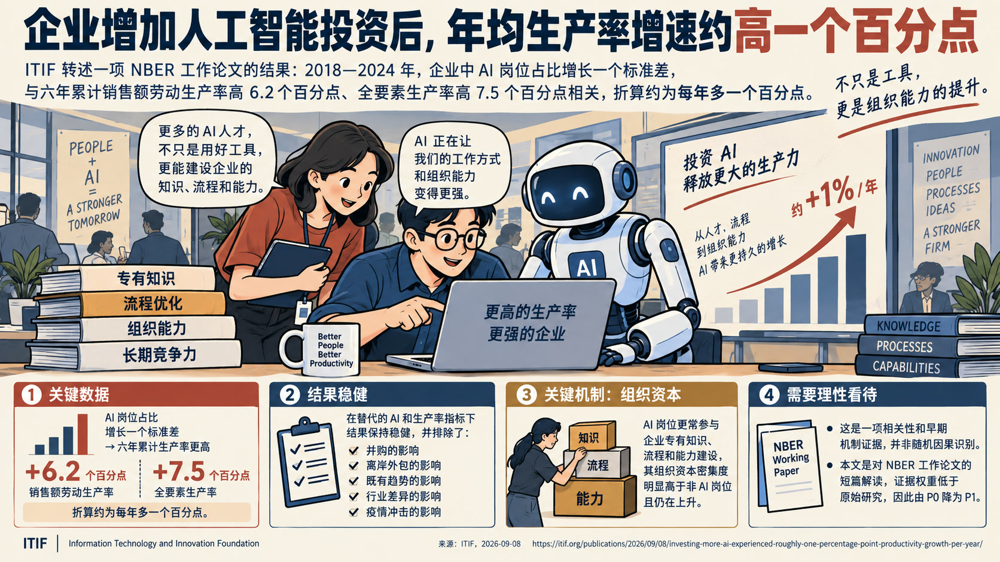

- **核心判断**：**ITIF转述一项NBER工作论文的结果：2018—2024年，企业中AI岗位占比增长一个标准差，与六年累计销售额劳动生产率高6.2个百分点、全要素生产率高7.5个百分点相关，折算约为每年多一个百分点。**
- **主要论据**：
  - 研究在替代AI和生产率指标下保持稳健，并排除了并购、离岸外包、既有趋势、行业差异和疫情冲击等解释。
  - Information Technology and Innovation Foundation把“组织资本”视为关键机制：AI岗位更常参与企业专有知识、流程和能力建设，其组织资本密集度明显高于非AI岗位且仍在上升。
  - 这一材料提供的是相关性和早期机制证据，并非随机因果识别；同时它是对工作论文的短篇解读，证据权重低于原始研究，因此由P0降为P1。
- **政策建议**：**短文未提出独立政策方案；可验证的启示是，评估企业AI投入不能只看软件或算力，还应跟踪岗位结构、流程重组和组织资本积累。**

### 主题 09｜[P1] [中国或将引领量子技术研究，民主国家须加快行动](https://www.aspistrategist.org.au/china-is-poised-to-lead-in-research-on-quantum-technologies-democracies-must-act/)

- **来源**：Australian Strategic Policy Institute｜**议题**：涉华科技竞争与上海参考
- **主题**：中国与上海相关, 科技创新

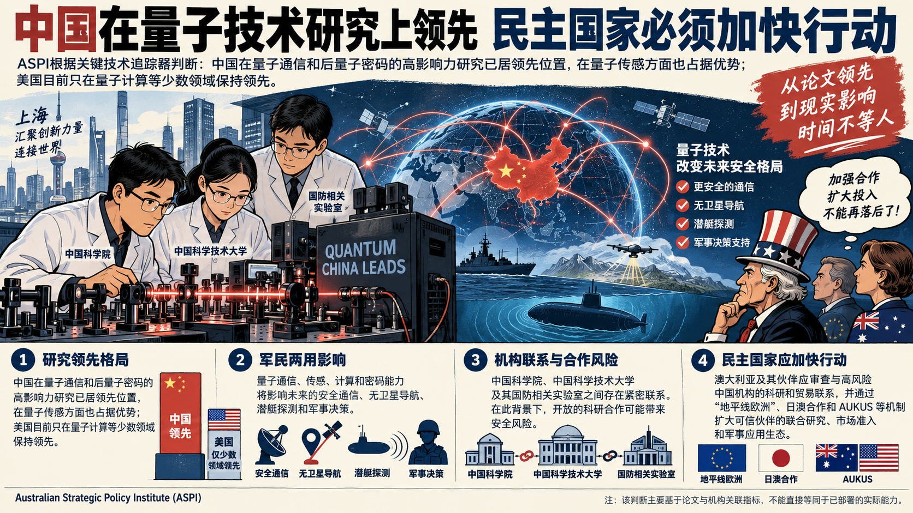

- **核心判断**：**ASPI依据其关键技术追踪器判断，中国在量子通信和后量子密码的高影响力研究上已居领先位置，在量子传感方面也占据优势，美国目前只在量子计算等少数领域保持领先。**
- **主要论据**：
  - 文章把这些科研指标与军民两用应用相联系，认为量子通信、传感、计算和密码能力将影响安全通信、无卫星导航、潜艇探测和军事决策。
  - Australian Strategic Policy Institute尤其强调中国科学院、中国科学技术大学及其国防相关实验室之间的联系，并据此把开放科研合作视为潜在安全风险。
  - 其结论是，民主国家若仅依靠零散限制而不扩大可信伙伴之间的科研、资本和产业合作，可能在量子研究转化阶段失去主动权；但该判断主要来自论文与机构关联指标，不能直接等同于已部署的实际能力。
- **政策建议**：**澳大利亚及其伙伴应一方面审查与高风险中国机构的科研和贸易联系，另一方面通过“地平线欧洲”、日澳合作和 AUKUS 等机制扩大可信伙伴的联合研究、市场准入和军事应用生态。**
- **中国/上海参考**：**该文提供的是 ASPI 以高影响力论文、H 指数和机构关系构建的涉华竞争判断，适合用于观察国外对中国量子科研优势和军民两用风险的叙事；引用时应保留其安全立场与指标局限。**

### 主题 10｜[P1] [十亿美元芯片：谁还能负担未来设计](https://www.csis.org/analysis/billion-dollar-chip-who-can-afford-design-future)

- **来源**：Center for Strategic and International Studies｜**议题**：产业链、制造与能源基础设施
- **主题**：半导体, 科技创新

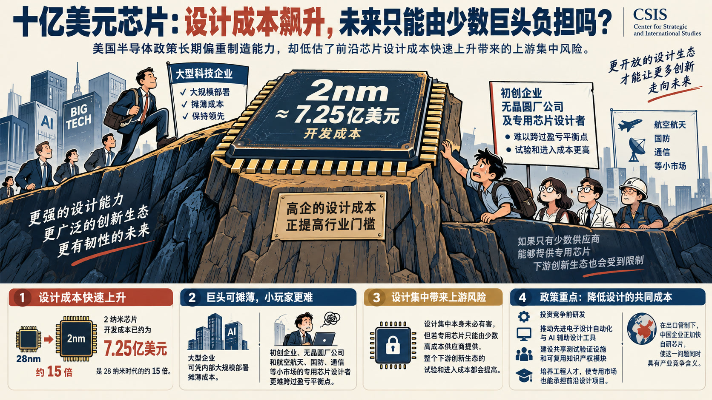

- **核心判断**：**Center for Strategic and International Studies指出，美国半导体政策长期偏重制造能力，却低估了前沿芯片设计成本快速上升带来的上游集中风险。**
- **主要论据**：
  - 2 纳米芯片开发成本已约为 7.25 亿美元，是 28 纳米时代的约 15 倍；巨头可凭内部大规模部署摊薄成本，初创企业、无晶圆厂公司和航空航天、国防、通信等小市场的专用芯片设计者却更难跨过盈亏平衡点。
  - 设计集中本身未必有害，但若专用芯片只能由少数高成本供应商提供，整个下游创新生态的试验和进入成本都会提高。
  - Center for Strategic and International Studies因此把政策目标从“维持既有企业结构”转向“降低设计的共同成本”，并指出中国企业在出口管制下加快自研芯片，使这一问题同时具有产业竞争含义。
- **政策建议**：**投资竞争前研发、先进电子设计自动化与 AI 辅助设计工具、共享测试验证设施、可复用知识产权模块和工程人才，使专用市场也能承担前沿设计项目。**

### 主题 11｜[P1] [华盛顿仍未正视中国的技术经济挑战](https://itif.org/publications/2026/09/10/washington-is-still-in-denial-about-chinas-techno-economic-challenge/)

- **来源**：Information Technology and Innovation Foundation｜**议题**：涉华科技竞争与上海参考
- **主题**：中国与上海相关, 科技创新

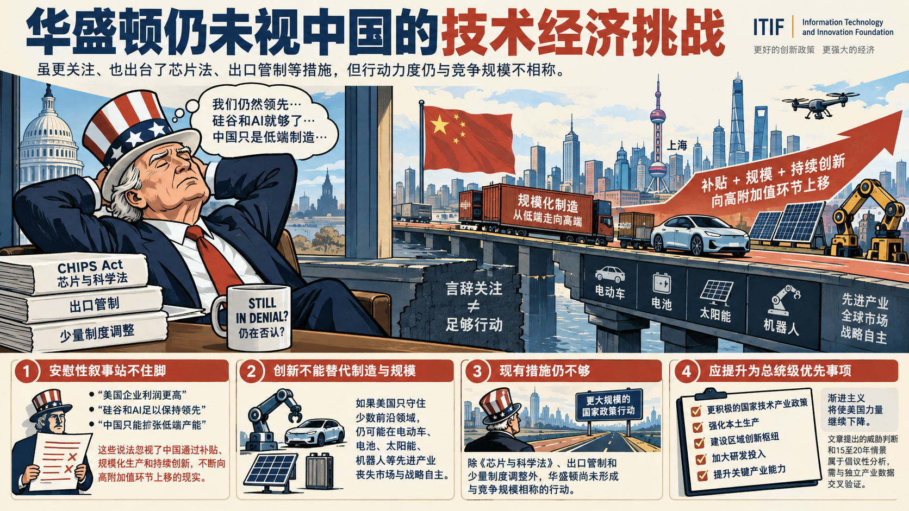

- **核心判断**：**Information Technology and Innovation Foundation判断，华盛顿虽比十年前更关注中国的技术经济与贸易挑战，但除《芯片与科学法》、出口管制和少量制度调整外，尚未形成与竞争规模相称的行动。**
- **主要论据**：
  - 文章反驳“美国企业利润更高”“硅谷和AI足以保持领先”“中国只能扩张低端产能”等安慰性叙事，强调中国正通过补贴、规模化生产和持续创新从低利润市场向高附加值环节上移。
  - Information Technology and Innovation Foundation认为，创新本身不能替代制造、规模和产业生态，美国若只守住少数前沿领域，仍可能在电动车、电池、太阳能、机器人等先进产业丧失市场与战略自主。
  - 该文立场鲜明地主张国家技术产业政策，并预测渐进主义将使美国力量继续下降；其威胁判断和15至20年情景属于倡议性分析，需与独立产业数据交叉验证。
- **政策建议**：**Information Technology and Innovation Foundation要求美国把对华竞争提升为总统级优先事项，建立更积极的国家技术产业政策，同时强化本土生产、区域创新枢纽、研发投入和关键产业能力，而不只依赖出口管制与市场自发调整。**
- **中国/上海参考**：**材料可用于观察美国创新政策阵营如何把中国的低利润扩张、规模化制造和国家支持解释为技术经济竞争优势；引用时应标明这是ITIF作者的政策倡议，而非中性竞争力评估。**

### 主题 12｜[P1] [安全部门治理与管理中的新兴技术](https://www.rand.org/pubs/research_reports/RRA4634-1.html)

- **来源**：RAND｜**议题**：AI、数字基础设施与技术治理
- **主题**：AI治理, 科技创新

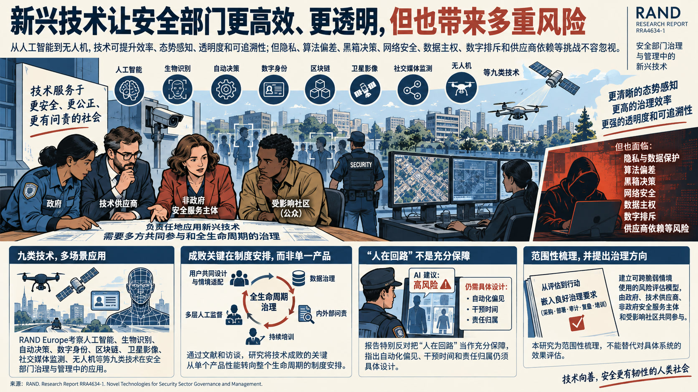

- **核心判断**：**RAND认为，这些工具可提高效率、态势感知、透明度和可追溯性，但也会带来隐私与数据保护、算法偏差、黑箱决策、网络安全、数据主权、数字排斥和供应商依赖等跨场景风险。**
- **主要论据**：
  - RAND Europe考察人工智能、生物识别、自动决策、数字身份、区块链、卫星影像、社交媒体监测、无人机等九类技术在安全部门治理与管理中的应用。
  - 通过文献和访谈，作者把技术成败的关键从单个产品性能转向整个生命周期的制度安排，包括用户共同设计、情境适配、数据治理、多层人工监督、内外部问责和持续培训。
  - 报告特别反对把“人在回路”当作充分保障，指出自动化偏见、干预时间和责任归属仍须具体设计；其研究为范围性梳理，不能替代对具体系统的效果评估。
- **政策建议**：**应让技术供应商、政府与非政府安全服务主体及受影响社区共同参与，建立可跨脆弱情境使用的风险评估模型，并把良好治理要求写入采购、部署、审计、复盘和培训全过程。**

### 主题 13｜[P1] [AI数据中心的网络安全薄弱环节：支撑运行的操作技术](https://www.aspistrategist.org.au/ais-cybersecurity-weak-point-the-operational-technology-that-keeps-things-going/)

- **来源**：Australian Strategic Policy Institute｜**议题**：AI、数字基础设施与技术治理
- **主题**：AI治理, 数字经济

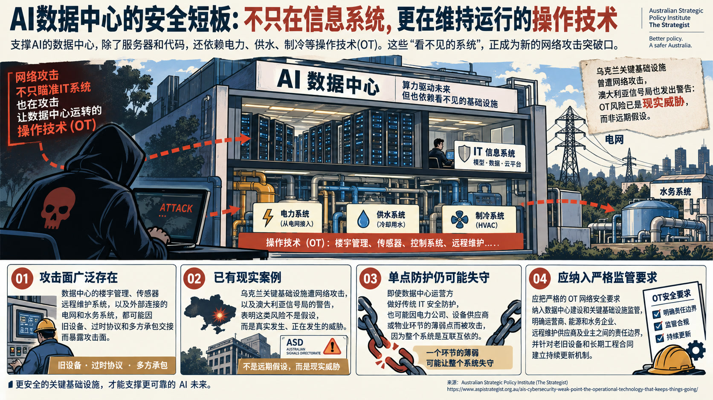

- **核心判断**：**文章判断，人工智能基础设施的安全短板不只在信息系统，还在维持数据中心供电、供水和冷却的操作技术（OT）。**
- **主要论据**：
  - 数据中心内部的楼宇管理、传感器与远程维护系统，以及其外部连接的电网和水务系统，都可能因旧设备、过时协议和多方承包交接而暴露攻击面。
  - 乌克兰关键基础设施遭网络攻击以及澳大利亚信号局的警告表明，这类风险已是现实威胁，而非远期假设。
  - Australian Strategic Policy Institute强调，单个运营方即使做好传统 IT 防护，也可能因电力公司、设备供应商或物业环节的薄弱点而失守，因此 AI 战略必须把跨系统 OT 安全视为基础条件。
- **政策建议**：**应把严格的 OT 网络安全要求纳入数据中心建设和关键基础设施监管，明确运营商、能源和水务企业、远程维护供应商及业主之间的责任边界，并针对老旧设备和长期工程合同建立持续更新机制。**

### 主题 14｜[P1] [学校人工智能宜“慢下来才能快起来”的三个理由](https://www.brookings.edu/articles/3-reasons-why-going-slow-to-go-fast-is-the-right-approach-for-ai-in-schools/)

- **来源**：Brookings Center for Technology Innovation｜**议题**：AI、数字基础设施与技术治理
- **主题**：AI治理, 数字经济

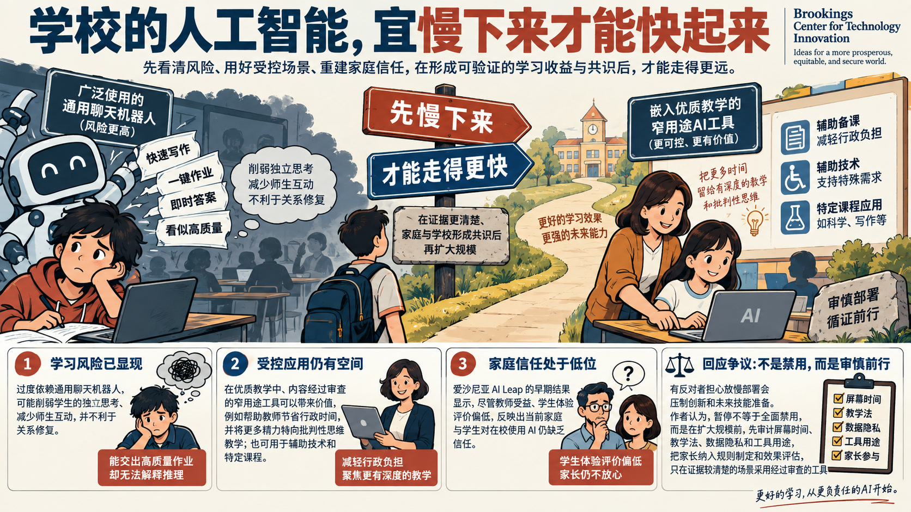

- **核心判断**：**Brookings Center for Technology Innovation主张学校对生成式人工智能采取“慢下来才能快起来”的路线，理由是学习风险已显现、受控应用仍有空间、家庭信任却处于低位。**
- **主要论据**：
  - 其区分“广泛使用”的通用聊天机器人与嵌入优质教学、内容经过审查的“窄用途”工具，认为前者可能削弱努力思考、师生互动和关系修复，后者则可支持备课、辅助技术和特定课程。
  - 爱沙尼亚 AI Leap 的早期结果被用作双面证据：教师节省行政时间并更多转向批判性思维教学，但不少学生能交出高质量作业却无法解释推理，且学生体验评价偏低。
  - 反对者担心放慢部署会压制创新和未来技能准备；作者回应，暂停不等于全面禁用，而是要在扩大规模前形成可验证的学习收益与家庭—学校共识。
- **政策建议**：**教育部门应先审计屏幕时间、教学法、数据隐私和工具用途，保留教师判断与学生主动思考，只在证据较清楚的场景采用经过审查的工具；学生端大规模部署前应把家长纳入规则制定和效果评估。**

### 主题 15｜[P1] [技术乐观与政策焦虑：智库如何看待技术、贸易与地缘政治](https://itif.org/publications/2026/09/08/balancing-optimism-with-anxiety-how-think-tanks-view-technology-trade-and-geopolitics/)

- **来源**：Information Technology and Innovation Foundation｜**议题**：科研体系、人才与创新政策
- **主题**：科技创新

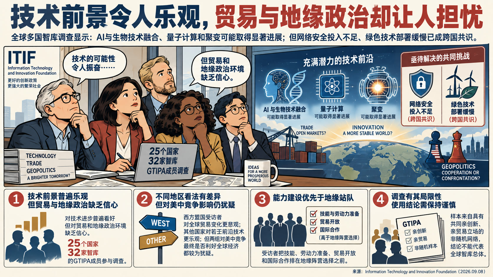

- **核心判断**：**人工智能与生物技术融合、量子计算和聚变被认为可能取得显著进展，网络安全投入不足和绿色技术部署缓慢则形成跨国共识。**
- **主要论据**：
  - ITIF对25个国家32家GTIPA成员智库的调查显示，受访者普遍看好技术进步，却对贸易和地缘政治环境缺乏信心。
  - 西方盟国受访者对全球贸易变化更悲观，其他国家对若干前沿技术更乐观，但两组对美中竞争最终是否利好全球经济都较为犹疑。
  - 更值得注意的是，受访者把技能、劳动力准备、贸易开放和国际合作排在地缘阵营选择之前；不过样本来自具有共同亲创新、亲贸易立场的非随机网络，结论不能代表全球智库总体。
- **政策建议**：**创新政策不应把地缘站队替代为能力建设，应优先补强技能、开放合作、网络安全和清洁技术部署；使用调查结果时须显式保留GTIPA成员自选择偏差。**

### 主题 16｜[P1] [跨大西洋次国家创新竞争力指数3.0](https://itif.org/publications/2026/09/08/transatlantic-subnational-innovation-competitiveness-index-3-0/)

- **来源**：Information Technology and Innovation Foundation｜**议题**：科研体系、人才与创新政策
- **主题**：科技创新

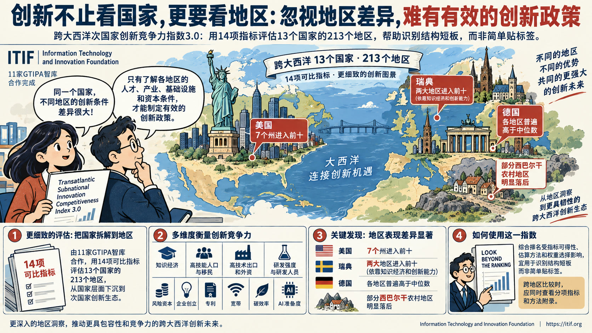

- **核心判断**：**报告的核心判断是，国家战略若忽视地区间人才、产业、基础设施和资本条件差异，就难以形成有效创新政策；但综合排名受指标可得性、估算方法和权重选择影响，宜用于识别结构短板而非简单贴标签。**
- **主要论据**：
  - 由11家GTIPA智库合作完成的指数，用14项可比指标评估13个跨大西洋国家的213个地区，试图把国家层面的创新竞争力分解到次国家生态。
  - 指标覆盖知识经济、高技能人口与移民、高技术出口和外资、研发强度与研发人员、风险资本、企业创立、专利、宽带、碳效率和AI准备度。
  - 结果显示，美国有7个州进入前十，瑞典两大地区凭知识经济和创新能力进入前十，德国各地区普遍高于中位数，首都地区往往因人才和外资集中表现较强，而部分西巴尔干农村地区明显落后。
- **政策建议**：**政策制定者应以地区画像配置研发、技能、宽带、资本和产业协同工具，并把国家制度与地方生态联动起来；跨地区比较时应同时查看分项指标和方法附录。**

### 主题 17｜[P1] [全球科学外交变化下中日韩科技合作的可持续路径](https://www.stepi.re.kr/site/stepien/ex/bbs/publicationView.do?pageIndex=1&cbIdx=1303&reIdx=139&cateCont=A0508)

- **来源**：Science and Technology Policy Institute Korea｜**议题**：科研体系、人才与创新政策
- **主题**：科技创新

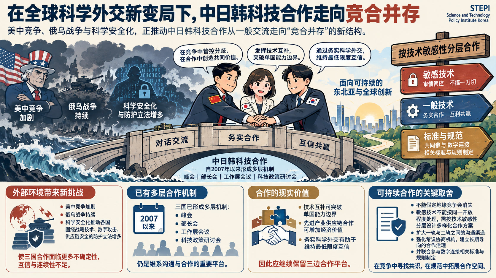

- **核心判断**：**STEPI认为，美中竞争、俄乌战争和科学安全化正在把中日韩科技合作从一般交流推向“竞合并存”的结构。**
- **主要论据**：
  - 三国自2007年以来已形成峰会、部长会、工作层会议和科技政策研讨会等多层机制，但疫情后围绕战略技术、数字攻击和供应链安全的防护立法增多，互信与连续性不足。
  - 报告仍主张保留三边平台，因为技术互补可突破单国能力边界，先进产业供应链合作可增加经济价值，务实科学外交也能维持最低限度互信。
  - 其核心取舍是，敏感技术不能按同一开放程度处理：合作需按技术敏感性分层，并在标准与规范领域寻找共同利益，而不能假定地缘竞争会消失。
- **政策建议**：**扩大一轨与二轨之间的沟通渠道，强化常设协商机构，建立长期导向的合作治理，按技术敏感度设计多样化合作方案，并联合参与数字连接相关标准与规则制定。**

### 主题 18｜[P1] [量子战争尚未打响：战略窗口正在关闭](https://www.aspistrategist.org.au/the-war-before-the-war-quantum-strategy-and-a-closing-window/)

- **来源**：Australian Strategic Policy Institute｜**议题**：科研体系、人才与创新政策
- **主题**：科技创新

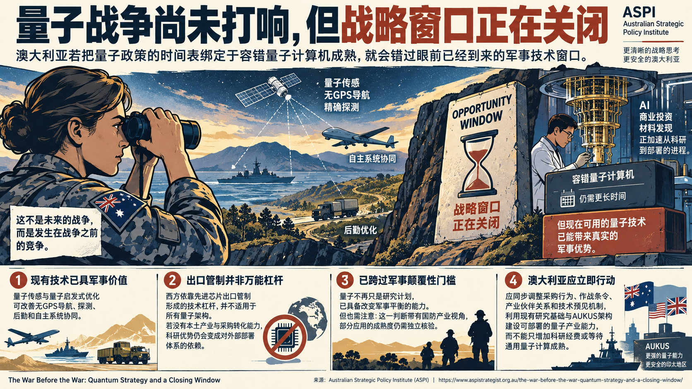

- **核心判断**：**Australian Strategic Policy Institute认为，澳大利亚把量子政策的时间表绑定于容错量子计算机成熟，是误判了眼前的军事技术窗口。**
- **主要论据**：
  - 量子传感和量子启发式优化已能改善无 GPS 导航、探测、后勤和自主系统协同，人工智能、商业投资与材料发现又在压缩从科研到部署的周期。
  - 文章进一步指出，西方依靠先进芯片出口管制形成的技术杠杆并不适用于所有量子架构，若没有本土产业与采购转化能力，科研优势仍会变成对外部部署体系的依赖。
  - 其核心争论是，量子是否仍只是研究计划；作者明确主张它已跨过军事颠覆性技术门槛，但这一判断带有国防产业视角，部分应用成熟度仍需独立核验。
- **政策建议**：**澳大利亚应同步调整采购行为、作战条令、产业伙伴关系和技术预见机制，利用现有研究基础与 AUKUS 架构建设可部署的量子产业能力，而不能只增加科研经费或等待通用量子计算成熟。**

### 主题 19｜[P1] [传统劳动力数据跟不上“前沿经济”新职业](https://www.brookings.edu/articles/traditional-labor-market-data-frontier-economy/)

- **来源**：Brookings Center for Technology Innovation｜**议题**：科研体系、人才与创新政策
- **主题**：科技人才

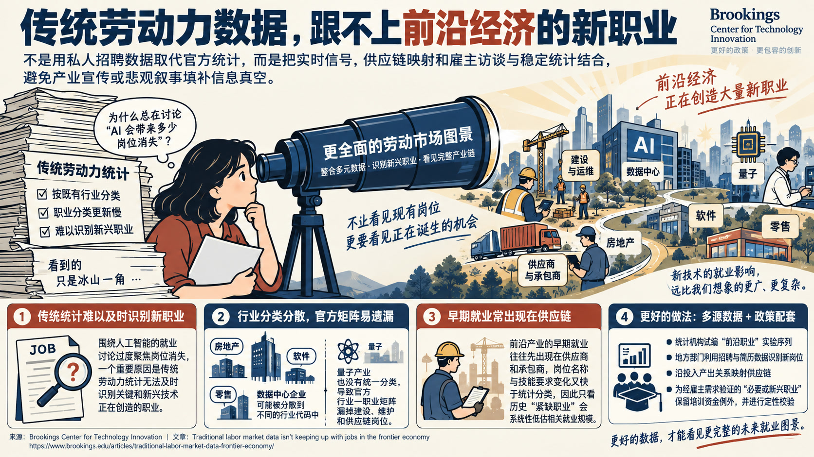

- **核心判断**：**文章并未主张用私人招聘数据取代官方统计，而是要求把实时信号、供应链映射和雇主访谈与稳定统计结合，以避免产业宣传或悲观叙事填补信息真空。**
- **主要论据**：
  - Brookings Center for Technology Innovation指出，围绕人工智能的就业讨论过度聚焦岗位消失，一个原因是传统劳动力统计无法及时识别关键和新兴技术正在创造的职业。
  - 数据中心企业可被分散到地产、软件、零售等行业代码，量子产业也没有统一分类，导致官方行业—职业矩阵漏掉建设、维护和供应链岗位。
  - Brookings Center for Technology Innovation还发现，早期就业往往先出现在供应商和承包商，岗位名称与技能要求变化又快于统计分类，因此只看历史“紧缺职业”会系统性低估前沿产业。
- **政策建议**：**统计机构试编“前沿职业”实验序列，地方部门利用招聘与简历数据识别新岗位，沿投入产出关系映射供应链，并为经雇主需求验证的“必要或新兴职业”保留培训资金例外和定性校验。**

### 主题 20｜[P1] [阻止数据中心建设，社区会失去什么](https://itif.org/publications/2026/09/07/what-communities-stand-to-lose-by-blocking-data-centers/)

- **来源**：Information Technology and Innovation Foundation｜**议题**：AI、数字基础设施与技术治理
- **主题**：数字经济

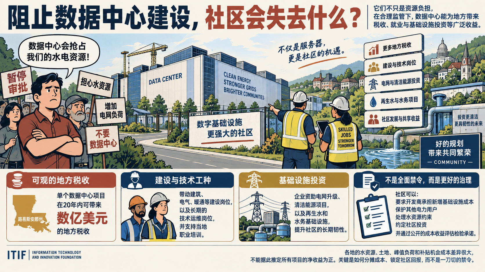

- **核心判断**：**ITIF反驳把数据中心简单视为水电资源负担的观点，认为在合理监管下，地方可获得税收、建设和技术工种、供电与水务基础设施投资以及其他用户的费率收益。**
- **主要论据**：
  - 文章用路易斯安那、弗吉尼亚等地的税收案例，以及企业资助再生水、职业培训、电网和清洁能源项目的实例说明收益并非只流向运营商。
  - Information Technology and Innovation Foundation判断，，地方争议的政策问题应是如何分摊成本、锁定社区回报，而不是先行设置全面禁令。
  - 需要保留的反方边界是，文中案例主要展示成功安排，水资源、土地、峰值负荷和补贴机会成本在不同地区差异很大，不能据此推定所有项目净收益为正。
- **政策建议**：**社区可要求开发商承担新增基础设施成本、保护其他电力用户、处理水约束并约定社区投资，以项目级条件治理替代笼统禁止，同时用公开成本收益评估检验企业承诺。**
