# 国际科技智库周报（2026-09-20）

## 目录

- P.05-06｜[主题 01｜韩国如何把人工智能存储器繁荣转化为系统性实力](#topic-01)
- P.07-08｜[主题 02｜通往超级智能的不确定路径：保持行动自由的美国战略](#topic-02)
- P.09-10｜[主题 03｜卡塔尔在全球研发与创新格局中的定位](#topic-03)
- P.11-12｜[主题 04｜卡塔尔研发与创新人才政策及项目格局](#topic-04)
- P.13-14｜[主题 05｜人工智能与评估伦理及实践](#topic-05)
- P.15-16｜[主题 06｜开放权重人工智能模型可能增加生物误用风险](#topic-06)
- P.17-18｜[主题 07｜不要放慢人工智能开发，应加快基准测试](#topic-07)
- P.19-20｜[主题 08｜统筹基础设施、环境与社区约束优化数据中心选址](#topic-08)
- P.21-22｜[主题 09｜人工智能时代的劳动力政策](#topic-09)
- P.23-24｜[主题 10｜面向社区规划者的数据中心选址模型与适宜性地图](#topic-10)
- P.25-26｜[主题 11｜阻止创造镜像生命：美国战略](#topic-11)
- P.27-28｜[主题 12｜建设并运用美国极地防务工业基础](#topic-12)
- P.29-30｜[主题 13｜伊朗战争紧张局势下能源市场韧性承压](#topic-13)
- P.31-32｜[主题 14｜科研安全的真正薄弱点是内部割裂](#topic-14)
- P.33-34｜[主题 15｜美国银行体系准备好迎接后量子时代了吗](#topic-15)

## 本周态势

本周形成 15 条 P0/P1 重点，议题集中在AI、数字基础设施与技术治理、科研体系、人才与创新政策。产业链、制造与能源信号 3 条；AI 与数字基础设施信号 8 条；直接涉华条目 1 条。

## 本周必读

1. **[韩国如何把人工智能存储器繁荣转化为系统性实力](https://itif.org/publications/2026/09/14/how-south-korea-can-turn-ai-memory-boom-into-systemic-strength/)**
   - **研判**：ITIF认为，韩国的高带宽存储器繁荣证明其仍能处在技术前沿，但单一芯片优势并不等于完整工业体系安全。
   - **证据**：报告用汉密尔顿指数和贸易数据指出，韩国在电子、机械、化工、汽车等先进产业高度专业化，同时中国正在相同产业层级扩大材料、设备、服务和产能。
   - **来源**：Information Technology and Innovation Foundation｜P0｜涉华科技竞争与上海参考
2. **[通往超级智能的不确定路径：保持行动自由的美国战略](https://www.rand.org/pubs/perspectives/PEA5105-1.html)**
   - **研判**：报告的中心判断是，算力、人才、能源、芯片和联盟网络等基础能力会决定谁能塑造技术轨迹，而单纯限制扩散可能把主动权交给竞争者。
   - **证据**：RAND把超级智能视为尚不确定但必须提前准备的战略情景，提出“行动自由”框架以保留美国及人类在快速能力跃迁中的选择权。
   - **来源**：RAND｜P0｜AI、数字基础设施与技术治理
3. **[不要放慢人工智能开发，应加快基准测试](https://www.csis.org/analysis/dont-slow-down-ai-development-speed-benchmarking)**
   - **研判**：CSIS认为美国AI政策不应停留在争论开发速度，而应加快独立、可重复的模型基准测试。
   - **证据**：文章判断，缺少公开评测会使安全、能力和部署效果无法比较，也让监管与采购缺乏证据。
   - **来源**：Center for Strategic and International Studies｜P1｜AI、数字基础设施与技术治理
4. **[科研安全的真正薄弱点是内部割裂](https://www.aspistrategist.org.au/on-research-security-our-divisions-are-the-real-vulnerability/)**
   - **研判**：文章支持提高国家安全和外国干预审查标准，但反对把任何国际合作都视为应被排除的对象。
   - **证据**：ASPI把澳大利亚高校科研安全的核心问题界定为外部干预风险与机构内部撕裂同时上升。
   - **来源**：Australian Strategic Policy Institute｜P1｜科研体系、人才与创新政策
5. **[卡塔尔在全球研发与创新格局中的定位](https://www.rand.org/pubs/research_reports/RRA3894-2.html)**
   - **研判**：RAND认为卡塔尔已形成较强的基础设施和政策雄心，但研发经费占GDP比重、STEM人才供给、企业参与和成果转化仍存在缺口。
   - **证据**：RAND将卡塔尔与其他小型先进经济体比较，评估其研发投入、人才、科研机构和创新转化能力。
   - **来源**：RAND｜P0｜科研体系、人才与创新政策

## 议题观点速览

### AI、数字基础设施与技术治理（4 条）

- **RAND**：报告的中心判断是，算力、人才、能源、芯片和联盟网络等基础能力会决定谁能塑造技术轨迹，而单纯限制扩散可能把主动权交给竞争者。
- **RAND**：RAND本章讨论生成式AI进入政策评估后对主体责任、知识判断和全球权力结构的影响。
- **RAND**：RAND据此认为开放权重带来创新和可访问性收益，但安全对齐不能被视为一次性防线。
- **Center for Strategic and International Studies**：CSIS认为美国AI政策不应停留在争论开发速度，而应加快独立、可重复的模型基准测试。

### 科研体系、人才与创新政策（4 条）

- **RAND**：RAND认为卡塔尔已形成较强的基础设施和政策雄心，但研发经费占GDP比重、STEM人才供给、企业参与和成果转化仍存在缺口。
- **RAND**：其证据结合国际政策比较、卡塔尔项目盘点和人才结构数据，认为“吸引”投入多于“留住”机制。
- **RAND**：RAND把镜像生命视为可能跨过不可逆风险阈值的合成生物学方向，主张在首个可存活镜像细菌出现前建立预防性约束。
- **Australian Strategic Policy Institute**：文章支持提高国家安全和外国干预审查标准，但反对把任何国际合作都视为应被排除的对象。

### 产业链、制造与能源基础设施（2 条）

- **Center for Strategic and International Studies**：Center for Strategic and International Studies主张扩大美国在极地环境中的防务、运输、通信和监测能力，并将其嵌入长期产业规划。
- **Center for Strategic and International Studies**：文章判断，冲突若持续，地区国家可能寻求一种不再完全依赖美国的安全协调机制。

### 涉华科技竞争与上海参考（1 条）

- **Information Technology and Innovation Foundation**：ITIF认为，韩国的高带宽存储器繁荣证明其仍能处在技术前沿，但单一芯片优势并不等于完整工业体系安全。

## 主题展开

### 主题 01｜[P0] [韩国如何把人工智能存储器繁荣转化为系统性实力](https://itif.org/publications/2026/09/14/how-south-korea-can-turn-ai-memory-boom-into-systemic-strength/)

- **来源**：Information Technology and Innovation Foundation｜**议题**：涉华科技竞争与上海参考
- **主题**：中国与上海相关, AI治理, 先进制造

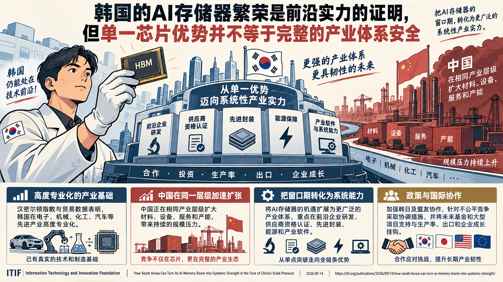

- **核心判断**：**ITIF认为，韩国的高带宽存储器繁荣证明其仍能处在技术前沿，但单一芯片优势并不等于完整工业体系安全。**
- **主要论据**：
  - 报告用汉密尔顿指数和贸易数据指出，韩国在电子、机械、化工、汽车等先进产业高度专业化，同时中国正在相同产业层级扩大材料、设备、服务和产能。
  - Information Technology and Innovation Foundation主张把AI存储器窗口转化为更广泛的系统能力，重点是前沿企业研发、供应商资格认证、先进封装、能源和产业软件。
  - 其政策方案包括韩日及盟友协作、针对不公平竞争的协调措施，以及把未来基金和大型项目支持与生产率、出口和企业成长挂钩。
  - 报告承认韩国已有真实技术和制造基础，但也承认投资总额和新工厂数量不能自动证明产业韧性。

### 主题 02｜[P0] [通往超级智能的不确定路径：保持行动自由的美国战略](https://www.rand.org/pubs/perspectives/PEA5105-1.html)

- **来源**：RAND｜**议题**：AI、数字基础设施与技术治理
- **主题**：科技创新, AI治理, 数字经济

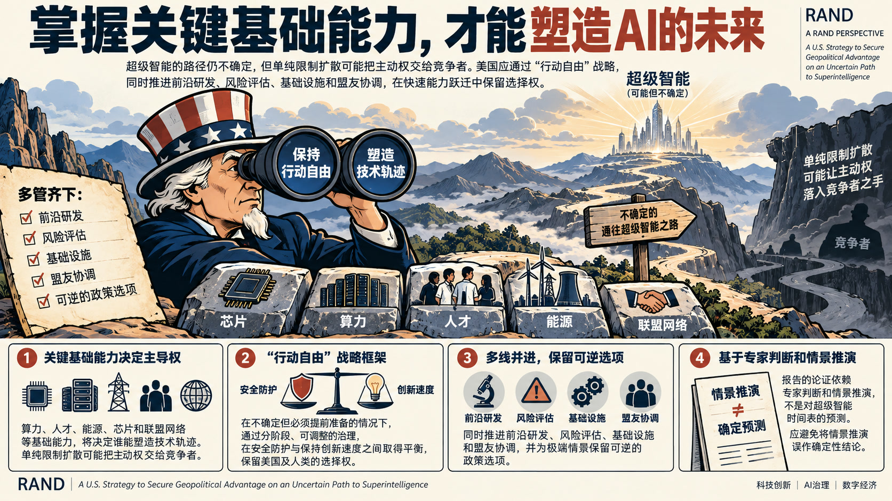

- **核心判断**：**报告的中心判断是，算力、人才、能源、芯片和联盟网络等基础能力会决定谁能塑造技术轨迹，而单纯限制扩散可能把主动权交给竞争者。**
- **主要论据**：
  - RAND把超级智能视为尚不确定但必须提前准备的战略情景，提出“行动自由”框架以保留美国及人类在快速能力跃迁中的选择权。
  - RAND建议同时推进前沿研发、风险评估、基础设施和盟友协调，并为极端情景保留可逆的政策选项。
  - 其论证依赖专家判断和情景推演，不是对超级智能时间表的预测。
  - 报告内部的主要张力在于安全防护与保持创新速度之间如何取舍，因而强调分阶段、可调整的治理。
- **政策建议**：**政策含义：在推进前沿研发的同时保留可逆的风险控制和盟友协调选项，避免把情景推演误作确定预测。**

### 主题 03｜[P0] [卡塔尔在全球研发与创新格局中的定位](https://www.rand.org/pubs/research_reports/RRA3894-2.html)

- **来源**：RAND｜**议题**：科研体系、人才与创新政策
- **主题**：科技人才, 科技创新

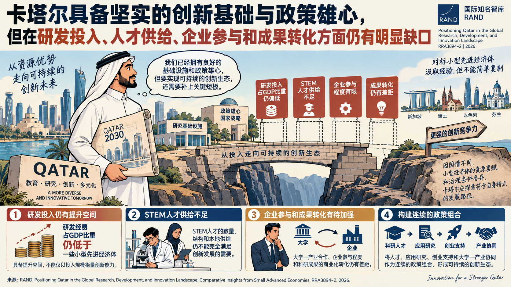

- **核心判断**：**RAND认为卡塔尔已形成较强的基础设施和政策雄心，但研发经费占GDP比重、STEM人才供给、企业参与和成果转化仍存在缺口。**
- **主要论据**：
  - RAND将卡塔尔与其他小型先进经济体比较，评估其研发投入、人才、科研机构和创新转化能力。
  - 其核心机制是资源投入若不能与长期人才管道、大学—产业合作和多元化融资结合，就难以形成可持续创新生态。
  - RAND建议围绕科研人才、应用研究、创业支持和产业协同建立连续的政策组合。
  - 比较分析也承认小型经济体的资源禀赋和治理条件不同，卡塔尔不能简单复制他国项目。
- **政策建议**：**政策含义：将人才、应用研究、创业支持和大学—产业协同作为连续组合，避免只以投入规模衡量创新能力。**

### 主题 04｜[P0] [卡塔尔研发与创新人才政策及项目格局](https://www.rand.org/pubs/research_reports/RRA3894-1.html)

- **来源**：RAND｜**议题**：科研体系、人才与创新政策
- **主题**：科技人才, 科技创新

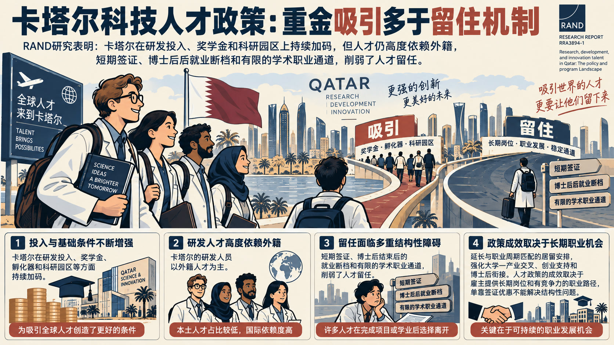

- **核心判断**：**其证据结合国际政策比较、卡塔尔项目盘点和人才结构数据，认为“吸引”投入多于“留住”机制。**
- **主要论据**：
  - RAND研究卡塔尔研发与创新人才的培养、吸引和留任政策。
  - RAND指出，卡塔尔研发投入和奖学金、孵化器、科研园区等基础条件在增加，但研发人员高度依赖外籍人才，短签证、博士后结束后的就业断档和有限的学术职业通道削弱留任。
  - RAND建议延长与职业周期匹配的居留安排，强化大学—产业交叉、创业支持和博士后衔接。
  - 报告也提醒，人才政策成效取决于雇主提供长期岗位和有竞争力的职业路径，单靠签证优惠不能解决结构性问题。

### 主题 05｜[P0] [人工智能与评估伦理及实践](https://www.rand.org/pubs/external_publications/EP71488.html)

- **来源**：RAND｜**议题**：AI、数字基础设施与技术治理
- **主题**：AI治理, 科技创新

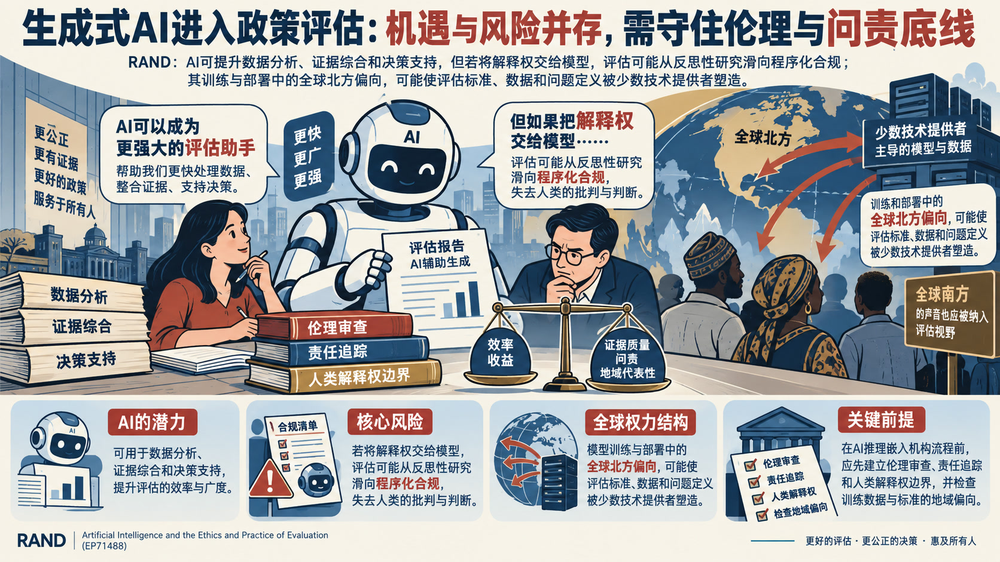

- **核心判断**：**RAND本章讨论生成式AI进入政策评估后对主体责任、知识判断和全球权力结构的影响。**
- **主要论据**：
  - RAND承认AI可用于数据分析、证据综合和决策支持，但警告若把解释权交给模型，评估可能从反思性研究滑向程序化合规。
  - 其关键论据是模型训练和部署中的全球北方偏向，可能使评估标准、数据和问题定义被少数技术提供者塑造。
  - RAND主张在AI推理嵌入机构流程前先建立伦理审查、责任追踪和人类解释权边界。
  - 章节并非否定AI工具，而是要求把效率收益与证据质量、问责和地域代表性同时纳入评估设计。
- **政策建议**：**政策含义：在评估流程引入AI前设置伦理审查、责任追踪和人类解释权边界，并检查训练数据与标准的地域偏向。**

### 主题 06｜[P0] [开放权重人工智能模型可能增加生物误用风险](https://www.rand.org/pubs/research_reports/RRA5112-1.html)

- **来源**：RAND｜**议题**：AI、数字基础设施与技术治理
- **主题**：AI治理, 科技创新

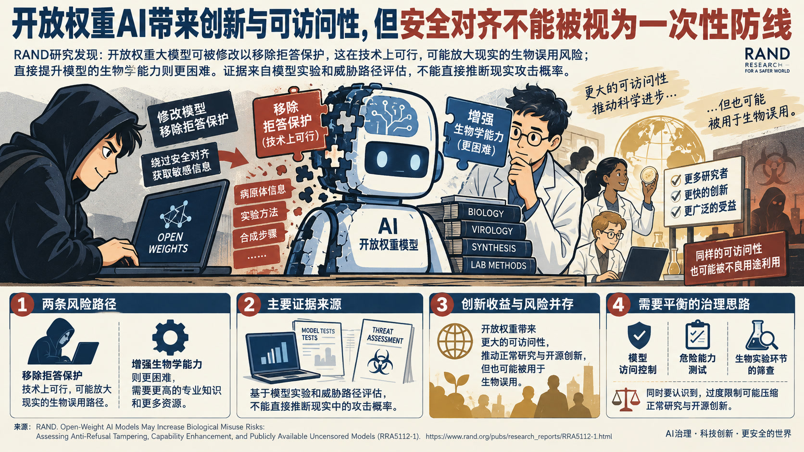

- **核心判断**：**RAND据此认为开放权重带来创新和可访问性收益，但安全对齐不能被视为一次性防线。**
- **主要论据**：
  - RAND测试开放权重大模型被用户修改后对生物安全的影响，区分“移除拒答保护”和“增强生物学能力”两条路径。
  - 研究发现，移除安全训练在技术上可行，可能放大现实的生物误用路径；直接提升模型的生物能力则更困难。
  - 主要证据来自模型实验和威胁路径评估，不能直接推断现实攻击概率。
  - RAND建议将模型访问控制、危险能力测试和生物实验环节的筛查结合，并承认过度限制会压缩正常研究与开源创新。

### 主题 07｜[P1] [不要放慢人工智能开发，应加快基准测试](https://www.csis.org/analysis/dont-slow-down-ai-development-speed-benchmarking)

- **来源**：Center for Strategic and International Studies｜**议题**：AI、数字基础设施与技术治理
- **主题**：AI治理, 科技创新

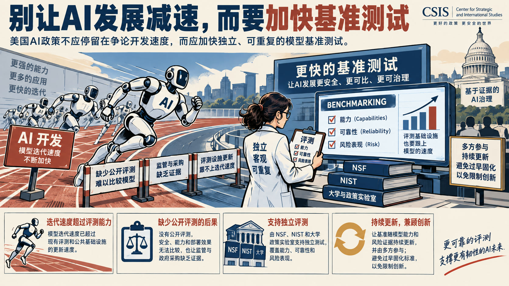

- **核心判断**：**CSIS认为美国AI政策不应停留在争论开发速度，而应加快独立、可重复的模型基准测试。**
- **主要论据**：
  - 文章判断，缺少公开评测会使安全、能力和部署效果无法比较，也让监管与采购缺乏证据。
  - Center for Strategic and International Studies建议由NSF、NIST和大学政策实验室支持独立测试，覆盖能力、可靠性和风险表现。
  - 其论据是模型迭代速度已超过现有评测和公共基础设施的更新速度。
  - 文章并未主张放慢所有研发，反方张力在于评测标准若过早固化可能限制创新，因此需要持续更新和多方参与。
- **政策建议**：**政策含义：由公共科研机构和大学支持独立评测，并让基准随模型能力和风险证据持续更新。**

### 主题 08｜[P1] [统筹基础设施、环境与社区约束优化数据中心选址](https://www.rand.org/pubs/tools/TLA4617-1.html)

- **来源**：RAND｜**议题**：AI、数字基础设施与技术治理
- **主题**：AI治理, 数字经济

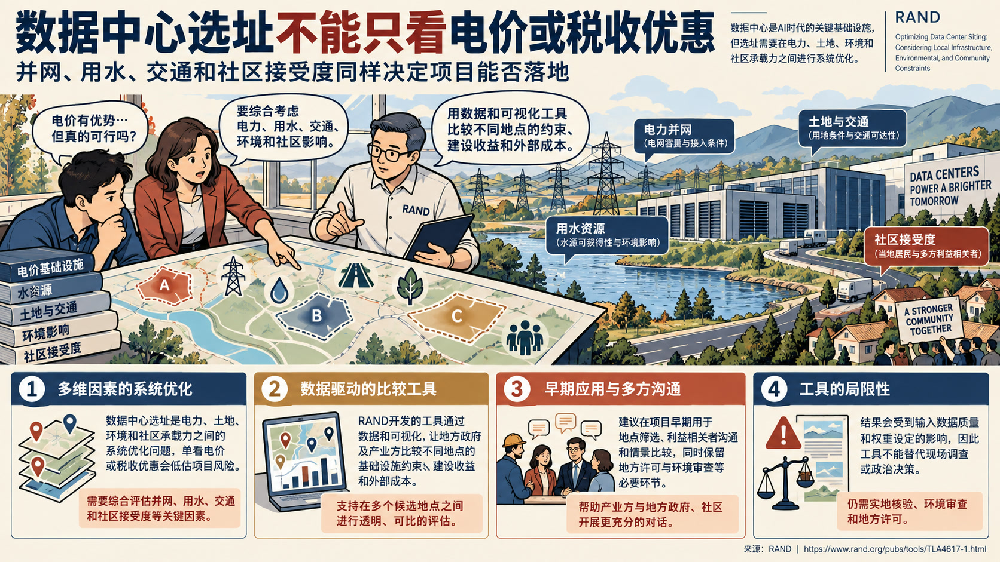

- **核心判断**：**报告的核心判断是，单看电价或税收优惠会低估并网、用水、交通和社区接受度对项目可行性的影响。**
- **主要论据**：
  - RAND把数据中心选址视为电力、土地、环境和社区承载力之间的系统优化问题。
  - 工具通过数据和可视化让地方政府及产业方比较不同地点的基础设施约束、建设收益和外部成本。
  - RAND建议把模型用于早期筛选、利益相关者沟通和情景比较，同时保留地方许可与环境审查。
  - 其局限在于输入数据质量和权重会改变结果，因此工具不能替代现场调查或政治决策。
- **政策建议**：**政策含义：在项目早期用多维数据比较选址，并把社区协商、环境审查和现场核验保留为必要环节。**

### 主题 09｜[P1] [人工智能时代的劳动力政策](https://www.brookings.edu/articles/workforce-policy-for-the-age-of-ai/)

- **来源**：Brookings Center for Technology Innovation｜**议题**：AI、数字基础设施与技术治理
- **主题**：AI治理, 科技人才

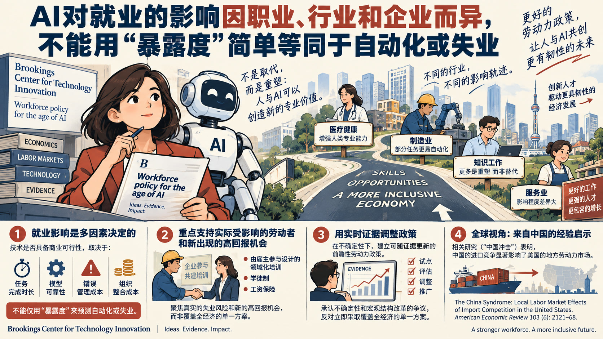

- **核心判断**：**Brookings综述经济学文献，认为AI对就业的影响会按职业、行业和企业分化，不能用“暴露度”直接等同于自动化或失业。**
- **主要论据**：
  - Brookings Center for Technology Innovation指出，任务完成时长、模型可靠性、错误管理和组织整合成本决定技术是否具备商业可行性；AI也可能重塑而非简单替代人的专业价值。
  - 机构主张建立可随证据更新的前瞻性劳动力政策，优先支持实际被替代的劳动者和新出现的高回报机会。
  - 具体建议包括由雇主参与设计的领域化培训、学徒制和工资保险。
  - Brookings Center for Technology Innovation同时承认不确定性和宏观结构改革的争议，因而反对立即采取覆盖全经济的单一方案。
- **政策建议**：**政策含义：以实际失业风险和高回报机会为对象，试行雇主参与的领域培训、学徒制和工资保险，并用实时证据调整方案。**
- **中国/上海参考**：**对中国/上海研判的参考在于：该材料提供了涉华技术能力、人才流动、产业链位置或政策工具的比较证据。** 关键原文线索包括：“ The China Syndrome : Local Labor Market Effects of Import Competition in the United States.” American Economic Review 103 (6): 2121–68.

### 主题 10｜[P1] [面向社区规划者的数据中心选址模型与适宜性地图](https://www.rand.org/pubs/tools/TLA4617-2.html)

- **来源**：RAND｜**议题**：AI、数字基础设施与技术治理
- **主题**：AI治理, 数字经济

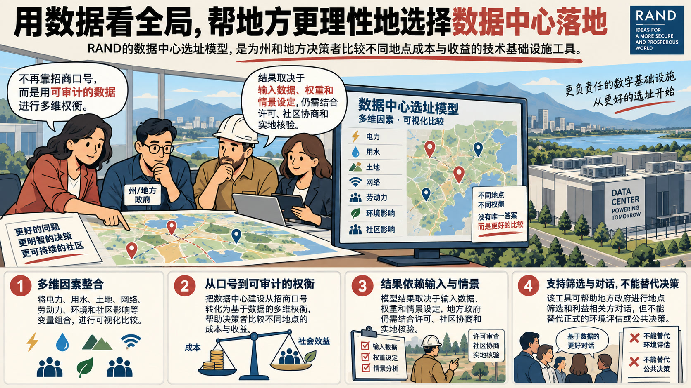

- **核心判断**：**RAND把数据中心选址模型定位为帮助州和地方决策者比较不同地点成本与收益的技术基础设施工具。**
- **主要论据**：
  - 技术文档说明，模型把电力、用水、土地、网络、劳动力、环境和社区影响等变量组合为可视化比较，而不是给出脱离地方条件的单一答案。
  - 其核心价值在于把数据中心建设从招商口号转化为可审计的多维权衡。
  - RAND强调结果依赖输入数据、权重和情景设定，地方政府仍需结合许可、社区协商和实地核验。
  - 该限制意味着工具可支持筛选和对话，但不能替代正式环境评估或公共决策。

### 主题 11｜[P1] [阻止创造镜像生命：美国战略](https://www.rand.org/pubs/research_briefs/RBA4335-1.html)

- **来源**：RAND｜**议题**：科研体系、人才与创新政策
- **主题**：科技创新

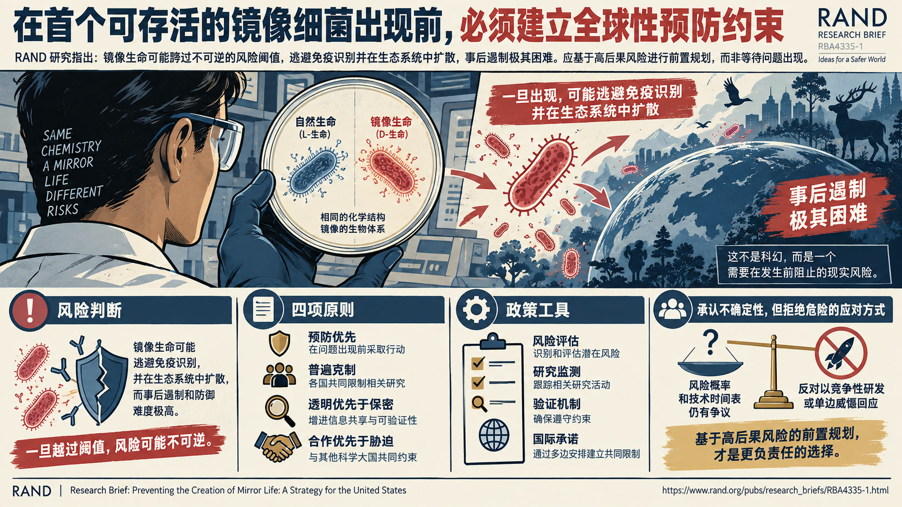

- **核心判断**：**RAND把镜像生命视为可能跨过不可逆风险阈值的合成生物学方向，主张在首个可存活镜像细菌出现前建立预防性约束。**
- **主要论据**：
  - 报告的风险判断是，镜像生命可能逃避免疫识别并在生态系统中扩散，而事后遏制和防御难度极高。
  - RAND提出四项原则：预防优先、普遍克制、透明优先于保密、合作优先于胁迫，并将科学超级大国尤其是中国纳入共同约束。
  - 主要政策工具包括风险评估、研究监测、验证机制和国际承诺。
  - 报告承认风险概率和技术时间表存在争议，因此反对以竞争性研发或单边威慑回应，强调该建议是基于高后果风险的前置规划。

### 主题 12｜[P1] [建设并运用美国极地防务工业基础](https://www.csis.org/analysis/building-and-using-us-polar-defense-industrial-base)

- **来源**：Center for Strategic and International Studies｜**议题**：产业链、制造与能源基础设施
- **主题**：先进制造

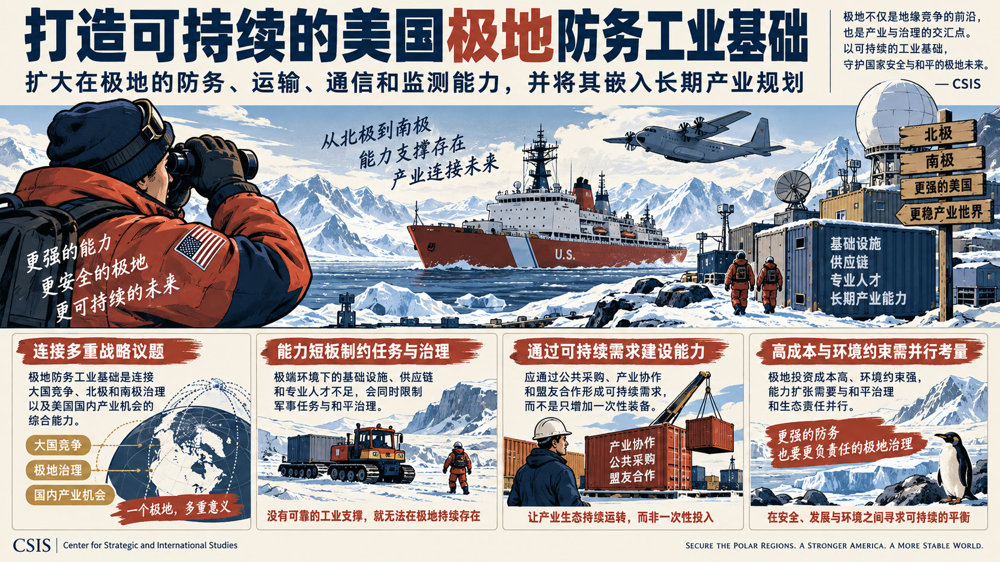

- **核心判断**：**Center for Strategic and International Studies主张扩大美国在极地环境中的防务、运输、通信和监测能力，并将其嵌入长期产业规划。**
- **主要论据**：
  - CSIS把极地防务工业基础视为连接大国竞争、北极和南极治理以及美国国内产业机会的综合能力。
  - 其核心机制是极端环境下的基础设施、供应链和专业人才不足会同时限制军事任务与和平治理。
  - Center for Strategic and International Studies的政策方向偏向通过公共采购、产业协作和盟友合作形成可持续需求，而不是只增加一次性装备。
  - 报告也隐含承认极地投资成本高、环境约束强，能力扩张需要与和平治理和生态责任并行。

### 主题 13｜[P1] [伊朗战争紧张局势下能源市场韧性承压](https://www.csis.org/index%2ephp/analysis/amid-iran-war-tensions-energy-market-resilience-wears-thin)

- **来源**：Center for Strategic and International Studies｜**议题**：产业链、制造与能源基础设施
- **主题**：先进制造

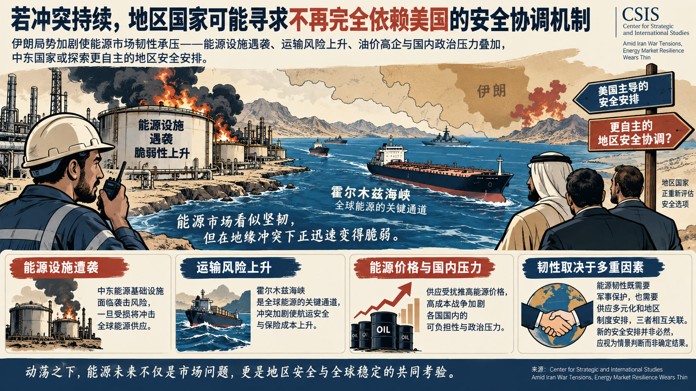

- **核心判断**：**文章判断，冲突若持续，地区国家可能寻求一种不再完全依赖美国的安全协调机制。**
- **主要论据**：
  - CSIS把中东能源基础设施遭袭与霍尔木兹海峡安全安排、能源价格和国内政治压力联系起来。
  - 其论据集中在能源设施受损、运输风险和高成本战争对选民可负担性的叠加影响。
  - Center for Strategic and International Studies的态度偏向风险预警，认为能源韧性既取决于军事保护，也取决于供应多元化和地区制度安排。
  - 材料没有证明新的安全安排必然形成，因而应将其视为情景判断而非对政策结果的确定预测。
- **政策建议**：**政策含义：将能源设施防护、供应多元化和地区安全协调作为相互关联的韧性议程。**

### 主题 14｜[P1] [科研安全的真正薄弱点是内部割裂](https://www.aspistrategist.org.au/on-research-security-our-divisions-are-the-real-vulnerability/)

- **来源**：Australian Strategic Policy Institute｜**议题**：科研体系、人才与创新政策
- **主题**：科技创新

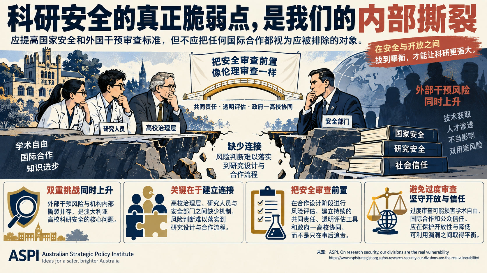

- **核心判断**：**文章支持提高国家安全和外国干预审查标准，但反对把任何国际合作都视为应被排除的对象。**
- **主要论据**：
  - ASPI把澳大利亚高校科研安全的核心问题界定为外部干预风险与机构内部撕裂同时上升。
  - 其主要论据是高校治理层、研究人员和安全部门之间缺少把风险判断落实到研究设计与合作流程的连接，双用途研究尤其难以由单一主体判断。
  - Australian Strategic Policy Institute主张把安全审查像伦理审查一样前置，依靠持续的共同责任、透明评估工具和政府—高校协同，而不是只在合作形成后追责。
  - 文章承认过度审查可能损害学术自由、国际合作和公众信任，因此强调“保护开放性并降低可利用漏洞”的平衡。
- **政策建议**：**政策含义：把科研安全前置到合作设计、风险评估和研究人员支持流程，并建立高校与安全部门的共享责任机制。**

### 主题 15｜[P1] [美国银行体系准备好迎接后量子时代了吗](https://www.csis.org/analysis/us-banking-system-ready-post-quantum-future)

- **来源**：Center for Strategic and International Studies｜**议题**：科研体系、人才与创新政策
- **主题**：科技创新

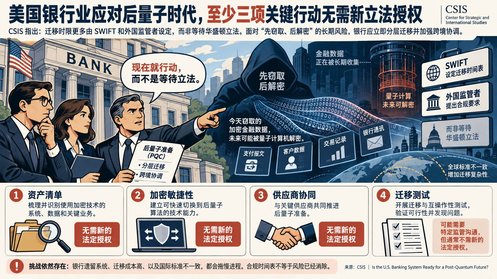

- **核心判断**：**Center for Strategic and International Studies认为，资产清单、加密敏捷性、供应商协同和迁移测试等四类行动中至少三类无需新的法定授权。**
- **主要论据**：
  - CSIS警告，美国银行业面临的后量子密码迁移期限，更多由SWIFT和外国监管者设定，而不是等待华盛顿立法。
  - 文章以“先窃取、后解密”的长期采集风险说明，金融流量当前就可能成为攻击者的准备对象。
  - 机构态度是立即进行分层迁移和跨境协调，避免把量子安全当成遥远的单点技术升级。
  - 文章也承认银行遗留系统、成本和国际标准不一致会拖慢迁移，因而不能把合规时间表简单等同于完成风险消除。
