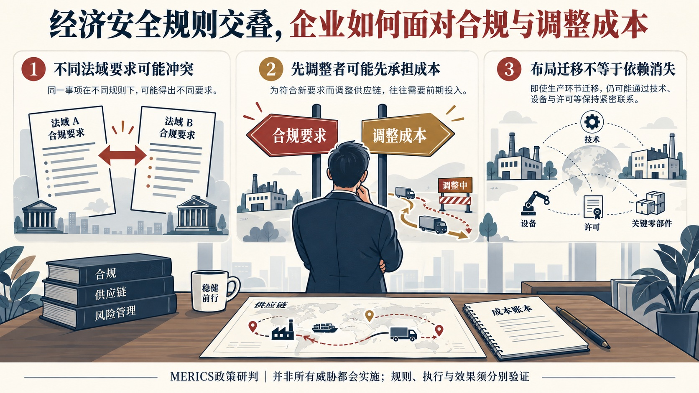
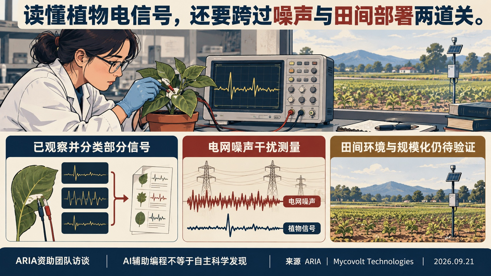
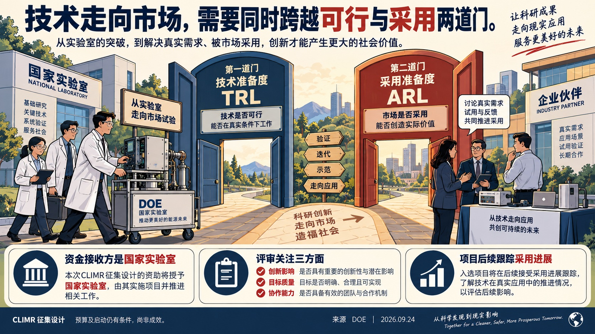
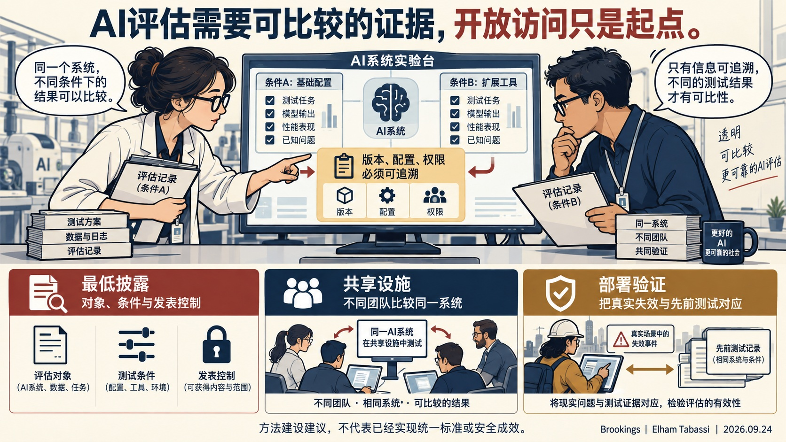
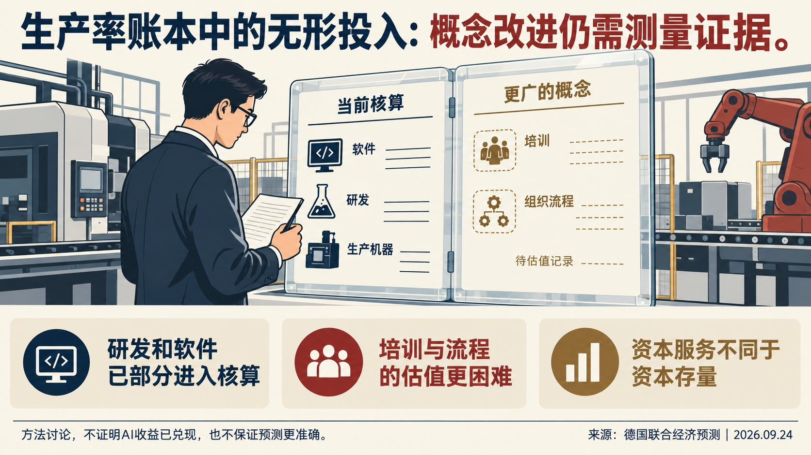
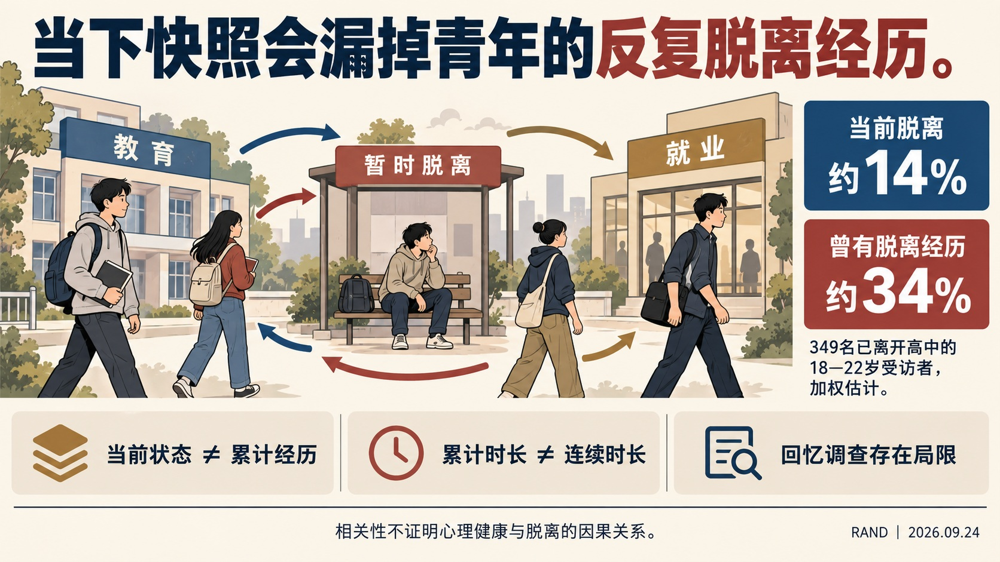
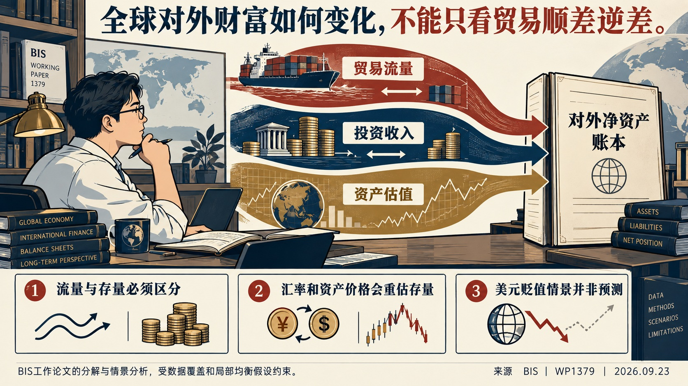
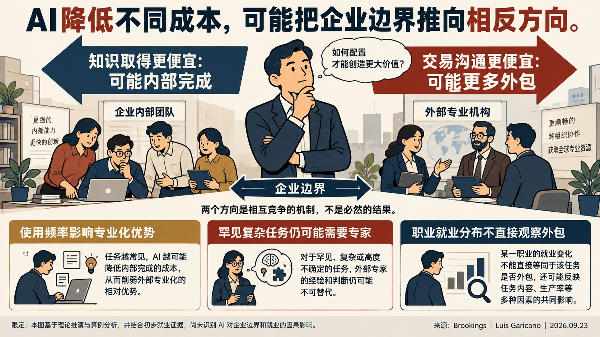
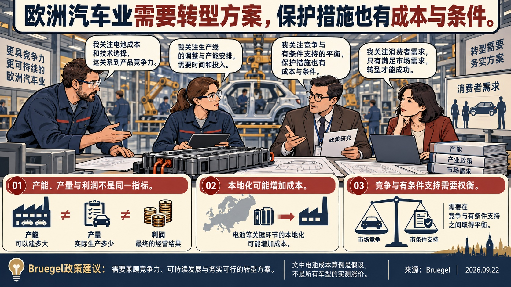

# 国际科技智库周报（2026-09-27）｜资料窗口：2026-09-21 至 2026-09-27

本期收录概况：收录 18 条｜重点 10 条｜本期收录机构 14 家。

<!-- weekly-editorial-sha256: c490ce201404cad255bdc9538efc4bbd369d8e3099103058db5aa1d829200774 -->

## 企业边界、技术采用与社会脱离：本周的几处独立发现

本期材料分布在企业组织、产业政策、科研资助、经济测量与青年处境。可先读企业外包边界的竞争机制，再看实验室技术采用如何进入评审；青年调查则提醒，当前状态会遮蔽一段时间内反复出现的困境。各篇分别保留理论、计划设计与已观察事实的边界。

## 值得细读的发现

### 同样是AI降成本，企业边界可能向两边移动

知识取得更便宜，可能削弱外部专业机构的成本优势；交易沟通更便宜，又可能促进外包。初步职业就业证据不能识别AI因果，值得读的是两个机制为何竞争。

原文：[PDF第2—5、13—14页，表1](https://www.brookings.edu/wp-content/uploads/2026/09/4b_Garicano.pdf) · [阅读全文](#topic-08)

### 技术可行与市场采用，被写成两套准备度要求

DOE CLIMR要求实验室团队同时说明技术成熟度、客户需求和采用障碍，并设置评审与后续跟踪。这是可核查的资助设计，尚不能当作商业化成效。

原文：[PDF第7—13、44—56页](https://eere-exchange.energy.gov/FileContent.aspx?FileID=379d6bac-82bd-4bee-857b-d9a6a0f04442) · [阅读全文](#topic-03)

### 当下没有脱离，不等于此前没有经历困境

RAND对349名已离开高中的18—22岁青年调查显示，调查时脱离教育和就业约14%，此前曾脱离约34%。这是加权样本估计；回忆调查、累计时长与因果解释均有边界。

原文：[PDF第1—13页，调查设计及脱离经历表](https://www.rand.org/content/dam/rand/pubs/perspectives/PEA5200/PEA5238-1/RAND_PEA5238-1.pdf) · [阅读全文](#topic-06)

[完整阅读导航（10 篇）](#reading-navigation)

## 主题展开

### 主题 01｜[P1] [经济安全规则交叠：MERICS如何分析企业合规与供应链困境](https://merics.org/en/report/chinas-economic-security-offensive-how-prc-pursues-dominance-industry-trade-and-technology)

- **来源**：Mercator Institute for China Studies｜2026-09-23

#### 摘要导读

MERICS从政策工具和执行机制分析经济安全摩擦，突出企业面对冲突合规要求、供应链依赖及先行动者成本的困境。其结论属于有明确欧洲政策立场的综合研判；工具存在、实际执行和经济效果须分别验证。

#### 从工具清单到企业处境：阅读政策风险报告的三个层次

### 报告怎样组织问题

MERICS将经济安全工具概括为促进、保护、伙伴与惩罚，结合政策文本、案例和二手统计讨论中国与欧洲的摩擦。这是欧洲智库的政策研判，含明确倡议立场，不是企业面板或因果评估。

### 企业为何可能难以单独调整

作者强调两类困境：不同法域的合规要求可能相互冲突；率先分散供应链的企业可能承担更高成本，短期竞争力受损。替代生产或研发布局也不必然消除对既有技术、设备和许可的依赖。报告建议欧洲补足支持、信息收集、反制与谈判安排，并区分不可信威胁、有限施压和升级，未认定全部威胁都会兑现。

### 选读时应分开的证据层次

| 层次 | 能回答什么 | 不能直接推出什么 |
|---|---|---|
| 工具和规则 | 有哪些可用手段 | 必然对每家企业使用 |
| 执行案例 | 特定条件下怎样行动 | 所有行业承受相同影响 |
| 宏观风险研判 | 哪些传导渠道值得追踪 | 已识别净损失或因果效应 |

上表是依据本文材料结构作出的编辑阅读提示，不是作者的计量结果。将制度能力、实际执行与最终效果逐层区分，才能避免把规则数量当作风险强度，或把倡议当作已实施政策。后续核查应落到具体法域、企业约束与事件条件；本文不足以直接替代企业法律判断。

来源：官网2026年9月23日报告正文，“economic security armory”“punishment doctrine”及“Options for European stakeholders”；网页正文已读，未声称逐项独立核验全部引文或完成PDF图表精读。

### 主题 02｜[P1] [ARIA植物信号案例：从读出信号到检验田间可用性](https://aria.org.uk/insights/2026/decoding-plant-signals)

- **来源**：Advanced Research and Invention Agency｜2026-09-21

#### 摘要导读

ARIA根据Mycovolt展示的植物电信号证据追加230万英镑种子支持。信号能被读出是已报告的进展，分类、噪声环境、规模与定位精度仍是下一阶段问题；定点施药和降低成本属于目标。

#### 一次种子资助怎样沿着证据继续推进

### 从小额试探到追加验证

选编范围为资助升级与研发协作问答，自撰整理，不是独立成效评估。ARIA于2025年8月首次资助Mycovolt。本周访谈披露230万英镑追加支持：理由是团队连续展示了可读出的植物电信号。后续任务随之转向机器学习分类、复杂噪声下的可靠性、扩大覆盖范围及定位精度。

### 生物问题怎样反馈给硬件

团队描述了一个具体循环：在植物上运行电路板24—48小时，生物学分析识别50Hz噪声，硬件工程师调整滤波与设计，一周内取得新板再测。每秒至少200次采样产生大量数据；AI辅助编写分析脚本，但分析框架及输出仍由人监督。

### 尚未回答的问题

目标是用传感网络支持农户及时定位胁迫、定点处理。访谈没有提供大规模田间效果、成本下降或减少农药的独立验证，不能把愿景写成结果。相比漫画，本篇保留资助升级的证据要求与实验反馈过程；其价值在于观察下一轮要检验什么。

来源定位：原文关于“£2.3m seed boost”“wider landscape”“out in a field”的三组问答。

### 主题 03｜[P1] [DOE实验室商业化资助：同时检验技术与采用准备度](https://eere-exchange.energy.gov/FileContent.aspx?FileID=379d6bac-82bd-4bee-857b-d9a6a0f04442)

- **来源**：U.S. Department of Energy｜2026-09-24

#### 摘要导读

DOE将实验室技术的技术成熟度与采用准备度分别纳入商业化资助，要求申请团队说明市场需求、合作承诺和项目结束后的延续能力。征集预算与启动时间仍有拨款及遴选条件；这些规则是计划设计，不能视为已实现的商业化效果。 DOE将实验室技术的技术成熟度与采用准备度分别纳入商业化资助，要求申请团队说明市场需求、合作承诺和项目结束后的延续能力。

#### 从技术可行到市场采用：CLIMR如何设置申请、评审和跟踪

### 选编范围与阅读价值

本篇依据9月24日发布的技术专项征集，选读资格、预算、申请、评审与跟踪条款，不涵盖各技术分领域的全部细则。以下为自撰整理。原文件65页，相关证据位于PDF第1—13、44—56页。它值得展开之处，是把“技术能工作”与“有人愿意采用”分别写成申请与评价要求。

### 经费给谁，资金承诺到哪一步

这是DOE国家实验室申报的计划，支持实验室形成的技术继续走向市场。文件将实验室开发技术界定为至少50%的研发在国家实验室完成。预计支持30—50个项目、期限1—3年，估计经费3300万—4100万美元，包含仍取决于国会拨款的FY2027部分。这些数值均为征集预期，尚非确定获批或实际支出。

企业可以作为外部伙伴参与，市场需求也是项目设计的重要依据，但联邦经费流向实验室，不能把这项计划描述为给创业企业直接发放补助。已有LEEP创业者参与时，还须说明新工作超出原支持范围。默认成本分担为项目总成本的50%；与符合条件的小企业、高校、非营利机构及其他列明伙伴合作时，可申请降低，仍需DOE判断，不能概括为所有项目自动享受豁免。

### 两种准备度回答不同问题

通常要求技术至少达到TRL 4，具体领域另有条件。同时，申请应列明起始与结束时的采用准备度ARL，并在项目期间提高它。TRL帮助回答技术在何种环境中得到验证；ARL促使团队说明客户、市场、经济性及其他采用障碍。技术进步不能自动替代市场采用证据，市场兴趣也不能替代技术验证。

概念申请先接受回应性与可行性审查；获得鼓励的申请才能进入完整申请阶段。完整申请要阐明市场拉动、差异化、合作参与、风险、预算及结束资助后的持续能力。合作方的支持信、客户试验与既有数据可以帮助验证这些主张，但承诺书本身不等于已有市场成功。

### 评审权重与跟踪设计

| 评审维度 | 权重 | 需要回答的主要问题 |
|---|---:|---|
| 创新与商业影响 | 40% | 项目有何差异，能否回应真实市场需求并持续产生价值？ |
| 目标质量与完成可能性 | 35% | 目标是否可核验，假设、预算与风险控制是否可信？ |
| 协作与团队能力 | 25% | 伙伴是否真实参与，团队与设施是否已经具备？ |

以上为征集文件的评审设计，不是成效统计。文件要求至少5项SMART指标，区分活动、产出与结果；按季度报告进度和联邦/分担经费使用，年度指标跟踪持续到授予资助后5年或项目结束后3年，以较晚日期为准。相比只在结项时数专利或合同，这一设计保留了观察商业化后续进展的时间。

### 时间与证据边界

概念申请截止2026年11月3日，完整申请计划于2027年3月1日截止。DOE预计在FY2027第四季度完成遴选，项目启动不早于FY2028第二季度，文件明确这些安排可调整。本期能确认的是制度设计及其约束；实际入选、资金兑现与采用效果，需要未来实施证据。

来源定位：预算和资格见PDF第7—13页；申请与指标见第44—49页；评审权重及项目跟踪见第52—56页。

### 主题 04｜[P1] [AI评估的测量缺口：开放访问之后还缺什么](https://www.brookings.edu/articles/in-ai-evaluation-access-is-not-evidence/)

- **来源**：Brookings Institution｜2026-09-24

#### 摘要导读

允许外部评估者进入企业，并不自动产生可比较的安全证据。作者提出从披露条件、跨团队比较、共享设施及部署验证四个环节改进评估；这是方法建设建议，尚非已生效统一标准。

#### 让一次测试成为能够解释、比较和积累的证据

### 为什么评估者进入企业仍不足够

本文为Elham Tabassi的评论，选编其测量问题及四步方法，自撰整理。对同一系统得出不同结论，可能源于版本、配置、访问权限、测试环境或方法差异。若这些条件不公开，读者无法判断分歧究竟反映模型变化还是测量变化。外部身份也不能单独保证独立性：方法、资金、访问及发表权由谁控制，同样需要披露。

### 四个相互衔接的建设环节

| 环节 | 作者要求 | 要避免的误读 |
|---|---|---|
| 最低披露 | 说明对象、版本、配置、防护、协议、权限、时间、不确定性及资助和发表控制 | 统一披露不等于强制统一方法 |
| 同系统比较 | 不同团队测试重叠对象，追查一致与分歧来自哪里 | 复现同一分数也可能复现同一盲点 |
| 共享设施 | 更新测试材料，提供安全环境、参考协议和记录方式 | 开发商提供算力不等于控制解释与发表 |
| 部署验证 | 将具体失效与部署前测试对象、条件和结果联系起来 | 能力测试有效不等于能预测所有事故 |

### 应当测量什么

评估需要覆盖实际部署系统及其防护，而不仅是底层模型。工具、检索、提示与安全措施变化，都会改变被测对象。最后一步尤其慢：事故记录不完整，严重事件稀少，采取缓解措施后又难以观察未干预的反事实。因而，作者提出的是逐步形成测量基础设施，不能把测试次数增加写成安全性已经提高。

来源定位：原文“4 steps to move from access to evidence”及“How we will know it is working”；评论日期2026年9月24日。

### 主题 05｜[P1] [德国联合预测的方法发现：资本存量与无形投入的测量边界](https://www.ifo.de/en/facts/2026-09-24/joint-economic-forecast-autumn-2026-recovery-under-structural-stress-fiscal-policy)

- **来源**：ifo Institute / Joint Economic Forecast institutes｜2026-09-24

#### 摘要导读

联合预测的资本测量章节区分已计入核算的研发、软件与更广泛的培训、流程等无形投入。更细的资本服务测量有解释价值，但现有数据不足以稳定改进潜在产出估计，也不足以确认AI热潮的生产率收益。

#### 为什么资本测量更精细，预测却未必更稳健

### 选读资本测量，而非只摘增长数字

9月24日发布的联合预测含专章研究资本与潜在产出。本篇自撰整理该章印刷第72、77—82页，不声称读完92页报告。前言9月17日是编制日期，与正式发布日分开。

### 无形资产不能用研发一项代替

核算已覆盖部分研发和软件，但企业培训、流程设计及客户关系等更广义投入仍难完整计量。企业内部生产这些资产，往往缺乏可比市场价格；知识如何折旧也未有统一处理。遗漏可能影响资本存量和国际比较，不能据此断言所有无形投入都未计入。

### 方法改善仍受数据约束

资本服务指数按使用成本提高短寿命设备和知识产权的权重，意在接近年度生产贡献。报告检验替代方法后认为，资产寿命与年龄结构等数据仍不足，预测优势不稳定。生产率J曲线也仅是解释假说，当前AI收益尚难可靠估计。漫画之外保留这一反差：概念更合适，不保证现有数据能支持更稳健的测量。

来源定位：德文PDF第5章，印刷第77—82页；联合作者机构包括DIW、ifo、Kiel、IWH及RWI，按一份作品去重。

### 主题 06｜[P1] [青年脱离教育与工作的持续时间：一次调查的发现与局限](https://www.rand.org/pubs/perspectives/PEA5238-1.html)

- **来源**：RAND Corporation｜2026-09-24

#### 摘要导读

RAND调查区分当前脱离状态与曾经经历，并指出长期脱离可能伴随社交隔离。样本为349名已离开高中的18—22岁青年；结果属于相关性证据，不能据此认定脱离状态导致心理困扰。

#### 把当下比例、累计经历与长期支持需求分开

### 调查怎样识别脱离状态

选读16页报告正文及方法注释（第1—13页），自撰整理。2026年2—3月，研究者调查349名已离开高中的18—22岁青年，询问离校后第一年每三个月的活动及当前状况。这里的脱离指未参与教育、培训或工作；它与通常失业率口径不同。

### 三个不能混用的比例

| 指标 | 加权比例 |
|---|---:|
| 调查时处于脱离状态 | 14% |
| 所观察期间曾经历脱离 | 34% |
| 累计脱离至少6个月 | 23% |

分母均为研究所代表的已离开高中18—22岁青年，来源为图1；累计时长不必连续。调查没有覆盖所有人离校至今的每个季度，存在回忆误差。

### 对项目设计的启发与限制

短暂转换与长期脱离需要不同支持；作者建议测试早期识别工具，并关注教育就业之外的社交联系。社交与心理指标只是相关关系，小亚组尤其不宜外推；当前脱离者仅45人。漫画突出时长区别，选编保留问卷范围、分母和非因果边界，不把干预建议写成已证实效果。

### 主题 07｜[P1] [全球失衡的资产负债网络：贸易之外的估值与收益](https://www.bis.org/publications/working-paper-1379-unraveling-cobweb-global-imbalances-drivers-vulnerabilities-and-adjustment-scenarios)

- **来源**：Bank for International Settlements｜2026-09-23

#### 摘要导读

论文把对外净投资头寸的变化分解为贸易、投资收益、其他收入与估值效应，说明贸易差额不足以概括外部脆弱性。情景测算用于识别传导渠道，不是预测，也不代表BIS正式立场。

#### 先分清存量与流量，再阅读冲击情景

### 研究对象与分解方法

本篇选读84页论文的导论、方法、数据限制及汇率情景，自撰整理，不是全译。作者研究28个经济体1980—2025年的对外头寸，覆盖约85%全球GDP。净国际投资头寸是对外资产减负债的存量；贸易差额只是每年改变它的一条渠道，投资收益和资产价格重估也会改变存量。

### 情景不是预测

作者进一步区分汇率、相对回报、初始资产负债规模及组合结构。在美元贬值20%的假设下，币种错配使各国受到不同影响；这种计算保持其他条件，未包含完整的二次反馈。近期金融因素的重要性，也不意味着长期贸易作用消失。

### 相近贸易状况，为什么可能对应不同的对外财富轨迹

论文对比说明，贸易差额与对外净资产变化不能一一对应。美国与英国在2010年前都曾通过相对较高的资产收益或估值增益抵消贸易赤字；此后，美国股票的相对强势及美元升值增加了外国持有的美国资产价值，使美国自身的对外负债估值上升。英国的轨迹不同，汇率和本国负债回报较弱仍发挥了缓冲作用。这里的对外净资产恶化，不等于美国居民全部财富同幅下降。

日本与巴西的另一组比较更能说明存量的作用：即使净贸易大致平衡，已有债权或债务形成的投资收入，仍可能维持较大的经常账户顺差或逆差。作者据此提示，贸易政策只改变一部分流量，不能立即消除历史积累的资产负债结构。

### 一项情景计算及其不能回答的问题

| 口径 | 2025年基准 | 美元对其他货币贬值20%的假设情景 |
|---|---:|---:|
| 美国对外净资产／美国GDP | -71% | 约-54% |
| 全球债权、债务净头寸绝对值合计／全球GDP | 41% | 约38% |

来源：PDF第43—45页，图14及相关说明。分母分别是美国GDP和全球GDP，不能把两个变化幅度直接比较。这一计算固定资产负债的货币结构及其他资产价格，仅追踪直接金融效应；未纳入贸易数量反应、政策应对、投资组合重配或危机反馈。它说明大幅汇率调整对某国净头寸和全球总量可能产生不同影响，不是汇率预测，也不证明贬值是无成本解决方案。

### 数据决定结论边界

论文采用修订后的美国FDI负债估值；部分币种构成数据止于2020年，金融中心与双边统计存在困难。阅读时应分别核对时期、分母和资产类别，不能把一国净头寸改善直接解释为居民普遍受益。相比漫画，本篇强调识别风险渠道所需的会计区分和假设约束。

来源定位：PDF第4—8、20—21、43—45页。本文为署名作者分析，不代表BIS及成员央行立场。

### 主题 08｜[P1] [专业化优势为何缩小：AI可能重画企业的外包边界](https://www.brookings.edu/articles/the-vanishing-advantage-of-specialization/)

- **来源**：Brookings Institution｜2026-09-23

#### 摘要导读

Garicano区分AI降低知识取得成本与降低交易成本的两种作用，前者可能促使工作回到企业内部，后者可能促进外包。职业就业分布提供初步一致线索，但不能识别AI的因果效果。

#### 同一种技术，为什么可能推动相反的组织变化

### 从使用频率解释专业化

本篇选读25页会议稿的导论、简化算例与职业分布证据（PDF第2—5、13—14页），不声称全译。专业机构的优势来自把学习一项知识的固定成本分摊给许多客户。客户企业自身也掌握场景知识，但遇到罕见问题较少，常选择购买外部服务。

作者用一个假设说明边界：维护能力每年需10万美元，客户一年使用10次、专业机构使用1000次，向外部解释问题另需每次2000美元。原先专业机构的分摊优势足够大；若知识维护成本降为1万美元，该优势缩至每次990美元，小于沟通成本，内部完成便可能更划算。这是理论算例，不是实际企业成本调查。

### 两种降成本机制方向不同

知识变便宜，客户可能把常见工作收回内部；寻找供应商、签约和沟通变便宜，则可能强化市场外包。最终方向取决于两者的相对变化及知识使用频率，不能用“AI减少成本”直接预测企业规模。外部专家仍可能处理稀少、困难、可靠知识取得成本较高的问题。

### 初步就业证据能够说明多少

| 职业 | 2022年在主要专业服务行业就业占比 | 2025年占比 |
|---|---:|---:|
| 律师 | 61.4% | 59.4% |
| 会计与审计 | 24.2% | 22.8% |
| 软件开发 | 34.3% | 30.5% |
| 管理分析 | 26.6% | 24.9% |

口径：作者依据BLS OEWS同方法数据计算，分母为相应职业的受薪就业人数，表1；不包括自雇者。“其他雇主”还包括政府和相邻专业供应商，并不全部等于客户企业内设部门。

这些变化与理论一致，却也可能受专业服务周期等因素影响。数据不直接观察外包采购或任务分配，作者明确未识别因果。上述机制存在竞争，算例依赖假设，就业分布仍是间接代理变量。

### 主题 09｜[P1] [法国LIVO联合实验室：博士合作后的持续仪器研发](https://anr.fr/en/latest-news/read/news/un-nouveau-laboratoire-commun-public-prive-pour-transformer-lanalyse-des-fluides/)

- **来源**：Agence nationale de la recherche｜2026-09-23

#### 摘要导读

LIVO把自2018年开始、经两轮Cifre博士研究形成的仪器合作延续为54个月的联合实验室。原有实时测速系统已经销售；新资助支持进一步改进与扩展应用，不能把未来功能当作已实现成效。

#### 从两轮博士研究到联合实验室的接续关系

### 合作先于联合实验室

选编范围为法文新闻的合作历程、技术用途与实施边界，以下为自撰整理。CNRS及三所高校的研究团队与中小企业Photon Lines自2018年合作，经两轮Cifre博士研究，将实时光流测速系统纳入企业产品。9月22日揭牌的LIVO获ANR36.3万欧元、54个月支持，任务是改进已有系统及扩展功能。

### 仪器改变哪些工作环节

原文将光流法与常用粒子图像测速比较：利用动态纹理图像计算速度场，并在测量过程中即时获得结果，减少事后处理及大量数据储存。研究团队提供流体问题和算法，企业工程团队将其集成到成像平台。这解释了合作怎样进入产品开发，而不仅是签约或揭牌。

### 区分已有产品与后续承诺

系统已销售是原文报告的实施进展；更广泛应用和性能提升仍是后续目标。原文没有可比条件下的量化性能基准、销量或收益，故不保留“市场唯一”等宣传判断，也不据此推算企业基础研究投入。比漫画增加的内容是两轮博士研究、仪器工程和长期合作安排之间的接续关系。

来源定位：首段；“Un partenariat de longue date”；“La vélocimétrie en temps réel”；合作方陈述。

### 主题 10｜[P1] [欧洲汽车转型的政策取舍：保护、价格与竞争力](https://www.bruegel.org/policy-brief/european-unions-automotive-sector-needs-plan-not-undue-protection)

- **来源**：Bruegel｜2026-09-22

#### 摘要导读

Bruegel作者把汽车转型问题放在需求收缩、电动化和国际竞争交织的背景下，主张支持措施限时并与调整挂钩。本地产地要求可能提高入门车型成本，保护市场与形成出口竞争力之间存在取舍。 Bruegel作者把汽车转型问题放在需求收缩、电动化和国际竞争交织的背景下，主张支持措施限时并与调整挂钩。

#### 成本由谁承担，支持是否推动产业调整

### 问题并非只来自进口竞争

选编政策简报19/2026的产业状况及第5—7节，自撰整理。官网正式日期为9月22日；程序曾误取关联文章日期。作者指出，欧洲2025年新车购买量比2019年少约220万辆，需求下降与电动化共同影响产量；下降是暂时还是结构性仍未确定。投资产能不能等同实际生产，产量下降也不直接等同盈利下降。

### 两项政策取舍

短期，限制低成本零部件来源可能提高车价，影响消费者转向电动车。长期，保护现有企业可以争取调整时间，却也可能削弱降低成本、技术升级及拓展出口的压力。作者还提示分配问题：既有车企与主要供应商较易得到保护，成本则分散给购车者和纳税人。

简报框2用一个条件算例说明量级：如果电芯成本从每千瓦时50欧元升到85欧元，一辆采用60千瓦时电池的纯电动车，对应成本差额为2100欧元。它取决于所设电池大小与单位价差，不是所有欧洲车型已经涨价2100欧元，也不能与其他成本或节约值不加区分地相加。

### 暂时保护必须服务于调整

作者主张以明确韧性标准替代笼统本地含量要求，改善能源、技能、充电设施和规则可预期性；外资若能带来技术与供应链协作，应逐案评价。贸易工具或谈判安排需设置时限，并与产业提高可负担电动车竞争力的努力相联系。

这些是作者的政策建议，不能写成欧盟已采纳安排。简报本身承认出口限制可能产生配额租金及WTO合法性争议，也承认部分新安排实施时间太短，尚不能判断效果。漫画给出取舍，选编保留成本算例、分配关系和建议的约束条件。来源定位：第2、5、6、7节及框2；作者依据多种二手统计与既有研究，不是单一因果实验。

## 本期简讯

### [粮食危机年中更新：局部改善与后续风险并存](https://joint-research-centre.ec.europa.eu/jrc-news-and-updates/food-crises-across-globe-acute-food-insecurity-remains-alarmingly-high-2026-09-21_en)

European Commission Joint Research Centre｜2026-09-21

JRC对年中粮食危机资料的解读显示，2025—2026年17个国家或地区改善、15个恶化，局部最严重等级人数下降并不代表整体危机解除。其数据与后续情景分开：厄尔尼诺、冲突及援助削减可能带来的进一步恶化尚未全部纳入当前估计。这里只摘编9月21日JRC解读，未将关联全球报告计为全文已读。

### [欧洲水学院启动：连接知识提供者与一线用水管理者](https://joint-research-centre.ec.europa.eu/jrc-news-and-updates/european-water-academy-water-resilient-europe-2026-09-21_en)

European Commission Joint Research Centre｜2026-09-21

欧委会9月21日启动欧洲水学院，采用跨机构网络连接公共部门、高校、研究组织、水务企业与专业协会。8家初始伙伴承诺提供多语言培训，覆盖污水处理、漏损检测及管道安装等；具体培训计划将后续公布。目前能确认组织设计与伙伴承诺，不能宣称已补齐技能缺口。

### [中美AI协议的可验证性：先建设技术条件](https://www.cnas.org/publications/cnas-insights/cnas-insights-u-s-china-ai-agreements-need-verification-not-trust)

Center for a New American Security｜2026-09-22

作者主张把算力申报、审计和多种监测线索结合，为可能出现的AI协议准备验证能力。其目标是让重大违规更难隐藏，不是保证零作弊。原文明确低成本验证基础设施尚未具备所需规模和成熟度；这是研发与谈判准备建议，不能描述为已成立的国际核查机制。

### [ITIF主张延长芯片投资税收激励，项目公告不能替代效果评估](https://itif.org/publications/2026/09/22/congress-should-make-chips-acts-investment-tax-credit-permanent/)

Information Technology and Innovation Foundation｜2026-09-22

Trelysa Long主张将芯片制造投资税收抵免永久化，理由是建厂决策周期长、临近开工资格截止日可能影响预期。文章引用自2020年起的投资与项目公告，起点早于2022年CHIPS法案；这些是计划口径，不能全部归因于税收抵免，也不等于实际完成投资。本文为政策倡议，未估计激励的净增量效果。

### [ITIF对欧盟AI合规成本的竞争力担忧](https://itif.org/publications/2026/09/22/the-eu-ai-acts-costs-to-american-innovation/)

Information Technology and Innovation Foundation｜2026-09-22

作者担忧美国企业在欧洲模型供应中的较大份额，使其承受较多合规成本，并可能影响创新投入。文章提供市场结构与罚款口径讨论，但未估计实际合规支出，也未识别监管导致创新下降的因果效果。本篇作为立场与争议线索，不能把最高罚款、市场份额或预测写成已发生损失。

### [军用AI互操作还取决于法律判断的协同](https://www.aspistrategist.org.au/australias-next-interoperability-challenge-is-military-ai/)

Australian Strategic Policy Institute｜2026-09-24

作者指出，即便盟友使用兼容系统，对人工核验、解释与授权的不同要求仍可能造成决策冲突。他建议以具体情景训练识别差异、建立共享术语。这是教育与制度协调主张，未提供已开展培训的成效评估；官网日期为9月24日，纠正程序提取的23日。

### [中等国家如何争取前沿AI访问条件](https://www.aspistrategist.org.au/to-secure-frontier-ai-access-australias-best-bet-is-a-coalition-of-the-dependent/)

Australian Strategic Policy Institute｜2026-09-25

作者建议澳大利亚与伙伴协调矿产、芯片、算力与评估能力，以共同的访问条件参与谈判，避免各自为争取投资而降低条件。这是协调机制建议，未形成实际联盟，也没有证明资产组合能带来同等模型访问权。原文正文已读，作为政策观点简讯。 作者建议澳大利亚与伙伴协调矿产、芯片、算力与评估能力，以共同的访问条件参与谈判，避免各自为争取投资而降低条件。

### [政府智能体：授权边界需随可执行行动设计](https://oecd.ai/en/wonk/governing-with-agentic-ai-when-machines-act-on-governments-behalf)

OECD.AI Policy Observatory｜2026-09-25

OECD工作组成员以采购、税务等假设场景，区分整理材料与修改正式记录、付款等不同权限。文章汇集各国正在推进的技术与治理安排，强调可审计、暂停及纠错能力。国家案例处于不同阶段，作者也承认公共部门价值尚未得到证明；不能把场景设想或架构目标写成已实现服务效果。

## 阅读导航

- [主题 01｜经济安全规则交叠：MERICS如何分析企业合规与供应链困境](#topic-01) · Mercator Institute for China Studies
- [主题 02｜ARIA植物信号案例：从读出信号到检验田间可用性](#topic-02) · Advanced Research and Invention Agency
- [主题 03｜DOE实验室商业化资助：同时检验技术与采用准备度](#topic-03) · U.S. Department of Energy
- [主题 04｜AI评估的测量缺口：开放访问之后还缺什么](#topic-04) · Brookings Institution
- [主题 05｜德国联合预测的方法发现：资本存量与无形投入的测量边界](#topic-05) · ifo Institute / Joint Economic Forecast institutes
- [主题 06｜青年脱离教育与工作的持续时间：一次调查的发现与局限](#topic-06) · RAND Corporation
- [主题 07｜全球失衡的资产负债网络：贸易之外的估值与收益](#topic-07) · Bank for International Settlements
- [主题 08｜专业化优势为何缩小：AI可能重画企业的外包边界](#topic-08) · Brookings Institution
- [主题 09｜法国LIVO联合实验室：博士合作后的持续仪器研发](#topic-09) · Agence nationale de la recherche
- [主题 10｜欧洲汽车转型的政策取舍：保护、价格与竞争力](#topic-10) · Bruegel
