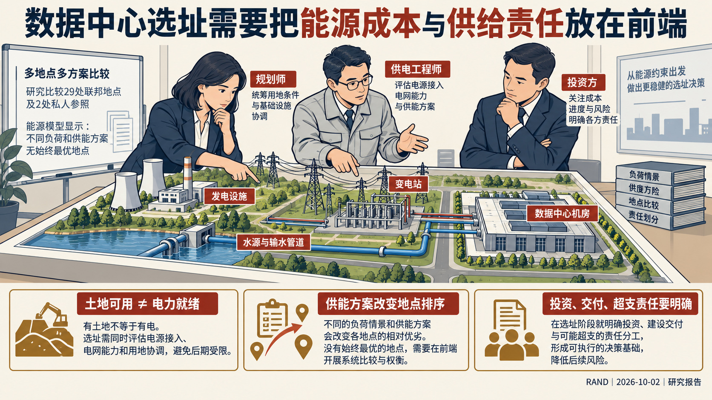
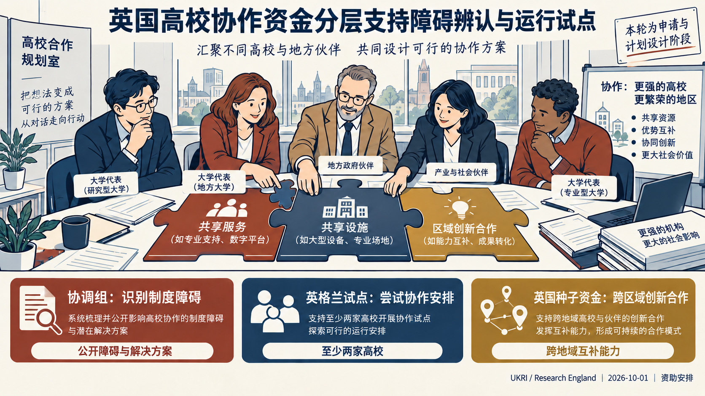
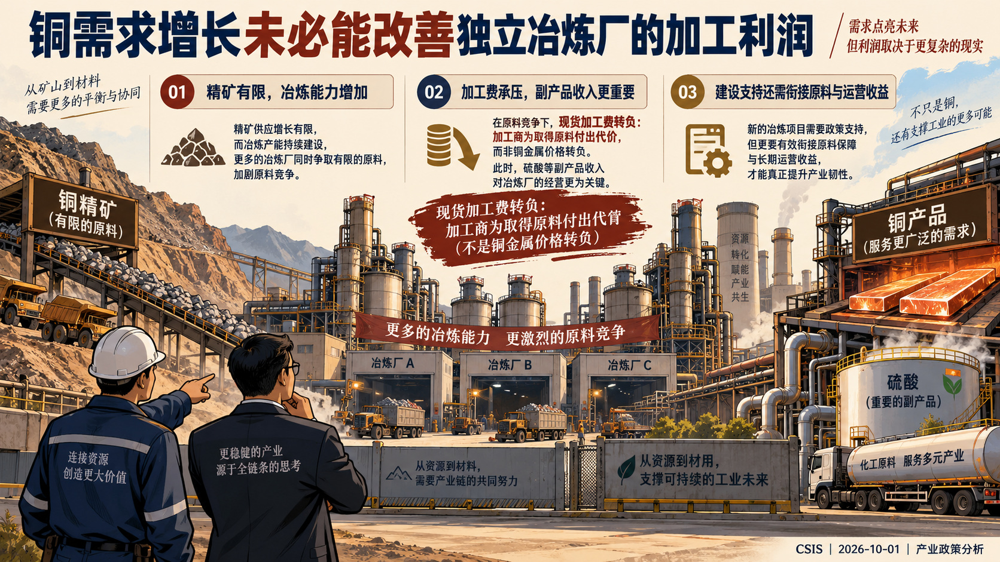
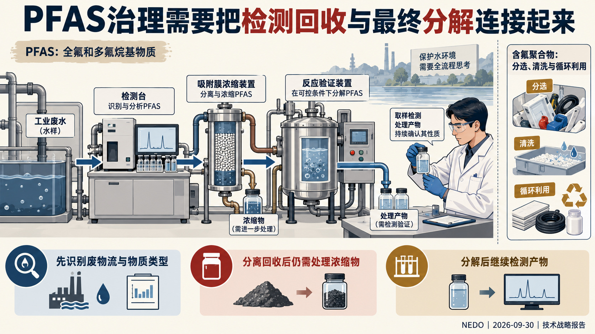
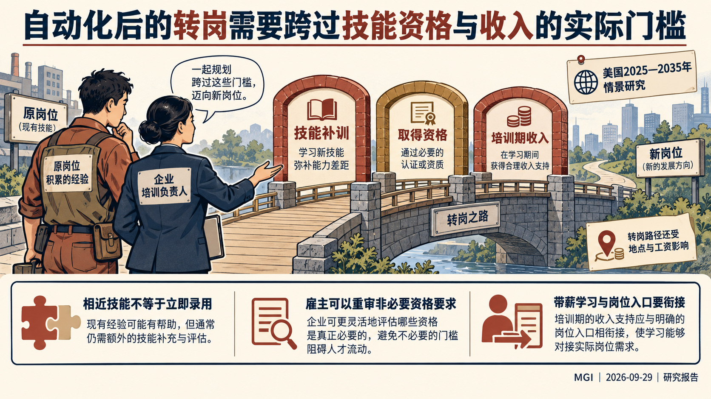
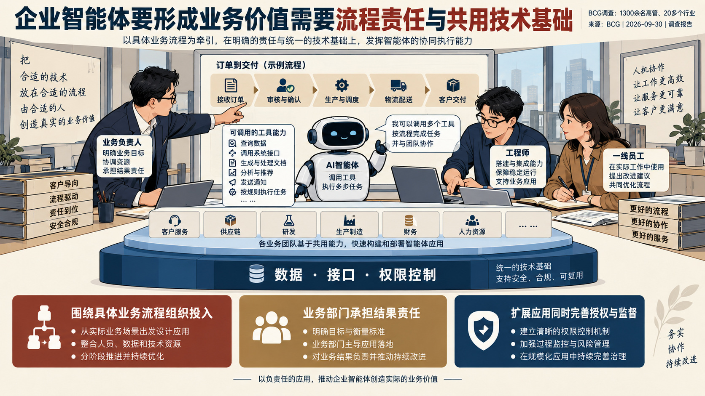
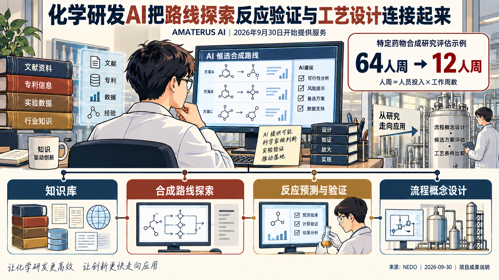

# 国际科技智库周报（2026-10-05）｜资料窗口：2026-09-29 至 2026-10-05

本期收录概况：收录 18 条｜重点 9 条｜本期收录机构 13 家。

<!-- weekly-editorial-sha256: ecc5587884c4c0e963d4c0f264b5a86b30a425f8b258c92859ff28ae1c381547 -->

## 化学研发、转岗路径与产业加工：本周的独立发现

本期可从化学研发AI的具体流程读起，再看劳动者怎样跨过转岗门槛、冶炼企业为何在需求增长中承压。数据中心供能、欧洲共同投资以及科研资助与组织安排提供另外几条阅读线索，各篇围绕自己的问题展开。

## 值得细读的发现

### 化学研发的AI工具开始连接多个环节

AMATERUS AI把知识库、路线探索、反应验证与流程设计衔接起来。特定药物评估示例由64人周降至12人周，单位是人员投入；新进展是9月30日开始提供服务。

原文：[背景、成果、四类工具及注3的人周口径](https://www.nedo.go.jp/news/press/AA5_101968.html) · [阅读全文](#topic-09)

### 有新岗位，还需要劳动者走得通的入口

MGI将转岗路径放到技能、资格、工资与培训时间中比较。企业能够改变的不只有课程，还包括非必要招聘门槛、培训期间收入和真实岗位入口。

原文：[第三章图15及第五章资格、收入和地理障碍讨论](https://www.mckinsey.com/mgi/our-research/Workforce-in-motion-Skills-and-pathways-to-future-jobs-in-the-United-States) · [阅读全文](#topic-07)

### 铜的需求增加，利润可能绕过加工环节

CSIS解释精矿与冶炼产能错配如何压低加工费，并讨论副产品收入和有退出条件的支持。值得追问的是加工环节怎样持续经营，而不只统计新增产能。

原文：[加工费、硫酸副产品、加工利润支持及政策结论](https://www.csis.org/analysis/restoring-economics-copper-processing) · [阅读全文](#topic-05)

[完整阅读导航（9 篇）](#reading-navigation)

## 主题展开

### 主题 01｜[P1] [数据中心选址应先算清供能系统的成本与责任](https://www.rand.org/pubs/research_reports/RRA5050-1.html)

- **来源**：RAND Corporation｜2026-10-02

#### 摘要导读

联邦土地可用，不代表数据中心能够按时获得电力。RAND把能源基础设施成本、并网与公私合作责任放到选址前端，发现地点排序会随负荷和供能假设改变。

#### 精华选编

美国开放联邦土地建设数据中心后，开发商仍需解决供电、用水、许可与建设进度。RAND从能源约束研究选址，比较29处联邦地点与2处私人参照地点，并通过行业和政府人员参与的情景研讨分析合作风险。

### 土地条件与能源方案必须一起比较

报告的基准情景以1吉瓦规模的数据中心为对象，比较电网、天然气、地热及太阳能配储能等方案。模型主要测算外部能源供给基础设施，并不等于整个数据中心的全生命周期预算。大规模部署时，能源设施投资可达到与数据中心本体相近的量级；随着负荷、资本成本和供能路径变化，地点的相对优势也会改变，没有一个地点在所有情景下都占优。

### 把不确定性写进招租与合作安排

作者建议，在发布租赁方案时就说明并网容量、变电站、天然气管线、用水及可扩建条件，同时澄清能源设施由谁投资、何时交付。场地、厂房与发电设施的时间表需要协调，避免一方建成而另一方延误。合作协议还应划清成本超支、审批延迟、闲置资产和后续退出的责任，通过阶段性投入减少一次性押注。情景研讨用于识别这些风险，并不代表模拟项目已经实施成功。

原文：RAND RR-A5050-1，摘要、第四章能源成本模型及公私合作讨论。

### 主题 02｜[P1] [京都科学愿景：以多元资助和组织实验改进科学发现](https://www.whitehouse.gov/releases/2026/10/us-leads-international-coalition-to-endorse-kyoto-vision-for-a-golden-age-of-science/)

- **来源**：White House Office of Science and Technology Policy｜2026-10-04

#### 摘要导读

17国在京都背书的联合愿景，将科学发现能力与资助工具、科研组织、智能工具和技术人才联系起来。声明鼓励制度实验及用经验研究改进科研系统，目前仍是共同方向，尚非逐国实施方案。

#### 精华选编

10月4日，美国、日本、德国、英国、韩国等17国在京都发表共同愿景，回应科研工具与组织方式的变化。声明的制度重点，是不同科研目标不宜依赖单一资助方式：长期资助、快速拨款、奖项与挑战赛可组成有意识设计的工具组合，科研机构也可以试验不同的自主权、资源和方向引导。

### 把科研制度本身纳入实证研究

声明欢迎“元科学”——以经验方法研究科学如何开展、组织和资助，并提出在政府中建立专门能力。它同时把科学诚信写入制度安排：可重复、透明、说明误差和不确定性、无偏同行评审，以及承认负结果和零结果的知识价值。这为评价体系留下了比成功案例数量更宽的观察对象。

### 智能工具与人才条件共同推进

文件使用“超智能（SI）”描述所期待的科研工具，提出知识综合、物理与生物模型及自主闭环实验等方向，并希望扩大数据、算力和实验设施的可及性。这是声明的政策主张，不表示超智能或其成效已获验证。人才部分既包括早期支持优秀青年研究者，也强调操作、维护和改进复杂仪器的人员，鼓励实践训练、联合博士及跨环境合作。

各国表达了在本国系统推进这些方向的意愿；声明未给出统一预算、分工或执行时表。后续值得观察的是工具组合和制度实验如何具体落地。

### 主题 03｜[P1] [英国以分层协作资金回应高校的成本与制度障碍](https://www.ukri.org/opportunity/collaboration-for-a-sustainable-future-pilots-uk-seed-funding/)

- **来源**：UK Research and Innovation / Research England｜2026-10-01

#### 摘要导读

英国“面向可持续未来的协作”计划把高校协作分成障碍诊断、实施试点和跨区域创新合作。这里的可持续指机构运行与成本效益；资助设计强调协作方式本身，而非普通联合研究课题。

#### 精华选编

面对高校运行压力，Research England希望通过协作改变机构提供服务和开展活动的方式。10月1日公布的资金分出不同路径，避免把讨论合作障碍、尝试新的运行安排和扩大区域创新合作混在一起。

### 先辨认障碍，再支持实施

另设的协调组资金总额75万英镑，支持形成对具体障碍和解决办法的共同认识；每项1万至10万英镑、最长一年，成果应公开。这类组不承担实施试点。英格兰高校试点则配置400万英镑，要求至少两家高校合作，单项10万至100万英镑、最长两年，优先较小且较快的项目。

### 跨区域种子资金连接互补能力

另有1500万英镑英国范围种子支持，单项100万至500万英镑、最长三年，面向至少两个地域创新生态的协作，强调高校与地方政府、企业和投资者等共同参与。支持对象应说明合作怎样改善运行或创新能力，普通联合科研项目不在适用范围。各路径仍处申请和设计阶段，未来是否获得后续资金并无保证，真正效果需要看协作成本、服务变化与执行结果。

原文：UKRI pilots/UK seed及coordinating groups两项10月1日公告。

### 主题 04｜[P1] [欧洲共同投资缺口不能仅靠担保工具补齐](https://www.bruegel.org/first-glance/finance-its-future-europe-needs-bigger-more-targeted-budget)

- **来源**：Bruegel｜2026-09-30

#### 摘要导读

Bruegel评估欧盟2028—2034年预算提案，认为规模与用途同时限制其投资作用。研究、跨境网络和气候等共同任务，需要直接公共投入，不能只寄望撬动私人资本。

#### 精华选编

欧洲面对能源转型、数字技术与创新投入需求，欧盟预算应承担哪些国家单独投资难以完成的任务？Bruegel的政策解读围绕2028—2034年预算提案，区分总体投资缺口和适合欧盟层面支出的“欧洲公共产品”：后者包括具有跨境外溢或共同实施优势的研究、气候行动与能源网络。

### 钱的用途影响预算能发挥多大作用

作者比较维持既有支出结构、优先投入共同公共产品、以及尽量带动总投资三种配置情景。在其假设下，预算提案可以填补欧洲公共产品投资缺口的12%—22%；若以全部公共与私人投资需求为分母，相应比例只有4%—8%。两个比例回答不同问题，不能相互替代，也不是已实现的投资成果。

### 支出自主权需要与共同任务相衔接

成员国获得更多配置灵活性，不保证资源自然流向跨境任务。作者主张扩大预算，同时把新增空间优先用于长期共同投资，避免旧有分配格局延续。担保和公私合作可以吸引私人资金，却无法取代缺少商业回报、但具有共同收益的直接公共投入。国防领域还缺乏足够清晰的共同投资需求数据，需要先改善口径与分析，再决定支出方案。

原文：Bruegel First Glance，预算情景、缺口比例与政策建议。

### 主题 05｜[P1] [铜需求增长为何没有带来冶炼环节的好生意](https://www.csis.org/analysis/restoring-economics-copper-processing)

- **来源**：Center for Strategic and International Studies｜2026-10-01

#### 摘要导读

铜冶炼的收益取决于原料、加工费与副产品，不能由铜价直接推断。CSIS分析现货加工费转负后的经营困境，主张把政策支持对准加工环节的盈利缺口。

#### 精华选编

电网、制造业与数据中心带动铜需求，冶炼厂却可能陷入利润压力。CSIS研究员Ryuhei Ono从价值链中段解释这一反差：矿山扩张较慢，冶炼能力持续增加，厂商为有限的精矿竞争，削弱了加工环节的议价能力。

### 加工费如何改变经营结果

粗炼与精炼加工费通常由矿山支付给冶炼商。现货费率降到零以下，意味着加工商反而需要付出代价取得原料，并非铜金属的价格变为负数。拥有矿山的综合企业可以在环节之间平衡收入，独立冶炼商承受的冲击更直接。硫酸等副产品能贡献收入，但收益取决于当地化工、化肥需求及运输条件，不能只看炼铜设备。

### 支持应对准可恢复的加工能力

作者建议区分建设投入与持续经营：资本补助可以降低建厂门槛，却不能单独填补加工利润长期不足。承购合同或有条件的利润支持应核查原料来源、长期竞争力及退出条件，随着加工费恢复逐步收窄。对精炼铜先加关税、却没有可替代的国内产能，会把压力传给下游。对加工能力的政策评估，因而需要同时查看原料取得、运营收益与最终用户成本。

原文：CSIS，市场机制、政策选项及结论。

### 主题 06｜[P1] [PFAS治理需要贯通检测、回收与最终分解](https://www.nedo.go.jp/library/ZZNA_100129.html)

- **来源**：New Energy and Industrial Technology Development Organization｜2026-09-30

#### 摘要导读

NEDO技术战略报告将PFAS治理拆解为相互衔接的技术环节：污染物被测出、被集中，与被彻底分解，是不同结果。面向不同废物流选择组合技术，比用一种处理率概括全部物质更有意义。

#### 精华选编

PFAS是全氟和多氟烷基物质的统称，内部包括性质不同的低分子物质与含氟聚合物。NEDO从检测、处理到循环利用梳理技术需求，关注产业实际面对的难题：废物流成分复杂，治理过程还可能产生新的浓缩物和副产物。

### 从识别问题到验证处理结果

目标物分析适于测定已知物质，总有机氟与非目标分析帮助发现未被既有清单覆盖的部分；现场筛查则需与实验室确认衔接。活性炭、离子交换和膜技术可以集中污染物，但回收本身不等于消除。短链物质、复杂水质和高处理负荷会改变技术表现。

### 为不同废物流设计组合工艺

先浓缩、再采用电化学、等离子体或光分解等方法，是报告讨论的组合方向。评价时要继续追踪短链产物和尾气，避免把原目标物减少当作最终无害化。含氟聚合物循环又有不同任务：成分明确的生产边角料较易处理，使用后的混合废料需要识别、分选、清洗及可追溯信息。报告因此把工艺研发与废物流管理放在一起，具体路线仍需按材料与规模验证。

原文：NEDO TSC Foresight，印刷页1—10，尤其表4。

### 主题 07｜[P1] [自动化之后，劳动者怎样跨过转岗的实际门槛](https://www.mckinsey.com/mgi/our-research/Workforce-in-motion-Skills-and-pathways-to-future-jobs-in-the-United-States)

- **来源**：McKinsey Global Institute｜2026-09-29

#### 摘要导读

麦肯锡把美国未来就业问题转化为职业之间能否实际迁移的问题：新岗位增加，并不保证原岗位上的劳动者能够进入。技能相近之外，资格、培训期间收入和地理位置同样决定转岗路径。

#### 精华选编

美国企业采用自动化，同时面对老龄化及医疗、基础设施需求变化。麦肯锡的报告将两类力量放进同一情景：2025—2035年，基准模型估计约1100万人需要转换职业，其他情景为600万至1600万人。模型以美国劳工统计局的总体就业增长为锚，分析约1800种职业的重新分布，并非对裁员人数的观测。

### 从岗位数量转向可走通的路径

研究依次比较目的职业需求、技能重合、工资保持和取得资格所需时间。模型中的转岗路径仅14%较直接，41%需要明显补训，45%面临更大障碍。行政助理具备协调与排期经验，却未必满足项目经理的学历、项目交付和利益相关方管理要求；招聘清单上的相似技能，不能直接变成录用。

### 企业能够改变哪些门槛

报告区分法律规定的资格与雇主偏好。前者涉及安全与专业责任，后者可通过实际能力测评、认可既有经验和学徒安排调整。即使新工作的工资不降低，劳动者也可能承担不起培训期间的收入中断。因而企业的人才规划需要把课程、岗位入口、带薪学习与实际工作地点接起来，而不能停在技能清单上。

原文：麦肯锡全球研究院，方法框及第三、五章。

### 主题 08｜[P1] [企业怎样把智能体试验变成可持续的业务能力](https://www.bcg.com/publications/2026/the-formula-for-agentic-ai-value)

- **来源**：Boston Consulting Group Research｜2026-09-30

#### 摘要导读

BCG将企业智能体应用的差异归结到业务选择、组织责任和共同技术基础。智能体是能够围绕目标调用工具、执行多步任务的AI系统；让它进入业务，需要同时改变工作流程与控制方式。

#### 精华选编

企业已经能够演示智能体完成任务，但试验能否形成业务收益，取决于它嵌入怎样的经营体系。BCG的2026年应用AI指数调查覆盖1300余名高管、20多个行业，以企业自报的应用与能力区分成熟程度；这些分组显示关联，不是随机试验的因果结果。

### 从零散项目走向共同安排

报告所称成熟企业，更常将投入组织成跨年度方案，围绕少量高价值流程配置资源，并让业务部门承担成果责任。收益指标需要进入经营核算，项目不宜只以模型表现或工具上线数交差。智能体接手部分步骤后，人与系统的交接、例外处理和工作岗位也要重新安排。

### 技术架构与授权控制同步建设

共同基础指可复用的数据、接口和控制能力，并不等于只选一家供应商。各业务在这些基础上扩展，才能减少孤立试点及后续重复集成。调查中，42%的受访企业预期到2030年使用自主智能体，当前仅5%认为完整控制措施已经到位。这一落差解释了为何权限、监督和责任必须伴随扩展，而不能等应用铺开后再补。

原文：BCG《The Formula for Agentic AI Value》，调查说明及组织、架构与控制相关章节。

### 主题 09｜[P1] [从合成路线到工艺设计：化学研发AI服务的四个环节](https://www.nedo.go.jp/news/press/AA5_101968.html)

- **来源**：New Energy and Industrial Technology Development Organization｜2026-09-30

#### 摘要导读

NEDO项目支持的AMATERUS AI服务把知识检索、合成路线、反应验证和工艺概念设计连接起来。它的价值在于缩小待验证的路线范围，并将AI建议送入化学与工艺判断。

#### 精华选编

化学品研发不仅要找到目标分子，还要判断怎样合成、反应是否可行以及怎样形成生产流程。山口大学初创企业TS Technology与奈良先端科学技术大学院大学参与NEDO项目后，推出AMATERUS AI，9月30日开始提供服务。

### 四类工具围绕同一研发过程衔接

知识库工具帮助利用已有化学信息；路线探索从大量可能组合中提出候选；反应预测与验证结合AI和量子化学计算，减少只凭经验逐一试探的负担；流程概念设计再把反应选择连接到工艺安排。这里的技术组合把“提出路线”与“检验路线”分开，使研发人员能够集中审查较有希望的方案。

### 人周缩减对应特定评估对象

发布说明所列示例，是药物合成研究评估中的投入由64人周降至12人周。人周是人员投入与工作周数的乘积，不能直接读成日历工期，也不能推广为所有化学品都实现同等节约。当前新增事实是研发成果开始作为服务提供；能否在更多化学体系与生产条件下保持效果，仍要靠具体使用验证。

原文：NEDO 9月30日发布说明，背景、成果与注3。

## 本期简讯

### [DFG支持面向AI研究的数据语料建设](https://www.dfg.de/de/aktuelles/neuigkeiten-themen/info-wissenschaft/2026/ifw-26-75)

Deutsche Forschungsgemeinschaft｜2026-09-29

AI研究能否开展，常受可用数据而不只是模型能力限制。德国研究联合会从167项申请中选择51项数据语料项目，安排约2200万欧元、两年支持，金额包含22%的项目间接费用。计划着眼于使科学数据可用于AI研究，涵盖数据的整理、质量和后续使用条件。这里公布的是获资助建设安排，尚不能据此判断数据集实际使用量或研究效果。

### [专利禁令如何改变许可谈判与创新资产价值](https://ecipe.org/insights/the-injunction-divide/)

European Centre for International Political Economy｜2026-09-29

ECIPE的Fredrik Erixon与Dyuti Pandya比较美欧专利禁令争论。禁令能制止继续侵权，损害赔偿则补偿损失，两者对谈判的作用并不相同：限制禁令可减少权利人以整件产品停产相要挟的空间，也可能让实施者从拖延许可、继续使用技术中获利。作者主张保留排他权，同时针对特殊情形调整救济方式。例如欧洲案件允许为特定患者保留唯一适用的心脏瓣膜，也以替换侵权部件代替销毁整台机器。文章认为，专利估值不能脱离权利能否执行；这是作者的政策判断，美国立法建议尚未取代现有判例标准，不能写成已经发生的法律变更。

### [关键矿产支持政策为何需要按产业环节区分](https://www.rand.org/pubs/research_reports/RRA5195-1.html)

RAND Corporation｜2026-09-29

RAND比较资本支持、生产激励、储备、关税与许可改革，指出增产、替代技术、下游成本、财政和见效速度之间存在取舍。例如，增加供应并压低价格，有助于下游生产，却可能削弱寻找替代材料的激励。研究结合经济机制分析与16次行业及专家访谈：矿山首先需要可预期的许可，冶炼商更关心资本与利润，精炼商还需要稳定原料。作者建议按环节组合工具并减少申请不透明与延误；储备可较快缓冲中断，却不直接新增产能。访谈用于识别方向性问题，不能代表全行业比例。

### [AI如何帮助居民参与数据中心的地方决策](https://www.brookings.edu/articles/ai-community-problem-solving-data-centers/)

Brookings Center for Technology Innovation｜2026-09-30

数据中心给地方带来税收、建设岗位，也增加用水、用电与土地争议。Brookings组织的专家工作组以虚构的密歇根县为场景，尝试用AI整理个人访谈、呈现不同优先事项，再共同比较行动方案。它将过程分成发现观点、形成协调、实施和学习四阶段，发现现有公共参与工具主要集中在前两阶段。作者主张让居民控制数据与工具配置，让每项归纳能够追溯、让少数意见继续可见。两次短会的专家演练说明了一种设计可能，真实居民参与和执行效果仍待试点检验。

### [人才收购的申报边界如何影响创业退出与技术扩散](https://itif.org/publications/2026/09/30/comments-korea-fair-trade-commission-regarding-merger-notification-guidelines/)

Information Technology and Innovation Foundation｜2026-09-30

ITIF就韩国并购申报规则修订提交意见，关注以取得团队及其知识为主要目的的“人才收购”。作者认为，单凭交易金额或资产占比划线，可能把竞争影响有限的小额交易也纳入申报，增加初创企业退出和团队流动的成本。其建议是先研究韩国市场的实际竞争问题，再调整门槛，使申报义务对准有实质竞争影响的交易。这是智库对拟议规则的立场，尚不能证明扩大申报必然损害创新，也不能把9月30日意见提交日当作法规生效日。

### [AI治理报告怎样减少重复准备材料](https://oecd.ai/en/wonk/bridging-frameworks-how-haip-2-0-supports-interoperability-with-the-eu-ai-act)

OECD.AI Policy Observatory｜2026-09-30

企业同时面对多个AI治理框架，重复解释模型、风险和控制措施会增加负担。OECD.AI刊登的民间研究者评论，将广岛AI进程第二版报告框架中的31项问题与欧盟相关工具对照，主张复用能够共同支持的证据。作者同时区分公开透明报告与面向监管的保密披露：信息可以衔接，公开范围和义务并不相同。自愿提交HAIP报告不能替代法定义务，也不构成合规证明。该文是作者的互操作分析，不代表OECD正式立场。

### [AGI竞争中的相互克制为何先需要国内监管证据](https://www.rand.org/pubs/research_reports/RRA5163-1.html)

RAND Corporation｜2026-09-30

RAND的Tobias Sytsma与Alvin Moon研究：竞争国家即使都希望减缓通用人工智能（AGI）竞赛，为何仍难相信对方会遵守约定？两阶段博弈模型把国内监管能力放在承诺之前：政府若无法掌握本国实验室的训练与设施记录，就难以证明自身守约。共同灾难风险可以约束部分冒险，却未必约束只为抢先的秘密行动；后者还需要可验证的证据与违约代价。若双方认为AGI即将到来，未来惩罚的时间会缩短，作者因此讨论提前建立保密核验与利益安排。模型假设国家能控制本国产业、核验没有误报；这些条件在现实中未必成立，所列工具也尚非有效性已获证明的政策。

### [化学品供应链怎样共享信息并保护商业秘密](https://www.nedo.go.jp/news/press/AA5_101969.html)

New Energy and Industrial Technology Development Organization｜2026-10-01

化学品企业需要知道产品含有什么，又不能向所有交易方公开配方。NEDO介绍的化学物质管理平台CMP，采用统一识别和面向指定伙伴的信息披露机制，将供应链追溯与商业秘密保护结合。平台于10月启动服务，此前自4月开展的实证已有500余家公司参与；参与实证不等于正式付费采用。报告中的2028年数千家覆盖仍是目标。平台属于数据协作安排，原文没有提供区块链技术依据。

### [AI时代政策分析机构的价值如何重新建立](https://www.rand.org/pubs/perspectives/PEA5282-1.html)

RAND Corporation｜2026-10-01

当AI能够快速生成分析，政策研究机构仅提供报告是否仍足够？RAND以对专业知识的信任、人或AI在分析中的主导程度构造四种2035年情景：共享证据与人的判断、算法主导后的审查、注意力竞争、嵌入地方的分散分析。情景用于压力测试，不是未来发生概率。作者据此建议，把AI验证、问题定义、不确定性下的比较及与决策者共同工作纳入能力建设；资助者还需支持共享数据和方法等难以按单个项目收费的基础能力。研究机构的可信度，需要在持续使用与实施反馈中建立。

## 阅读导航

- [主题 01｜数据中心选址应先算清供能系统的成本与责任](#topic-01) · RAND Corporation
- [主题 02｜京都科学愿景：以多元资助和组织实验改进科学发现](#topic-02) · White House Office of Science and Technology Policy
- [主题 03｜英国以分层协作资金回应高校的成本与制度障碍](#topic-03) · UK Research and Innovation / Research England
- [主题 04｜欧洲共同投资缺口不能仅靠担保工具补齐](#topic-04) · Bruegel
- [主题 05｜铜需求增长为何没有带来冶炼环节的好生意](#topic-05) · Center for Strategic and International Studies
- [主题 06｜PFAS治理需要贯通检测、回收与最终分解](#topic-06) · New Energy and Industrial Technology Development Organization
- [主题 07｜自动化之后，劳动者怎样跨过转岗的实际门槛](#topic-07) · McKinsey Global Institute
- [主题 08｜企业怎样把智能体试验变成可持续的业务能力](#topic-08) · Boston Consulting Group Research
- [主题 09｜从合成路线到工艺设计：化学研发AI服务的四个环节](#topic-09) · New Energy and Industrial Technology Development Organization
